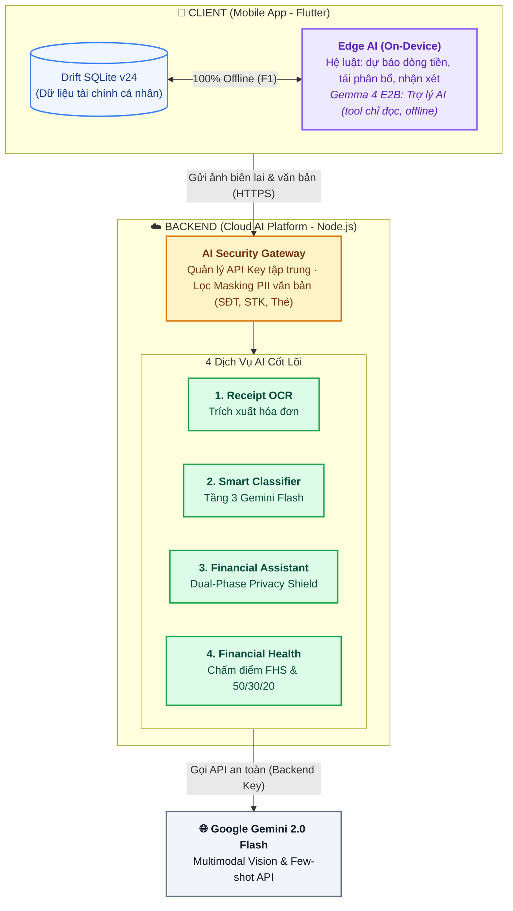
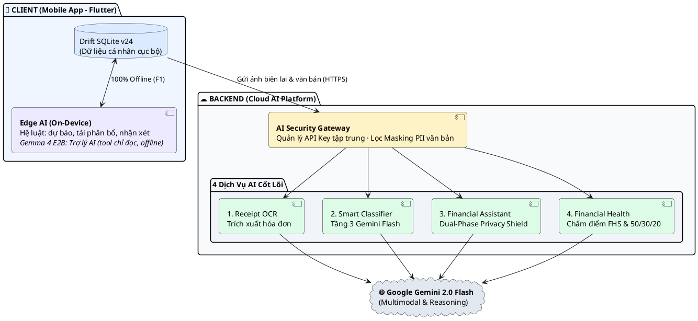

# KIẾN TRÚC HỆ THỐNG AI — MANAGEMENTFINANCE (FLOWMONEY)

> **Phiên bản:** Tối Giản (Minimalist Architecture v2.2)  
> **Mục tiêu:** Trực quan, cô đọng, dễ hiểu ngay trong 5 giây, tối ưu hiển thị trên `app.diagrams.net`.

---

## 1. Sơ Đồ Mermaid Tối Giản (Dán vào Mermaid trong draw.io)

---

## 2. Sơ Đồ PlantUML Tối Giản (Dán vào PlantUML trong draw.io)

---

## 3. Ý Nghĩa 3 Trục Kiến Trúc Cốt Lõi

1. **Khối Client (Edge AI & Hệ luật cục bộ):** Chạy 100% Offline trên Mobile. Hệ luật đảm nhiệm dự báo dòng tiền 30 ngày, gợi ý ngân sách $\le 90$ ngày, tái phân bổ ngân sách C1–C7 và các khối nhận xét. Mô hình **Gemma 4 E2B** phục vụ màn Trợ lý AI hỏi đáp bằng 7 tool chỉ đọc dữ liệu từ Drift SQLite cục bộ; dữ liệu cá nhân tuyệt đối không ra ngoài.
2. **Khối Backend (Cloud AI Gateway):** Đóng vai trò chốt chặn an toàn: giữ bí mật API Key (không đưa lên mobile) và lọc bỏ dữ liệu nhạy cảm văn bản (`masking.util.js`) trước khi gọi ra ngoài.
3. **4 Dịch Vụ AI Cốt Lõi Tại Backend:** Quét hóa đơn (OCR), phân loại giao dịch tầng 3 (Classifier), trợ lý tài chính trực tuyến có Privacy Shield (Chatbot), và đánh giá sức khỏe tài chính Lối A (Financial Health Score) kết hợp trí tuệ Google Gemini 2.0 Flash.
