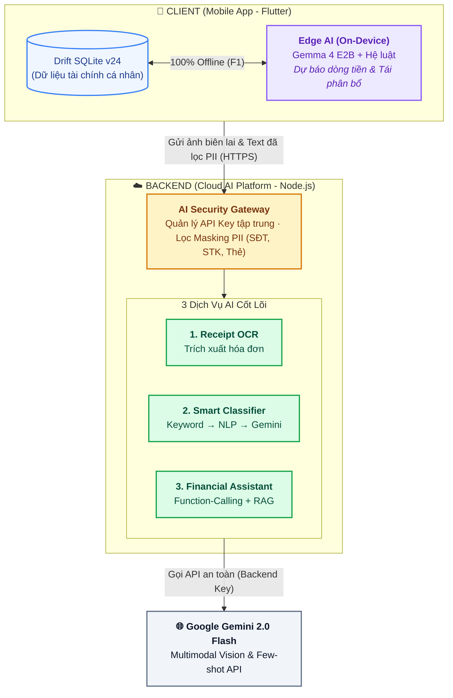
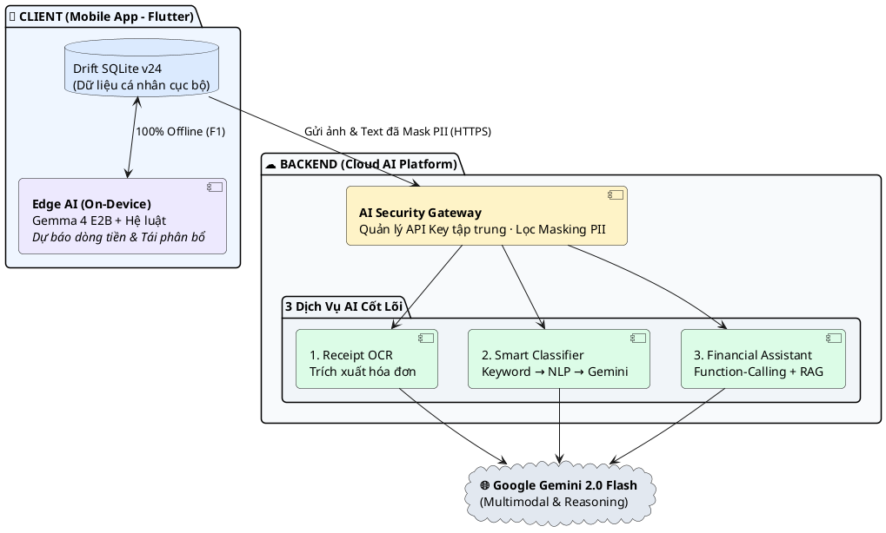

# KIẾN TRÚC HỆ THỐNG AI — MANAGEMENTFINANCE (FLOWMONEY)

> **Phiên bản:** Tối Giản (Minimalist Architecture v2.1)  
> **Mục tiêu:** Trực quan, cô đọng, dễ hiểu ngay trong 5 giây, tối ưu hiển thị trên `app.diagrams.net`.

---

## 1. Sơ Đồ Mermaid Tối Giản (Dán vào Mermaid trong draw.io)

---

## 2. Sơ Đồ PlantUML Tối Giản (Dán vào PlantUML trong draw.io)

---

## 3. Ý Nghĩa 3 Trục Kiến Trúc Cốt Lõi

1. **Khối Client (Edge AI):** Chạy 100% Offline trên Mobile. Mô hình **Gemma 4 E2B** đọc dữ liệu từ Drift SQLite cục bộ để dự báo và tối ưu ngân sách; dữ liệu cá nhân tuyệt đối không ra ngoài.
2. **Khối Backend (Cloud AI Gateway):** Đóng vai trò chốt chặn an toàn: giữ bí mật API Key (không đưa lên mobile) và lọc bỏ dữ liệu nhạy cảm (`masking.util.js`) trước khi gọi ra ngoài.
3. **3 Dịch Vụ AI Đám Mây:** Quét hóa đơn (OCR), phân loại giao dịch (Classifier), và trợ lý thông minh (Chatbot RAG) dùng chung mô hình Google Gemini 2.0 Flash.
