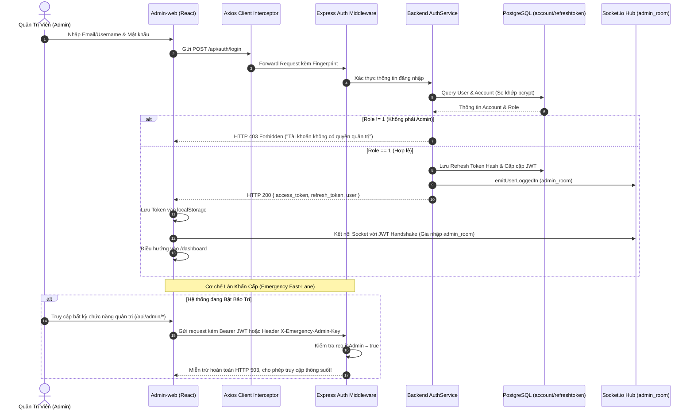

# 🔐 Chức Năng 01: Xác Thực, Phân Quyền Quản Trị & Làn Khẩn Cấp (Authentication, Authorization & Emergency Fast-Lane)

> **Mã chức năng:** `ADMIN-FEAT-01`  
> **Module phụ trách:**  
> - Frontend: `src/Admin-web/src/pages/auth/LoginPage.jsx`, `ForgotPasswordPage.jsx`, `src/Admin-web/src/store/auth.context.jsx`, `src/Admin-web/src/api/axios-client.js`  
> - Backend: `src/Backend/modules/auth/auth.service.js`, `auth.controller.js`, `src/Backend/middleware/auth.js`, `src/Backend/middleware/maintenance.middleware.js`  

---

## 📌 1. TỔNG QUAN & MỤC ĐÍCH NGHIỆP VỤ

Chức năng **Xác Thực & Phân Quyền Quản Trị** là cổng kiểm soát an ninh tối cao bảo vệ toàn bộ dữ liệu tài chính của nền tảng. Hệ thống đảm bảo rằng **chỉ những tài khoản có vai trò Quản trị viên (`idrole === 1`)** mới được phép truy cập vào Admin-web, nhận luồng thông tin giám sát và thực thi các mệnh lệnh quản trị hệ thống. 

Đồng thời, chức năng thiết lập cơ chế **Làn Khẩn Cấp (Emergency Fast-Lane)** cho phép quản trị viên luôn truy cập được hệ thống điều hành ngay cả khi toàn bộ máy chủ đang trong tình trạng bảo trì khẩn cấp hoặc chịu tải nặng.

---

## ⚙️ 2. CƠ CHẾ HOẠT ĐỘNG CHI TIẾT (END-TO-END FLOW)

### 2.1. Chu kỳ quay vòng Token kép (Dual Token Rotation)
1. **Access Token (JWT):** Có thời gian sống ngắn (15 phút), chứa các claims: `{ idaccount, idrole, username, jti }`. Dùng để xác thực trên từng request qua header `Authorization: Bearer <token>`.
2. **Refresh Token (Opaque Hash):** Có thời gian sống 30 ngày. Được băm SHA-256 (`token_hash`) trước khi lưu vào bảng `refreshtoken` trong PostgreSQL, không lưu bản rõ (Plaintext) để tuân thủ `Data_Security.md`.
3. **Cơ chế Silent Refresh:** `axios-client.js` bắt mã lỗi `401 Unauthorized`. Khi Access Token hết hạn, client tự động đưa request vào hàng đợi và gọi `POST /api/auth/refresh` bằng Refresh Token để lấy cặp token mới mà không làm gián đoạn trải nghiệm của Admin.

### 2.2. Cơ chế Làn Ưu Tiên Quản Trị (Admin Priority Fast-Lane)
Khi chế độ bảo trì toàn cục được kích hoạt (cắt đứt kết nối người dùng thông thường bằng HTTP 503), middleware `adminPriorityMiddleware` tại `src/Backend/middleware/maintenance.middleware.js` tự động nhận diện Admin qua 2 cơ chế:
- **Cơ chế 1:** Request có tiền tố URL bắt đầu bằng `/api/admin` hoặc chứa JWT có `idrole === 1`.
- **Cơ chế 2 (Cứu hộ khẩn cấp):** Header `X-Emergency-Admin-Key` khớp với khóa bí mật cấu hình trong môi trường server (`ADMIN_EMERGENCY_KEY`), cho phép Admin truy cập ngay cả khi cơ chế xác thực JWT gặp sự cố.

---

## 📐 3. CÁC CHỈ SỐ, THÔNG SỐ & CÔNG THỨC TÍNH TOÁN

| Thông số / Thuộc tính | Giá trị cấu hình | Ý nghĩa & Cơ chế bảo vệ |
|---|---|---|
| **Access Token TTL** | `15m` (900 giây) | Giảm thiểu cửa sổ nguy hiểm nếu token bị rò rỉ trên client. |
| **Refresh Token TTL** | `30d` (2,592,000 giây) | Duy trì phiên làm việc cho quản trị viên, tự động thu hồi khi đổi mật khẩu hoặc đăng xuất. |
| **Băm mật khẩu** | `bcrypt` (10 rounds) | Chống tấn công Rainbow Table và Brute-force offline. |
| **Băm Refresh Token** | `SHA-256` | Token hash lưu tại database: `token_hash = SHA256(raw_token)`. |
| **Ngưỡng khóa đăng nhập Brute-force** | $\ge 5$ lần thất bại / 10s | Kích hoạt tường lửa AIOps phong tỏa IP nguồn 15 phút. |

---

## ⛔ 4. CÁC GIỚI HẠN KỸ THUẬT & RÀNG BUỘC VẬN HÀNH

1. **Khóa chức năng Quên mật khẩu tự phục vụ (Self-service Reset):**
   - Tài khoản Admin **tuyệt đối không được phép tự đặt lại mật khẩu** qua Email/SMS tại trang `/forgot-password`.
   - Lý do: Ngăn chặn triệt để nguy cơ chiếm đoạt hộp thư quản trị viên hoặc tấn công giả mạo (Phishing). Giao diện hiển thị số điện thoại Hotline kỹ thuật xác thực danh tính trực tiếp.
2. **Cô lập bộ nhớ đệm xác thực (Auth Invalidation Cache):**
   - Khi tài khoản bị vô hiệu hóa hoặc đổi quyền, hàm `invalidateAccountCache(idaccount)` được kích hoạt ngay lập tức, xóa phiên trên Redis và In-Memory để vô hiệu hóa mọi request tiếp theo chỉ sau $< 1\text{ms}$.
3. **Phân quyền tuyệt đối (RBAC):**
   - Chỉ `idrole === 1` mới được phép vượt qua middleware `authorize('admin')`. Mọi tài khoản `idrole === 2` (Người dùng di động) cố tình đăng nhập vào Admin-web đều bị từ chối với mã HTTP 403.

---

## 💼 5. CÔNG DỤNG & GIÁ TRỊ NGHIỆP VỤ

- **Bảo vệ tài nguyên trung tâm:** Ngăn chặn kẻ xâm nhập can thiệp vào cấu trúc tài chính, số dư và nhật ký hệ thống.
- **Không bao giờ bị "tự nhốt ngoài cửa" (Lockout Prevention):** Nhờ cơ chế Làn ưu tiên và Khóa cứu hộ `X-Emergency-Admin-Key`, đội ngũ kỹ thuật luôn có quyền truy cập để gỡ lỗi khi hệ thống gặp thảm họa hoặc bảo trì khẩn cấp.
- **Truy vết trách nhiệm pháp lý:** Mọi hành động của Admin đều gắn liền với định danh `idaccount` duy nhất trong JWT, ghi nhận Append-only vào `audit_log`.

---

## 🧩 6. TÍNH NĂNG ĐI KÈM & GIAO DIỆN LIÊN QUAN

1. **Giao diện Đăng nhập Hiện đại (`LoginPage.jsx`):**
   - Layout chia đôi màn hình (Split-screen) với visual nhận diện thương hiệu `FinanceAdmin`.
   - Toggle hiển thị/ẩn mật khẩu an toàn.
   - Bắt lỗi trực tiếp và hiển thị thông báo tiếng Việt trực quan.
2. **Giao diện Chính sách Quên Mật Khẩu (`ForgotPasswordPage.jsx`):**
   - Banner cảnh báo bảo mật màu vàng Amber.
   - Thẻ hiển thị số điện thoại Hotline hỗ trợ khẩn cấp (+84 355 281 276).
3. **Đăng xuất Cưỡng chế & Tự nguyện:**
   - Xóa token khỏi `localStorage`, xóa phiên Socket.io và điều hướng về trang Login ngay lập tức.

---

## 📱 7. ẢNH HƯỞNG ĐẾN HỆ THỐNG & MOBILE APP (CLIENT-APP)

- **Đến Backend:**
  - Giảm tải DB nhờ cơ chế xác thực JWT phi trạng thái (Stateless), chỉ truy vấn DB khi refresh token.
- **Đến Cơ sở dữ liệu:**
  - Bảng `refreshtoken` được làm sạch tự động định kỳ, thu hồi các token hết hạn (`Status = true`).
- **Đến Mobile App (Client-app):**
  - Cơ chế phân quyền cách ly hoàn toàn người dùng di động khỏi các route quản trị (`/api/admin/*`). Nếu người dùng Client-app thử gọi API Admin, server trả về ngay HTTP 403 mà không tốn tài nguyên xử lý logic.
  - Khi Admin thực hiện đổi mật khẩu hoặc khóa tài khoản của người dùng từ Admin-web, Backend phát lệnh Socket cưỡng chế đăng xuất Mobile App tức thời.

---

## 📡 8. DANH MỤC API & SOCKET.IO PHỤ TRÁCH

### REST API Endpoints
| Phương thức | Endpoint | Chức năng | Phân quyền |
|---|---|---|---|
| `POST` | `/api/auth/login` | Đăng nhập hệ thống & Cấp cặp JWT | Công khai (Rate-limited) |
| `POST` | `/api/auth/refresh` | Đổi Refresh Token lấy Access Token mới | Có Refresh Token hợp lệ |
| `POST` | `/api/auth/logout` | Đăng xuất & Thu hồi Refresh Token | Authenticated |
| `GET` | `/api/auth/profile` | Lấy thông tin chi tiết tài khoản Admin | Admin (`idrole === 1`) |

### Socket.io Events
- **Lắng nghe (`Client -> Server`):** Handshake gửi kèm `token` qua query/auth header.
- **Phát tán (`Server -> admin_room`):**
  - `admin.user_logged_in`: Phát tới toàn bộ Admin khi có lượt đăng nhập mới thành công.
