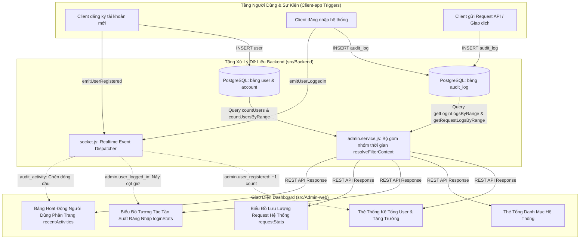

# 📊 Chức Năng 02: Bảng Điều Khiển & Động Cơ Phân Tích Thống Kê (Dashboard & Analytics Engine)

> **Mã chức năng:** `ADMIN-FEAT-02`  
> **Module phụ trách:**  
> - Frontend: `src/Admin-web/src/pages/dashboard/DashboardPage.jsx`, `src/Admin-web/src/components/common/InteractiveLineChart.jsx`, `ServerHealthPanel.jsx`  
> - Backend: `src/Backend/modules/admin/admin.service.js`, `admin.controller.js`, `admin.repository.js`, `src/Backend/modules/auth/auth.service.js`  

---

## 📌 1. TỔNG QUAN & MỤC ĐÍCH NGHIỆP VỤ

**Bảng Điều Khiển & Động Cơ Phân Tích Thống Kê (Dashboard & Analytics Engine)** là giao diện trung tâm đầu tiên mà quản trị viên tiếp cận sau khi đăng nhập. Chức năng cung cấp bức tranh toàn cảnh vĩ mô (360-degree overview) về quy mô người dùng, tốc độ tăng trưởng, lưu lượng truy cập hệ thống và nhật ký hoạt động thực tế.

Toàn bộ dữ liệu hiển thị trên Dashboard được **thống kê và tổng hợp 100% từ cơ sở dữ liệu PostgreSQL**, kết hợp luồng cập nhật **Real-Time qua Socket.io Event Bus**, loại bỏ hoàn toàn việc sử dụng dữ liệu tĩnh hoặc dữ liệu giả lập (mockup).

---

## ⚙️ 2. CƠ CHẾ HOẠT ĐỘNG CHI TIẾT (END-TO-END FLOW)



### 2.1. Động cơ phân tích theo ngữ cảnh thời gian (Contextual Time Filter Engine)
Hệ thống hỗ trợ 5 chế độ lọc thời gian toàn cục ăn khớp giữa Frontend và Backend qua hàm `resolveFilterContext(params)`:
1. **Hôm nay (`today`):** Cửa sổ thời gian từ `00:00:00` đến `23:59:59` của ngày hiện tại theo múi giờ Việt Nam (`Asia/Ho_Chi_Minh` GMT+7). Dữ liệu được chia thành **24 buckets theo giờ** (`00:00` đến `23:00`). Chu kỳ so sánh là ngày hôm qua.
2. **7 ngày qua (`7days`):** Cửa sổ 7 ngày gần nhất, chia thành **7 buckets theo ngày**. Chu kỳ so sánh là 7 ngày liền kề trước đó.
3. **1 tháng qua (`1month`):** Cửa sổ 30 ngày gần nhất, chia thành **30 buckets theo ngày**. Chu kỳ so sánh là 30 ngày trước đó.
4. **1 năm qua (`1year`):** Cửa sổ 12 tháng gần nhất, chia thành **12 buckets theo tháng**. Chu kỳ so sánh là năm trước đó.
5. **Tùy chỉnh (`custom`):** Quản trị viên có thể chọn trực tiếp:
   - Theo 1 ngày cụ thể bất kỳ: Chia 24 giờ.
   - Theo 1 tháng cụ thể: Chia theo số ngày của tháng đó (28-31 ngày).
   - Theo 1 năm cụ thể: Chia 12 tháng.

---

## 📐 3. CÁC CHỈ SỐ, CÔNG THỨC & CÁCH TÍNH TOÁN

### 3.1. Công thức tính Tỷ Lệ Tăng Trưởng (Growth Rate)
Được áp dụng để đo lường mức độ biến thiên người dùng mới so với chu kỳ trước:

$$\text{Growth (\%)} = \begin{cases} 
0\% & \text{khi } \text{current} = 0 \\
100\% & \text{khi } \text{previous} = 0 \text{ và } \text{current} > 0 \\
\left(\frac{\text{current}}{\text{previous}} \times 100\right) & \text{khi } \text{previous} > 0 
\end{cases}$$

- *Ví dụ:* Kỳ này có 15 user mới, kỳ trước có 10 user mới $\implies \text{Growth} = 150\%$.
- *Đánh dấu màu:* Nếu $\ge 100\%$ hiển thị Badge màu Xanh lá (Tăng trưởng); nếu $< 100\%$ hiển thị Badge màu Đỏ hoặc Vàng Cam.

### 3.2. Thuật toán Gom nhóm Dữ liệu Biểu đồ (Time-Bucket Aggregation)
Thay vì trả về hàng ngàn bản ghi thô gây tràn bộ nhớ trình duyệt, Backend gom nhóm toàn bộ logs vào các thùng chứa (buckets) với độ phức tạp $O(N)$ bằng `Map`:

```javascript
// Khởi tạo Buckets chuẩn theo khung giờ Việt Nam (GMT+7)
const bucketMap = new Map();
buckets.forEach(b => bucketMap.set(b.key, b));

// Lặp qua logs và gom vào đúng bucket theo múi giờ Asia/Ho_Chi_Minh
for (const log of logs) {
  const vnParts = getVnTimeParts(log.time_req);
  const key = (format === 'hour') ? vnParts.hour : `${vnParts.year}-${vnParts.month}-${vnParts.day}`;
  if (bucketMap.has(key)) {
    bucketMap.get(key).count += 1;
  }
}
```

### 3.3. Các chỉ số tóm tắt (Statistical Summary)
- **Tổng số (`total`):** $\sum_{i=1}^{k} \text{count}_i$
- **Đỉnh cao nhất (`max`):** $\max(\text{count}_1, \text{count}_2, \dots, \text{count}_k)$
- **Trung bình (`avg`):** $\text{round}\left(\frac{\text{total}}{k}\right)$

---

## ⛔ 4. CÁC GIỚI HẠN KỸ THUẬT & RÀNG BUỘC VẬN HÀNH

1. **Ràng buộc Thời gian Tương lai (`isFutureDate`):**
   - Bộ chọn ngày trên giao diện tự động vô hiệu hóa (disabled) các ngày, tháng, năm trong tương lai, ngăn chặn việc gửi truy vấn vô nghĩa lên database.
2. **Giới hạn số lượng bản ghi bảng hoạt động (`activityLimit`):**
   - Mặc định phân trang 5 bản ghi/trang để tối ưu thời gian phản hồi của trang ($< 50\text{ms}$).
3. **Bảo vệ Bộ nhớ Đồ họa SVG:**
   - Biểu đồ đường SVG tương tác sử dụng thuộc tính `vectorEffect="non-scaling-stroke"` và thuật toán vẽ đường cong mềm Bezier mượt mà, giới hạn tối đa 31 điểm trên một khung nhìn nhằm đảm bảo FPS luôn đạt 60fps trên mọi trình duyệt.

---

## 💼 5. CÔNG DỤNG & GIÁ TRỊ NGHIỆP VỤ

- **Theo dõi sức khỏe kinh doanh tức thời:** Nhận biết ngay lập tức lượng đăng ký tài khoản mới có bị chững lại hay không.
- **Phát hiện hành vi bất thường theo giờ:** Nếu biểu đồ `loginStats` hoặc `requestStats` nảy vọt đột biến vào lúc 2h-4h sáng, quản trị viên có thể lập tức chuyển sang trang AIOps Sentinel để kiểm tra rà quét Brute-Force hoặc DoS.
- **Đo lường hiệu quả chiến dịch:** Đánh giá số lượng người dùng truy cập sau khi phát đi thông báo hệ thống (System Broadcast).

---

## 🧩 6. TÍNH NĂNG ĐI KÈM TRÊN GIAO DIỆN

1. **Bộ Chọn Ngày Nâng Cao (Custom DatePicker Modal):**
   - Hỗ trợ chuyển đổi mượt mà giữa tab Ngày, Tháng và Năm kèm lưới lịch tiếng Việt.
2. **Biểu đồ Đường Tương Tác Đa Năng (`InteractiveLineChart`):**
   - Tooltip thông minh tự căn chỉnh vị trí trên SVG, hiển thị chính xác số lượt và khung giờ khi rê chuột (hover).
   - Vùng diện tích dải chuyển màu Gradient xanh dương sang trong suốt.
3. **Thanh Phân Trang Thông Minh (`getPageNumbers`):**
   - Tự động rút gọn trang bằng dấu chấm lửng `...` (ví dụ: `1, 2, 3, ..., 15`) khi số trang vượt quá 5.
4. **Bảng Hoạt Động Người Dùng Thời Gian Thực:**
   - Hiển thị đầy đủ Badge trạng thái (`Pass`, `Fail`, `Rejected`, `Interrupted`), thời gian xử lý và tên người dùng thực hiện.

---

## 📱 7. ẢNH HƯỞNG ĐẾN HỆ THỐNG & MOBILE APP (CLIENT-APP)

- **Đến Backend & PostgreSQL:**
  - Nhờ tính toán trước bằng Aggregate Query và Index trên cột `time_req`, truy vấn Dashboard hoàn tất trong $< 15\text{ms}$, không gây khóa bảng (Lock table) ảnh hưởng đến giao dịch của Client-app.
- **Đến Mobile App (Client-app):**
  - Khi người dùng Client-app thực hiện bất kỳ thao tác nào (Đăng ký, Đăng nhập, Gửi yêu cầu sync), số liệu trên Dashboard của Admin sẽ tự động nhảy số theo thời gian thực mà không làm tăng độ trễ mạng của Client-app.

---

## 📡 8. DANH MỤC API & SOCKET.IO PHỤ TRÁCH

### REST API Endpoints
| Phương thức | Endpoint | Chức năng | Phân quyền |
|---|---|---|---|
| `GET` | `/api/admin/totaluser` | Lấy tổng số người dùng Client-app đang active | Admin |
| `GET` | `/api/admin/totalcategories` | Lấy tổng số danh mục hệ thống | Admin |
| `GET` | `/api/admin/getusertotime` | Lấy thống kê người dùng mới & tỷ lệ tăng trưởng | Admin |
| `GET` | `/api/admin/login-stats` | Lấy chuỗi dữ liệu biểu đồ đăng nhập theo bộ lọc | Admin |
| `GET` | `/api/admin/request-stats` | Lấy chuỗi dữ liệu biểu đồ request theo bộ lọc | Admin |
| `GET` | `/api/auth/recent-activities` | Lấy danh sách nhật ký hoạt động có phân trang | Admin |

### Socket.io Events Lắng Nghe
- `admin.user_registered`: Tự động cộng 1 vào `totalUsers` và `newUsers`.
- `admin.user_logged_in`: Tự động nảy số lượng trên biểu đồ đăng nhập theo giờ hiện tại.
- `admin.category_updated`: Tự động đồng bộ số đếm `totalCategories`.
- `audit_activity`: Tự động chèn bản ghi mới lên dòng đầu tiên của bảng Hoạt động.
