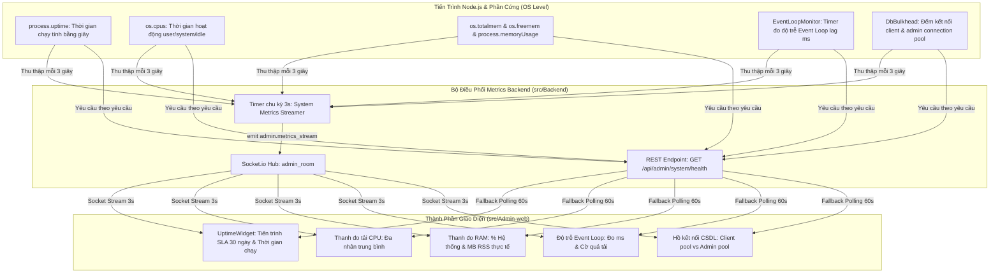

# 🖥️ Chức Năng 03: Giám Sát Sức Khỏe Máy Chủ & Đo Lường Uptime SLA 30 Ngày (Server Health & SLA Monitoring)

> **Mã chức năng:** `ADMIN-FEAT-03`  
> **Module phụ trách:**  
> - Frontend: `src/Admin-web/src/components/common/ServerHealthPanel.jsx`, `DashboardPage.jsx`  
> - Backend: `src/Backend/modules/admin/admin.service.js`, `src/Backend/core/resilience/event-loop-monitor.js`, `src/Backend/core/resilience/db-bulkhead.js`, `src/Backend/index.js`  

---

## 📌 1. TỔNG QUAN & MỤC ĐÍCH NGHIỆP VỤ

**Giám Sát Sức Khỏe Máy Chủ & Đo Lường Uptime SLA** là bảng chỉ số hạ tầng thời gian thực cung cấp cho quản trị viên cái nhìn trực diện về trạng thái vận hành của máy chủ Node.js và CSDL PostgreSQL. 

Điểm nổi bật của chức năng này là **công thức tính tỷ lệ hoạt động liên tục (Uptime Percentage) theo tiêu chuẩn cam kết dịch vụ SLA 30 ngày**, loại bỏ các con số ảo 100% khi server vừa mới được deploy hoặc restart, phản ánh độ tin cậy thực tế của nền tảng dịch vụ.

---

## ⚙️ 2. CƠ CHẾ HOẠT ĐỘNG CHI TIẾT (END-TO-END FLOW)

### 2.1. Luồng truyền tải kép (Dual-Path Delivery)
1. **Luồng Real-time Stream chính (Primary):** `System Metrics Streamer` chạy ngầm định kỳ **3 giây/lần** trong `index.js`, phát sự kiện `admin.metrics_stream` trực tiếp vào room `admin_room`. Bảng điều khiển cập nhật kim đo và phần trăm ngay lập tức mà không cần gửi request HTTP.
2. **Luồng REST Fallback dự phòng (Secondary):** Định kỳ **60 giây/lần** (hoặc khi mất kết nối mạng Socket), component tự động gọi API `GET /api/admin/system/health` để bảo toàn tính toàn vẹn dữ liệu.

---

## 📐 3. CÁC CHỈ SỐ, CÔNG THỨC & CÁCH TÍNH TOÁN

### 3.1. Công thức tính Uptime SLA 30 Ngày Chuẩn Hóa
Nhiều hệ thống thường hiển thị "100% Uptime" ngay cả khi server vừa restart được 2 phút. Trong ManagementFinance, công thức phản ánh chính xác chu kỳ cam kết chất lượng dịch vụ (SLA Window 30 ngày):

$$\text{SLA Window (seconds)} = 30 \times 24 \times 3600 = 2,592,000 \text{ giây}$$

$$\text{Uptime Percentage (\%)} = \left(\frac{\text{uptimeSeconds}}{\max(\text{uptimeSeconds}, 2,592,000)} \times 100\right)$$

- **Ý nghĩa vận hành:**
  - Nếu server vừa restart chạy được 1 giờ (3,600s) $\implies \text{Uptime} \approx 0.139\%$.
  - Nếu server duy trì hoạt động ổn định liên tục đủ 30 ngày $\implies \text{Uptime} = 100.000\%$.
  - Khuyến khích đội ngũ kỹ thuật duy trì server bền vững, không restart bừa bãi.

### 3.2. Định Dạng Chuỗi Thời Gian Hoạt Động (`formatUptimeDuration`)
Chuyển đổi số giây thực tế `process.uptime()` thành định dạng tiếng Việt tự nhiên:
- Số ngày: $\lfloor \text{seconds} / 86400 \rfloor$
- Số giờ: $\lfloor (\text{seconds} \pmod{86400}) / 3600 \rfloor$
- Số phút: $\lfloor (\text{seconds} \pmod{3600}) / 60 \rfloor$
- *Kết quả hiển thị:* `5 ngày 12 giờ 34 phút`.

### 3.3. Công thức tính Tải CPU Trung Bình Đa Nhân
Duyệt qua tất cả các nhân phần cứng CPU (`os.cpus()`):

$$\text{CPU Core \%} = \frac{\text{totalTime} - \text{idleTime}}{\text{totalTime}} \times 100$$

$$\text{Average CPU \%} = \frac{\sum_{i=1}^{N} \text{Core}_i}{N} \quad (N = \text{số nhân CPU})$$

### 3.4. Công thức tính Bộ Nhớ RAM
- **RAM sử dụng:** $\text{usedMem} = \text{totalmem} - \text{freemem}$
- **Tỷ lệ RAM %:** $(\text{usedMem} / \text{totalmem}) \times 100$
- **RSS (Resident Set Size):** Đo lường lượng RAM vật lý thực tế mà tiến trình Node.js đang chiếm giữ: `Math.round(process.memoryUsage().rss / 1024 / 1024)` (MB).

### 3.5. Đo Lường Độ Trễ Event Loop (Event Loop Lag)
Sử dụng một micro-timer để đo độ trễ thực tế giữa thời điểm dự kiến kích hoạt timer và thời điểm callback thực sự được thực thi.
- Nếu `lagMs < 20ms`: Event Loop hoạt động lý tưởng.
- Nếu `lagMs >= 50ms`: Cảnh báo nghẽn I/O.
- Nếu `lagMs >= 120ms`: Máy chủ bị quá tải CPU/Event Loop, có nguy cơ treo phản hồi.

---

## ⛔ 4. CÁC GIỚI HẠN KỸ THUẬT & NGƯỠNG CẢNH BÁO

| Chỉ số | Ngưỡng Bình thường | Ngưỡng Cảnh báo (Warning) | Ngưỡng Nguy cấp (Critical) |
|---|:---:|:---:|:---:|
| **Uptime SLA** | $\ge 99.5\%$ (Xanh lá) | $95.0\% - 99.4\%$ (Vàng cam) | $< 95.0\%$ (Đỏ) |
| **CPU Sử Dụng** | $< 70\%$ | $70\% - 84\%$ | $\ge 85\%$ |
| **RAM Sử Dụng** | $< 80\%$ | $80\% - 89\%$ | $\ge 90\%$ |
| **Event Loop Lag** | $< 25\text{ms}$ | $25\text{ms} - 49\text{ms}$ | $\ge 50\text{ms}$ (Bật cờ quá tải) |
| **DB Connection Pool** | $< 70\%$ Max | $70\% - 89\%$ Max | $\ge 90\%$ (Kích hoạt Bulkhead) |

---

## 💼 5. CÔNG DỤNG & GIÁ TRỊ NGHIỆP VỤ

- **Phát hiện rò rỉ bộ nhớ (Memory Leak):** Quản trị viên theo dõi chỉ số `ramRssMb`. Nếu RSS liên tục tăng dần theo thời gian mà không hạ xuống sau garbage collection, hệ thống có nguy cơ rò rỉ bộ nhớ.
- **Minh bạch cam kết SLA:** Cung cấp bằng chứng kỹ thuật rõ ràng về thời gian hoạt động của máy chủ phục vụ đánh giá chất lượng đồ án và vận hành sản phẩm.
- **Cửa thoát hiểm khẩn cấp (Emergency Escape Hatch):** Ngay tại góc panel, quản trị viên có nút công tắc bảo trì độc lập để ngắt kết nối hệ thống lập tức khi phát hiện phần cứng bốc khói hoặc Event Loop bị treo.

---

## 🧩 6. TÍNH NĂNG ĐI KÈM TRÊN GIAO DIỆN

1. **Thanh Progress Bar Uptime:**
   - Đổi màu động theo ngưỡng SLA 30 ngày (`#10b981` cho $\ge 99.5\%$, `#f59e0b` cho $95-99.5\%$, `#ef4444` cho $< 95\%$).
   - Hiển thị ngày giờ khởi động máy chủ quy đổi múi giờ `Asia/Ho_Chi_Minh`.
2. **Khối Gauges Trực Quan Hóa:**
   - 4 thanh đo phần cứng với animation chuyển động 500ms mượt mà.
3. **Chỉ số Cắt Tải Tự Động (Load Shedding Count):**
   - Đếm số lượng request bị middleware chủ động ngắt bỏ trong 24 giờ qua để bảo vệ máy chủ khỏi sập hoàn toàn.

---

## 📱 7. ẢNH HƯỞNG ĐẾN HỆ THỐNG & MOBILE APP (CLIENT-APP)

- **Đến Backend:**
  - Nhịp tim Stream 3s chạy bằng timer non-blocking (`unref()`), payload siêu nhẹ $< 450$ bytes, tiêu tốn $< 0.1\%$ CPU máy chủ.
- **Đến Cơ sở dữ liệu:**
  - Giám sát CSDL thông qua biến In-Memory của `DbBulkhead`, hoàn toàn không phát sinh câu lệnh SQL `SELECT` thăm dò, không làm tốn Connection Pool của người dùng.
- **Đến Mobile App (Client-app):**
  - Khi Admin phát hiện CPU/RAM/Event Loop chạm ngưỡng đỏ trên bảng điều khiển, Admin có thể bật Bảo trì hoặc kích hoạt Load Shedding, giúp bảo vệ an toàn cho các giao dịch tài chính quan trọng của người dùng không bị hỏng hóc giữa chừng.

---

## 📡 8. DANH MỤC API & SOCKET.IO PHỤ TRÁCH

### REST API Endpoints
| Phương thức | Endpoint | Chức năng | Phân quyền |
|---|---|---|---|
| `GET` | `/api/admin/system/health` | Lấy chi tiết thông số phần cứng, uptime SLA, và DB pool | Admin |

### Socket.io Events
- **Nhận từ Server (`admin_room`):**
  - Sự kiện `admin.metrics_stream`: Nhận gói tin nhịp tim mỗi 3 giây chứa đầy đủ Uptime, CPU, RAM, Event Loop Lag và Threat Score.
