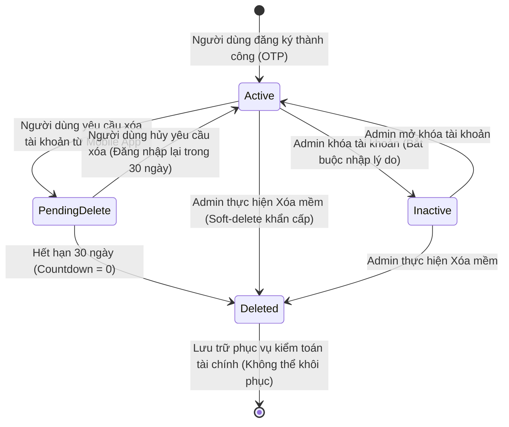

# 👥 Chức Năng 04: Quản Lý Người Dùng & Vòng Đời Tài Khoản (User Management & Lifecycle)

> **Mã chức năng:** `ADMIN-FEAT-04`  
> **Module phụ trách:**  
> - Frontend: `src/Admin-web/src/pages/users/UserListPage.jsx`, `UserDetailPage.jsx`, `src/Admin-web/src/components/common/UserDetailModal.jsx`  
> - Backend: `src/Backend/modules/admin/admin.service.js`, `admin.repository.js`, `admin.controller.js`, `src/Backend/utils/masking.util.js`, `src/Backend/utils/content-filter.util.js`  

---

## 📌 1. TỔNG QUAN & MỤC ĐÍCH NGHIỆP VỤ

Chức năng **Quản Lý Người Dùng & Vòng Đời Tài Khoản** cho phép quản trị viên theo dõi, giám sát và can thiệp kịp thời vào trạng thái hoạt động của các tài khoản người dùng cuối (Client-app). 

Hệ thống được thiết kế tuân thủ tuyệt đối **Nghị định 13/2023/NĐ-CP về Bảo vệ dữ liệu cá nhân** và chuẩn **GDPR**:
- 100% dữ liệu nhạy cảm (Email, SĐT, Địa chỉ) hiển thị trên màn hình đều được mặt nạ hóa (Masking).
- Quy trình khóa tài khoản bắt buộc phải có lý do nghiệp vụ chính đáng và phát sinh sự kiện **Cưỡng chế đăng xuất (Force Logout)** tức thời trên thiết bị di động.
- Quy trình xóa tài khoản được thực thi an toàn bằng giao dịch cơ sở dữ liệu (Prisma Transaction 5 bước), không làm mất dữ liệu tài chính lịch sử.

---

## ⚙️ 2. VÒNG ĐỜI TÀI KHOẢN & CƠ CHẾ HOẠT ĐỘNG (LIFECYCLE FLOW)



### 2.1. Quy trình Khóa Tài Khoản & Cưỡng Chế Đăng Xuất (Force Logout)
Khi quản trị viên phát hiện tài khoản người dùng có dấu hiệu gian lận, rửa tiền hoặc vi phạm điều khoản:
1. Admin chọn **"Vô hiệu hóa (Khóa tài khoản)"** và nhập lý do (ví dụ: *"Phát hiện dấu hiệu đăng nhập bất thường từ nhiều thiết bị lạ"*).
2. Backend kiểm tra tính hợp lệ của lý do (`validateReasonInactive`).
3. Cập nhật `status = 'Inactive'` và lưu lý do vào database.
4. Xóa sạch cache xác thực `invalidateAccountCache(idaccount)`.
5. Phát sự kiện Socket.io `force_logout` mang mã `ACCOUNT_INACTIVE` tới thiết bị di động của người dùng.
6. **Trên ứng dụng Mobile Flutter:** Ứng dụng lập tức bắt sự kiện, hiển thị hộp thoại thông báo lý do khóa của Admin, xóa sạch token trong máy và đẩy người dùng ra khỏi phiên làm việc về màn hình Đăng nhập.

### 2.2. Giao Dịch Xóa Mềm 5 Bước An Toàn (Soft-Delete Transaction)
Khi Admin thực hiện xóa tài khoản, để bảo toàn tính toàn vẹn dữ liệu kế toán và lịch sử giao dịch, hệ thống không chạy lệnh `DELETE` vật lý mà thực thi giao dịch Prisma Transaction 5 bước bất khả xâm phạm:
```javascript
return prisma.$transaction(async (tx) => {
  // Bước 1: Đánh dấu xóa Account (status = 'Deleted', countdown = 0, delete_at = now)
  await tx.account.update({ where: { idaccount }, data: { status: 'Deleted', countdown: 0, delete_at: now } });
  
  // Bước 2: Đánh dấu xóa User (delete_at = now)
  await tx.user.update({ where: { iduser }, data: { delete_at: now } });
  
  // Bước 3: Đóng băng toàn bộ ví tài chính liên quan (status = 'Inactive')
  await tx.wallet.updateMany({ where: { idaccount, delete_at: null }, data: { status: 'Inactive' } });
  
  // Bước 4: Ngắt kết nối ngân hàng nhưng giữ lại lịch sử đối soát
  await tx.bank_account.updateMany({ where: { idaccount }, data: { connect_status: 'Disconnected' } });
  
  // Bước 5: Thu hồi toàn bộ Refresh Token ngay lập tức
  await tx.refreshtoken.updateMany({ where: { idaccount }, data: { status: true } });
});
```

---

## 📐 3. CÁC QUY TẮC MẶT NẠ HÓA DỮ LIỆU (DATA MASKING RULES)

Nhằm đảm bảo quản trị viên không thể thu thập hoặc làm rò rỉ dữ liệu cá nhân của khách hàng:

| Trường thông tin | Quy tắc mặt nạ hóa (Masking Formula) | Dữ liệu gốc mẫu | Dữ liệu hiển thị trên Admin-web |
|---|---|---|---|
| **Email** | Giữ ký tự đầu + `***` + ký tự cuối trước `@` + giữ domain | `nguyenphubao@gmail.com` | `n***o@gmail.com` |
| **Số điện thoại** | Giữ 2 số đầu + `****` + 3 số cuối | `0901234567` | `09****567` |
| **Địa chỉ** | Thay thế số nhà & tên đường bằng `***`, giữ lại Tỉnh/Thành phố | `123 Nguyễn Văn Cừ, Quận 5, TP. Hồ Chí Minh` | `***, TP. Hồ Chí Minh` |
| **Địa chỉ IP** | Giữ 2 octet đầu, che 2 octet cuối dạng `xx.xx` | `113.161.45.12` | `113.161.xx.xx` |

---

## ⛔ 4. CÁC RÀNG BUỘC PHÁP LÝ & AN NINH TUYỆT ĐỐI

1. **Ràng buộc Quyền Tự Chủ GDPR (`PendingDelete Protection`):**
   - Khi người dùng gửi yêu cầu xóa tài khoản từ Mobile App, tài khoản chuyển sang trạng thái `PendingDelete` với thời gian đếm ngược 30 ngày (Countdown).
   - **Quy tắc bất di bất dịch:** Admin **tuyệt đối KHÔNG ĐƯỢC PHÉP** thay đổi trạng thái hoặc thao tác xóa trên tài khoản đang trong trạng thái `PendingDelete`. Server sẽ từ chối với lỗi HTTP 400 để bảo vệ quyền tự do thu hồi yêu cầu của người dùng.
2. **Bảo vệ tài khoản Quản trị viên Tối cao:**
   - Admin không thể tự xóa tài khoản của chính mình hoặc xóa tài khoản của các Admin khác (`idrole === 1`).
3. **Bảo vệ nội dung lý do khóa (`validateReasonInactive`):**
   - Lý do vô hiệu hóa bắt buộc phải có độ dài từ 5 đến 255 ký tự, không được bỏ trống và không được chứa các từ ngữ phản cảm.

---

## 💼 5. CÔNG DỤNG & GIÁ TRỊ NGHIỆP VỤ

- **Kiểm soát rủi ro tức thì:** Ngăn chặn ngay lập tức các tài khoản đang có hành vi spam giao dịch hoặc tấn công hệ thống.
- **Minh bạch thông tin:** Quản trị viên nắm rõ tài khoản nào đang hoạt động, tài khoản nào đang trong diện chờ thanh lý 30 ngày.
- **Tuân thủ pháp luật:** Tránh mọi rủi ro kiện tụng liên quan đến việc nhân viên nội bộ xem lén thông tin liên lạc cá nhân của khách hàng.

---

## 🧩 6. TÍNH NĂNG ĐI KÈM TRÊN GIAO DIỆN

1. **Bảng Danh Sách Người Dùng (`UserListPage.jsx`):**
   - Tìm kiếm linh hoạt theo Họ tên, Email hoặc Số điện thoại.
   - Bộ lọc trạng thái đa năng: Tất cả, Hoạt động (`Active`), Đã vô hiệu hóa (`Inactive`), Chờ xóa (`PendingDelete`), Đã xóa (`Deleted`).
1. **Giao Diện Quản Lý Người Dùng Chuẩn Enterprise AIOps Bento (`UserListPage.jsx` — Cập nhật v2.5):**
   - **Hero Header Bar:** Tích hợp icon nhận diện tròn gradient, huy hiệu Realtime Sync xanh lá nhấp nháy, nút Refresh tức thì.
   - **Bento Stats KPI:** 4 thẻ KPI bo góc `rounded-2xl` tổng hợp tức thời: Tổng người dùng, Đang hoạt động, Bị vô hiệu hóa, Chờ xóa 30 ngày (hỗ trợ click trực tiếp để chuyển nhanh bộ lọc).
   - **Thanh Điều Khiển Pill Tabs:** Lọc nhanh trạng thái người dùng dạng viên thuốc (`Tất Cả`, `Hoạt Động`, `Vô Hiệu Hóa`, `Chờ Xóa`) kèm số lượng badge thời gian thực.
   - **Bảng Dữ Liệu Hiện Đại:** Bo góc mềm `rounded-2xl`, avatar người dùng sinh động, badges trạng thái pastel chuẩn màu (Emerald, Slate, Amber, Rose).
   - **Bộ Lọc Nâng Cao:** Hỗ trợ tìm kiếm realtime đa trường (Họ tên, Email, SĐT, Username) và lọc theo 4 khu vực đô thị trọng điểm: TP. Hồ Chí Minh, Hà Nội, Đà Nẵng, Cần Thơ.
   - **Phân Trang Tiêu Chuẩn:** Tùy chọn 5, 10, 20 hoặc 50 người dùng/trang với bộ điều hướng linh hoạt.
2. **Modal & Trang Chi Tiết Người Dùng (`UserDetailModal.jsx` / `UserDetailPage.jsx`):**
   - Hiển thị ngày tạo tài khoản, ngày cập nhật, mã vùng quốc gia, lý do khóa và số ngày đếm ngược chờ xóa.
3. **Modal Khóa Tài Khoản Kèm Kiểm Tra Ràng Buộc:**
   - Textarea nhập lý do có đếm ký tự và thông báo lỗi trực tiếp, nút vô hiệu hóa tự động bị khóa khi chưa nhập lý do.
4. **Cập Nhật Real-Time Không Cần F5:**
   - Nhận sự kiện `admin.user_registered`: Tự động chèn người dùng mới lên đầu bảng với hiệu ứng hiển thị nổi bật và phát sinh Alert Toast.
   - Nhận sự kiện `admin.user_status_changed`: Cập nhật lại Badge màu và số ngày countdown của dòng đó ngay lập tức.

---

## 📱 7. ẢNH HƯỞNG ĐẾN HỆ THỐNG & MOBILE APP (CLIENT-APP)

- **Đến Backend:**
  - Lệnh soft-delete được gói gọn trong 1 Transaction nguyên tử (ACID), cam kết hoặc hoàn tất tất cả hoặc rollback, không bao giờ để lại dữ liệu rác.
- **Đến Mobile App (Client-app):**
  - **Khóa tài khoản:** Client nhận Socket `force_logout`, bị xóa JWT, chuyển về màn hình đăng nhập. Mọi API sau đó đều trả về HTTP 401/403 kèm thông báo lý do Admin đã nhập.
  - **Mở khóa tài khoản:** Người dùng có thể đăng nhập lại bình thường trên điện thoại.
  - **Xóa mềm:** Toàn bộ liên kết ngân hàng bị ngắt kết nối an toàn, các giao dịch offline trên SQLite sẽ không thể push sync lên máy chủ.

---

## 📡 8. DANH MỤC API & SOCKET.IO PHỤ TRÁCH

### REST API Endpoints
| Phương thức | Endpoint | Chức năng | Phân quyền |
|---|---|---|---|
| `GET` | `/api/admin/getuser` | Lấy danh sách toàn bộ người dùng Client-app (đã mask) | Admin |
| `GET` | `/api/admin/getuser/:id` | Lấy chi tiết thông tin tài khoản và người dùng | Admin |
| `PATCH` | `/api/admin/updatestatus/:id` | Khóa hoặc mở khóa tài khoản người dùng | Admin |
| `DELETE` | `/api/admin/deleteuser/:id` | Xóa mềm tài khoản an toàn 5 bước | Admin |

### Socket.io Events
- **Lắng nghe (`Client -> Server`):**
  - `admin.user_registered`: Nhận thông tin tài khoản mới đăng ký từ Client-app.
  - `admin.user_status_changed`: Nhận biến động trạng thái tài khoản.
- **Phát tán (`Server -> Client-app`):**
  - `force_logout`: Gửi tới socket của người dùng cụ thể để cưỡng chế đăng xuất thiết bị.
