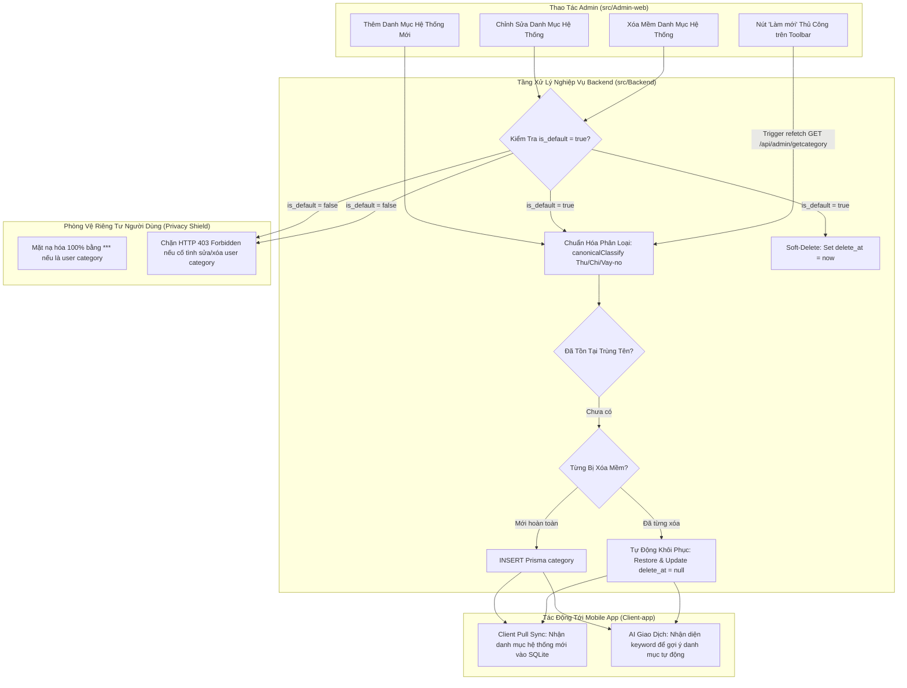

# 🏷️ Chức Năng 05: Quản Lý Danh Mục Hệ Thống & Bảo Vệ Quyền Riêng Tư (Category Management & Privacy Defense)

> **Mã chức năng:** `ADMIN-FEAT-05`  
> **Module phụ trách:**  
> - Frontend: `src/Admin-web/src/pages/categories/CategoryPage.jsx`  
> - Backend: `src/Backend/modules/admin/admin.service.js`, `admin.repository.js`, `admin.controller.js`  

---

## 📌 1. TỔNG QUAN & MỤC ĐÍCH NGHIỆP VỤ

Chức năng **Quản Lý Danh Mục Hệ Thống** cho phép quản trị viên thiết lập và duy trì bộ danh mục thu chi chuẩn mực cho toàn bộ nền tảng. Khi một người dùng mới đăng ký tài khoản trên Mobile App, hệ thống sẽ sử dụng các danh mục mặc định này để khởi tạo bộ khung tài chính ban đầu cho họ.

Điểm kiến trúc then chốt của chức năng này là **Cơ chế Phòng Vệ Chiều Sâu (Defense-in-Depth Privacy Protection)**: Admin chỉ quản lý các danh mục công cộng của hệ thống (`is_default = true`), **tuyệt đối không được phép xem, chỉnh sửa hoặc xóa các danh mục riêng tư do người dùng tự tạo trên ứng dụng di động** (`is_default = false`).

---

## ⚙️ 2. CƠ CHẾ HOẠT ĐỘNG CHI TIẾT (END-TO-END FLOW)



### 2.1. Cơ Chế Chuẩn Hóa Phân Loại Danh Mục (Canonical Classify Normalization)
Để đảm bảo tính nhất quán giữa cơ sở dữ liệu tiếng Việt và mobile app đa ngôn ngữ, hệ thống tự động chuẩn hóa mọi biến thể của nhóm Vay/Nợ về một định danh duy nhất:
- Nhập vào: `'Vay/nợ'`, `'Vay'`, hoặc `'no'` $\implies$ Chuẩn hóa lưu trữ: `'Vay/no'`.
- Ba nhóm phân loại chuẩn:
  1. **`Thu` (`income`):** Danh mục nguồn thu nhập (Lương, Thưởng, Lãi tiết kiệm, Đầu tư).
  2. **`Chi` (`expense`):** Danh mục chi tiêu (Ăn uống, Đi lại, Mua sắm, Y tế, Giáo dục).
  3. **`Vay/no` (`debt`):** Danh mục công nợ (Cho vay, Đi vay, Trả nợ, Thu nợ).

### 2.2. Cơ Chế Chống Trùng Lặp & Tự Động Phục Hồi (Auto-Restore on Re-create)
Để tránh tình trạng duplicate dữ liệu:
1. Khi Admin tạo danh mục `"Tiền Điện"`, Backend kiểm tra trong các danh mục hệ thống đang active (`delete_at: null`). Nếu đã có danh mục cùng tên (so sánh không phân biệt hoa thường - `mode: 'insensitive'`), hệ thống báo lỗi HTTP 400.
2. Nếu danh mục `"Tiền Điện"` đã từng bị xóa mềm trong quá khứ (`delete_at: { not: null }`), hệ thống **tự động phục hồi bản ghi cũ**, cập nhật lại `delete_at = null`, gán icon và từ khóa mới. Cơ chế này giúp giữ nguyên khóa chính `idcategory`, bảo toàn tính toàn vẹn cho các giao dịch lịch sử trước đây từng liên kết với danh mục này.

### 2.3. Phòng Vệ Chiều Sâu 3 Tầng (Defense-in-Depth Privacy)
- **Tầng 1 (Query Level):** Mọi câu lệnh truy vấn từ Admin Repository luôn bắt buộc có điều kiện `where: { is_default: true, delete_at: null }`.
- **Tầng 2 (Masking Fallback):** Nếu vì lỗi hệ thống hoặc dữ liệu bất thường mà một danh mục của người dùng lọt vào kết quả, service tự động che tên và từ khóa thành `***` trước khi gửi ra response.
- **Tầng 3 (Mutation Guard):** Tại API Update và Delete, service kiểm tra cờ `if (!currentCat.is_default)`. Nếu phát hiện là danh mục cá nhân của người dùng, server lập tức ném lỗi HTTP 403: *"Vi phạm quyền riêng tư: Tuyệt đối cấm chỉnh sửa/xóa danh mục của người dùng"*.

---

## 📐 3. CẤU TRÚC DỮ LIỆU & TỪ KHÓA HỌC MÁY (KEYWORD FIELD)

Mỗi danh mục hệ thống chứa các trường dữ liệu quan trọng phục vụ vận hành:

```json
{
  "id": "uuid-v4",
  "name": "Ăn uống",
  "classify": "Chi",
  "type": "expense",
  "is_default": true,
  "keyword": "com, bun, pho, ca phe, tra sua, nha hang, sieu thi, bach hoa",
  "icon": "restaurant",
  "created_by": "Hệ thống"
}
```

- **Ý nghĩa trường `keyword`:** Là chuỗi các từ khóa ngữ nghĩa không dấu và có dấu phân cách bằng dấu phẩy. Trường này là **nguồn tri thức nền tảng (Ground Truth) để mô hình Edge AI & SLM trên điện thoại di động** tự động phân loại giao dịch khi quét SMS ngân hàng hoặc OCR hóa đơn bán lẻ.

---

## ⛔ 4. CÁC RÀNG BUỘC KỸ THUẬT

1. **Ràng buộc tên danh mục:** Độ dài từ 2 đến 50 ký tự, không được chỉ chứa khoảng trắng.
2. **Ràng buộc un-link danh mục con khi xóa Group:** Nếu xóa một danh mục cha (`is_group = true`), toàn bộ danh mục con trực thuộc sẽ được tự động tách độc lập (`updateMany: idgroup = null`), không gây lỗi ràng buộc khóa ngoại (Foreign Key Constraint).
3. **Admin chỉ tạo danh mục hệ thống:** Toàn bộ danh mục tạo từ Admin-web đều bắt buộc gán `is_default = true`.

---

## 💼 5. CÔNG DỤNG & GIÁ TRỊ NGHIỆP VỤ

- **Chuẩn hóa hệ sinh thái tài chính:** Định hình sẵn các thói quen ghi chép thu chi cho người dùng khi mới cài app.
- **Tối ưu hóa độ chính xác của AI:** Khi Admin bổ sung các từ khóa mới xuất hiện trên thị trường (ví dụ: *"ShopeeFood"*, *"GrabMart"*), năng lực nhận diện của Chatbot AI và OCR sẽ tự động thông minh hơn.
- **Độc lập và bảo mật:** Người dùng thoải mái tạo danh mục riêng tư cá nhân mà không sợ nhân viên quản trị đọc lén.

---

## 🧩 6. TÍNH NĂNG ĐI KÈM TRÊN GIAO DIỆN

1. **Giao Diện Quản Lý Danh Mục Chuẩn Enterprise AIOps Bento (`CategoryPage.jsx` — Cập nhật v2.5):**
   - **Hero Header Bar:** Biểu tượng nhận diện tròn gradient, huy hiệu NLP Keywords Ready nổi bật, nút Refresh tải lại tức thì và nút Thêm mới nổi bật.
   - **Bento Stats KPI:** 4 thẻ KPI bo góc `rounded-2xl` tổng hợp tức thời: Tổng danh mục hệ thống, Khoản chi tiêu (Expense), Khoản thu nhập (Income), Nghĩa vụ vay/nợ (Debt) (hỗ trợ bấm chuyển nhanh bộ lọc).
   - **Thanh Điều Khiển Pill Tabs:** Lọc nhanh theo phân loại dạng viên thuốc (`Tất Cả`, `Chi Tiêu`, `Thu Nhập`, `Vay / Nợ`) hiển thị kèm số lượng thống kê theo từng nhóm.
   - **Bảng Danh Mục Hiện Đại:** Bo góc mềm `rounded-2xl`, hiển thị icon sinh động cho từng loại giao dịch, thanh từ khóa AI NLP bo tròn tinh tế hỗ trợ select-all tiện lợi.
   - **Cơ Chế Bảo Vệ Riêng Tư:** Danh mục cá nhân hiển thị `***` và tự động gắn badge `Cấm sửa / xóa`.
   - **Tìm Kiếm Đa Năng:** Hỗ trợ tìm kiếm thông minh tiếng Việt không dấu (`normalizeVietnameseUnaccent`).
2. **Modal Thêm Mới & Chỉnh Sửa:**
   - Chọn loại phân loại bằng Selectbox trực quan, input tên danh mục bo tròn chuẩn thiết kế Enterprise.
   - Hướng dẫn nhập từ khóa gợi ý cho bộ máy phân loại AI tự động.
3. **Modal Cảnh Báo Xóa An Toàn:**
   - Cảnh báo rõ việc xóa là Soft Delete, không làm mất giao dịch lịch sử của người dùng.
4. **Nút 'Làm Mới' Trên Thanh Công Cụ (`Refresh Button`):**
   - Theo quyết định của PO (Mục 05): Bỏ lắng nghe Real-time Socket.io vì danh mục hệ thống có tần suất thay đổi rất thấp; trang bị nút "Làm mới" trực tiếp trên toolbar (`title="Làm mới danh sách danh mục"`) kèm biểu tượng xoay khi đang tải, cho phép Admin chủ động tải lại danh sách khi cần.

---

## 📱 7. ẢNH HƯỞNG ĐẾN HỆ THỐNG & MOBILE APP (CLIENT-APP)

- **Đến Backend:**
  - Index độc lập trên `[name_category, is_default, delete_at]` giúp tốc độ kiểm tra trùng lặp chỉ mất $< 2\text{ms}$.
  - Giảm tải kết nối WebSocket duy trì không cần thiết cho màn hình danh mục.
- **Đến Mobile App (Client-app):**
  - Khi người dùng đăng ký mới hoặc cài lại ứng dụng, Mobile App gọi `GET /api/sync/pull` để kéo danh sách các danh mục `is_default = true` mới nhất này vào CSDL SQLite nội bộ trên điện thoại.
  - Các giao dịch mới tạo trên điện thoại sẽ tự động gợi ý danh mục dựa trên bộ từ khóa `keyword` mà Admin đã cấu hình.

---

## 📡 8. DANH MỤC API & PHƯƠNG THỨC ĐỒNG BỘ

### REST API Endpoints
| Phương thức | Endpoint | Chức năng | Phân quyền |
|---|---|---|---|
| `GET` | `/api/admin/getcategory` | Lấy danh sách danh mục mặc định hệ thống | Admin |
| `POST` | `/api/admin/addcategory` | Tạo mới hoặc phục hồi danh mục hệ thống | Admin |
| `PUT` | `/api/admin/updatecategory/:id` | Cập nhật thông tin danh mục hệ thống | Admin |
| `DELETE` | `/api/admin/deletecategory/:id` | Xóa mềm danh mục hệ thống | Admin |

### Phương Thức Đồng Bộ (Sync Strategy)
- **Cơ chế:** Kéo thủ công qua nút "Làm mới" (Manual Pull via REST API).
- **Socket.io:** Đã loại bỏ hoàn toàn listener tại giao diện Quản lý Danh mục theo quyết định tối ưu hóa tài nguyên của PO.
