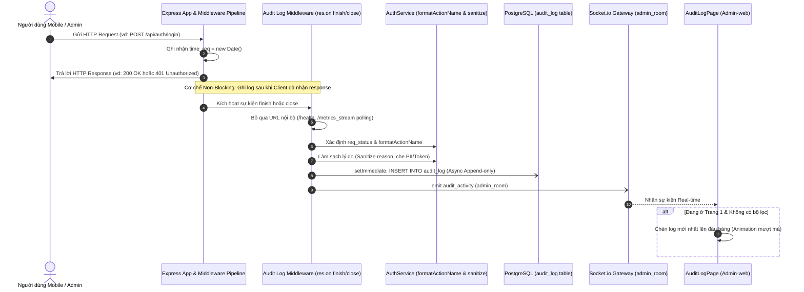

# 📜 Chức Năng 06: Nhật Ký Truy Vết Toàn Hệ Thống (Audit Logging & Security Traceability)

> **Mã chức năng:** `ADMIN-FEAT-06`  
> **Module phụ trách:**  
> - Frontend: `src/Admin-web/src/pages/system/AuditLogPage.jsx`  
> - Backend: `src/Backend/middleware/audit-log.middleware.js`, `src/Backend/modules/auth/auth.service.js`, `src/Backend/modules/admin/admin.repository.js`  

---

## 📌 1. TỔNG QUAN & MỤC ĐÍCH NGHIỆP VỤ

**Hệ Thống Nhật Ký Truy Vết Toàn Bộ Request (Audit Logging)** là kho lưu trữ pháp lý bất biến (Append-only Ledger) ghi nhận toàn bộ các thao tác, yêu cầu API, trạng thái xử lý và nguyên nhân lỗi phát sinh trên toàn hệ thống (bao gồm cả từ ứng dụng di động Client-app lẫn web quản trị Admin-web).

Chức năng cung cấp năng lực **Truy vết an ninh số (Digital Forensics)** giúp quản trị viên:
1. Phát hiện các cuộc tấn công dò quét mật khẩu hoặc cố tình khai thác API trái phép.
2. Đối soát khiếu nại của người dùng khi gặp lỗi đồng bộ hoặc gián đoạn giao dịch.
3. Đáp ứng tiêu chuẩn kiểm toán hệ thống bắt buộc theo Nghị định 13/2023/NĐ-CP và khuyến nghị OWASP Top 10 API Security.

---

## ⚙️ 2. CƠ CHẾ HOẠT ĐỘNG CHI TIẾT (END-TO-END FLOW)

### 2.1. Cơ Chế Bất Đồng Bộ Không Gây Chậm Client (Zero Latency Overhead)
- Middleware ghi nhận `time_req` ngay khi request chạm vào server.
- Việc tính toán mã trạng thái và ghi vào database được trì hoãn đến khi sự kiện `res.on('finish')` (hoặc `res.on('close')`) phát ra và đóng gói trong hàm `setImmediate()`.
- **Kết quả:** Quá trình ghi nhận Audit Log **hoàn toàn không làm tăng thêm dù chỉ 1 phần nghìn giây (0ms overhead)** vào thời gian phản hồi trả về cho người dùng di động.

### 2.2. Bộ Lọc Tránh Phình Dữ Liệu Rác (Noise Reduction Filter)
Để ngăn chặn bảng `audit_log` bị phình to bởi hàng triệu request kiểm tra định kỳ của hệ thống hạ tầng, middleware tự động loại trừ (bypass) các route sau:
- `/health`, `/health/admin`, `/favicon.ico`
- Các polling thống kê của chính Admin: `/admin/system/health`, `/admin/totaluser`, `/admin/totalcategories`, `/admin/getusertotime`, `/admin/login-stats`, `/admin/request-stats`, `/admin/aiops/*`.

### 2.3. Ánh Xạ Hành Động Tiếng Việt Thân Thiện (`formatActionName`)
Thay vì hiển thị URL kỹ thuật khó hiểu (`POST /api/sync/push`), hệ thống tự động biên dịch thành ngôn ngữ tự nhiên:
- `POST /api/auth/login` $\implies$ **"Đăng nhập hệ thống"**
- `POST /api/auth/register` $\implies$ **"Đăng ký tài khoản"**
- `POST /api/sync/push` $\implies$ **"Đồng bộ dữ liệu (Push)"**
- `GET /api/sync/pull` $\implies$ **"Tải dữ liệu đồng bộ (Pull)"**
- `POST /api/ai/chatbot/chat/stream` $\implies$ **"Hỏi đáp trợ lý tài chính AI"**
- `POST /api/bank/webhook` $\implies$ **"Webhook biến động số dư"**

---

## 📐 3. CÁC MÃ TRẠNG THÁI & NGUYÊN NHÂN LỖI (STATUS CODES)

Hệ thống phân loại các request vào 7 trạng thái chuẩn hóa:

| Trạng thái | Mã HTTP tương ứng | Màu sắc hiển thị | Ý nghĩa vận hành |
|---|:---:|:---:|---|
| **Pass** | `200`, `201`, `204` | Xanh lá (`#dcfce7`) | Yêu cầu xử lý thành công trọn vẹn. |
| **Accepted** | `202` | Xanh ngọc (`#ccfbf1`) | Yêu cầu đã được tiếp nhận vào hàng đợi xử lý ngầm. |
| **Processing** | `102` | Xanh dương (`#dbeafe`) | Yêu cầu đang được xử lý trong tiến trình dài hạn. |
| **Pending** | — | Tím (`#f3e8ff`) | Đang chờ điều kiện hoặc chờ xác nhận từ bên thứ ba. |
| **Rejected** | `400`, `401`, `403`, `429` | Đỏ nhạt (`#fee2e2`) | Bị từ chối do sai mật khẩu, thiếu token, hoặc vượt quá giới hạn tần suất (Rate limit). |
| **Fail** | `500`, `502`, `503`, `504` | Đỏ đậm (`#fef2f2`) | Lỗi máy chủ nội bộ hoặc lỗi kết nối dịch vụ bên ngoài. |
| **Interrupted** | Client ngắt kết nối giữa chừng | Vàng Cam (`#fef9c3`) | Người dùng hủy request hoặc mất sóng 4G/Wifi trước khi server gửi xong response. |

### Cơ chế làm sạch lý do lỗi (`sanitizeAuditReason`)
Tuyệt đối không lưu trữ chi tiết kỹ thuật nhạy cảm ra ngoài:
- Các chuỗi chứa Token, Password, Secret Key hoặc Database Connection String đều được lọc bỏ.
- Lỗi 401 được chuẩn hóa: *"Tài khoản hoặc mật khẩu không chính xác"* hoặc *"Phiên đăng nhập đã hết hạn"*.
- Lỗi 500 được chuẩn hóa: *"Lỗi máy chủ nội bộ trong quá trình xử lý"*.

---

## ⛔ 4. CÁC GIỚI HẠN KỸ THUẬT & TÍNH BẤT BIẾN (IMMUTABILITY)

1. **Nguyên tắc Append-Only (Bất biến):**
   - Bảng `audit_log` trong CSDL PostgreSQL chỉ có quyền `INSERT` và `SELECT`. Tuyệt đối cấm lệnh `UPDATE` hoặc `DELETE` từ bất kỳ tài khoản nào (kể cả Admin) để đảm bảo bằng chứng pháp lý trước cơ quan chức năng.
2. **Giới hạn số lượng truy vấn (`queryLimit`):**
   - API phân trang cho phép lấy tối đa 200 bản ghi/lần (mặc định 50 bản ghi/trang).
3. **Chỉ mục hiệu năng (Composite Indexes):**
   - Đánh index trên `time_req DESC` và `[idaccount, time_req]` giúp truy vấn phân trang trên hàng triệu bản ghi chỉ mất $< 10\text{ms}$.

---

## 💼 5. CÔNG DỤNG & GIÁ TRỊ NGHIỆP VỤ

- **Truy tìm nguồn gốc sự cố:** Khi người dùng phản ánh "bị trừ tiền nhưng không thấy giao dịch", Admin kiểm tra Audit Log theo `idaccount` của họ để xem ngân hàng có gửi Webhook hay không và mã phản hồi là gì.
- **Phát hiện tấn công sớm:** Nếu thấy hàng loạt dòng `Rejected` với hành động *"Đăng nhập hệ thống"* liên tục trong vài giây từ cùng 1 tài khoản, Admin biết ngay tài khoản đó đang bị kẻ xấu dò mật khẩu.
- **Giám sát tải hệ thống:** Thống kê tỷ lệ `Pass` vs `Fail` để đánh giá độ ổn định dịch vụ sau mỗi lần release phiên bản mới.

---

## 🧩 6. TÍNH NĂNG ĐI KÈM TRÊN GIAO DIỆN

1. **Bộ Lọc Tìm Kiếm Đa Chiều (`AuditLogPage.jsx`):**
   - Lọc theo từng mã trạng thái (`Pass`, `Fail`, `Rejected`, `Interrupted`, v.v.).
   - Tìm kiếm tức thời theo Tên người dùng (`Username`) hoặc Tên hành động (`Request`).
   - Lọc theo khoảng ngày bắt đầu (`dateFrom`) và ngày kết thúc (`dateTo`).
2. **Luồng Cập Nhật Real-time:**
   - Kết nối Socket.io qua sự kiện `audit_activity`. Khi quản trị viên đang đứng ở Trang 1 và không bật bộ lọc, các dòng log mới phát sinh từ người dùng di động sẽ tự động chèn vào đầu bảng kèm hiệu ứng làm mới nhẹ nhàng.
3. **Thanh Phân Trang Thông Minh (`Pagination.jsx`):**
   - Hỗ trợ nhảy trang trực tiếp và chọn kích thước trang linh hoạt (50, 100, 200).

---

## 📱 7. ẢNH HƯỞNG ĐẾN HỆ THỐNG & MOBILE APP (CLIENT-APP)

- **Đến Backend:**
  - Nhờ xử lý bất đồng bộ qua `setImmediate`, luồng xử lý chính của Node.js không bao giờ bị nghẽn bởi các thao tác ghi log.
- **Đến Mobile App (Client-app):**
  - Mọi sự cố ngắt kết nối mạng do người dùng đi vào vùng mất sóng (đường hầm, thang máy) đều được server ghi nhận chính xác trạng thái `Interrupted`, giúp đội ngũ chăm sóc khách hàng giải thích minh bạch khi có thắc mắc.

---

## 📡 8. DANH MỤC API & SOCKET.IO PHỤ TRÁCH

### REST API Endpoints
| Phương thức | Endpoint | Chức năng | Phân quyền |
|---|---|---|---|
| `GET` | `/api/admin/audit-logs` | Lấy danh sách nhật ký truy vết có lọc và phân trang | Admin |

### Socket.io Events
- **Phát tán (`Server -> admin_room`):**
  - `audit_activity`: Phát gói tin tóm tắt `{ id, idaccount, user, action, status, reason, time_req, time_res }` mỗi khi một request được hoàn tất.
