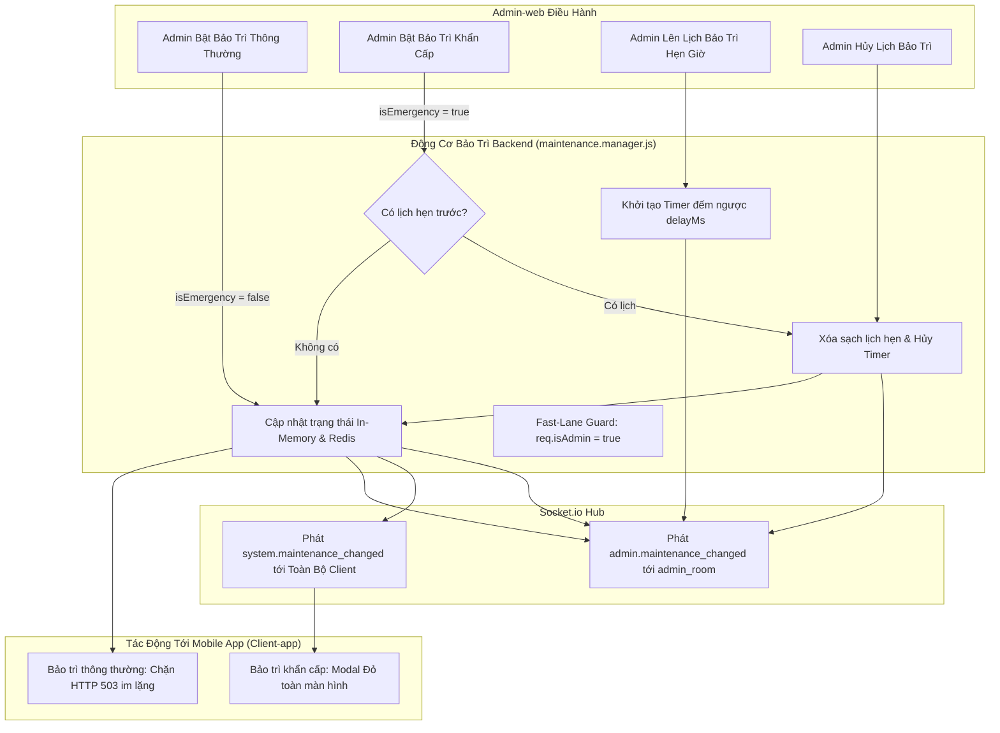

# ⚙️ Chức Năng 07: Quản Trị Chế Độ Bảo Trì & Cứu Hộ Khẩn Cấp (Maintenance & Resilience Management)

> **Mã chức năng:** `ADMIN-FEAT-07`  
> **Module phụ trách:**  
> - Frontend: `src/Admin-web/src/pages/system/BroadcastPage.jsx` (Tab 1), `src/Admin-web/src/components/common/ServerHealthPanel.jsx`  
> - Backend: `src/Backend/core/resilience/maintenance.manager.js`, `src/Backend/middleware/maintenance.middleware.js`, `src/Backend/api/admin.routes.js`  

---

## 📌 1. TỔNG QUAN & MỤC ĐÍCH NGHIỆP VỤ

Chức năng **Quản Trị Chế Độ Bảo Trì & Cứu Hộ Khẩn Cấp** là công tắc ngắt mạch trung tâm (Circuit Breaker) của toàn bộ nền tảng. Khi hệ thống cần nâng cấp phiên bản, thực hiện migrate cơ sở dữ liệu lớn hoặc đối mặt với sự cố an ninh nghiêm trọng, chức năng này cho phép quản trị viên cách ly an toàn máy chủ khỏi lưu lượng người dùng di động.

Đặc biệt, hệ thống triển khai **Quy Tắc Cốt Lõi Của PO**: Khi kích hoạt Bảo trì Khẩn Cấp, hệ thống sẽ **tự động hủy bỏ và xóa sạch lịch bảo trì đã hẹn trước**, chuyển đổi toàn bộ nguồn lực sang chế độ phản ứng thảm họa tức thì.

---

## ⚙️ 2. CƠ CHẾ HOẠT ĐỘNG CHI TIẾT (END-TO-END FLOW)



### 2.1. Hai Chế Độ Bảo Trì Chuyên Biệt (Dual Maintenance Modes)
1. **Bảo trì Kỹ thuật Thông thường (Im lặng - `isEmergency: false`):**
   - Áp dụng khi nâng cấp tính năng định kỳ, sao lưu backup dữ liệu đêm.
   - Toàn bộ kết nối từ Client-app bị chặn với mã **HTTP 503 Service Unavailable**.
   - **Đặc điểm:** Hoàn toàn **KHÔNG phát thông báo hoảng loạn** tới người dùng. Ứng dụng di động tự động giữ dữ liệu cục bộ trong SQLite và âm thầm thử lại sau.
2. **Bảo trì Khẩn Cấp (Phản ứng sự cố - `isEmergency: true`):**
   - Áp dụng khi phát hiện tấn công 0-day, sập đường truyền cáp quang, hoặc đe dọa rò rỉ dữ liệu.
   - Toàn bộ kết nối Client-app bị cắt đứt lập tức với mã HTTP 503.
   - **Đặc điểm:** Tự động phát sóng broadcast cấp độ **CRITICAL** qua Socket.io tới toàn bộ ứng dụng di động đang mở. Trên màn hình điện thoại người dùng sẽ hiện ngay Modal cảnh báo đỏ toàn màn hình yêu cầu tạm dừng thao tác.

### 2.2. Cơ Chế Làn Ưu Tiên Quản Trị (Admin Priority Fast-Lane)
Khi chế độ bảo trì đang bật (kể cả khẩn cấp), các quản trị viên **hoàn toàn KHÔNG bị chặn**. Middleware `adminPriorityMiddleware` kiểm tra:
```javascript
// Nếu request gửi tới các route quản trị /api/admin hoặc có cờ req.isAdmin = true
if (req.isAdmin || (req.baseUrl && req.baseUrl.startsWith('/api/admin'))) {
  return next(); // Cho phép truy cập thông suốt!
}
```
Cơ chế này đảm bảo quản trị viên luôn truy cập được Admin-web để giám sát, điều tra nhật ký và tắt bảo trì khi hoàn thành sửa chữa.

### 2.3. Quy Tắc Cốt Lõi: Bảo Trì Khẩn Cấp Tự Động Xóa Lịch Hẹn Trước
Nếu hệ thống đã được lên lịch bảo trì vào tối mai, nhưng bất ngờ xảy ra sự cố nghiêm trọng ngay hôm nay và Admin bật **Bảo Trì Khẩn Cấp**:
```javascript
// Trích xuất từ src/Backend/core/resilience/maintenance.manager.js
if (isEmergency && this.scheduledTimer) {
  clearTimeout(this.scheduledTimer);
  this.scheduledTimer = null;
  const clearedInfo = this.scheduledMaintenance;
  this.scheduledMaintenance = null;
  
  logger.warn('[MAINTENANCE] Phát hiện sự cố khẩn cấp: TỰ ĐỘNG XÓA LỊCH BẢO TRÌ ĐÃ HẸN TRƯỚC', {
    clearedSchedule: clearedInfo,
    emergencyActivatedBy: activatedBy
  });
}
```
Lịch bảo trì đã hẹn trước sẽ bị hủy bỏ ngay lập tức, ngăn ngừa tình trạng hệ thống bị bật bảo trì trùng lặp hoặc sai lệch mốc thời gian sau khi thảm họa được khắc phục.

---

## 📐 3. CÁC THÔNG SỐ KỸ THUẬT & HEADERS

| Thuộc tính / Header | Giá trị | Mục đích & Ý nghĩa |
|---|---|---|
| **HTTP Status Code** | `503 Service Unavailable` | Báo cho Client và Web Crawler biết server tạm thời bảo trì, không bị đánh tụt SEO. |
| **Header `Retry-After`** | `3600` (giây) | Hướng dẫn client thời gian quay lại thử lại. |
| **Error Code Payload** | `MAINTENANCE_MODE` | Mã chuẩn hóa cho Client-app bắt exception. |
| **Redis Cache Key** | `system:maintenance:status` | Lưu trữ bền bỉ phân tán trên Redis (nếu có nhiều server node). |
| **Scheduled Timer** | `setTimeout().unref()` | Non-blocking timer, không gây treo tiến trình Node.js khi shutdown. |

---

## ⛔ 4. CÁC GIỚI HẠN & NGUYÊN TẮC AN TOÀN

1. **Chặn thời gian trong quá khứ:** Form lên lịch bảo trì tự động kiểm tra thời điểm hẹn. Nếu thời gian chọn nhỏ hơn thời điểm hiện tại (`targetDate <= Date.now()`), hệ thống từ chối với lỗi HTTP 400.
2. **Miễn trừ Route kiểm tra sức khỏe:** Route `/health`, `/health/admin` luôn mở 100% để bộ cân bằng tải (Load Balancer / Kubernetes / Render) không hiểu nhầm container đã chết mà restart liên tục.
3. **Đồng bộ đa tiến trình (Cross-Process Hydration):** Khi khởi động, Backend tự động gọi `hydrateFromRedis()` để nạp lại trạng thái bảo trì nếu trước đó server bị restart bất ngờ.

---

## 💼 5. CÔNG DỤNG & GIÁ TRỊ NGHIỆP VỤ

- **Bảo toàn dữ liệu tài chính:** Khi thực hiện migrate schema bảng giao dịch hoặc nâng cấp thuật toán mã hóa, việc ngắt kết nối Client giúp loại bỏ 100% nguy cơ tranh chấp dữ liệu (Race Condition).
- **Phản ứng thảm họa tức thì:** Cho phép cô lập hệ thống chỉ trong $< 1$ giây khi phát hiện các cuộc tấn công phá hoại CSDL.
- **Tiện lợi cho quản trị:** Có thể lên lịch bảo trì vào lúc 2h sáng và đi ngủ, hệ thống sẽ tự động bật bảo trì đúng giờ mà không cần thức canh.

---

## 🧩 6. TÍNH NĂNG ĐI KÈM TRÊN GIAO DIỆN (`BroadcastPage.jsx`)

1. **Banner Trạng Thái Động Toàn Cục:**
   - Đổi màu thời gian thực: Xanh lá (Bình thường), Cam (Bảo trì Kỹ thuật), Đỏ nhấp nháy Animation Pulse (Bảo trì Khẩn cấp).
   - Nút **"Tắt Bảo Trì & Mở Lại Hệ Thống"** xuất hiện nổi bật ngay trên banner khi bảo trì đang bật.
2. **Form Bật/Tắt Tức Thì:**
   - Ô nhập lý do hiển thị cho người dùng.
   - Checkbox kích hoạt chế độ Khẩn cấp kèm giải thích rõ ràng.
3. **Form Lên Lịch Hẹn Trước:**
   - Input `datetime-local` chọn ngày giờ chuẩn xác.
4. **Card Lịch Bảo Trì Đã Hẹn (Scheduled Card):**
   - Hiển thị thời gian hẹn (đổi sang giờ Việt Nam), lý do, quản trị viên tạo lịch và nút **"Hủy Lịch Hẹn"** màu đỏ nổi bật.

---

## 📱 7. ẢNH HƯỞNG ĐẾN HỆ THỐNG & MOBILE APP (CLIENT-APP)

- **Đến Backend:**
  - Middleware kiểm tra cờ `active` bằng biến In-Memory tốc độ $O(1)$ ($< 0.05\text{ms}$), không tốn tài nguyên DB.
- **Đến Mobile App (Client-app):**
  - **Khi bật Khẩn cấp:** Ứng dụng nhận sự kiện Socket, hiển thị ngay Dialog đỏ không thể bỏ qua: *"Hệ thống đang bảo trì khẩn cấp để bảo vệ an toàn tài khoản"*. Toàn bộ tính năng đồng bộ bị tạm dừng, người dùng vẫn có thể xem lại các giao dịch đã lưu trong máy (Offline-first).
  - **Khi tắt bảo trì:** Ứng dụng tự động kết nối lại, mở khóa các tính năng và đồng bộ hóa các giao dịch đang chờ trong SQLite lên máy chủ.

---

## 📡 8. DANH MỤC API & SOCKET.IO PHỤ TRÁCH

### REST API Endpoints
| Phương thức | Endpoint | Chức năng | Phân quyền |
|---|---|---|---|
| `GET` | `/api/admin/system/maintenance` | Lấy chi tiết trạng thái bảo trì & lịch hẹn hiện tại | Admin |
| `POST` | `/api/admin/system/maintenance` | Bật hoặc Tắt bảo trì tức thì | Admin |
| `POST` | `/api/admin/system/maintenance/schedule` | Lên lịch hẹn bảo trì tự động | Admin |
| `DELETE` | `/api/admin/system/maintenance/schedule` | Hủy bỏ lịch bảo trì đã hẹn | Admin |

### Socket.io Events
- **Phát tán tới Toàn Hệ Thống (`broadcast`):**
  - `system.maintenance_changed`: Bắn tới toàn bộ người dùng di động khi trạng thái bảo trì bật/tắt.
- **Phát tán tới Phòng Quản Trị (`admin_room`):**
  - `admin.maintenance_changed`: Cập nhật trạng thái công tắc và card lịch hẹn trên mọi tab Admin-web đang mở.
