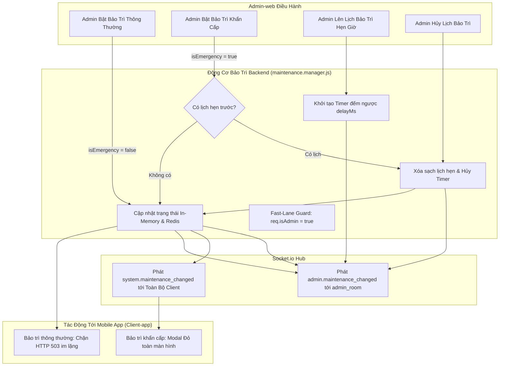

# ⚙️ Chức Năng 07: Quản Trị Chế Độ Bảo Trì & Cứu Hộ Khẩn Cấp (Maintenance & Resilience Management)

> **Mã chức năng:** `ADMIN-FEAT-07`  
> **Module phụ trách:**  
> - Frontend: `src/Admin-web/src/pages/system/BroadcastPage.jsx` (Tab 1), `src/Admin-web/src/components/common/ServerHealthPanel.jsx`  
> - Backend: `src/Backend/core/resilience/maintenance.manager.js`, `src/Backend/middleware/maintenance.middleware.js`, `src/Backend/api/admin.routes.js`  

---

## 📌 1. TỔNG QUAN & MỤC ĐÍCH NGHIỆP VỤ

Chức năng **Quản Trị Chế Độ Bảo Trì & Cứu Hộ Khẩn Cấp** là công tắc ngắt mạch trung tâm (Circuit Breaker) của toàn bộ nền tảng. Khi hệ thống cần nâng cấp phiên bản, thực hiện migrate cơ sở dữ liệu lớn hoặc đối mặt với sự cố an ninh nghiêm trọng, chức năng này cho phép quản trị viên cách ly an toàn máy chủ khỏi lưu lượng người dùng di động.

Đặc biệt, hệ thống triển khai **Quy Tắc Cốt Lõi Của PO**: Khi kích hoạt Bảo trì Khẩn Cấp, hệ thống sẽ **tự động hủy bỏ và xóa sạch lịch bảo trì đã hẹn trước**, chuyển đổi toàn bộ nguồn lực sang chế độ phản ứng thảm họa tức thì.

---

## ⚙️ 2. CƠ CHẾ HOẠT ĐỘNG CHI TIẾT (END-TO-END FLOW)

```mermaid
graph TD
    subgraph "Admin-web Điều Hành"
        A1[Admin Bật Bảo Trì Thông Thường]
        A2[Admin Bật Bảo Trì Khẩn Cấp]
        A3[Admin Lên Lịch Bảo Trì Hẹn Giờ]
        A4[Admin Hủy Lịch Bảo Trì]
    end

    subgraph "Động Cơ Bảo Trì Backend (maintenance.manager.js)"
        B1{Có lịch hẹn trước?}
        B2[Xóa sạch lịch hẹn & Hủy Timer]
        B3[Cập nhật trạng thái In-Memory & Redis]
        B4[Khởi tạo Timer đếm ngược delayMs]
        B5[Fast-Lane Guard: req.isAdmin = true]
    end

    subgraph "Socket.io Hub"
        S1[Phát system.maintenance_changed tới Toàn Bộ Client]
        S2[Phát admin.maintenance_changed tới admin_room]
    end

    subgraph "Tác Động Tới Mobile App (Client-app)"
        M1[Bảo trì thông thường: Chặn HTTP 503 im lặng]
        M2[Bảo trì khẩn cấp: Modal Đỏ toàn màn hình]
    end

    A1 -->|isEmergency = false| B3 --> S2
    A3 --> B4 --> S2
    A4 --> B2 --> S2

    A2 -->|isEmergency = true| B1
    B1 -- "Có lịch" --> B2 --> B3
    B1 -- "Không có" --> B3
    B3 --> S1 & S2
    
    B3 --> M1
    S1 --> M2
```

### 2.1. Hai Loại Bảo Trì Rõ Ràng (Dual Categorized Maintenance)
1. **Bảo trì Khẩn Cấp (Emergency Maintenance - Luôn là chế độ mặc định của Bảo trì tức thì):**
   - **Giao diện:** Nút điều khiển luôn có màu ĐỎ (`bg-red-600`), ghi rõ **"Bật Bảo Trì Khẩn Cấp"** (khi hệ thống bình thường) hoặc **"Tắt Bảo Trì Khẩn Cấp"** (khi đang bảo trì).
   - **Tối ưu UX:** Đã loại bỏ hoàn toàn ô checkbox "Bảo trì khẩn cấp" vì bị thừa, do toàn bộ thao tác bảo trì tức thì luôn được hiểu là bảo trì khẩn cấp.
   - **Tác động:** Luôn luôn cắt tải mọi người dùng di động (mã **HTTP 503 Service Unavailable**), tự động hủy toàn bộ lịch bảo trì hẹn trước, và phát sóng còi báo động đỏ real-time qua Socket.IO tới toàn bộ Client-app.
2. **Bảo trì Theo Lịch (Scheduled Maintenance):**
   - Áp dụng khi quản trị viên cần hẹn giờ trước thời điểm bắt đầu và thời điểm kết thúc dự kiến (ví dụ nâng cấp hạ tầng lúc 2h sáng).
   - Tự động phát sóng thông báo trước cho người dùng khi đến giờ hẹn.

---

## 📐 3. CÁC THÔNG SỐ KỸ THUẬT & HEADERS

| Thuộc tính / Header | Giá trị | Mục đích & Ý nghĩa |
|---|---|---|
| **HTTP Status Code** | `503 Service Unavailable` | Báo cho Client và Web Crawler biết server tạm thời bảo trì, không bị đánh tụt SEO. |
| **Header `Retry-After`** | `3600` (giây) | Hướng dẫn client thời gian quay lại thử lại. |
| **Error Code Payload** | `MAINTENANCE_MODE` | Mã chuẩn hóa cho Client-app bắt exception. |
| **Redis Cache Key** | `system:maintenance:status` | Lưu trữ bền bỉ phân tán trên Redis (nếu có nhiều server node). |
| **Scheduled Timer** | `setTimeout().unref()` | Non-blocking timer, không gây treo tiến trình Node.js khi shutdown. |
| **Database Table** | `maintenance_history` | Bảng lưu trữ nhật ký vĩnh viễn trên PostgreSQL Supabase. |

---

## ⛔ 4. CÁC GIỚI HẠN & NGUYÊN TẮC AN TOÀN

1. **Chặn thời gian trong quá khứ:** Form lên lịch bảo trì tự động kiểm tra thời điểm hẹn. Nếu thời gian chọn nhỏ hơn thời điểm hiện tại (`targetDate <= Date.now()`), hệ thống từ chối với lỗi HTTP 400.
2. **Miễn trừ Route kiểm tra sức khỏe:** Route `/health`, `/health/admin` luôn mở 100% để bộ cân bằng tải (Load Balancer / Kubernetes / Render) không hiểu nhầm container đã chết mà restart liên tục.
3. **Đồng bộ đa tiến trình (Cross-Process Hydration):** Khi khởi động, Backend tự động gọi `hydrateFromRedis()` để nạp lại trạng thái bảo trì nếu trước đó server bị restart bất ngờ.
4. **Bảo toàn CSDL (DB Guard & In-Memory Fallback):** Nhật ký bảo trì lưu trữ tại PostgreSQL với cơ chế in-memory fallback thông minh, đảm bảo server không bao giờ bị nghẽn nếu CSDL có sự cố đường truyền tạm thời.

---

## 💼 5. CÔNG DỤNG & GIÁ TRỊ NGHIỆP VỤ

- **Bảo toàn dữ liệu tài chính:** Khi thực hiện migrate schema bảng giao dịch hoặc nâng cấp thuật toán mã hóa, việc ngắt kết nối Client giúp loại bỏ 100% nguy cơ tranh chấp dữ liệu (Race Condition).
- **Phản ứng thảm họa tức thì:** Cho phép cô lập hệ thống chỉ trong $< 1$ giây khi phát hiện các cuộc tấn công phá hoại CSDL.
- **Tiện lợi cho quản trị:** Có thể lên lịch bảo trì vào lúc 2h sáng và đi ngủ, hệ thống sẽ tự động bật bảo trì đúng giờ mà không cần thức canh.
- **Truy vết & Minh bạch quản trị:** Nhật ký lịch sử lưu trữ vĩnh viễn ai là người kích hoạt, thời điểm bắt đầu/kết thúc, thời lượng và lý do bảo trì.

---

## 🧩 6. TÍNH NĂNG ĐI KÈM TRÊN GIAO DIỆN (`BroadcastPage.jsx`)

1. **Banner Trạng Thái Động Toàn Cục:**
   - Đổi màu thời gian thực: Xanh lá (Bình thường), Cam (Bảo trì Kỹ thuật), Đỏ nhấp nháy Animation Pulse (Bảo trì Khẩn cấp).
   - Nút **"Tắt Bảo Trì Khẩn Cấp"** màu xanh ngọc xuất hiện nổi bật ngay trên banner và cột điều khiển khi bảo trì đang bật.
2. **Cột Trái — Kích Hoạt Bảo Trì Khẩn Cấp:**
   - Ô nhập lý do gửi tới người dùng.
   - Nút bấm **LUÔN ĐỎ** (`bg-red-600`) mang tên **"Bật Bảo Trì Khẩn Cấp"**, không còn checkbox thừa.
3. **Cột Phải — Lên Lịch Thời Điểm Bảo Trì:**
   - Input `datetime-local` chọn ngày giờ bắt đầu và kết thúc dự kiến chuẩn xác.
   - Chặn form lên lịch nếu hệ thống đang trong phiên bảo trì trực tiếp để tránh xung đột.
4. **Bảng Lịch Sử Các Phiên Bảo Trì Hệ Thống (PostgreSQL Persistence):**
   - **Lưu trữ CSDL vĩnh viễn:** Đọc trực tiếp từ bảng `maintenance_history` trên PostgreSQL Supabase.
   - **Các cột hiển thị:**
     - `#`: Mã phiên bảo trì.
     - `Loại bảo trì`: Badge đỏ (Khẩn cấp) hoặc Badge xanh (Theo lịch).
     - `Người kích hoạt`: Tên tài khoản quản trị viên kích hoạt phiên bảo trì (`activated_by`).
     - `Lý do / Thông điệp`: Nội dung giải thích nguyên nhân bảo trì.
     - `Thời điểm bắt đầu` & `Thời điểm kết thúc`: Chuyển đổi theo định dạng ngày giờ Việt Nam.
     - `Thời lượng`: Đo lường chi tiết phiên bảo trì (Ví dụ: `25 phút`, `1 giờ 15 phút`, hoặc `Đang diễn ra...`).
     - `Trạng thái`: Badge màu (Đang diễn ra, Đã hoàn thành, Đã hủy).
   - **Tính năng mở rộng:** Bộ lọc theo Loại (Tất cả / Khẩn cấp / Theo lịch), Bộ lọc Trạng thái (Tất cả / Đang diễn ra / Đã hoàn thành / Đã hủy), Phân trang và Nút làm mới dữ liệu.

---

## 📱 7. ẢNH HƯỞNG ĐẾN HỆ THỐNG & MOBILE APP (CLIENT-APP)

- **Đến Backend:**
  - Middleware kiểm tra cờ `active` bằng biến In-Memory tốc độ $O(1)$ ($< 0.05\text{ms}$), không tốn tài nguyên DB.
- **Đến Mobile App (Client-app):**
  - **Khi bật Khẩn cấp:** Ứng dụng nhận sự kiện Socket, hiển thị ngay Dialog đỏ không thể bỏ qua: *"Hệ thống đang bảo trì khẩn cấp để bảo vệ an toàn tài khoản"*. Toàn bộ tính năng đồng bộ bị tạm dừng, người dùng vẫn có thể xem lại các giao dịch đã lưu trong máy (Offline-first).
  - **Khi tắt bảo trì:** Ứng dụng tự động kết nối lại, mở khóa các tính năng và đồng bộ hóa các giao dịch đang chờ trong SQLite lên máy chủ.

---

## 📡 8. DANH MỤC API & SOCKET.IO PHỤ TRÁCH

### REST API Endpoints
| Phương thức | Endpoint | Chức năng | Phân quyền |
|---|---|---|---|
| `GET` | `/api/admin/system/maintenance` | Lấy chi tiết trạng thái bảo trì & lịch hẹn hiện tại | Admin |
| `POST` | `/api/admin/system/maintenance` | Bật hoặc Tắt bảo trì khẩn cấp tức thì | Admin |
| `POST` | `/api/admin/system/maintenance/schedule` | Lên lịch hẹn bảo trì tự động | Admin |
| `DELETE` | `/api/admin/system/maintenance/schedule` | Hủy bỏ lịch bảo trì đã hẹn | Admin |
| `GET` | `/api/admin/system/maintenance/history` | Lấy danh sách lịch sử các phiên bảo trì (có phân trang, bộ lọc) | Admin |

### Socket.io Events
- **Phát tán tới Toàn Hệ Thống (`broadcast`):**
  - `system.maintenance_changed`: Bắn tới toàn bộ người dùng di động khi trạng thái bảo trì bật/tắt.
- **Phát tán tới Phòng Quản Trị (`admin_room`):**
  - `admin.maintenance_changed`: Cập nhật trạng thái công tắc và card lịch hẹn trên mọi tab Admin-web đang mở.
