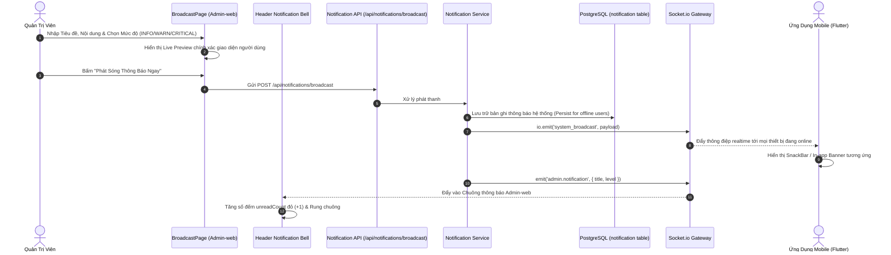

# 📢 Chức Năng 08: Phát Sóng Thông Báo & Hộp Thư Cảnh Báo (Broadcast & Notification System)

> **Mã chức năng:** `ADMIN-FEAT-08`  
> **Module phụ trách:**  
> - Frontend: `src/Admin-web/src/pages/system/BroadcastPage.jsx` (Tab 2), `src/Admin-web/src/components/layout/Header.jsx`  
> - Backend: `src/Backend/modules/notification/`, `src/Backend/core/socket.js`, `src/Backend/api/notification.routes.js`  

---

## 📌 1. TỔNG QUAN & MỤC ĐÍCH NGHIỆP VỤ

Chức năng **Phát Sóng Thông Báo & Hộp Thư Cảnh Báo** thiết lập kênh giao tiếp hai chiều quan trọng giữa quản trị viên và hệ thống:
1. **Chiều Xuất (Outbound Broadcast):** Cho phép quản trị viên gửi thông điệp khẩn cấp hoặc tin tức tức thời tới **toàn bộ người dùng di động (Client-app)** đang kết nối mạng thông qua Socket.io mà không cần phải phát hành bản cập nhật ứng dụng lên Google Play / App Store.
2. **Chiều Nhập (Inbound Admin Alerts):** Hộp thư thông báo an ninh tại thanh tiêu đề (Header) của Admin-web tự động tiếp nhận các cảnh báo từ hệ thống AI (AIOps Sentinel), cảnh báo quá tải phần cứng và biến động tài khoản quan trọng theo thời gian thực.

---

## ⚙️ 2. CƠ CHẾ HOẠT ĐỘNG CHI TIẾT (END-TO-END FLOW)

### 2.1. Phân Cấp Mức Độ Ưu Tiên (Broadcast Priority Levels)
Hệ thống hỗ trợ 3 mức độ thông báo với phong cách hiển thị và hành vi chuyên biệt trên ứng dụng di động:
1. **`INFO` (Thông báo thường - Màu Xanh dương):**
   - Áp dụng: Giới thiệu tính năng mới, mẹo tiết kiệm chi tiêu, lời chúc ngày lễ.
   - Hành vi trên Mobile: Hiển thị thanh thông báo nhẹ (SnackBar) ở đáy màn hình, tự động ẩn sau 4 giây.
2. **`WARNING` (Cảnh báo - Màu Vàng Cam):**
   - Áp dụng: Nhắc nhở bảo trì dự kiến tối nay, cảnh báo nghẽn mạng ngân hàng đối tác.
   - Hành vi trên Mobile: Hiển thị thanh Banner nổi bật ở đỉnh màn hình, yêu cầu người dùng bấm đóng hoặc vuốt để tắt.
3. **`CRITICAL` (Khẩn cấp - Màu Đỏ):**
   - Áp dụng: Cảnh báo lỗi nghiêm trọng, phát hiện rò rỉ bảo mật, thông báo đóng hệ thống khẩn cấp.
   - Hành vi trên Mobile: Kích hoạt Hộp thoại Pop-up (Alert Dialog) chắn toàn màn hình kèm âm thanh rung cảnh báo.

### 2.2. Cơ Chế Xử Lý Cho Người Dùng Ngoại Tuyến (Offline Persistence)
Nếu người dùng đang tắt mạng hoặc không mở app tại thời điểm Admin phát sóng:
- Thông điệp được lưu trữ bền vững trong bảng `notification` của PostgreSQL.
- Khi người dùng mở app và kết nối Internet, ứng dụng sẽ gọi API đồng bộ để nạp thông báo vào Hộp thư cá nhân, đảm bảo không ai bị bỏ lỡ thông tin quan trọng.

---

## 📐 3. CÁC THÔNG SỐ KỸ THUẬT & GIỚI HẠN

| Thuộc tính | Giới hạn kỹ thuật | Lý do thiết kế & Ràng buộc |
|---|:---:|---|
| **Độ dài Tiêu đề** | Tối đa 120 ký tự | Đảm bảo hiển thị trọn vẹn trên màn hình điện thoại cỡ nhỏ (320px). |
| **Độ dài Nội dung** | Tối đa 500 ký tự | Tránh spam văn bản dài, tối ưu dung lượng gói tin Socket.io ($< 1\text{KB}$). |
| **Số lượng thông báo lưu ở Header** | 10 bản ghi gần nhất | Giữ DOM trình duyệt nhẹ, phản hồi mở dropdown trong $< 16\text{ms}$. |
| **Tự động đóng Dropdown (Click Outside)** | Event `mousedown` | Tự động ẩn dropdown khi click ra ngoài vùng hiển thị. |

---

## 💼 5. CÔNG DỤNG & GIÁ TRỊ NGHIỆP VỤ

- **Truyền thông tức thì (Instant Communication):** Giúp doanh nghiệp chủ động định hướng người dùng ngay khi có biến động thị trường hoặc sự cố hạ tầng.
- **Tiết kiệm chi phí viễn thông:** Thay thế hoàn toàn việc phải gửi tin nhắn SMS Brandname tốn kém khi cần thông báo tới hàng chục nghìn người dùng.
- **Tập trung hóa an ninh (Unified Security Feed):** Quản trị viên chỉ cần nhìn vào biểu tượng Chuông ở Header là nắm được mọi báo động đỏ từ hệ sinh thái AIOps Sentinel.

---

## 🧩 6. TÍNH NĂNG ĐI KÈM TRÊN GIAO DIỆN

1. **Giao Diện Soạn Thảo & Xem Trước Sống Động (`BroadcastPage.jsx`):**
   - Bộ 3 nút chọn mức độ ưu tiên lớn với biểu tượng Material Symbols rõ ràng.
   - Bộ đếm ký tự thời gian thực cho tiêu đề (`title.length/120`) và nội dung (`message.length/500`).
   - Khung **"Xem trước thông báo hiển thị trên máy người dùng" (Live Preview Box)** tự động đổi màu nền (Đỏ/Vàng/Xanh) phản ánh trung thực trải nghiệm thị giác của người dùng cuối.
2. **Khối Chuông Thông Báo Thông Minh (`Header.jsx`):**
   - Biểu tượng Chuông kèm Huy hiệu đỏ đếm số lượng cảnh báo chưa đọc (`unreadCount`).
   - Dropdown danh sách thông báo hiển thị cấp độ cảnh báo (CRITICAL, WARNING, INFO) và thời gian tương đối.
   - Nút **"Đánh dấu đã đọc"** gọi API cập nhật trạng thái `isRead = true` vào CSDL.

---

## 📱 7. ẢNH HƯỞNG ĐẾN HỆ THỐNG & MOBILE APP (CLIENT-APP)

- **Đến Backend:**
  - Socket.io sử dụng cơ chế phát tán Room chung (Room-based Broadcasting) cực kỳ tối ưu, tiêu tốn rất ít băng thông mạng so với việc lặp qua từng kết nối riêng lẻ.
- **Đến Mobile App (Client-app):**
  - Người dùng nhận thông báo ngay trong ứng dụng mà không cần cấp quyền Push Notification cấp hệ điều hành (vốn thường bị người dùng tắt đi).

---

## 📡 8. DANH MỤC API & SOCKET.IO PHỤ TRÁCH

### REST API Endpoints
| Phương thức | Endpoint | Chức năng | Phân quyền |
|---|---|---|---|
| `POST` | `/api/notifications/broadcast` | Phát thông báo toàn mạng tới Client-app | Admin |
| `GET` | `/api/notifications/admin-alerts` | Lấy danh sách thông báo cảnh báo an ninh cho Admin | Admin |
| `PATCH` | `/api/notifications/admin-alerts/:id/read` | Đánh dấu một cảnh báo an ninh đã đọc | Admin |

### Socket.io Events
- **Phát tán tới Client-app (`broadcast`):**
  - `system_broadcast`: Gửi payload `{ title, message, level, timestamp }` tới toàn bộ thiết bị.
- **Phát tán tới Admin-web (`admin_room`):**
  - `admin.notification`: Gửi cảnh báo hệ thống vào chuông Header của quản trị viên.
  - `admin.security_alert`: Nhận cảnh báo tấn công an ninh từ module AIOps Sentinel.
