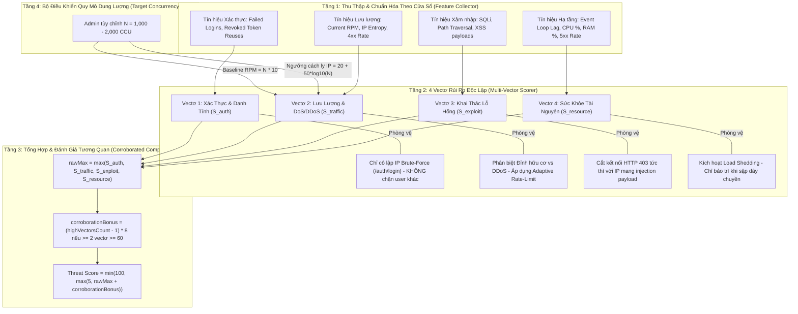

# 🛡️ Chức Năng 09: Hệ Thống AI Giám Sát Bất Thường & Tường Lửa Phong Tỏa (AIOps Sentinel & Active Quarantine Shield)

> **Mã chức năng:** `ADMIN-FEAT-09`  
> **Module phụ trách:**  
> - Frontend: `src/Admin-web/src/pages/system/AIOpsPage.jsx`, `src/Admin-web/src/components/layout/AppLayout.jsx`  
> - Backend: `src/Backend/modules/aiops/feature.collector.js`, `anomaly.detector.js`, `aiops.quarantine.js`, `aiops.service.js`, `src/Backend/api/admin.routes.js`  

---

## 📌 1. TỔNG QUAN & MỤC ĐÍCH NGHIỆP VỤ

**AIOps Sentinel & Active Quarantine Shield** là cỗ máy phòng vệ tự động thông minh (Autonomous Cyber Defense & Self-Healing Engine) chạy ngầm trực tiếp trong tiến trình Backend. Hệ thống áp dụng các mô hình học máy trực tuyến (In-process Online Learning) để liên tục học đường chuẩn vận hành (Baseline) của 24 khung giờ Việt Nam, từ đó:
1. Phát hiện sớm các sự cố sập server (DDoS, rò rỉ bộ nhớ RAM, nghẽn Event Loop).
2. Phát hiện các cuộc tấn công an ninh nguy hiểm (Dò quét mật khẩu Brute-Force, Tái sử dụng token đã thu hồi Token Hijacking, Rà quét lỗ hổng SQL Injection).
3. **Tự động kích hoạt Tường Lửa Chủ Động (Active Quarantine Shield):** Cắt đứt kết nối của nguồn IP vi phạm ngay tại đầu Express Pipeline với mã HTTP 403, giải phóng tài nguyên CPU/RAM/DB tức thì và thông báo Real-Time về Admin-web.

---

## ⚙️ 2. KIẾN TRÚC & CƠ CHẾ HOẠT ĐỘNG 4 VECTƠ ĐỘC LẬP (MULTI-VECTOR RISK ARCHITECTURE)

Hệ thống bãi bỏ hoàn toàn cơ chế tính điểm gộp đơn nhất (Monolithic Additive) dễ gây báo động giả khi mở rộng quy mô. Thay vào đó, Sentinel phân tách rủi ro thành **4 vectơ hoàn toàn độc lập**, mỗi vectơ có thang đo $[0, 100]$ điểm và biện pháp phòng vệ cá nhân hóa riêng biệt:



---

## 📐 3. CÁC CÔNG THỨC TOÁN HỌC & MÔ HÌNH CHỊU TẢI DUNG LƯỢNG

### 3.1. Khảo Sát & Ước Tính Request Theo Chức Năng (Request Profiling)
Khảo sát chi tiết số lượng HTTP Request phát sinh khi Admin hoặc Client thực hiện từng chức năng cốt lõi:

| Nhóm chức năng | Hành động cụ thể | Số request phát sinh | Chi tiết endpoints |
|---|---|:---:|---|
| **Xác thực (Auth)** | Đăng nhập tài khoản | **3 reqs** | `POST /auth/login` $\to$ `GET /users/profile` $\to$ `GET /categories` |
| **Bảng điều khiển (Dashboard)** | Khởi động & tải trang chủ | **4 reqs** | `GET /wallets` $\to$ `GET /transactions/summary` $\to$ `GET /budgets` $\to$ `GET /audit_log/summary` |
| **Giao dịch (Transactions)** | Thêm 1 giao dịch mới | **2 reqs** | `POST /transactions` $\to$ `GET /wallets/balance` (cập nhật số dư) |
| **Báo cáo (Reports)** | Xuất báo cáo thu chi tháng | **3 reqs** | `GET /reports/cashflow` $\to$ `GET /reports/category-breakdown` $\to$ `GET /reports/trends` |
| **Đồng bộ ngầm (Background Sync)** | Mobile app duy trì kết nối | **~2 req/phút** | Heartbeat token check & thông báo đẩy |

Trung bình một người dùng hoạt động tích cực (Active User) tạo ra khoảng **10 requests/phút** ($\mu \approx 0.15\text{ req/s}$).

### 3.2. Mô Hình Chịu Tải & Công Thức Tính Quy Mô (Capacity Scaling Model)
Từ khảo sát trên, hệ thống xây dựng mô hình suy diễn tự động cho số lượng người dùng đồng thời $N \in [100, 50000]$:

1. **Baseline RPM kỳ vọng:**
   $$\text{Baseline RPM}(N) = N \times 10\text{ req/phút}$$
   - Với $N = 1,000$ người dùng đồng thời $\implies \text{Baseline RPM} = 10,000\text{ req/phút}$.
   - Với $N = 2,000$ người dùng đồng thời $\implies \text{Baseline RPM} = 20,000\text{ req/phút}$.

2. **Trần Đỉnh An Toàn (Safe Peak Ceiling $3\times$):**
   $$\text{Safe Peak RPM}(N) = 3 \times \text{Baseline RPM}(N)$$
   Lưu lượng hợp pháp có thể dao động tự nhiên lên tới $3\times$ baseline trong các đợt cao điểm mà **không bao giờ bị hệ thống coi là tấn công DoS**.

3. **Ngưỡng Cách Ly IP Tự Động Thích Ứng (Dynamic IP Quarantine Threshold):**
   Thay vì cố định cứng 120 req/10s, ngưỡng cách ly 1 địa chỉ IP được điều chỉnh thích ứng theo quy mô:
   $$\text{Quarantine Burst Limit}(N) = \max\left(150, \text{round}\left(20 + 50 \cdot \log_{10}(N)\right)\right)\text{ req/10s}$$
   - $N = 1,000 \implies 20 + 50 \times 3 = 170\text{ req/10s}$.
   - $N = 2,000 \implies 20 + 50 \times 3.301 = 185\text{ req/10s}$.

### 3.3. Công Thức Đo Lường Cá Nhân Hóa Từng Vectơ Rủi Ro
Mỗi vectơ đo lường mức độ nguy cơ độc lập trong thang điểm $[0, 100]$:

1. **Vectơ 1: Xác Thực & Danh Tính ($S_{\text{auth}}$)**:
   $$S_{\text{auth}} = \min(100, (\text{failedLogins} \times 8) + (\text{tokenReuseAttacks} \times 25))$$
   - 1 lần đăng nhập sai chỉ chiếm $8$ điểm (không thể gây báo động hay khóa admin).
   - Chỉ khi đăng nhập sai $\ge 5$ lần/10s hoặc có tái dùng token đã thu hồi, $S_{\text{auth}}$ mới chạm ngưỡng cảnh báo.

2. **Vectơ 2: Lưu Lượng & DoS ($S_{\text{traffic}}$)**:
   $$S_{\text{traffic}} = \min(100, \text{rpmThreat} \times (1 - \text{entropyFactor}))$$
   - Khi RPM tăng vọt nhưng độ phân tán IP cao ($\text{distinctIps} \ge 10$) $\implies$ $\text{entropyFactor} \to 0.8 \implies$ $S_{\text{traffic}}$ được dìm xuống dưới $25$ điểm (Lưu lượng tự nhiên).
   - Khi RPM tăng vọt mà chỉ có $1-2$ IP $\implies$ $\text{entropyFactor} \to 0 \implies$ $S_{\text{traffic}}$ vọt lên $80-100$ điểm (DDoS tập trung).

3. **Vectơ 3: Khai Thác Lỗ Hổng & Thăm Dò ($S_{\text{exploit}}$)**:
   $$S_{\text{exploit}} = \min(100, \text{malformedRequests} \times 30)$$
   - Phát hiện các mẫu SQL Injection (`' OR 1=1`), Path Traversal (`../etc/passwd`), XSS probe.

4. **Vectơ 4: Sức Khỏe Tài Nguyên Hệ Thống ($S_{\text{resource}}$)**:
   $$S_{\text{resource}} = \min(100, \text{lagFactor} + \text{ramFactor} + \text{cpuFactor} + \text{err5xxFactor})$$
   - Phản ánh độ trễ Event Loop ($> 100\text{ms}$), RAM ($> 90\%$), CPU ($> 85\%$) và mã lỗi HTTP 5xx ($> 5\%$).

### 3.4. Công Thức Tổng Hợp Tương Quan (Corroborated Composite Threat Score)
$$S_{\text{composite}} = \min\left(100, \max\left(5, \max(S_{\text{auth}}, S_{\text{traffic}}, S_{\text{exploit}}, S_{\text{resource}}) + \text{Bonus}_{\text{corroboration}}\right)\right)$$
Trong đó $\text{Bonus}_{\text{corroboration}} = (\text{Số lượng vectơ} \ge 60 - 1) \times 8$.  
Hệ thống **không cộng dồn ngẫu nhiên**, chỉ bổ sung điểm tương quan khi phát hiện nhiều vectơ độc lập cùng bị công kích đồng thời.

### 3.5. Cơ Chế Chống Đầu Độc Mô Hình Máy Học (Anti-Poisoning Guard)
```javascript
// Chỉ cập nhật baseline khi Threat Score < 70 (Hệ thống đang trong trạng thái an toàn)
if (threatScore < 70) {
  this._updateHourlyBaseline(sample);
} else {
  logger.warn('[AIOps] Anti-Poisoning kích hoạt: Từ chối cập nhật Baseline khi Threat Score cao', { threatScore });
}
```

---

## 🛑 4. CƠ CHẾ TƯỜNG LỬA CHỦ ĐỘNG & TỰ ĐỘNG PHONG TỎA (ACTIVE QUARANTINE SHIELD)

### 4.1. Bốn Kịch Bản Tự Động Phong Tỏa (Auto-Quarantine Triggers)
Khi phát hiện vi phạm, `AIOpsQuarantineManager` tự động đưa nguồn IP vào danh sách đen In-Memory với thời hạn cách ly cụ thể:

| Hình thái tấn công | Ngưỡng vi phạm tự động | Thời gian phong tỏa | Mã lý do |
|---|---|:---:|---|
| **DoS Request Burst** | Gửi $> 120$ request / 10 giây | **15 phút** | `Tấn công DoS quá ngưỡng request` |
| **Quét lỗ hổng SQLi / Path Traversal** | Gửi request chứa `' OR 1=1`, `../etc/passwd` $\ge 3$ lần | **30 phút** | `SQL Injection / Malicious Probe` |
| **Dò mật khẩu Brute-force** | Đăng nhập thất bại liên tiếp 5 lần trong 10 giây | **15 phút** | `Dò mật khẩu Brute-Force` |
| **Tái sử dụng Token đã hủy** | Gửi Refresh Token đã thu hồi (Bị hack hoặc đánh cắp) | **15 phút** | `Phát hiện hành vi chiếm đoạt Token` |

### 4.2. Mã Phản Hồi Ngắt Kết Nối Ngay Đầu Pipeline (HTTP 403)
Khi một IP đã bị phong tỏa gửi request lên server:
```json
HTTP/1.1 403 Forbidden
{
  "success": false,
  "code": "AIOPS_QUARANTINED",
  "error": "AIOPS_QUARANTINED",
  "message": "Kết nối từ thiết bị của bạn tạm thời bị phong tỏa do hệ thống phát hiện hành vi bất thường hoặc dấu hiệu tấn công an ninh.",
  "reason": "Tấn công DoS quá ngưỡng request",
  "quarantineExpiresAt": "2026-10-03T03:30:00.000Z"
}
```
Request bị ngắt lập tức trước khi chạm vào router nghiệp vụ hoặc database, giải phóng tài nguyên CPU và RAM tức thì.

### 4.3. Miễn Trừ Quản Trị Tuyệt Đối & Tự Động Giải Cứu (Admin Fast-Lane & Auto-Unquarantine)
Quản trị viên và giao diện Admin-web luôn được bảo vệ bởi 4 tầng thông suốt:
1. **Nhận diện Kênh Admin-web:** Toàn bộ request từ Admin-web được gắn header `x-client-platform: admin-web` cùng bộ lọc Origin/Referer, được middleware `adminPriority` cấp quyền `req.isAdmin = true` và `req.isAdminWebClient = true`.
2. **Mở Cửa Ngõ Đăng Nhập:** Request `POST /api/auth/login` với tài khoản `admin` hoặc từ Admin-web không bị chặn đứng bởi phong tỏa, cho phép đi tiếp vào controller để so khớp mật khẩu bcrypt an toàn.
3. **Cơ Chế Tự Động Giải Cứu (Auto-Unquarantine Upon Admin Login):** Khi đăng nhập thành công với vai trò Quản trị viên, hệ thống **tự động xóa IP đó khỏi danh sách phong tỏa ngay tức thì** (`defaultAIOpsQuarantine.unquarantine(clientIp)`).
4. **Miễn Trừ Môi Trường Phát Triển (Dev Loopback Exemption):** Khi `NODE_ENV === 'development'`, các địa chỉ loopback (`127.0.0.1`, `::1`, `localhost`) được miễn trừ hoàn toàn khỏi lệnh cô lập, đảm bảo các thiết bị thử nghiệm thật kết nối qua `adb reverse` hoặc máy ảo không bao giờ bị khóa chùm.
5. **Khai Thác IP Chuẩn Xác Tuân Thủ `trust proxy`:** Tuyệt đối không đọc thô phần tử đầu của `X-Forwarded-For` (vốn cho phép client giả mạo IP); hệ thống sử dụng chuẩn `req.ip || req.socket?.remoteAddress` đảm bảo tôn trọng `app.set('trust proxy', 1)`.
6. **Phân Định Token Expired vs Token Reuse:** Hết hạn phiên làm việc thông thường chỉ trả về `401 Unauthorized` để client đăng nhập lại, tuyệt đối KHÔNG phong tỏa IP. Chỉ khi kẻ gian cố tình tái sử dụng Refresh Token đã bị thu hồi (`req.tokenReuseDetected === true`) mới kích hoạt cảnh báo Token Hijacking.

---

## 💼 5. CÔNG DỤNG & GIÁ TRỊ NGHIỆP VỤ

- **Tự chữa lành và tự vệ (Self-Healing System):** Máy chủ tự động đẩy lùi các đợt tấn công mà không cần lập trình viên phải thức đêm trực canh.
- **Tiết kiệm chi phí hạ tầng:** Giảm tải đến $95\%$ lưu lượng rác tấn công vào cơ sở dữ liệu PostgreSQL.
- **Bảo mật chuẩn ngân hàng:** Chống lại các cuộc tấn công chiếm đoạt tài khoản tiền gửi của khách hàng.

---

## 🧩 6. TÍNH NĂNG ĐI KÈM TRÊN GIAO DIỆN (`AIOpsPage.jsx`)

1. **Bộ Điều Khiển Quy Mô Người Dùng Mục Tiêu (Target Concurrency Scaler):**
   - Cho phép Admin thiết lập hoặc chọn nhanh quy mô tải người dùng đồng thời ($N = 500$, $1,000$, $2,000$, $5,000$ CCU hoặc tùy biến).
   - Tự động hiển thị và tính toán: Baseline RPM ($N \times 10$), Trần đỉnh an toàn ($3\times$), và Ngưỡng cách ly IP cá nhân ($20 + 50 \cdot \log_{10}(N)$).
   - Cập nhật trực tiếp xuống lõi máy chủ qua API `POST /api/admin/aiops/scale` trong thời gian thực.
2. **Ma Trận 4 Vectơ Rủi Ro Độc Lập (Multi-Vector Risk Matrix):**
   - 4 thẻ trực quan với thước đo Progress Bar $[0, 100]$ điểm và huy hiệu màu tương ứng (Xanh, Vàng, Cam, Đỏ).
   - Hiển thị chi tiết từng chỉ số đóng góp và **Hành vi phòng vệ cá nhân hóa độc lập** cho từng nhóm rủi ro (Auth, Traffic, Exploit, Resource).
3. **Đồng Hồ Bán Nguyệt Đo Rủi Ro Tổng Hợp (Composite Threat Score Gauge SVG):**
   - Thiết kế bán nguyệt bán kính $R=85$, quét từ $0$ đến $100$.
   - 4 phân vùng màu chuẩn xác: Xanh ($0-59$ Bình thường), Vàng ($60-79$ Tăng cao), Cam ($80-89$ Cảnh báo), Đỏ ($90-100$ Nguy cấp).
   - Công thức hiển thị: $\text{Threat Score} = \max(\text{Vectơ}) + \text{Bonus kết hợp}$.
4. **Biểu Đồ Xu Hướng 4 Vectơ Rủi Ro Độc Lập Thời Gian Thực (Multi-Vector Trend Chart SVG):**
   - Trực quan hóa 60 mẫu trượt gần nhất (10 phút) của cả **4 vectơ độc lập** trên cùng một hệ quy chiếu $[0, 100]$ điểm.
   - **Thanh chuyển Tab (Filter Tabs):** Cho phép xem đồng thời "Tất Cả 4 Vectơ" hoặc soi cận cảnh từng vectơ riêng biệt:
     - 🟠 **Vectơ 1 (Xác thực):** Amber `#f59e0b` — Theo dõi failed logins & token reuse.
     - 🔵 **Vectơ 2 (Lưu lượng):** Blue `#3b82f6` — Theo dõi biến thiên RPM theo trần CCU.
     - 🔴 **Vectơ 3 (Khai thác):** Rose `#f43f5e` — Theo dõi các mẫu SQLi, traversal injection.
     - 🟢 **Vectơ 4 (Tài nguyên):** Teal `#0d9488` — Theo dõi tải CPU/RAM và độ trễ Event Loop.
     - 🟣 **Trần tham chiếu (Composite Max):** Nét đứt tím `#8b5cf6`.
   - **Tương tác trực quan (Interactive Hover Tooltip):** Khi rê chuột lên biểu đồ, hiển thị vạch gióng thời gian và bảng chỉ số chi tiết của cả 4 vectơ tại mốc thời gian đó (HH:mm:ss).
   - Hiển thị 2 vạch ngưỡng định lượng: Vạch vàng Cảnh báo ($70$) và Vạch đỏ Khẩn cấp ($85$).
5. **Bảng Bóc Tách Nguyên Nhân Gốc Rễ (Root Cause Analysis):**
   - Phân tích chi tiết chỉ số đo được, giá trị đường chuẩn Baseline và giải thích tiếng Việt rõ ràng.
6. **Bảng Nguồn Request Đang Bị Cô Lập (Active Quarantine Blacklist):**
   - Hiển thị danh sách IP bị phong tỏa (đã mask `a.b.xx.xx`), nguyên nhân, thời gian bị chặn, số lần vi phạm (Hits).
   - Nút **"Gỡ Chặn (Unblock)"** cho phép Admin mở khóa thủ công cho IP bất kỳ chỉ với 1 click.
7. **Modal 1-Click Khóa Hệ Thống Bảo Trì Khẩn Cấp (Chỉ Khi Sập Dây Chuyền):**
   - **Nguyên tắc bảo vệ nghiêm ngặt:** Nút kích hoạt này **CHỈ hiển thị khi Vectơ 4 (Tài nguyên) vượt ngưỡng nguy cơ sập dây chuyền** (`resourceScore >= 85` hoặc `resourceScore >= 70 && Event Loop Lag > 250ms && 5xx > 15%`).
   - Tuyệt đối không bao giờ hiển thị nút bảo trì toàn hệ thống khi chỉ có tấn công Brute-Force mật khẩu (Vectơ 1) hay tấn công Injection (Vectơ 3) từ các IP bên ngoài.
8. **Modal Tái Hiệu Chuẩn Baseline (Calibrate Baseline):**
   - Cho phép đặt lại đường chuẩn khi doanh nghiệp mở đợt khuyến mãi lớn.
9. **Banner Báo Động Đỏ Toàn Cục (`AppLayout.jsx`):**
   - Banner bảo trì khẩn cấp màu đỏ chỉ xuất hiện khi `recommendedAction === 'EMERGENCY_MAINTENANCE'` hoặc `vectorScores.resource >= 85`. Các đợt tấn công từ IP hacker chỉ hiển thị Toast thông báo cô lập IP thành công (`admin.security_blocked`), không làm gián đoạn trải nghiệm của Admin và người dùng bình thường.

---

## 📱 7. ẢNH HƯỞNG ĐẾN HỆ THỐNG & MOBILE APP (CLIENT-APP)

- **Đến Backend:**
  - Bộ nhớ In-Memory Ring Buffer chỉ lưu 60 mẫu gần nhất $\implies$ chiếm dụng $< 2\text{MB}$ RAM, thời gian tính toán Threat Score chỉ mất $< 0.2\text{ms}$.
  - Điều chỉnh trần dung lượng động, không cần khởi động lại máy chủ.
- **Đến Mobile App (Client-app):**
  - Người dùng bình thường không nhận thấy bất kỳ sự khác biệt nào ngay cả trong giờ cao điểm 1,000 - 2,000 người dùng.
  - Thiết bị nào cố tình gửi request spam hoặc can thiệp token sẽ nhận thông báo bị phong tỏa kèm thời gian đếm ngược còn lại để mở khóa.

---

## 📡 8. DANH MỤC API & SOCKET.IO PHỤ TRÁCH

### REST API Endpoints
| Phương thức | Endpoint | Chức năng | Phân quyền |
|---|---|---|---|
| `GET` | `/api/admin/aiops/status` | Lấy Threat Score, 4 điểm vectơ, trạng thái và phân tích | Admin |
| `GET` | `/api/admin/aiops/history` | Lấy 60 mẫu lịch sử phục vụ vẽ biểu đồ SVG | Admin |
| `GET` | `/api/admin/aiops/quarantine` | Lấy danh sách toàn bộ các IP đang bị phong tỏa | Admin |
| `DELETE` | `/api/admin/aiops/quarantine/:hash` | Gỡ chặn và mở khóa kết nối thủ công cho IP | Admin |
| `POST` | `/api/admin/aiops/scale` | Thiết lập số người dùng đồng thời kỳ vọng (CCU) | Admin |
| `POST` | `/api/admin/aiops/calibrate` | Tái hiệu chuẩn đường chuẩn máy học | Admin |

### Socket.io Events
- **Phát tán tới Admin-web (`admin_room`):**
  - `admin.security_alert`: Báo động khi Threat Score $\ge 80$.
  - `admin.security_blocked`: Thông báo real-time ngay khi có 1 IP bị tường lửa phong tỏa.
  - `admin.metrics_stream`: Stream thông số nhịp tim, Threat Score, 4 điểm vectơ và quy mô CCU mỗi 3 giây.
