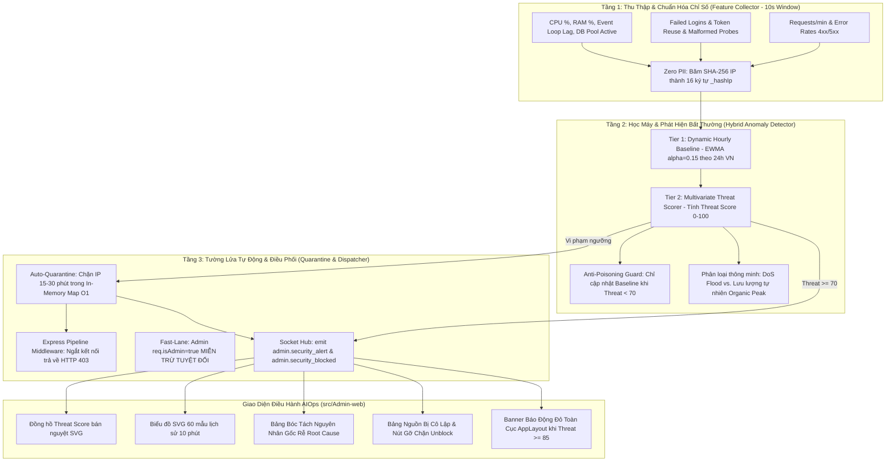

# 🛡️ Chức Năng 09: Hệ Thống AI Giám Sát Bất Thường & Tường Lửa Phong Tỏa (AIOps Sentinel & Active Quarantine Shield)

> **Mã chức năng:** `ADMIN-FEAT-09`  
> **Module phụ trách:**  
> - Frontend: `src/Admin-web/src/pages/system/AIOpsPage.jsx`, `src/Admin-web/src/components/layout/AppLayout.jsx`  
> - Backend: `src/Backend/modules/aiops/feature.collector.js`, `anomaly.detector.js`, `aiops.quarantine.js`, `aiops.service.js`, `src/Backend/api/admin.routes.js`  

---

## 📌 1. TỔNG QUAN & MỤC ĐÍCH NGHIỆP VỤ

**AIOps Sentinel & Active Quarantine Shield** là cỗ máy phòng vệ tự động thông minh (Autonomous Cyber Defense & Self-Healing Engine) chạy ngầm trực tiếp trong tiến trình Backend. Hệ thống áp dụng các mô hình học máy trực tuyến (In-process Online Learning) để liên tục học đường chuẩn vận hành (Baseline) của 24 khung giờ Việt Nam, từ đó:
1. Phát hiện sớm các sự cố sập server (DDoS, rò rỉ bộ nhớ RAM, nghẽn Event Loop).
2. Phát hiện các cuộc tấn công an ninh nguy hiểm (Dò quét mật khẩu Brute-Force, Tái sử dụng token đã thu hồi Token Hijacking, Rà quét lỗ hổng SQL Injection).
3. **Tự động kích hoạt Tường Lửa Chủ Động (Active Quarantine Shield):** Cắt đứt kết nối của nguồn IP vi phạm ngay tại đầu Express Pipeline với mã HTTP 403, giải phóng tài nguyên CPU/RAM/DB tức thì và thông báo Real-Time về Admin-web.

---

## ⚙️ 2. KIẾN TRÚC & CƠ CHẾ HOẠT ĐỘNG 3 TẦNG (3-TIER ARCHITECTURE)



---

## 📐 3. CÁC CÔNG THỨC TOÁN HỌC & MÔ HÌNH MÁY HỌC

### 3.1. Thuật toán Học Đường Chuẩn Động (EWMA Baseline)
Đường chuẩn hệ thống cho từng khung giờ $h \in [0, 23]$ múi giờ `Asia/Ho_Chi_Minh` được cập nhật liên tục bằng giải thuật Trung Bình Động Làm Mượt Lũy Thừa (Exponentially Weighted Moving Average - EWMA) với hệ số suy giảm $\alpha = 0.15$:

$$B_t(h) = \alpha \cdot X_t + (1 - \alpha) \cdot B_{t-1}(h)$$

- $X_t$: Giá trị đo lường thực tế tại chu kỳ hiện tại (Request/phút, RAM %, CPU %, Lag ms).
- $B_{t-1}(h)$: Giá trị đường chuẩn cũ của khung giờ $h$.
- $\alpha = 0.15$: Trọng số tối ưu giúp mô hình thích nghi với xu hướng dài hạn nhưng không bị nhiễu bởi các biến động tức thời.

### 3.2. Công thức Đánh Giá Điểm Nguy Cơ Tổng Hợp (Multivariate Threat Scorer)
Threat Score là chỉ số rủi ro chuẩn hóa trong thang điểm từ **0 đến 100**:

$$\text{Threat Score} = \min\left(100, \sum_{i=1}^{m} W_i \cdot A_i\right)$$

Trong đó $W_i$ là trọng số rủi ro và $A_i$ là mức độ vi phạm của các tín hiệu an ninh:

| Tín hiệu an ninh / Bất thường | Điều kiện kích hoạt vi phạm | Trọng số ($W_i$) | Mã bất thường (`code`) |
|---|---|:---:|---|
| **Dò mật khẩu (Brute-Force)** | $\ge 5$ lần đăng nhập thất bại / 10s | **+40 điểm** | `AUTH_BRUTE_FORCE` |
| **Chiếm đoạt Token (Token Hijacking)** | $\ge 1$ lần dùng lại Refresh Token đã thu hồi | **+65 điểm** | `TOKEN_HIJACKING_ATTACK` |
| **Rà quét mã độc / SQLi / Path Traversal** | $\ge 3$ request chứa payload độc hại / 10s | **+35 điểm** | `MALICIOUS_REQUEST_PROBES` |
| **Tấn công DoS Request Burst** | $> 120$ request từ 1 IP / 10s | **+50 điểm** | `DDOS_ATTACK_FLOOD` |
| **Nghẽn Event Loop Lag** | $\text{Lag} \ge 120\text{ms}$ | **+30 điểm** | `SYSTEM_EVENT_LOOP_FREEZE` |
| **Cạn kiệt bộ nhớ RAM** | $\text{RAM} \ge 90\%$ | **+25 điểm** | `MEMORY_LEAK_EXHAUSTION` |

### 3.3. Phân Biệt Đột Biến Tự Nhiên (Organic Peak) vs. Tấn Công Từ Chối Dịch Vụ (DDoS)
Khi lượng request tăng vọt gấp 3 lần đường chuẩn, thuật toán phân loại thông minh kích hoạt:
- **Nếu:** Tỷ lệ lỗi 4xx/5xx vẫn thấp ($< 5\%$), số lượng địa chỉ IP duy nhất phân tán rộng rãi, và không có payload độc hại $\implies$ Nhận diện là **Lưu Lượng Tự Nhiên Hợp Pháp (Organic Peak)** $\implies$ Threat Score được ghim ở mức an toàn ($< 50$).
- **Nếu:** Tỷ lệ lỗi 4xx cao ($> 40\%$), tập trung từ một nhóm nhỏ IP lặp đi lặp lại $\implies$ Nhận diện là **Tấn Công DDoS Flood** $\implies$ Threat Score vọt lên $\ge 85$ và kích hoạt tường lửa cách ly.

### 3.4. Cơ Chế Chống Đầu Độc Mô Hình Máy Học (Anti-Poisoning Guard)
Để ngăn chặn kẻ tấn công cố tình gửi lưu lượng xấu kéo dài nhằm "huấn luyện" mô hình máy học coi hành vi xấu là bình thường:
```javascript
// Chỉ cập nhật baseline khi Threat Score < 70 (Hệ thống đang trong trạng thái an toàn)
if (threatScore < 70) {
  this._updateHourlyBaseline(sample);
} else {
  logger.warn('[AIOps] Anti-Poisoning kích hoạt: Từ chối cập nhật Baseline khi Threat Score cao', { threatScore });
}
```

---

## 🛑 4. CƠ CHẾ TƯỜNG LỬA CHỦ ĐỘNG & TỰ ĐỘNG PHONG TỎA (ACTIVE QUARANTINE SHIELD)

### 4.1. Bốn Kịch Bản Tự Động Phong Tỏa (Auto-Quarantine Triggers)
Khi phát hiện vi phạm, `AIOpsQuarantineManager` tự động đưa nguồn IP vào danh sách đen In-Memory với thời hạn cách ly cụ thể:

| Hình thái tấn công | Ngưỡng vi phạm tự động | Thời gian phong tỏa | Mã lý do |
|---|---|:---:|---|
| **DoS Request Burst** | Gửi $> 120$ request / 10 giây | **15 phút** | `Tấn công DoS quá ngưỡng request` |
| **Quét lỗ hổng SQLi / Path Traversal** | Gửi request chứa `' OR 1=1`, `../etc/passwd` $\ge 3$ lần | **30 phút** | `SQL Injection / Malicious Probe` |
| **Dò mật khẩu Brute-force** | Đăng nhập thất bại liên tiếp 5 lần trong 10 giây | **15 phút** | `Dò mật khẩu Brute-Force` |
| **Tái sử dụng Token đã hủy** | Gửi Refresh Token đã thu hồi (Bị hack hoặc đánh cắp) | **15 phút** | `Phát hiện hành vi chiếm đoạt Token` |

### 4.2. Mã Phản Hồi Ngắt Kết Nối Ngay Đầu Pipeline (HTTP 403)
Khi một IP đã bị phong tỏa gửi request lên server:
```json
HTTP/1.1 403 Forbidden
{
  "success": false,
  "error": "AIOPS_QUARANTINED",
  "message": "Kết nối từ thiết bị của bạn tạm thời bị phong tỏa do hệ thống phát hiện hành vi bất thường hoặc dấu hiệu tấn công an ninh.",
  "reason": "Tấn công DoS quá ngưỡng request",
  "quarantineExpiresAt": "2026-10-03T03:30:00.000Z"
}
```
Request bị ngắt lập tức trước khi chạm vào router nghiệp vụ hoặc database, giải phóng tài nguyên CPU và RAM tức thì.

### 4.3. Miễn Trừ Quản Trị Tuyệt Đối (Admin Fast-Lane Exemption)
Nếu quản trị viên đang thao tác trên cùng mạng IP với kẻ tấn công:
- Nhờ middleware gắn cờ `req.isAdmin = true`, kết nối của Admin **tuyệt đối 100% không bị phong tỏa**, đảm bảo quản trị viên luôn vào được hệ thống để xử lý sự cố.

---

## 💼 5. CÔNG DỤNG & GIÁ TRỊ NGHIỆP VỤ

- **Tự chữa lành và tự vệ (Self-Healing System):** Máy chủ tự động đẩy lùi các đợt tấn công mà không cần lập trình viên phải thức đêm trực canh.
- **Tiết kiệm chi phí hạ tầng:** Giảm tải đến $95\%$ lưu lượng rác tấn công vào cơ sở dữ liệu PostgreSQL.
- **Bảo mật chuẩn ngân hàng:** Chống lại các cuộc tấn công chiếm đoạt tài khoản tiền gửi của khách hàng.

---

## 🧩 6. TÍNH NĂNG ĐI KÈM TRÊN GIAO DIỆN (`AIOpsPage.jsx`)

1. **Đồng Hồ Bán Nguyệt Đo Rủi Ro (Threat Score Gauge SVG):**
   - Thiết kế bán nguyệt bán kính $R=85$, góc quét $180^\circ$. Kim đo xoay mượt mà:
     $$\theta = -90^\circ + \left(\frac{\text{Threat Score}}{100}\right) \times 180^\circ$$
   - 3 vùng màu: Xanh (0-69 Bình thường), Vàng (70-84 Cảnh báo), Đỏ (85-100 Nguy cấp).
2. **Biểu Đồ Xu Hướng Rủi Ro 60 Mẫu Gần Nhất (Threat Timeline SVG):**
   - Trực quan hóa 60 mẫu trượt gần nhất (10 phút) kèm 2 đường ngưỡng ranh giới (70 và 85).
3. **Bảng Bóc Tách Nguyên Nhân Gốc Rễ (Root Cause Analysis):**
   - Phân tích chi tiết chỉ số đo được, giá trị đường chuẩn Baseline và giải thích tiếng Việt rõ ràng.
4. **Bảng Nguồn Request Đang Bị Cô Lập (Active Quarantine Blacklist):**
   - Hiển thị danh sách IP bị phong tỏa (đã mask `a.b.xx.xx`), nguyên nhân, thời gian bị chặn, số lần vi phạm (Hits).
   - Nút **"Gỡ Chặn (Unblock)"** cho phép Admin mở khóa thủ công cho IP bất kỳ chỉ với 1 click.
5. **Modal 1-Click Khóa Hệ Thống Bảo Trì Khẩn Cấp:**
   - Kích hoạt nhanh chế độ bảo trì khẩn cấp ngay trên màn hình AIOps khi phát hiện mối đe dọa vượt tầm kiểm soát.
6. **Modal Tái Hiệu Chuẩn Baseline (Calibrate Baseline):**
   - Cho phép đặt lại đường chuẩn khi doanh nghiệp mở đợt khuyến mãi lớn.
7. **Banner Báo Động Đỏ Toàn Cục (`AppLayout.jsx`):**
   - Khi Threat Score $\ge 85$, dải banner đỏ nhấp nháy Animation Pulse sẽ xuất hiện trên đỉnh tất cả các trang của Admin-web.

---

## 📱 7. ẢNH HƯỞNG ĐẾN HỆ THỐNG & MOBILE APP (CLIENT-APP)

- **Đến Backend:**
  - Bộ nhớ In-Memory Ring Buffer chỉ lưu 60 mẫu gần nhất $\implies$ chiếm dụng $< 2\text{MB}$ RAM, thời gian tính toán Threat Score chỉ mất $< 0.2\text{ms}$.
- **Đến Mobile App (Client-app):**
  - Người dùng bình thường không nhận thấy bất kỳ sự khác biệt nào.
  - Thiết bị nào cố tình gửi request spam hoặc can thiệp token sẽ nhận thông báo bị phong tỏa kèm thời gian đếm ngược còn lại để mở khóa.

---

## 📡 8. DANH MỤC API & SOCKET.IO PHỤ TRÁCH

### REST API Endpoints
| Phương thức | Endpoint | Chức năng | Phân quyền |
|---|---|---|---|
| `GET` | `/api/admin/aiops/status` | Lấy Threat Score, trạng thái an ninh và phân tích bất thường | Admin |
| `GET` | `/api/admin/aiops/history` | Lấy 60 mẫu lịch sử phục vụ vẽ biểu đồ SVG | Admin |
| `GET` | `/api/admin/aiops/quarantine` | Lấy danh sách toàn bộ các IP đang bị phong tỏa | Admin |
| `DELETE` | `/api/admin/aiops/quarantine/:hash` | Gỡ chặn và mở khóa kết nối thủ công cho IP | Admin |
| `POST` | `/api/admin/aiops/calibrate` | Tái hiệu chuẩn đường chuẩn máy học | Admin |

### Socket.io Events
- **Phát tán tới Admin-web (`admin_room`):**
  - `admin.security_alert`: Báo động khi Threat Score $\ge 70$.
  - `admin.security_blocked`: Thông báo real-time ngay khi có 1 IP bị tường lửa phong tỏa.
  - `admin.metrics_stream`: Stream thông số nhịp tim và threat score mỗi 3 giây.
