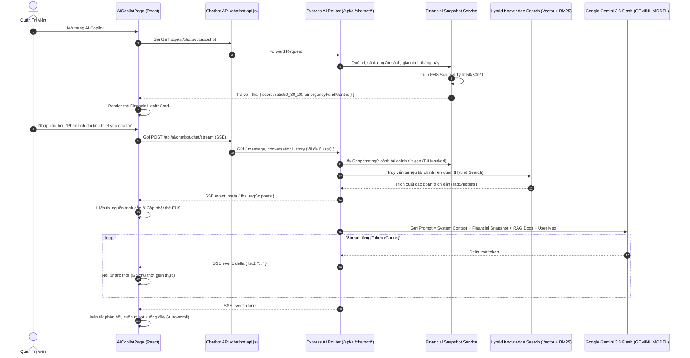

# 🤖 Chức Năng 10: Trợ Lý Tài Chính Thông Minh & Điểm Sức Khỏe FHS (AI Copilot & Financial Health Intelligence)

> **Mã chức năng:** `ADMIN-FEAT-10`  
> **Trạng thái trên Admin-web:** ⚠️ **ĐÃ LOẠI BỎ KHỎI GIAO DIỆN ADMIN-WEB THEO QUYẾT ĐỊNH CỦA PO**  
> **Phạm vi bảo lưu:** Giữ nguyên 100% mã nguồn và dịch vụ Backend để phục vụ ứng dụng di động (`src/Client-app`).  
> **Module liên quan:**  
> - Frontend: Đã gỡ khỏi `src/Admin-web/src/components/layout/Sidebar.jsx` và `src/Admin-web/src/router/routes.jsx`  
> - Backend: `src/Backend/modules/ai/features/chatbot/`, `financial.snapshot.service.js`, `rag/hybrid.search.js`, `chatbot.controller.js`  

---

## 📌 1. QUYẾT ĐỊNH CỦA PRODUCT OWNER (PO DIRECTIVE)

Theo chỉ đạo của PO tại đợt rà soát hệ thống:
- **Lý do loại bỏ khỏi Admin-web:** Trợ lý AI và Điểm sức khỏe FHS được nghiên cứu và thiết kế nhằm mục đích hỗ trợ người dùng cá nhân quản lý thu chi, thiết lập ngân sách và lập kế hoạch tiết kiệm trên ứng dụng di động di động (Client-app). Tính năng này hoàn toàn không mang lại giá trị vận hành cho ban quản trị trên Admin-web.
- **Biện pháp thực hiện:**
  1. Gỡ bỏ tuyến đường `/ai-copilot` và liên kết trên Sidebar của `src/Admin-web`.
  2. Tuyệt đối **không xóa** mã nguồn tầng Backend (`src/Backend/modules/ai/`) để đảm bảo ứng dụng Mobile Client-app tiếp tục gọi các API phân tích chi tiêu, gợi ý danh mục và hỏi đáp tài chính thông thường.

---

## ⚙️ 2. TỔNG QUAN KIẾN TRÚC KỸ THUẬT (DÀNH CHO CLIENT-APP)

### 2.1. Cơ Chế Luồng Server-Sent Events (SSE Streaming)
Thay vì chờ 5-10 giây để nhận câu trả lời dạng JSON thông thường:
- API sử dụng luồng SSE qua endpoint `POST /api/ai/chatbot/chat/stream`.
- Trình duyệt sử dụng `ReadableStream` và `TextDecoder('utf-8')` để bóc tách luồng theo từng cặp `event:` và `data:`.
- **Nút Dừng Phản Hồi (Abort Streaming):** Sử dụng `AbortController` của JavaScript. Quản trị viên có thể bấm nút **"Dừng"** bất cứ lúc nào để lập tức ngắt luồng kết nối và tiết kiệm token máy chủ.

### 2.2. Kỹ Thuật Bảo Vệ Riêng Tư Trước Khi Gửi Tới AI (PII Masking)
Trước khi dữ liệu tài chính được đưa vào Prompt của mô hình AI:
- `PIIMasker` tự động thay thế số tài khoản ngân hàng bằng định dạng `****1234`.
- Tên người nhận/gửi tiền và số điện thoại được ẩn hoàn toàn, đảm bảo tuân thủ tiêu chuẩn an toàn dữ liệu `Data_Security.md`.

---

## 📐 3. CÁC CHỈ SỐ, CÔNG THỨC & CÁCH TÍNH TOÁN FHS

### 3.1. Điểm Sức Khỏe Tài Chính FHS (Financial Health Score)
Chỉ số FHS là điểm số vĩ mô trong thang điểm từ **0 đến 100**, được tổng hợp từ 4 trụ cột tài chính:

$$\text{FHS Score} = w_1 \cdot S_{\text{Budget}} + w_2 \cdot S_{\text{Emergency}} + w_3 \cdot S_{\text{Debt}} + w_4 \cdot S_{\text{Saving}}$$

- **Thang phân loại:**
  - $\text{FHS} \ge 80$: **Xuất sắc (Excellent)** — Màu Xanh ngọc (`#10b981`), cơ cấu tài chính vững mạnh.
  - $60 \le \text{FHS} \le 79$: **Tốt / Ổn định (Good)** — Màu Vàng cam (`#f59e0b`), quản lý chi tiêu tương đối tốt.
  - $\text{FHS} < 60$: **Cần Cải Thiện (Needs Attention)** — Màu Đỏ hồng (`#f43f5e`), có nguy cơ mất cân đối chi tiêu.

### 3.2. Quy Tắc Cơ Cấu Chi Tiêu 50/30/20
Hệ thống tự động phân loại các danh mục chi tiêu vào 3 nhóm:
1. **Thiết yếu (Needs - Chuẩn 50%):** Tiền thuê nhà, điện nước, ăn uống cơ bản, y tế, học phí.
2. **Linh hoạt / Sở thích (Wants - Chuẩn 30%):** Mua sắm, du lịch, xem phim, cà phê bạn bè.
3. **Tiết kiệm & Dự phòng (Savings - Chuẩn 20%):** Gửi tiết kiệm, đầu tư tích lũy, trả nợ gốc.

$$\text{Needs \%} = \left(\frac{\text{Chi Thiết Yếu}}{\text{Tổng Thu Nhập}}\right) \times 100$$

### 3.3. Số Tháng Dự Phòng Khẩn Cấp (Emergency Fund Months)
Đo lường số tháng mà tài khoản có thể duy trì cuộc sống nếu mất hoàn toàn nguồn thu nhập:

$$\text{Emergency Fund Months} = \frac{\text{Tổng Tiền Mặt \& Tiết Kiệm Sẵn Sàng}}{\text{Chi Phí Thiết Yếu Trung Bình 1 Tháng}}$$

- Mục tiêu lý tưởng: $\ge 6$ tháng.

---

## ⛔ 4. CÁC GIỚI HẠN KỸ THUẬT

1. **Giới hạn Lịch sử Ngữ Cảnh (Sliding Window Context):**
   - Chỉ gửi tối đa **6 lượt trao đổi gần nhất** (`messages.slice(-6)`) lên API nhằm tối ưu chi phí token LLM và tránh tràn Context Window.
2. **Giới hạn Nhập Liệu:**
   - Tin nhắn tối đa 1,000 ký tự. Vô hiệu hóa nút gửi khi đang trong trạng thái streaming.
3. **Bộ đệm Streaming SSE:**
   - Xử lý các gói tin TCP bị phân mảnh bằng cơ chế `buffer = lines.pop()` trước khi parse JSON, đảm bảo không bao giờ bị lỗi cú pháp JSON giữa chừng.

---

## 💼 5. CÔNG DỤNG & GIÁ TRỊ NGHIỆP VỤ

- **Kiểm định chất lượng mô hình AI:** Đảm bảo Chatbot tư vấn đúng các quy tắc tài chính, không đưa ra lời khuyên đầu tư rủi ro hoặc trái pháp luật.
- **Hỗ trợ người dùng thông minh:** Giúp người dùng hiểu rõ tiền của mình đang đi đâu và cần cắt giảm ở nhóm chi tiêu nào để đạt mục tiêu tiết kiệm.
- **Trích dẫn nguồn minh bạch:** Hiển thị chính xác các điều khoản và tài liệu tham khảo tài chính mà AI đã dùng để trả lời.

---

## 🧩 6. TÍNH NĂNG ĐI KÈM TRÊN GIAO DIỆN (`AICopilotPage.jsx`)

1. **Thẻ Điểm Sức Khỏe Tài Chính (`FinancialHealthCard.jsx`):**
   - Hiển thị điểm số FHS vĩ mô, nhãn phân loại động.
   - Thanh progress 3 dải màu phân bổ 50/30/20 (Tím Indigo cho Needs, Vàng cho Wants, Xanh lục cho Savings).
2. **Bong Bóng Hội Thoại Thông Minh (`ChatMessageBubble.jsx`):**
   - Định dạng Markdown hoàn chỉnh: Hỗ trợ in đậm, danh sách, bảng dữ liệu, khối mã.
   - Nút **"Sao chép câu trả lời"** tiện lợi.
   - Khung trích dẫn nguồn RAG (Knowledge Sources) có thể bấm mở rộng để xem nội dung chi tiết.
3. **Các Con Chip Gợi Ý Câu Hỏi Mẫu (`PromptSuggestionChips.jsx`):**
   - Bấm vào câu hỏi mẫu để gửi ngay lập tức: *"Phân tích sức khỏe tài chính của tôi"*, *"Tư vấn cách tối ưu chi tiêu tháng này"*, *"Kiểm tra quỹ dự phòng khẩn cấp"*.
4. **Bảng Debug Metadata (Dành cho Kỹ Sư & QA):**
   - Toggle xem chi tiết thời gian xử lý (latency ms), số lượng token, và dữ liệu snapshot thô.
5. **Nút Làm Mới Hội Thoại (Reset Chat Session):**
   - Xóa sạch ngữ cảnh trò chuyện cũ để bắt đầu chủ đề mới.

---

## 📱 7. ẢNH HƯỞNG ĐẾN HỆ THỐNG & MOBILE APP (CLIENT-APP)

- **Đến Backend:**
  - Nhờ xử lý SSE Streaming, kết nối giữa máy chủ và client được duy trì mượt mà, không gây nghẽn hàng đợi request như kiểu polling truyền thống.
- **Đến Mobile App (Client-app):**
  - Giao diện và thuật toán tính điểm FHS tại Admin-web hoàn toàn đồng nhất với màn hình Chatbot AI trên Mobile App Flutter, đảm bảo người dùng di động và quản trị viên luôn nhìn thấy cùng một bộ chỉ số tài chính chuẩn xác.

---

## 📡 8. DANH MỤC API PHỤ TRÁCH

### REST & SSE Endpoints
| Phương thức | Endpoint | Định dạng | Chức năng | Phân quyền |
|---|---|:---:|---|---|
| `POST` | `/api/ai/chatbot/chat/stream` | `text/event-stream` (SSE) | Luồng stream hội thoại AI thời gian thực | Authenticated |
| `GET` | `/api/ai/chatbot/snapshot` | `application/json` | Lấy bản chụp phân tích FHS & 50/30/20 | Authenticated |
| `POST` | `/api/ai/chatbot/reset` | `application/json` | Xóa phiên hội thoại AI ngắn hạn | Authenticated |
| `POST` | `/api/ai/chatbot/chat` | `application/json` | Endpoint fallback dạng JSON tĩnh (Non-stream) | Authenticated |
