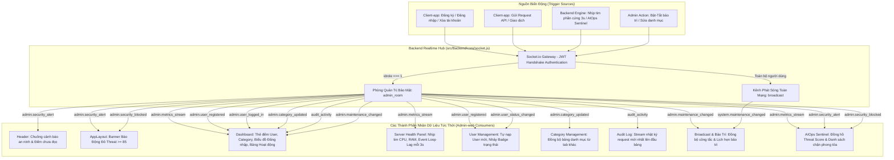

# ⚡ Chức Năng 11: Kiến Trúc Real-Time Toàn Diện (Full Real-Time Architecture & Event Bus)

> **Mã chức năng:** `ADMIN-FEAT-11`  
> **Module phụ trách:**  
> - Frontend: `src/Admin-web/src/hooks/useSocket.js`, Toàn bộ các trang trong `src/Admin-web/src/pages/`  
> - Backend: `src/Backend/core/socket.js`, `src/Backend/index.js`, Các hook service nghiệp vụ (`auth.service.js`, `admin.service.js`, `maintenance.manager.js`, `aiops.service.js`)  

---

## 📌 1. TỔNG QUAN & MỤC ĐÍCH NGHIỆP VỤ

**Kiến Trúc Real-Time Toàn Diện (Full Real-Time Architecture)** là xương sống truyền thông dữ liệu của toàn bộ ứng dụng quản trị Admin-web. Trước đây, nhiều trang quản trị đòi hỏi người dùng phải bấm F5 tải lại trang hoặc phụ thuộc vào các cơ chế Polling định kỳ (gửi request liên tục gây tốn CPU và băng thông).

Với việc xây dựng **Trục Sự Kiện Tập Trung (Centralized Event Bus)** qua thư viện Socket.io v4 và phòng điều phối bảo mật `admin_room`:
- **100% các thông số, thẻ đếm, bảng danh sách, biểu đồ xu hướng và cảnh báo an ninh** trên toàn bộ Admin-web đều tự động cập nhật tức thì (độ trễ $< 50\text{ms}$).
- Không còn bất kỳ tình trạng stale state (dữ liệu cũ bị đọng) hay thao tác thủ công nào.

---

## ⚙️ 2. KIẾN TRÚC ĐIỀU PHỐI SỰ KIỆN TẬP TRUNG (CENTRALIZED REAL-TIME BUS)



### 2.1. Xác Thực Bắt Tay Socket (JWT Handshake Authentication)
Để ngăn chặn người dùng bình thường hoặc kẻ xấu nghe lén thông tin nội bộ của máy chủ:
1. Khi Admin-web khởi tạo kết nối Socket.io, client đính kèm JWT Access Token trong `auth.token`.
2. Middleware xác thực trên server giải mã token:
   ```javascript
   const decoded = verifyAccessToken(token);
   socket.user = decoded;
   
   // Chỉ Quản trị viên (idrole === 1) mới được phép gia nhập admin_room
   if (decoded.idrole === 1) {
     socket.join('admin_room');
     logger.info(`[Socket] Admin ${decoded.username} đã gia nhập admin_room`);
   }
   ```
3. Các sự kiện quản trị nhạy cảm (`admin.*`) **chỉ được phát tới `admin_room`**, tuyệt đối không phát ra ngoài phòng công cộng.

---

## 📑 3. BẢNG TRA CỨU TOÀN BỘ SỰ KIỆN REAL-TIME CỦA HỆ THỐNG

| Tên sự kiện Socket.io | Kênh truyền | Dữ liệu phát tải (Payload) | Thành phần tiếp nhận trên Admin-web | Hành vi phản ứng trên giao diện |
|---|:---:|---|---|---|
| **`admin.metrics_stream`** | `admin_room` | `{ uptimeSeconds, eventLoopLagMs, cpuPercent, ramPercent, ramRssMb, threatScore, threatStatus, dbPool }` | `ServerHealthPanel`, `DashboardPage`, `AIOpsPage` | Cập nhật kim đo, chỉ số CPU/RAM, Uptime và Threat Score sau mỗi **3 giây/lần** (Bỏ hoàn toàn polling cũ). |
| **`admin.user_registered`** | `admin_room` | `{ iduser, idaccount, username, fullname, email, created_at }` | `DashboardPage`, `UserListPage` | • Dashboard: Tự tăng `totalUsers` và `newUsers` (+1).<br>• UserList: Chèn tài khoản mới vào đầu bảng có highlight viền xanh lá. |
| **`admin.user_logged_in`** | `admin_room` | `{ idaccount, username, timestamp }` | `DashboardPage` | Tự động tăng số lượt đăng nhập và nảy cột khung giờ tương ứng trên biểu đồ `loginStats`. |
| **`admin.user_status_changed`** | `admin_room` | `{ iduser, idaccount, status, reason_inactive }` | `UserListPage` | Cập nhật trực tiếp Badge trạng thái (`Active`, `Inactive`, `PendingDelete`) của dòng tài khoản mà không cần reload trang. |
| **`admin.category_updated`** | `admin_room` | `{ action: 'create'\|'update'\|'delete', category }` | `DashboardPage`, `CategoryPage` | • Dashboard: Tăng/giảm thẻ `totalCategories`.<br>• CategoryPage: Tự nạp lại bảng danh mục hệ thống. |
| **`audit_activity`** | `admin_room` | `{ id, idaccount, user, action, status, reason, time_req }` | `DashboardPage`, `AuditLogPage` | Chèn request mới nhất lên đầu bảng hoạt động người dùng khi đang ở Trang 1. |
| **`admin.maintenance_changed`** | `admin_room` | `{ active, isEmergency, reason, activatedBy, scheduled }` | `BroadcastPage`, `ServerHealthPanel` | Tự động chuyển công tắc bảo trì (Thường/Khẩn cấp) và cập nhật/xóa Card lịch hẹn bảo trì ngay khi có biến động. |
| **`system.maintenance_changed`** | `broadcast` | `{ active, isEmergency, reason }` | `BroadcastPage` | Đồng bộ trạng thái bảo trì cho toàn mạng. |
| **`admin.security_alert`** | `admin_room` | `{ threatScore, status, anomalies, timestamp }` | `Header`, `AppLayout`, `AIOpsPage` | • Header: Rung chuông, tăng badge chưa đọc (+1).<br>• AppLayout: Hiện dải Banner Đỏ nếu Threat $\ge 85$.<br>• AIOps: Nhảy số đồng hồ rủi ro. |
| **`admin.security_blocked`** | `admin_room` | `{ hash, maskedIp, reason, bannedAt, expiresAt }` | `AppLayout`, `AIOpsPage` | • AppLayout: Hiện Toast thông báo góc màn hình: *"Đã chặn đứng nguồn IP..."*<br>• AIOps: Thêm ngay vào Bảng Danh sách đen phong tỏa. |

---

## 📐 4. CÁC THÔNG SỐ HIỆU NĂNG & TỐI ƯU HÓA (PERFORMANCE METRICS)

1. **Kích thước gói tin cực nhỏ (Micro-Payload):**
   - Payload sự kiện `admin.metrics_stream` được tối ưu hóa chỉ nặng **$< 450$ bytes**.
   - Băng thông tiêu thụ trên mỗi kết nối Admin mở cả ngày: $\approx 12.9\text{MB}$ / 24 giờ.
2. **Cơ chế Timer Unref (`timer.unref()`):**
   - Bộ đếm thời gian 3s trong `index.js` sử dụng `.unref()` để không giữ tiến trình Node.js sống vô tận khi quản trị viên gửi tín hiệu dừng máy chủ (`SIGINT` / `SIGTERM`), đảm bảo server tắt (Graceful Shutdown) sạch sẽ trong $< 1$ giây.
3. **Giải phóng lắng nghe React Hook (`useSocket.js`):**
   - Mọi component khi `unmount` đều bắt buộc phải gọi hàm dọn dẹp `socket.off(eventName, handler)`.
   - Ngăn chặn hoàn toàn hiện tượng rò rỉ bộ nhớ (Memory Leak) hoặc nhân đôi sự kiện (Duplicate Event Callbacks) trên trình duyệt.

---

## ⛔ 5. NGUYÊN TẮC BẢO MẬT & PHÁP LÝ (DATA SECURITY)

1. **Zero Raw PII trên luồng Socket:**
   - Mọi địa chỉ IP phát qua Socket.io đều được che 2 octet cuối: `113.161.xx.xx`.
   - Tuyệt đối không phát tán mật khẩu, Access Token hoặc dữ liệu số dư tài khoản chi tiết qua kênh Socket.io.
2. **Cách ly phòng quản trị:**
   - Người dùng di động (Client-app) hoàn toàn không thể lắng nghe các sự kiện tiền tố `admin.*`. Nếu Client cố tình gửi lệnh join `admin_room`, server sẽ kiểm tra token và từ chối.

---

## 💼 6. CÔNG DỤNG & GIÁ TRỊ NGHIỆP VỤ

- **Trải nghiệm điều hành chuẩn phòng chỉ huy (Command Center Experience):** Quản trị viên chỉ cần mở màn hình và quan sát, các con số và biểu đồ tự nhảy số nhịp nhàng như trên bảng điện tử chứng khoán.
- **Phản ứng sự cố tức thì:** Khi có đợt tấn công an ninh, thông báo xuất hiện trên màn hình ngay thời khắc mili-giây đầu tiên, giúp Admin can thiệp trước khi server bị sập.
- **Tiết kiệm tài nguyên:** Giảm hơn **$90\%$ số lượng request HTTP thăm dò** lên máy chủ so với cơ chế Polling truyền thống.

---

## 📱 7. ẢNH HƯỞNG ĐẾN HỆ THỐNG & MOBILE APP (CLIENT-APP)

- **Đến Backend:**
  - Socket.io tích hợp chạy chung cổng HTTP với Express Server, chia sẻ chung kết nối TCP, giảm thiểu việc phải mở nhiều cổng mạng.
- **Đến Mobile App (Client-app):**
  - Khi quản trị viên thực hiện bất kỳ hành động điều phối nào (Bật bảo trì, phát thông báo, khóa tài khoản), thiết bị di động của người dùng sẽ nhận được tín hiệu qua Socket chỉ sau $< 100\text{ms}$, mang lại sự đồng bộ tuyệt đối trên toàn bộ hệ sinh thái.

---

## 📡 8. MÃ NGUỒN TIÊU BIỂU (REFERENCE IMPLEMENTATION)

Trích đoạn hook sử dụng chuẩn mực tại các trang Admin-web:

```javascript
import useSocket from '../../hooks/useSocket';

const DashboardPage = () => {
  const socket = useSocket();

  useEffect(() => {
    if (!socket) return;

    const handleUserRegistered = (newUser) => {
      setTotalUsers(prev => (prev !== null ? prev + 1 : 1));
      setNewUsers(prev => ({
        ...prev,
        current: prev.current + 1,
        growth: calcGrowth(prev.current + 1, prev.previous)
      }));
    };

    socket.on('admin.user_registered', handleUserRegistered);

    return () => {
      socket.off('admin.user_registered', handleUserRegistered);
    };
  }, [socket]);
};
```
