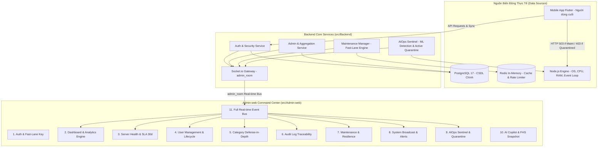

# 📘 Hệ Thống Tài Liệu Kỹ Thuật Admin-Web (WealthCommand)

> **Dự án:** Personal Finance Management  
> **Module:** `src/Admin-web` (Frontend Quản trị) & `src/Backend/modules/admin` (Backend Core API)  
> **Phiên bản:** v2.4 (Cập nhật ngày 03/10/2026)  
> **Đối tượng sử dụng:** Product Owner (PO), Technical Architect, Senior Engineers, QA & DevOps Team  

---

## 🏛️ 1. TỔNG QUAN KIẾN TRÚC ADMIN-WEB

Hệ thống quản trị **Admin-web** là trung tâm chỉ huy tối cao (Command Center) của nền tảng Quản lý Tài chính Cá nhân. Admin-web được thiết kế theo kiến trúc **Single Page Application (SPA)** kết hợp **Centralized Event-Driven Real-time Bus**, cho phép quản trị viên theo dõi nhịp tim hệ thống, phân tích dữ liệu vĩ mô, điều phối an ninh an toàn thông tin và tương tác trực tiếp với người dùng di động (Client-app).



---

## 📑 2. MỤC LỤC CHI TIẾT CÁC TÀI LIỆU CHỨC NĂNG

Mỗi chức năng của Admin-web được ghi nhận độc lập tại một tập tin tài liệu chuyên sâu, phản ánh đầy đủ: **Cơ chế hoạt động, Công thức toán học, Giới hạn kỹ thuật, Công dụng, Tính năng đi kèm, và Mức độ ảnh hưởng tới Hệ thống & Ứng dụng Mobile Client-app**.

| STT | Tập tin tài liệu | Tên chức năng chính | Mô tả vắn tắt |
|:---:|---|---|---|
| **01** | [`01-authentication-and-authorization.md`](./01-authentication-and-authorization.md) | **Xác thực & Phân quyền Quản trị (Auth & Fast-Lane)** | Đăng nhập Admin, xác thực Token JWT kép, Invalidation Cache, và Cửa thoát hiểm khẩn cấp `X-Emergency-Admin-Key`. |
| **02** | [`02-dashboard-and-analytics.md`](./02-dashboard-and-analytics.md) | **Bảng Điều Khiển & Động Cơ Thống Kê Tổng Hợp** | Thống kê số liệu vĩ mô (Polling ngầm 10s), kết hợp luồng Real-Time Socket.io tức thì cho Hoạt động gần đây (Audit-log) và Server Health. |
| **03** | [`03-server-health-and-sla-monitoring.md`](./03-server-health-and-sla-monitoring.md) | **Giám Sát Sức Khỏe Máy Chủ & Uptime SLA 30 Ngày** | Đo lường Uptime chuẩn SLA 30 ngày, theo dõi tải CPU, RAM (RSS), độ trễ Event Loop Lag, DB Pool và Load Shedding (Bảo vệ 24/7). |
| **04** | [`04-user-management-and-lifecycle.md`](./04-user-management-and-lifecycle.md) | **Quản Lý Người Dùng & Vòng Đời Tài Khoản** | Danh sách người dùng, mặt nạ bảo mật PII, lọc địa phương, khóa tài khoản cưỡng chế đăng xuất Socket và xóa mềm an toàn. |
| **05** | [`05-category-management.md`](./05-category-management.md) | **Quản Lý Danh Mục Hệ Thống & Bảo Vệ Riêng Tư** | Quản lý danh mục mặc định, kiểm soát trùng tên, tự động phục hồi danh mục đã xóa, nút Làm mới thủ công (bỏ Socket listener). |
| **06** | [`06-audit-logging-and-traceability.md`](./06-audit-logging-and-traceability.md) | **Nhật Ký Truy Vết Toàn Hệ Thống (Audit Logging)** | Ghi nhận bất đồng bộ toàn bộ request kỹ thuật (Zero PII), phân loại trạng thái HTTP, tuân thủ Luật ATTTM 2015 & NĐ 13/2023/NĐ-CP. |
| **07** | [`07-maintenance-and-resilience.md`](./07-maintenance-and-resilience.md) | **Quản Trị Bảo Trì Hệ Thống & Cứu Hộ Khẩn Cấp** | Công tắc bảo trì 2 chế độ (Thường vs Khẩn cấp), làn ưu tiên Quản trị viên, và Quy tắc cốt lõi: Bảo trì khẩn cấp tự động xóa lịch hẹn. |
| **08** | [`08-broadcast-and-notification.md`](./08-broadcast-and-notification.md) | **Phát Sóng Thông Báo Hệ Thống & Hộp Thư Cảnh Báo** | Phát sóng thông báo toàn mạng (Info, Warning, Critical) qua Socket.io room chung và quản lý thông báo an ninh cho Admin. |
| **09** | [`09-aiops-sentinel-and-quarantine.md`](./09-aiops-sentinel-and-quarantine.md) | **AIOps Sentinel & Tường Lửa Tự Động Phong Tỏa** | Máy học Online giám sát 13 thông số, tính Threat Score, bóc tách Root Cause, và tự động cách ly nguồn IP tấn công (HTTP 403). |
| **10** | [`10-ai-copilot-and-financial-health.md`](./10-ai-copilot-and-financial-health.md) | **Trợ Lý AI Tài Chính & Điểm Sức Khỏe FHS** | ⚠️ Đã loại bỏ khỏi Admin-web theo quyết định của PO (Bảo lưu toàn bộ mã nguồn Backend cho ứng dụng di động Client-app). |
| **11** | [`11-full-realtime-architecture.md`](./11-full-realtime-architecture.md) | **Kiến Trúc Real-Time Toàn Diện Qua Socket.io** | Trục điều phối sự kiện thời gian thực tập trung qua `admin_room`, cập nhật tức thì 100% trang không cần tải lại trang (F5). |

---

## 🛡️ 3. MA TRẬN ẢNH HƯỞNG TỚI MOBILE APP (CLIENT-APP)

Hệ thống quản trị Admin-web có quyền lực điều phối trực tiếp tới trải nghiệm và hoạt động của người dùng di động:

```
┌────────────────────────────────────────┬────────────────────────────────────────────────────────┐
│ Hành động từ Admin-web                 │ Tác động trực tiếp lên Mobile App (Client-app)         │
├────────────────────────────────────────┼────────────────────────────────────────────────────────┤
│ 1. Bật Bảo trì Khẩn cấp                │ Chặn kết nối tức thì (HTTP 503), đẩy Modal đỏ toàn màn │
│                                        │ hình, ngắt kết nối đồng bộ dữ liệu.                    │
├────────────────────────────────────────┼────────────────────────────────────────────────────────┤
│ 2. Bật Bảo trì Thông thường            │ Chặn âm thầm (HTTP 503) khi gửi request, không hiện    │
│                                        │ banner cảnh báo hoảng loạn, giữ dữ liệu cục bộ SQLite. │
├────────────────────────────────────────┼────────────────────────────────────────────────────────┤
│ 3. Vô hiệu hóa tài khoản (Khóa)        │ Socket.io đẩy `force_logout`, thu hồi refresh token,   │
│                                        │ xóa sạch phiên trên máy, đẩy người dùng ra màn Login.  │
├────────────────────────────────────────┼────────────────────────────────────────────────────────┤
│ 4. Tường lửa AIOps phong tỏa IP        │ Thiết bị người dùng tại IP đó bị chặn với HTTP 403     │
│                                        │ `AIOPS_QUARANTINED`, hiển thị lý do và thời gian hết hạn.│
├────────────────────────────────────────┼────────────────────────────────────────────────────────┤
│ 5. Phát sóng thông báo (Broadcast)     │ Đẩy SnackBar/Dialog thông báo tức thời tới màn hình    │
│                                        │ ứng dụng mà không cần cập nhật bản build mới.          │
├────────────────────────────────────────┼────────────────────────────────────────────────────────┤
│ 6. Thêm/Sửa danh mục hệ thống          │ Tự động đồng bộ vào danh mục mặc định của ứng dụng khi  │
│                                        │ Client thực hiện Pull Sync.                            │
└────────────────────────────────────────┴────────────────────────────────────────────────────────┘
```

---

## 🔒 4. NGUYÊN TẮC BẢO MẬT & PHÁP LÝ (DATA SECURITY)

Toàn bộ các chức năng trong thư mục tài liệu này tuân thủ 100% quy định tại [`docs/Rule_Project/Data_Security.md`](../Rule_Project/Data_Security.md), Nghị định 13/2023/NĐ-CP và tiêu chuẩn bảo mật quốc tế OWASP:
1. **Zero PII Exposure:** 100% thông tin nhạy cảm của người dùng (Email, SĐT, Địa chỉ, Số tài khoản ngân hàng, IP) đều được mặt nạ hóa (Masking) trước khi hiển thị trên Admin-web.
2. **User-scoped Privacy Protection:** Admin tuyệt đối không có quyền xem, sửa hoặc xóa danh mục riêng tư của người dùng Client-app.
3. **Audit Immutability:** Mọi thao tác quản trị viên đều được ghi nhật ký Append-only vĩnh viễn, không thể chỉnh sửa hay tẩy xóa.

---

## ⚙️ 5. TRUNG TÂM CÀI ĐẶT HỆ THỐNG & TRẢI NGHIỆM QUẢN TRỊ (SETTINGS CENTER)

Tích hợp trực tiếp trên Header thanh điều hướng (`Header.jsx`), nằm ngay bên phải icon Thông báo hệ thống (🔔):
- **Biểu tượng (Icon):** ⚙️ Material Symbol `settings` (title: *"Cài đặt hệ thống"*).
- **Hộp thoại Cài Đặt (`SettingsModal.jsx`):** Thiết kế Tabbed Modal bo góc chuẩn Enterprise với 4 tab nghiệp vụ:
  1. **Giao diện (Appearance):** Lựa chọn Chủ đề Giao diện (Sáng / Tối / Tự động theo OS), Mật độ hiển thị bảng (Rộng rãi / Tiêu chuẩn / Tối ưu thu gọn Compact).
  2. **Cảnh báo & Âm thanh (Alerts & Sound):** Bật/tắt âm thanh cảnh báo khi có sự cố khẩn cấp (`soundAlarm`), Thời lượng hiển thị Toast thông báo (3s / 5s / 8s / 10s), Bật/tắt huy hiệu đếm chưa đọc trên icon chuông.
  3. **Realtime & Socket.io:** Trạng thái kết nối Socket `admin_room` trực tiếp, cấu hình chu kỳ lấy mẫu nhịp tim AIOps Sentinel (1s / 3s / 5s), nút Kiểm tra độ trễ (Ping Test).
  4. **Bảo mật & Hệ thống (Security & Storage):** Tự động khóa màn hình Admin sau thời gian rảnh rỗi (5 / 15 / 30 phút), nút Xóa bộ nhớ đệm trình duyệt cục bộ (Local Storage Cache Reset) an toàn, hiển thị Thông tin phiên bản & Môi trường runtime.
- **Lưu trữ Cục bộ:** Mọi cấu hình cài đặt được tự động lưu bền vững vào `localStorage` với tiền tố `admin_settings_*` và có hiệu lực ngay lập tức.
