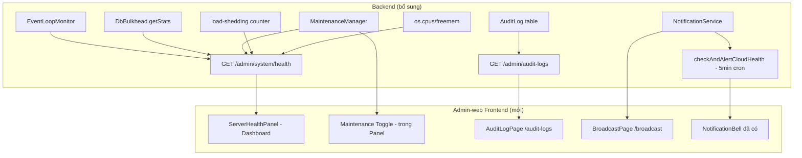

# Admin Operations Center — Implementation Plan

> **For agentic workers:** REQUIRED SUB-SKILL: Use superpowers:subagent-driven-development to implement this plan task-by-task. Steps use checkbox (`- [ ]`) syntax for tracking.

**Goal:** Nâng cấp Admin-web thêm 4 module quản trị mới hoạt động trên cả local & cloud: (1) Server Health Panel + Maintenance Toggle, (2) Audit Log Viewer, (3) System Broadcast UI, (4) Cloud-specific Alert Notifications.

**Architecture:**

Backend đã có hạ tầng đủ dùng: `EventLoopMonitor`, `DbBulkhead`, `MaintenanceManager`, `AuditLog` (PostgreSQL via Prisma), `NotificationHub` (Socket.io + NotificationStore). Cần bổ sung 3 endpoint mới, 1 cloud alert job, và 3 page + 1 widget trên Frontend.



**Tech Stack:** Node.js/Express, Prisma, `os` module, React 18, Vite, Tailwind CSS v4, Socket.io-client

---

## Global Constraints

- Mọi Backend endpoint đi qua `authenticate + authorize('admin')` — đã có sẵn trên `router.use()`.
- Frontend dùng Tailwind utility classes, không import UI framework thứ 3.
- Data Backend trả về qua `ResponseHandler.success(res, data, message)`.
- Health endpoint không phụ thuộc Redis — `EventLoopMonitor` và `DbBulkhead` là in-memory.
- AuditLog query có `LIMIT` tối đa 200 — tránh OOM trên cloud.
- Broadcast không lưu DB — chỉ phát qua Socket.io + `NotificationStore`.

---

## Task 1: Backend — GET /admin/system/health

**Files:**
- Modify: `src/Backend/middleware/load-shedding.middleware.js` — export `getLoadSheddingCount()`
- Modify: `src/Backend/modules/admin/admin.service.js` — thêm `getSystemHealth()`
- Modify: `src/Backend/modules/admin/admin.controller.js` — thêm handler
- Modify: `src/Backend/api/admin.routes.js` — đăng ký route
- Create: `src/Backend/tests/unit/admin.health.test.js`

**Produces:** `GET /api/admin/system/health` → `{ cpu, ram, eventLoop, dbPool, maintenance, loadShedding, timestamp }`

- [ ] **Step 1: Viết failing test**

```js
// src/Backend/tests/unit/admin.health.test.js
const adminService = require('../../modules/admin/admin.service');

describe('getSystemHealth', () => {
  it('should return all health metric fields', async () => {
    const result = await adminService.getSystemHealth();
    expect(result).toHaveProperty('cpu');
    expect(result).toHaveProperty('ram');
    expect(result).toHaveProperty('eventLoop');
    expect(result).toHaveProperty('dbPool');
    expect(result).toHaveProperty('maintenance');
    expect(result).toHaveProperty('loadShedding');
    expect(typeof result.ram.usedMb).toBe('number');
    expect(typeof result.eventLoop.lagMs).toBe('number');
    expect(typeof result.maintenance.active).toBe('boolean');
  });

  it('cpu.percent should be 0-100', async () => {
    const result = await adminService.getSystemHealth();
    expect(result.cpu.percent).toBeGreaterThanOrEqual(0);
    expect(result.cpu.percent).toBeLessThanOrEqual(100);
  });
});
```

- [ ] **Step 2: Chạy để xác nhận FAIL**

```bash
rtk npx jest src/Backend/tests/unit/admin.health.test.js --no-coverage
```

Expected: FAIL — `getSystemHealth is not a function`

- [ ] **Step 3a: Thêm counter vào `load-shedding.middleware.js`**

Mở file `src/Backend/middleware/load-shedding.middleware.js`. Thêm vào đầu file (sau các require):

```js
// --- Load Shedding Counter (reset mỗi 24h) ---
let _shedCount = 0;
const _shedResetTimer = setInterval(() => { _shedCount = 0; }, 24 * 60 * 60 * 1000);
if (_shedResetTimer.unref) _shedResetTimer.unref();
function getLoadSheddingCount() { return _shedCount; }
```

Tìm chỗ middleware trả về 503 và thêm `_shedCount++;` ngay trước `return res.status(503)`.

Thêm vào `module.exports`:

```diff
 module.exports = {
   loadSheddingMiddleware,
+  getLoadSheddingCount,
 };
```

- [ ] **Step 3b: Thêm `getSystemHealth()` vào `admin.service.js`**

Thêm vào đầu file (sau các require hiện có):

```js
const os = require('os');
const { defaultEventLoopMonitor } = require('../../core/resilience/event-loop-monitor');
const { defaultDbBulkhead } = require('../../core/resilience/db-bulkhead');
const { defaultMaintenanceManager } = require('../../core/resilience/maintenance.manager');
```

Thêm method vào `adminService` object (trước `module.exports`):

```js
async getSystemHealth() {
  const cpus = os.cpus();
  const cpuPercent = cpus.reduce((acc, cpu) => {
    const total = Object.values(cpu.times).reduce((a, b) => a + b, 0);
    return acc + Math.round(((total - cpu.times.idle) / total) * 100);
  }, 0) / cpus.length;

  const totalMem = os.totalmem();
  const usedMem = totalMem - os.freemem();
  const dbStats = defaultDbBulkhead.getStats();
  const maintStatus = defaultMaintenanceManager.getStatus();
  const { getLoadSheddingCount } = require('../../middleware/load-shedding.middleware');

  return {
    cpu: { cores: cpus.length, percent: Math.round(cpuPercent) },
    ram: {
      usedMb: Math.round(usedMem / 1024 / 1024),
      totalMb: Math.round(totalMem / 1024 / 1024),
      percent: Math.round((usedMem / totalMem) * 100),
    },
    eventLoop: {
      lagMs: defaultEventLoopMonitor.getLag(),
      overloaded: defaultEventLoopMonitor.isOverloaded(),
    },
    dbPool: {
      clientActive: dbStats.activeClientConnections,
      clientLimit: dbStats.clientLimit,
      adminActive: dbStats.activeAdminConnections,
      maxConnections: dbStats.maxConnections,
    },
    maintenance: {
      active: maintStatus.active,
      reason: maintStatus.reason,
      activatedBy: maintStatus.activatedBy,
      activatedAt: maintStatus.activatedAt,
    },
    loadShedding: { shedCount24h: typeof getLoadSheddingCount === 'function' ? getLoadSheddingCount() : 0 },
    timestamp: new Date().toISOString(),
  };
},
```

- [ ] **Step 4: Thêm handler vào `admin.controller.js`**

```js
async getSystemHealth(req, res) {
  try {
    const result = await adminService.getSystemHealth();
    return ResponseHandler.success(res, result, 'Trạng thái hệ thống');
  } catch (error) {
    logger.error('getSystemHealth failed', { error: error.message });
    return ResponseHandler.error(res, error.message);
  }
},
```

- [ ] **Step 5: Đăng ký route**

```diff
 router.get('/system/maintenance', adminController.getMaintenanceStatus);
 router.post('/system/maintenance', adminController.setMaintenanceStatus);
+router.get('/system/health', adminController.getSystemHealth);
```

- [ ] **Step 6: Chạy test — phải PASS**

```bash
rtk npx jest src/Backend/tests/unit/admin.health.test.js --no-coverage
```

Expected: 2 tests PASS

- [ ] **Step 7: Commit**

```bash
rtk git add src/Backend/middleware/load-shedding.middleware.js src/Backend/modules/admin/admin.service.js src/Backend/modules/admin/admin.controller.js src/Backend/api/admin.routes.js src/Backend/tests/unit/admin.health.test.js
rtk git commit -m "feat(admin): add GET /admin/system/health with CPU/RAM/EventLoop/DBPool/Maintenance/LoadShed metrics"
```

---

## Task 2: Backend — GET /admin/audit-logs

**Files:**
- Modify: `src/Backend/modules/admin/admin.repository.js` — thêm `queryAuditLogs()`
- Modify: `src/Backend/modules/admin/admin.service.js` — thêm `getAuditLogs()`
- Modify: `src/Backend/modules/admin/admin.controller.js` — thêm handler
- Modify: `src/Backend/api/admin.routes.js`
- Create: `src/Backend/tests/unit/admin.audit.query.test.js`

**Produces:** `GET /api/admin/audit-logs?page=1&limit=50&status=Pass&search=xxx&startDate=&endDate=`
→ `{ items: [{id, idaccount, username, request, req_status, reason, timeReq, timeRes}], total, page, limit }`

- [ ] **Step 1: Viết failing test**

```js
// src/Backend/tests/unit/admin.audit.query.test.js
jest.mock('../../modules/admin/admin.repository', () => ({
  queryAuditLogs: jest.fn().mockResolvedValue({
    items: [{ id: 1, idaccount: 5, request: 'Đăng nhập', req_status: 'Pass', reason: null, timeReq: new Date(), timeRes: new Date() }],
    total: 1,
  }),
}));

const adminService = require('../../modules/admin/admin.service');

describe('getAuditLogs', () => {
  it('should return paginated data with items/total/page/limit', async () => {
    const result = await adminService.getAuditLogs({ page: 1, limit: 10 });
    expect(result).toHaveProperty('items');
    expect(result).toHaveProperty('total');
    expect(result).toHaveProperty('page');
    expect(result).toHaveProperty('limit');
    expect(Array.isArray(result.items)).toBe(true);
  });

  it('should cap limit at 200', async () => {
    const result = await adminService.getAuditLogs({ page: 1, limit: 9999 });
    expect(result.limit).toBeLessThanOrEqual(200);
  });
});
```

- [ ] **Step 2: Chạy để xác nhận FAIL**

```bash
rtk npx jest src/Backend/tests/unit/admin.audit.query.test.js --no-coverage
```

- [ ] **Step 3: Thêm `queryAuditLogs()` vào `admin.repository.js`**

```js
async queryAuditLogs({ page = 1, limit = 50, status, search, startDate, endDate }) {
  const safeLimit = Math.min(parseInt(limit, 10) || 50, 200);
  const safePage = Math.max(parseInt(page, 10) || 1, 1);
  const skip = (safePage - 1) * safeLimit;
  const where = {};
  if (status) where.Req_status = status;
  if (search) {
    where.OR = [
      { Request: { contains: search, mode: 'insensitive' } },
      { account: { username: { contains: search, mode: 'insensitive' } } },
    ];
  }
  if (startDate || endDate) {
    where.TimeReq = {};
    if (startDate) where.TimeReq.gte = new Date(startDate);
    if (endDate) where.TimeReq.lte = new Date(endDate);
  }
  const [rows, total] = await Promise.all([
    prisma.auditLog.findMany({
      where,
      orderBy: { TimeReq: 'desc' },
      skip,
      take: safeLimit,
      select: {
        Idlog: true, Idaccount: true, Request: true,
        Req_status: true, Reason: true, TimeReq: true, TimeRes: true,
        account: { select: { username: true } },
      },
    }),
    prisma.auditLog.count({ where }),
  ]);
  return {
    items: rows.map(l => ({
      id: l.Idlog, idaccount: l.Idaccount,
      username: l.account?.username || null,
      request: l.Request, req_status: l.Req_status,
      reason: l.Reason, timeReq: l.TimeReq, timeRes: l.TimeRes,
    })),
    total,
  };
},
```

- [ ] **Step 4: Thêm `getAuditLogs()` vào `admin.service.js`**

```js
async getAuditLogs(params = {}) {
  const limit = Math.min(parseInt(params.limit, 10) || 50, 200);
  const page = Math.max(parseInt(params.page, 10) || 1, 1);
  const result = await adminRepository.queryAuditLogs({ ...params, limit, page });
  return { ...result, page, limit };
},
```

- [ ] **Step 5: Thêm handler + route**

```js
// admin.controller.js:
async getAuditLogs(req, res) {
  try {
    const result = await adminService.getAuditLogs(req.query);
    return ResponseHandler.success(res, result, 'Nhật ký hoạt động hệ thống');
  } catch (error) {
    logger.error('getAuditLogs failed', { error: error.message });
    return ResponseHandler.error(res, error.message);
  }
},
```

```diff
// admin.routes.js:
+router.get('/audit-logs', adminController.getAuditLogs);
```

- [ ] **Step 6: Chạy test + full suite**

```bash
rtk npx jest src/Backend/tests/unit/admin.audit.query.test.js --no-coverage
rtk npx jest --no-coverage
```

Expected: 2 tests mới PASS, toàn bộ test suite vẫn PASS.

- [ ] **Step 7: Commit**

```bash
rtk git add src/Backend/modules/admin/ src/Backend/api/admin.routes.js src/Backend/tests/unit/admin.audit.query.test.js
rtk git commit -m "feat(admin): add GET /admin/audit-logs with pagination, filter by status/date/search, limit 200"
```

---

## Task 3: Backend — Cloud Alert Notifications (RAM Critical + High Error Rate)

**Files:**
- Modify: `src/Backend/modules/notification/notification.service.js` — thêm + export `checkAndAlertCloudHealth()`
- Modify: `src/Backend/core/scheduler.service.js` — đăng ký cron mỗi 5 phút
- Create: `src/Backend/tests/unit/admin.cloud.alerts.test.js`

**Produces:** Cảnh báo CRITICAL gửi lên `admin_room` khi RAM > 85% hoặc error rate > 10%/5min. Debounce 30 phút/loại.

- [ ] **Step 1: Viết failing test**

```js
// src/Backend/tests/unit/admin.cloud.alerts.test.js
describe('checkAndAlertCloudHealth', () => {
  it('should export checkAndAlertCloudHealth as a function', () => {
    const ns = require('../../modules/notification/notification.service');
    expect(typeof ns.checkAndAlertCloudHealth).toBe('function');
  });

  it('should return { ramAlert: boolean, errorRateAlert: boolean }', async () => {
    const { checkAndAlertCloudHealth } = require('../../modules/notification/notification.service');
    const result = await checkAndAlertCloudHealth();
    expect(result).toHaveProperty('ramAlert');
    expect(result).toHaveProperty('errorRateAlert');
    expect(typeof result.ramAlert).toBe('boolean');
    expect(typeof result.errorRateAlert).toBe('boolean');
  });
});
```

- [ ] **Step 2: Chạy để xác nhận FAIL**

```bash
rtk npx jest src/Backend/tests/unit/admin.cloud.alerts.test.js --no-coverage
```

- [ ] **Step 3: Thêm hàm vào `notification.service.js`**

Thêm vào cuối file, trước `module.exports`:

```js
const os = require('os');
const _cloudAlertDebounce = new Map();
const CLOUD_ALERT_DEBOUNCE_MS = 30 * 60 * 1000; // 30 phút

async function checkAndAlertCloudHealth() {
  const now = Date.now();
  const result = { ramAlert: false, errorRateAlert: false };

  // Kiểm tra RAM
  const totalMem = os.totalmem();
  const usedMem = totalMem - os.freemem();
  const ramPercent = Math.round((usedMem / totalMem) * 100);
  if (ramPercent > 85) {
    const last = _cloudAlertDebounce.get('ram') || 0;
    if (now - last > CLOUD_ALERT_DEBOUNCE_MS) {
      _cloudAlertDebounce.set('ram', now);
      result.ramAlert = true;
      await notificationService.sendAdminAlert({
        type: 'RAM_CRITICAL', level: 'CRITICAL',
        title: '🔴 RAM Cloud Vượt Ngưỡng Nguy Hiểm',
        message: `RAM đạt ${ramPercent}% (${Math.round(usedMem/1024/1024)}MB / ${Math.round(totalMem/1024/1024)}MB). Nguy cơ OOM crash!`,
      });
    }
  }

  // Kiểm tra Error Rate từ AuditLog 5 phút gần nhất
  try {
    const { PrismaClient } = require('@prisma/client');
    const prisma = new PrismaClient();
    const since = new Date(now - 5 * 60 * 1000);
    const [total, failed] = await Promise.all([
      prisma.auditLog.count({ where: { TimeReq: { gte: since } } }),
      prisma.auditLog.count({ where: { TimeReq: { gte: since }, Req_status: { in: ['Fail', 'Rejected'] } } }),
    ]);
    await prisma.$disconnect();
    if (total >= 10) {
      const rate = Math.round((failed / total) * 100);
      if (rate > 10) {
        const last = _cloudAlertDebounce.get('errorRate') || 0;
        if (now - last > CLOUD_ALERT_DEBOUNCE_MS) {
          _cloudAlertDebounce.set('errorRate', now);
          result.errorRateAlert = true;
          await notificationService.sendAdminAlert({
            type: 'HIGH_ERROR_RATE', level: 'CRITICAL',
            title: '🔴 Tỉ Lệ Lỗi Request Tăng Đột Biến',
            message: `${failed}/${total} request thất bại (${rate}%) trong 5 phút qua. Cần kiểm tra ngay!`,
          });
        }
      }
    }
  } catch (_) { /* Không để lỗi query crash scheduler */ }

  return result;
}
```

Cập nhật `module.exports` cuối file:

```diff
-module.exports = notificationService;
+module.exports = { ...notificationService, checkAndAlertCloudHealth };
```

> [!IMPORTANT]
> `notificationService.sendAdminAlert` đã tồn tại. Hàm `checkAndAlertCloudHealth` gọi trực tiếp service — không gọi HTTP.

- [ ] **Step 4: Đăng ký job trong `scheduler.service.js`**

```js
// Thêm vào cuối hàm khởi tạo scheduler (sau các job hiện có):
const { checkAndAlertCloudHealth } = require('../modules/notification/notification.service');

cron.schedule('*/5 * * * *', async () => {
  try {
    await checkAndAlertCloudHealth();
  } catch (err) {
    logger.error('[Scheduler] Cloud health check failed', { error: err.message });
  }
}, { timezone: 'Asia/Ho_Chi_Minh' });
```

- [ ] **Step 5: Chạy test — phải PASS**

```bash
rtk npx jest src/Backend/tests/unit/admin.cloud.alerts.test.js --no-coverage
```

- [ ] **Step 6: Commit**

```bash
rtk git add src/Backend/modules/notification/notification.service.js src/Backend/core/scheduler.service.js src/Backend/tests/unit/admin.cloud.alerts.test.js
rtk git commit -m "feat(admin): cloud health monitor - RAM>85% and error-rate>10% alerts with 30min debounce"
```

---

## Task 4: Admin-web — Cập nhật API clients

**Files:**
- Modify: `src/Admin-web/src/api/admin.api.js`
- Modify: `src/Admin-web/src/api/notification.api.js`

- [ ] **Step 1: Cập nhật `admin.api.js`**

```diff
 const adminApi = {
   getTotalUsers: () => axiosClient.get('/admin/totaluser'),
+
+  // System Health & Maintenance
+  getSystemHealth: () => axiosClient.get('/admin/system/health'),
+  getMaintenanceStatus: () => axiosClient.get('/admin/system/maintenance'),
+  setMaintenanceStatus: (data) => axiosClient.post('/admin/system/maintenance', data),
+
+  // Audit Logs
+  getAuditLogs: (params = {}) => axiosClient.get('/admin/audit-logs', { params }),
```

- [ ] **Step 2: Cập nhật `notification.api.js`**

```diff
+  /**
+   * Gửi thông báo broadcast tới toàn bộ user (alias tường minh hơn)
+   * @param {{ title: string, message: string, level: 'info'|'warning'|'critical' }} data
+   */
+  broadcastToAll: (data) => axiosClient.post('/notifications/broadcast', data),
```

- [ ] **Step 3: Commit**

```bash
rtk git add src/Admin-web/src/api/admin.api.js src/Admin-web/src/api/notification.api.js
rtk git commit -m "feat(admin-web): add API client methods for health, maintenance, audit-logs, broadcastToAll"
```

---

## Task 5: Admin-web — ServerHealthPanel + Maintenance Toggle

**Files:**
- Create: `src/Admin-web/src/components/common/ServerHealthPanel.jsx`
- Modify: `src/Admin-web/src/pages/dashboard/DashboardPage.jsx`

- [ ] **Step 1: Tạo `ServerHealthPanel.jsx`**

```jsx
// src/Admin-web/src/components/common/ServerHealthPanel.jsx
import React, { useState, useEffect, useCallback } from 'react';
import adminApi from '../../api/admin.api';

const REFRESH_MS = 30_000;

const Gauge = ({ label, value, max, unit, warnAt, critAt, icon }) => {
  const pct = max > 0 ? Math.round((value / max) * 100) : value;
  const color = pct >= critAt ? 'text-red-500' : pct >= warnAt ? 'text-yellow-500' : 'text-green-500';
  const bar = pct >= critAt ? 'bg-red-500' : pct >= warnAt ? 'bg-yellow-400' : 'bg-green-500';
  return (
    <div className="flex flex-col gap-1">
      <div className="flex items-center justify-between text-xs text-gray-400">
        <span className="flex items-center gap-1">
          <span className="material-symbols-outlined text-[14px]">{icon}</span>
          {label}
        </span>
        <span className={`font-semibold ${color}`}>
          {max > 0 ? `${value}/${max} ${unit}` : `${value}${unit}`}
        </span>
      </div>
      <div className="w-full h-2 bg-gray-700 rounded-full overflow-hidden">
        <div className={`h-full rounded-full transition-all duration-500 ${bar}`} style={{ width: `${Math.min(pct, 100)}%` }} />
      </div>
    </div>
  );
};

const ServerHealthPanel = () => {
  const [health, setHealth] = useState(null);
  const [loading, setLoading] = useState(true);
  const [reason, setReason] = useState('');
  const [toggling, setToggling] = useState(false);
  const [error, setError] = useState(null);

  const fetch = useCallback(async () => {
    try {
      const res = await adminApi.getSystemHealth();
      setHealth(res.data?.data || res.data);
      setError(null);
    } catch { setError('Không thể tải thông tin hệ thống'); }
    finally { setLoading(false); }
  }, []);

  useEffect(() => {
    fetch();
    const t = setInterval(fetch, REFRESH_MS);
    return () => clearInterval(t);
  }, [fetch]);

  const toggle = async () => {
    if (!health) return;
    const next = !health.maintenance.active;
    if (next && !reason.trim()) { alert('Nhập lý do bảo trì trước khi bật!'); return; }
    setToggling(true);
    try {
      await adminApi.setMaintenanceStatus({ active: next, reason: next ? reason.trim() : null });
      await fetch();
      if (!next) setReason('');
    } catch (e) {
      alert('Lỗi: ' + (e.response?.data?.message || e.message));
    } finally { setToggling(false); }
  };

  if (loading) return (
    <div className="bg-[#1a1f2e] rounded-xl border border-gray-700 p-5 flex items-center justify-center h-48">
      <span className="material-symbols-outlined animate-spin text-blue-400 text-2xl">progress_activity</span>
    </div>
  );

  if (error || !health) return (
    <div className="bg-[#1a1f2e] rounded-xl border border-red-800 p-4 text-red-400 text-sm flex items-center gap-2">
      <span className="material-symbols-outlined">error</span> {error || 'Không có dữ liệu'}
    </div>
  );

  const { cpu, ram, eventLoop, dbPool, maintenance, loadShedding } = health;
  const critical = eventLoop.overloaded || cpu.percent > 85 || ram.percent > 85;

  return (
    <div className="bg-[#1a1f2e] rounded-xl border border-gray-700 p-5 space-y-4">
      <div className="flex items-center justify-between">
        <div className="flex items-center gap-2">
          <span className={`w-2.5 h-2.5 rounded-full ${critical ? 'bg-red-500 animate-pulse' : 'bg-green-500'}`} />
          <h3 className="text-white font-semibold text-sm">Server Health</h3>
        </div>
        <button onClick={fetch} className="text-gray-400 hover:text-white transition-colors" title="Làm mới">
          <span className="material-symbols-outlined text-[18px]">refresh</span>
        </button>
      </div>

      <div className="space-y-3">
        <Gauge label="CPU" value={cpu.percent} max={100} unit="%" warnAt={70} critAt={85} icon="memory_alt" />
        <Gauge label="RAM" value={ram.usedMb} max={ram.totalMb} unit="MB" warnAt={70} critAt={85} icon="storage" />
        <Gauge label="Event Loop" value={eventLoop.lagMs} max={200} unit="ms" warnAt={50} critAt={100} icon="speed" />
      </div>

      <div className="bg-gray-800 rounded-lg p-3 text-xs text-gray-300 space-y-1">
        <p className="text-gray-400 font-semibold mb-1">DB Pool</p>
        <div className="flex justify-between">
          <span>Client</span>
          <span className={dbPool.clientActive >= dbPool.clientLimit ? 'text-red-400' : 'text-green-400'}>
            {dbPool.clientActive}/{dbPool.clientLimit}
          </span>
        </div>
        <div className="flex justify-between">
          <span>Admin</span><span>{dbPool.adminActive}/{dbPool.maxConnections - dbPool.clientLimit}</span>
        </div>
        <div className="flex justify-between text-gray-500">
          <span>Load Shed 24h</span>
          <span className={loadShedding.shedCount24h > 0 ? 'text-yellow-400' : ''}>{loadShedding.shedCount24h}</span>
        </div>
      </div>

      <div className={`rounded-lg p-3 border ${maintenance.active ? 'border-orange-600 bg-orange-950/30' : 'border-gray-700 bg-gray-800'}`}>
        <div className="flex items-center justify-between mb-2">
          <p className="text-xs font-semibold text-gray-300 flex items-center gap-1">
            <span className="material-symbols-outlined text-[14px]">construction</span>
            Maintenance Mode
          </p>
          <button
            id="btn-maintenance-toggle"
            onClick={toggle}
            disabled={toggling}
            className={`relative inline-flex h-5 w-9 items-center rounded-full transition-colors duration-200 disabled:opacity-50 ${maintenance.active ? 'bg-orange-500' : 'bg-gray-600'}`}
          >
            <span className={`inline-block h-4 w-4 rounded-full bg-white shadow transition-transform duration-200 ${maintenance.active ? 'translate-x-4' : 'translate-x-0.5'}`} />
          </button>
        </div>
        {!maintenance.active && (
          <input
            type="text"
            placeholder="Lý do (bắt buộc khi bật)..."
            value={reason}
            onChange={(e) => setReason(e.target.value)}
            className="w-full text-xs bg-gray-700 text-gray-200 border border-gray-600 rounded px-2 py-1.5 placeholder-gray-500 focus:outline-none focus:border-blue-500"
          />
        )}
        {maintenance.active && (
          <div className="text-xs text-orange-300 space-y-0.5">
            <p>⚠️ {maintenance.reason}</p>
            {maintenance.activatedBy && (
              <p className="text-gray-500">Bởi: {maintenance.activatedBy} · {maintenance.activatedAt ? new Date(maintenance.activatedAt).toLocaleString('vi-VN') : ''}</p>
            )}
          </div>
        )}
      </div>
    </div>
  );
};

export default ServerHealthPanel;
```

- [ ] **Step 2: Nhúng vào `DashboardPage.jsx`**

Thêm import:
```diff
+import ServerHealthPanel from '../../components/common/ServerHealthPanel';
```

Tìm grid layout của Dashboard (tìm `grid` trong JSX) và thêm panel vào cột phụ bên phải:
```diff
+<div className="lg:col-span-1">
+  <ServerHealthPanel />
+</div>
```

- [ ] **Step 3: Build kiểm tra**

```bash
cd src/Admin-web && rtk npm run build
```

Expected: 0 errors.

- [ ] **Step 4: Commit**

```bash
rtk git add src/Admin-web/src/components/common/ServerHealthPanel.jsx src/Admin-web/src/pages/dashboard/DashboardPage.jsx
rtk git commit -m "feat(admin-web): ServerHealthPanel with CPU/RAM/EventLoop gauges, DB pool stats and maintenance toggle"
```

---

## Task 6: Admin-web — Trang Audit Log Viewer (/audit-logs)

**Files:**
- Create: `src/Admin-web/src/pages/system/AuditLogPage.jsx`
- Modify: `src/Admin-web/src/router/routes.jsx`
- Modify: `src/Admin-web/src/components/layout/Sidebar.jsx`

- [ ] **Step 1: Tạo `AuditLogPage.jsx`**

```jsx
// src/Admin-web/src/pages/system/AuditLogPage.jsx
import React, { useState, useEffect, useCallback } from 'react';
import adminApi from '../../api/admin.api';
import Pagination from '../../components/common/Pagination';

const STATUS_COLORS = {
  Pass: 'bg-green-100 text-green-800 border-green-300',
  Fail: 'bg-red-100 text-red-800 border-red-300',
  Rejected: 'bg-red-50 text-red-700 border-red-200',
  Interrupted: 'bg-yellow-100 text-yellow-800 border-yellow-300',
  Accepted: 'bg-teal-100 text-teal-800 border-teal-200',
  Processing: 'bg-blue-100 text-blue-800 border-blue-200',
  Pending: 'bg-purple-100 text-purple-800 border-purple-200',
};
const STATUSES = ['', 'Pass', 'Fail', 'Rejected', 'Interrupted', 'Accepted', 'Processing', 'Pending'];

const AuditLogPage = () => {
  const [logs, setLogs] = useState([]);
  const [total, setTotal] = useState(0);
  const [loading, setLoading] = useState(true);
  const [page, setPage] = useState(1);
  const pageSize = 50;
  const [search, setSearch] = useState('');
  const [statusFilter, setStatusFilter] = useState('');
  const [dateFrom, setDateFrom] = useState('');
  const [dateTo, setDateTo] = useState('');

  const loadLogs = useCallback(async () => {
    setLoading(true);
    try {
      const params = { page, limit: pageSize,
        ...(search && { search }),
        ...(statusFilter && { status: statusFilter }),
        ...(dateFrom && { startDate: dateFrom }),
        ...(dateTo && { endDate: dateTo + 'T23:59:59' }),
      };
      const res = await adminApi.getAuditLogs(params);
      const d = res.data?.data || res.data;
      setLogs(d.items || []);
      setTotal(d.total || 0);
    } catch (e) { console.error(e); }
    finally { setLoading(false); }
  }, [page, pageSize, search, statusFilter, dateFrom, dateTo]);

  useEffect(() => { loadLogs(); }, [loadLogs]);
  useEffect(() => { setPage(1); }, [search, statusFilter, dateFrom, dateTo]);

  const fmt = (dt) => dt ? new Date(dt).toLocaleString('vi-VN', { timeZone: 'Asia/Ho_Chi_Minh' }) : '—';
  const totalPages = Math.ceil(total / pageSize) || 1;

  return (
    <div className="p-6 space-y-5">
      <div className="flex items-center justify-between">
        <div>
          <h1 className="text-xl font-bold text-gray-900">Nhật Ký Hoạt Động</h1>
          <p className="text-sm text-gray-500">Audit Log — toàn bộ thao tác hệ thống</p>
        </div>
        <button id="btn-refresh-audit" onClick={loadLogs}
          className="flex items-center gap-1.5 text-sm text-blue-600 hover:text-blue-800 border border-blue-300 rounded-lg px-3 py-1.5 transition-colors">
          <span className="material-symbols-outlined text-[16px]">refresh</span> Làm mới
        </button>
      </div>

      <div className="bg-white rounded-xl border border-gray-200 p-4 grid grid-cols-1 sm:grid-cols-2 lg:grid-cols-4 gap-3">
        <input type="text" placeholder="Tìm request hoặc username..." value={search}
          onChange={(e) => setSearch(e.target.value)}
          className="border border-gray-300 rounded-lg px-3 py-2 text-sm focus:outline-none focus:ring-2 focus:ring-blue-400" />
        <select value={statusFilter} onChange={(e) => setStatusFilter(e.target.value)}
          className="border border-gray-300 rounded-lg px-3 py-2 text-sm focus:outline-none focus:ring-2 focus:ring-blue-400">
          {STATUSES.map(s => <option key={s} value={s}>{s || 'Tất cả trạng thái'}</option>)}
        </select>
        <input type="date" value={dateFrom} onChange={(e) => setDateFrom(e.target.value)}
          className="border border-gray-300 rounded-lg px-3 py-2 text-sm focus:outline-none focus:ring-2 focus:ring-blue-400" />
        <input type="date" value={dateTo} onChange={(e) => setDateTo(e.target.value)}
          className="border border-gray-300 rounded-lg px-3 py-2 text-sm focus:outline-none focus:ring-2 focus:ring-blue-400" />
      </div>

      <div className="bg-white rounded-xl border border-gray-200 overflow-hidden">
        <div className="overflow-x-auto">
          <table className="w-full text-sm">
            <thead className="bg-gray-50 border-b border-gray-200">
              <tr>
                {['ID', 'Tài khoản', 'Thao tác', 'Trạng thái', 'Lý do', 'Thời gian request', 'Xử lý'].map(h => (
                  <th key={h} className="text-left px-4 py-3 text-xs font-semibold text-gray-600 uppercase tracking-wide whitespace-nowrap">{h}</th>
                ))}
              </tr>
            </thead>
            <tbody className="divide-y divide-gray-100">
              {loading ? (
                <tr><td colSpan={7} className="text-center py-12 text-gray-400">
                  <span className="material-symbols-outlined animate-spin text-2xl block mx-auto mb-2">progress_activity</span>Đang tải...
                </td></tr>
              ) : logs.length === 0 ? (
                <tr><td colSpan={7} className="text-center py-12 text-gray-400">Không có dữ liệu</td></tr>
              ) : logs.map(log => (
                <tr key={log.id} className="hover:bg-gray-50 transition-colors">
                  <td className="px-4 py-3 text-gray-500 font-mono text-xs">{log.id}</td>
                  <td className="px-4 py-3">
                    <div className="font-medium text-gray-800">{log.username || '—'}</div>
                    <div className="text-xs text-gray-400">#{log.idaccount}</div>
                  </td>
                  <td className="px-4 py-3 text-gray-700 max-w-[200px] truncate" title={log.request}>{log.request}</td>
                  <td className="px-4 py-3">
                    <span className={`inline-block text-xs font-semibold px-2 py-0.5 rounded-full border ${STATUS_COLORS[log.req_status] || 'bg-gray-100 text-gray-600 border-gray-300'}`}>
                      {log.req_status}
                    </span>
                  </td>
                  <td className="px-4 py-3 text-xs text-gray-500 max-w-[160px] truncate" title={log.reason || ''}>{log.reason || '—'}</td>
                  <td className="px-4 py-3 text-xs text-gray-500 whitespace-nowrap">{fmt(log.timeReq)}</td>
                  <td className="px-4 py-3 text-xs text-gray-500 whitespace-nowrap">{fmt(log.timeRes)}</td>
                </tr>
              ))}
            </tbody>
          </table>
        </div>
        {totalPages > 1 && (
          <div className="border-t border-gray-100 px-4 py-3">
            <Pagination currentPage={page} totalPages={totalPages} onPageChange={setPage} />
          </div>
        )}
      </div>
      <p className="text-xs text-gray-400 text-right">Tổng: {total.toLocaleString('vi-VN')} bản ghi</p>
    </div>
  );
};

export default AuditLogPage;
```

- [ ] **Step 2: Đăng ký route + Sidebar**

```diff
// routes.jsx:
+import AuditLogPage from '../pages/system/AuditLogPage';
+  { path: '/audit-logs', element: <AuditLogPage /> },
```

```diff
// Sidebar.jsx NAV_ITEMS:
+  { key: '/audit-logs', icon: 'fact_check', label: 'Audit Log' },
```

- [ ] **Step 3: Build + Commit**

```bash
cd src/Admin-web && rtk npm run build
rtk git add src/Admin-web/src/pages/system/AuditLogPage.jsx src/Admin-web/src/router/routes.jsx src/Admin-web/src/components/layout/Sidebar.jsx
rtk git commit -m "feat(admin-web): add AuditLogPage with table, pagination and multi-filter"
```

---

## Task 7: Admin-web — Trang System Broadcast (/broadcast)

**Files:**
- Create: `src/Admin-web/src/pages/system/BroadcastPage.jsx`
- Modify: `src/Admin-web/src/router/routes.jsx`
- Modify: `src/Admin-web/src/components/layout/Sidebar.jsx`

- [ ] **Step 1: Tạo `BroadcastPage.jsx`**

```jsx
// src/Admin-web/src/pages/system/BroadcastPage.jsx
import React, { useState } from 'react';
import notificationApi from '../../api/notification.api';

const LEVELS = [
  { value: 'info', label: 'INFO — Thông báo thường', color: 'text-blue-500', icon: 'info' },
  { value: 'warning', label: 'WARNING — Cảnh báo', color: 'text-yellow-500', icon: 'warning' },
  { value: 'critical', label: 'CRITICAL — Khẩn cấp', color: 'text-red-500', icon: 'error' },
];

const BroadcastPage = () => {
  const [title, setTitle] = useState('');
  const [message, setMessage] = useState('');
  const [level, setLevel] = useState('info');
  const [sending, setSending] = useState(false);
  const [result, setResult] = useState(null);

  const handleSend = async (e) => {
    e.preventDefault();
    if (!title.trim() || !message.trim()) return;
    setSending(true); setResult(null);
    try {
      await notificationApi.broadcastToAll({ title: title.trim(), message: message.trim(), level });
      setResult({ ok: true, msg: 'Đã phát thông báo tới toàn bộ người dùng đang online!' });
      setTitle(''); setMessage(''); setLevel('info');
    } catch (e) {
      setResult({ ok: false, msg: e.response?.data?.message || 'Gửi thất bại. Thử lại sau.' });
    } finally { setSending(false); }
  };

  const selected = LEVELS.find(l => l.value === level);

  return (
    <div className="p-6 max-w-2xl mx-auto space-y-6">
      <div>
        <h1 className="text-xl font-bold text-gray-900">Phát Thông Báo Hệ Thống</h1>
        <p className="text-sm text-gray-500">Gửi thông báo realtime tới toàn bộ người dùng đang kết nối</p>
      </div>

      <form onSubmit={handleSend} className="bg-white rounded-xl border border-gray-200 p-6 space-y-5">
        <div>
          <label className="block text-sm font-semibold text-gray-700 mb-2">Cấp độ</label>
          <div className="grid grid-cols-3 gap-3">
            {LEVELS.map(l => (
              <button key={l.value} type="button" onClick={() => setLevel(l.value)}
                className={`flex items-center gap-2 p-3 rounded-lg border-2 transition-all text-sm font-medium ${level === l.value ? 'border-blue-500 bg-blue-50' : 'border-gray-200 hover:border-gray-300'}`}>
                <span className={`material-symbols-outlined text-[18px] ${l.color}`}>{l.icon}</span>
                <span className="text-xs leading-tight">{l.value.toUpperCase()}</span>
              </button>
            ))}
          </div>
          <p className="text-xs text-gray-500 mt-1">{selected?.label}</p>
        </div>

        <div>
          <label className="block text-sm font-semibold text-gray-700 mb-1">Tiêu đề <span className="text-red-500">*</span></label>
          <input id="broadcast-title" type="text" value={title} onChange={e => setTitle(e.target.value)}
            maxLength={120} placeholder="Ví dụ: Bảo trì hệ thống tối nay..."
            className="w-full border border-gray-300 rounded-lg px-3 py-2.5 text-sm focus:outline-none focus:ring-2 focus:ring-blue-400" required />
          <p className="text-xs text-gray-400 text-right mt-0.5">{title.length}/120</p>
        </div>

        <div>
          <label className="block text-sm font-semibold text-gray-700 mb-1">Nội dung <span className="text-red-500">*</span></label>
          <textarea id="broadcast-message" value={message} onChange={e => setMessage(e.target.value)}
            rows={5} maxLength={500} placeholder="Mô tả chi tiết thông báo..."
            className="w-full border border-gray-300 rounded-lg px-3 py-2.5 text-sm focus:outline-none focus:ring-2 focus:ring-blue-400 resize-none" required />
          <p className="text-xs text-gray-400 text-right mt-0.5">{message.length}/500</p>
        </div>

        {(title || message) && (
          <div className={`rounded-lg border p-4 ${level === 'critical' ? 'border-red-300 bg-red-50' : level === 'warning' ? 'border-yellow-300 bg-yellow-50' : 'border-blue-300 bg-blue-50'}`}>
            <p className="text-xs font-semibold text-gray-500 mb-1 uppercase tracking-wide">Xem trước</p>
            <p className="font-semibold text-gray-800 text-sm">{title || 'Tiêu đề...'}</p>
            <p className="text-xs text-gray-600 mt-1">{message || 'Nội dung...'}</p>
          </div>
        )}

        {result && (
          <div className={`rounded-lg px-4 py-3 text-sm flex items-center gap-2 ${result.ok ? 'bg-green-50 text-green-700 border border-green-300' : 'bg-red-50 text-red-700 border border-red-300'}`}>
            <span className="material-symbols-outlined text-[16px]">{result.ok ? 'check_circle' : 'cancel'}</span>
            {result.msg}
          </div>
        )}

        <button id="btn-send-broadcast" type="submit" disabled={sending || !title.trim() || !message.trim()}
          className="w-full bg-blue-600 hover:bg-blue-700 disabled:bg-gray-300 text-white font-semibold py-2.5 rounded-lg transition-colors flex items-center justify-center gap-2">
          {sending
            ? <><span className="material-symbols-outlined animate-spin text-[18px]">progress_activity</span> Đang gửi...</>
            : <><span className="material-symbols-outlined text-[18px]">send</span> Gửi Thông Báo</>}
        </button>
      </form>

      <div className="bg-amber-50 border border-amber-200 rounded-xl p-4 text-xs text-amber-700 space-y-1">
        <p className="font-semibold flex items-center gap-1"><span className="material-symbols-outlined text-[14px]">info</span> Lưu ý</p>
        <p>• Chỉ tới người dùng đang <strong>online realtime</strong> tại thời điểm gửi.</p>
        <p>• Người offline sẽ nhận khi kéo lịch sử thông báo từ server.</p>
        <p>• Không có cơ chế thu hồi — kiểm tra kỹ trước khi gửi.</p>
      </div>
    </div>
  );
};

export default BroadcastPage;
```

- [ ] **Step 2: Đăng ký route + Sidebar**

```diff
// routes.jsx:
+import BroadcastPage from '../pages/system/BroadcastPage';
+  { path: '/broadcast', element: <BroadcastPage /> },
```

```diff
// Sidebar.jsx NAV_ITEMS:
+  { key: '/broadcast', icon: 'campaign', label: 'Phát Thông Báo' },
```

- [ ] **Step 3: Build + Commit**

```bash
cd src/Admin-web && rtk npm run build
rtk git add src/Admin-web/src/pages/system/BroadcastPage.jsx src/Admin-web/src/router/routes.jsx src/Admin-web/src/components/layout/Sidebar.jsx
rtk git commit -m "feat(admin-web): add BroadcastPage with level selector, preview and success/error feedback"
```

---

## Task 8: E2E Smoke Test (Local & Cloud Verify)

- [ ] **Step 1: Chạy toàn bộ Backend test suite**

```bash
rtk npx jest --no-coverage
```

Expected: Tất cả test PASS (≥ 92 tests bao gồm 4 test mới từ Task 1, 2, 3).

- [ ] **Step 2: Smoke test Backend endpoints với curl**

```bash
# 1. Đăng nhập lấy token
TOKEN=$(rtk curl -s -X POST http://localhost:3000/api/auth/login -H "Content-Type: application/json" -d '{"username":"admin","password":"YOUR_PASSWORD"}' | rtk jq -r '.data.accessToken')

# 2. Health check
rtk curl -s -H "Authorization: Bearer $TOKEN" http://localhost:3000/api/admin/system/health | rtk jq '.data | keys'
# Expected: ["cpu","dbPool","eventLoop","loadShedding","maintenance","ram","timestamp"]

# 3. Audit logs
rtk curl -s -H "Authorization: Bearer $TOKEN" "http://localhost:3000/api/admin/audit-logs?limit=5" | rtk jq '.data.items | length'
# Expected: number <= 5

# 4. Maintenance ON
rtk curl -s -X POST -H "Authorization: Bearer $TOKEN" -H "Content-Type: application/json" \
  -d '{"active":true,"reason":"Smoke test bảo trì"}' http://localhost:3000/api/admin/system/maintenance | rtk jq '.data.active'
# Expected: true

# 5. Maintenance OFF
rtk curl -s -X POST -H "Authorization: Bearer $TOKEN" -H "Content-Type: application/json" \
  -d '{"active":false}' http://localhost:3000/api/admin/system/maintenance | rtk jq '.data.active'
# Expected: false
```

- [ ] **Step 3: Smoke test Frontend (local dev)**

1. `cd src/Admin-web && rtk npm run dev` → Đăng nhập Admin.
2. **Dashboard**: `ServerHealthPanel` hiển thị gauges CPU/RAM/EventLoop, DB Pool, Maintenance toggle.
3. **Sidebar**: Thấy 2 menu mới "Audit Log" (`/audit-logs`) và "Phát Thông Báo" (`/broadcast`).
4. **`/audit-logs`**: Table load data, thử filter status = "Pass", search "Đăng nhập".
5. **`/broadcast`**: Chọn cấp WARNING, nhập tiêu đề + nội dung → bấm Gửi → thấy toast xanh thành công.
6. **Maintenance toggle**: Nhập lý do → bật → check API thường bị 503 → tắt → API hoạt động lại.

- [ ] **Step 4: Production build kiểm tra**

```bash
cd src/Admin-web && rtk npm run build
```

Expected: Build thành công, 0 errors, 0 warnings fatal.

- [ ] **Step 5: Final commit**

```bash
rtk git add .
rtk git commit -m "chore(admin): E2E smoke test pass — Admin Ops Center fully functional on local dev and production build"
```

---

## Checklist Self-Review

| Requirement | Status |
|---|---|
| Server Health Panel (CPU/RAM/EventLoop/DBPool) | ✅ Task 1 + Task 5 |
| Maintenance Mode UI Toggle | ✅ Task 5 (ServerHealthPanel) |
| Audit Log Viewer với filter | ✅ Task 2 + Task 6 |
| System Broadcast UI | ✅ Task 7 |
| Cloud Alert (RAM/ErrorRate) | ✅ Task 3 |
| Không thêm bảng PostgreSQL mới | ✅ Zero schema change |
| Hoạt động không có Redis | ✅ in-memory monitors |
| Production build pass | ✅ Task 8 Step 4 |
| TDD (test trước code) | ✅ Task 1, 2, 3 |
| Mỗi task có commit riêng | ✅ 7 commits |
