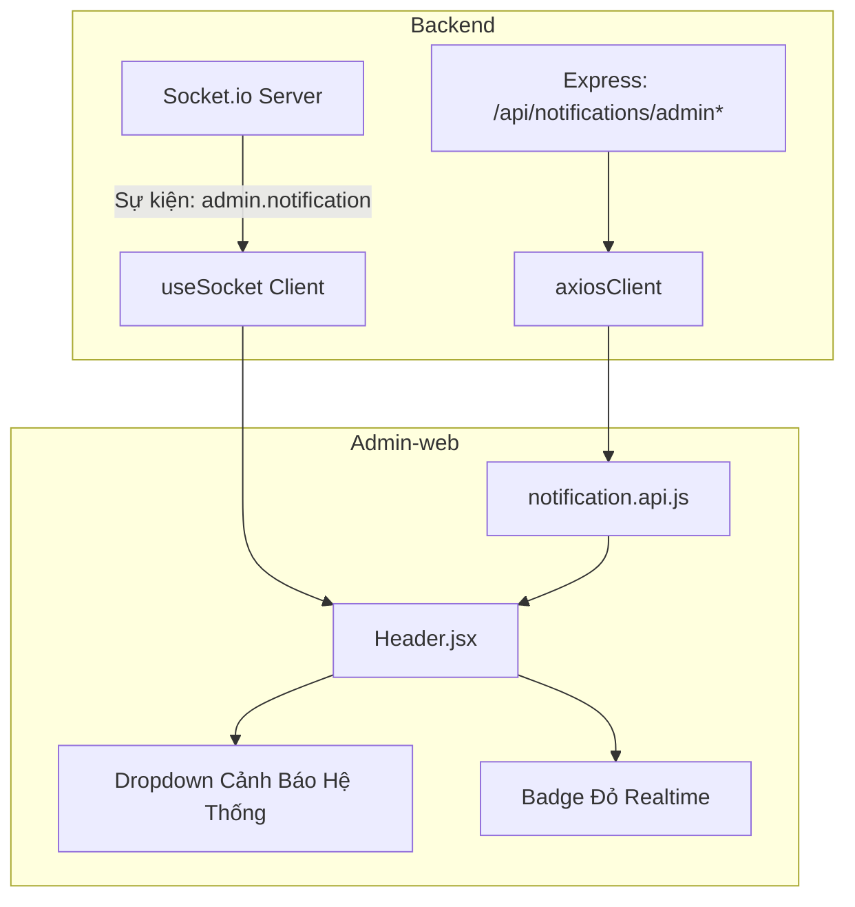

# 📘 Tài Liệu Kỹ Thuật Module Notification — Admin-web

> **Trạng thái:** Đã hoàn thành triển khai & kiểm thử 100% (2026-09-29)  
> **Phạm vi:** `src/Admin-web/src/components/layout/Header.jsx`, `src/Admin-web/src/api/notification.api.js`, `src/Admin-web/src/hooks/useSocket.js`  
> **Biên dịch Frontend:** `rtk npm run build` **thành công 100% (0 errors)**

---

## 1. Tổng Quan Tính Năng Trên Admin-web

Trong hệ thống quản trị Admin-web, tính năng Thông Báo đóng vai trò là **Hệ thống Giám sát & Báo động Khẩn cấp Thời gian thực (Real-time Operations & Security Monitoring)**.

Tính năng này giải quyết triệt để vấn đề trước đây khi icon chuông trên Header chỉ hiển thị chuỗi tĩnh *"Danh sách thông báo trống"*, thay vào đó cung cấp luồng cảnh báo sống động khi hệ thống gặp sự cố tải, nguy cơ cạn kiệt tài nguyên CSDL hoặc các cảnh báo bảo mật.

---

## 2. Các Thành Phần Đã Triển Khai



### 2.1. Chuông Thông Báo Realtime Trên Header
- **File:** [`src/Admin-web/src/components/layout/Header.jsx`](file:///d:/Tai_Lieu_IUH/Tailieu_Nam5_HK1/DoAnTotNghiep/Personal_Finance_Management/src/Admin-web/src/components/layout/Header.jsx)
- **Tính năng nổi bật:**
  1. **Badge Đếm Số Cảnh Báo Chưa Đọc:**
     - Tự động hiển thị số lượng cảnh báo chưa đọc (nếu > 99 hiển thị `99+`).
     - Tích hợp hiệu ứng `animate-pulse` thu hút sự chú ý của quản trị viên khi có cảnh báo mới phát sinh.
     - Tự động ẩn badge khi không có cảnh báo chưa đọc.
  2. **Dropdown Danh Sách Cảnh Báo Phân Cấp Mức Độ:**
     - **CRITICAL (Đỏ):** Sự cố nghiêm trọng (Quá tải Event Loop Lag > 100ms, tiến trình gặp lỗi nặng).
     - **WARNING (Vàng cam):** Cảnh báo tài nguyên (Chạm hạn ngạch CSDL 80% DB Pool, brute force, cảnh báo bảo mật).
     - **INFO (Xanh dương):** Thông tin hệ thống định kỳ hoặc thông báo phát toàn hệ thống (Broadcast).
  3. **Tương Tác Trực Tiếp (Click-to-Read):**
     - Bấm vào một cảnh báo chưa đọc sẽ lập tức gửi lệnh `markAdminAlertAsRead(id)`, chuyển trạng thái sang đã đọc và giảm số lượng chưa đọc mà không cần tải lại trang.
  4. **Tối Ưu Trải Nghiệm (UX/UI):**
     - Nút "Làm mới" hỗ trợ fetch lại danh sách cảnh báo tức thì.
     - Tự động đóng dropdown khi click ra ngoài vùng hiển thị (`handleClickOutside`).
     - Hiển thị thời gian định dạng tiếng Việt rõ ràng (`HH:mm dd/MM`).

### 2.2. Tầng API Client
- **File:** [`src/Admin-web/src/api/notification.api.js`](file:///d:/Tai_Lieu_IUH/Tailieu_Nam5_HK1/DoAnTotNghiep/Personal_Finance_Management/src/Admin-web/src/api/notification.api.js)
- **Các phương thức:**
  ```javascript
  import axiosClient from './axios-client';

  const notificationApi = {
    // Lấy danh sách cảnh báo hệ thống (params: { page, limit, unreadOnly })
    getAdminAlerts: (params = {}) => axiosClient.get('/notifications/admin', { params }),

    // Đánh dấu 1 cảnh báo là đã đọc
    markAdminAlertAsRead: (id) => axiosClient.patch(`/notifications/admin/${id}/read`),

    // Admin phát thông báo Broadcast tới toàn hệ thống
    broadcastNotification: (data) => axiosClient.post('/notifications/broadcast', data),
  };

  export default notificationApi;
  ```

### 2.3. Tầng Kết Nối Realtime Socket.io
- **File:** [`src/Admin-web/src/hooks/useSocket.js`](file:///d:/Tai_Lieu_IUH/Tailieu_Nam5_HK1/DoAnTotNghiep/Personal_Finance_Management/src/Admin-web/src/hooks/useSocket.js)
- **Cơ chế hoạt động:**
  - Tự động đính kèm `auth: { token }` từ `localStorage` khi thiết lập kết nối WebSocket với Backend.
  - Server xác thực role Admin (`idrole === 1`) và tự động đưa socket vào phòng `admin_room`.
  - [`Header.jsx`](file:///d:/Tai_Lieu_IUH/Tailieu_Nam5_HK1/DoAnTotNghiep/Personal_Finance_Management/src/Admin-web/src/components/layout/Header.jsx) lắng nghe sự kiện `admin.notification`:
    ```javascript
    useEffect(() => {
      if (!socket) return;
      const handleAdminNotification = (newAlert) => {
        setNotifications((prev) => [newAlert, ...prev.slice(0, 9)]);
        setUnreadCount((prev) => prev + 1);
      };
      socket.on('admin.notification', handleAdminNotification);
      return () => socket.off('admin.notification', handleAdminNotification);
    }, [socket]);
    ```

---

## 3. Các Kịch Bản Báo Động Thực Tế Được Hỗ Trợ

| Tình huống | Mức độ | Nguồn phát | Hành vi trên Admin-web |
|---|---|---|---|
| **Hệ thống bị nghẽn (Event Loop Lag > 100ms)** | `CRITICAL` | `Load Shedding Middleware` | Header rung chuông, badge tăng số đỏ, thông báo "Cảnh báo quá tải hệ thống (Load Shedding)". |
| **CSDL đạt ngưỡng 80% kết nối (Supabase Pool)** | `WARNING` | `DB Bulkhead Middleware` | Header hiển thị cảnh báo chạm trần 80% kết nối, nhắc nhở quản trị viên. |
| **Phát hiện xâm nhập / Brute-force đăng nhập** | `WARNING` | `Security / Auth Service` | Header hiển thị cảnh báo địa chỉ IP và tần suất bất thường. |
| **Thông báo khẩn cấp toàn hệ thống (Broadcast)** | `INFO` / `WARNING` | `Admin Broadcast API` | Lưu vào lịch sử cảnh báo và gửi tới tất cả người dùng đang online. |

---

## 4. Kiểm Thử & Kiểm Tra Biên Dịch

- **Lệnh kiểm tra:** `rtk npm run build` tại `src/Admin-web`
- **Kết quả:**
  ```bash
  ✓ 155 modules transformed.
  rendering chunks...
  dist/index.html                   1.05 kB │ gzip:   0.56 kB
  dist/assets/index-BGG_aq6F.css   62.84 kB │ gzip:  11.70 kB
  dist/assets/index-CgqGUqx4.js   441.77 kB │ gzip: 135.64 kB │ map: 1,564.35 kB
  ✓ built in 2.04s
  ```
- **Không có bất kỳ cảnh báo hoặc lỗi type/syntax nào phát sinh.**
