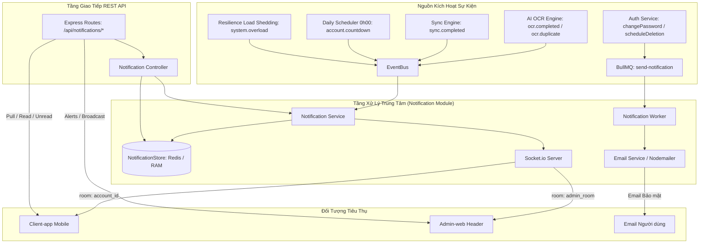

# 📘 Tài Liệu Kỹ Thuật Module Notification — Backend

> **Trạng thái:** Đã hoàn thành triển khai & kiểm thử 100% (2026-09-29)  
> **Phạm vi:** `src/Backend/modules/notification/`, `src/Backend/core/socket.js`, `src/Backend/workers/notification.worker.js`, `src/Backend/api/notification.routes.js`  
> **Kiểm thử:** **27/27 tests Notification PASS**, **88/88 tests toàn hệ thống PASS 100%**

---

## 1. Tổng Quan & Triết Lý Thiết Kế

Module Notification của Backend đóng vai trò là **Hub điều phối thông báo đa kênh tập trung** cho toàn bộ hệ thống WealthCommand / ManagementFinance, kết nối người dùng cuối (Mobile Client-app) và ban quản trị (Admin-web).

### Triết Lý Thiết Kế Cốt Lõi:
1. **Zero PostgreSQL Schema Conflict:** Không can thiệp vào schema Prisma hay bảng PostgreSQL, tránh hoàn toàn rủi ro migration conflict hoặc phá vỡ hợp đồng đồng bộ (`SyncEntityType`).
2. **Lưu trữ nhẹ và tự dọn dẹp (`NotificationStore`):** Sử dụng **Redis List** kết hợp **In-Memory fallback**, tự động cắt tỉa giới hạn **50 thông báo gần nhất** cho mỗi tài khoản và Admin, TTL **30 ngày**, ngăn chặn triệt để rò rỉ bộ nhớ (Memory Leak).
3. **Phân luồng 3 kênh minh bạch:**
   - **Kênh Realtime User (Socket.io):** Phát vào room cá nhân `account_${idaccount}` đã xác thực JWT.
   - **Kênh Realtime Admin (Socket.io):** Phát vào room quản trị `admin_room`.
   - **Kênh Email Bất Đồng Bộ (BullMQ Worker):** Gửi email cảnh báo bảo mật qua hàng đợi `send-notification` với cơ chế retry exponential backoff.
4. **Bảo mật dữ liệu tuyệt đối (`Data_Security.md`):** Tuyệt đối không lưu trữ hay gửi mật khẩu, token, OTP, CVV/CVC, hay thông tin nhạy cảm qua nội dung thông báo.

---

## 2. Kiến Trúc Các Tầng Triển Khai



---

## 3. Chi Tiết Các Thành Phần

### 3.1. Tầng Lưu Trữ — `NotificationStore`
- **File:** [`src/Backend/modules/notification/notification.store.js`](file:///d:/Tai_Lieu_IUH/Tailieu_Nam5_HK1/DoAnTotNghiep/Personal_Finance_Management/src/Backend/modules/notification/notification.store.js)
- **Cơ chế lưu trữ:**
  - **Redis:** Khóa `notifications:account:{idaccount}` (danh cho user) và `notifications:admin` (dành cho admin). Sử dụng `LPUSH` + `LTRIM 0 49` + `EXPIRE 2592000` (30 ngày).
  - **In-Memory Cache:** `Map<accKey, Array>` và `adminStore: Array` tự động cắt tỉa `length = 50`.
  - **Đồng nhất kiểu dữ liệu:** Chuẩn hóa toàn bộ `accKey = String(idaccount)` đảm bảo Number và String đều truy xuất cùng một tập dữ liệu.
- **Phương thức cung cấp:**
  - `addNotification(idaccount, data)`: Thêm thông báo user (tự sinh UUID, timestamp, `isRead = false`).
  - `getNotifications(idaccount, { page, limit, unreadOnly })`: Lấy danh sách phân trang, đếm chưa đọc.
  - `getUnreadCount(idaccount)`: Lấy số lượng thông báo chưa đọc.
  - `markAsRead(idaccount, notificationId)`: Đánh dấu 1 thông báo đã đọc.
  - `markAllAsRead(idaccount)`: Đánh dấu tất cả đã đọc (trả về số lượng `affected`).
  - `addAdminNotification(data)`: Thêm cảnh báo hệ thống cho Admin (INFO, WARNING, CRITICAL).
  - `getAdminNotifications({ page, limit, unreadOnly })`: Lấy danh sách cảnh báo Admin.
  - `markAdminAsRead(notificationId)`: Admin đánh dấu cảnh báo đã đọc.

### 3.2. Tầng Realtime & Dịch Vụ — `Socket.io` & `NotificationService`
- **File Socket:** [`src/Backend/core/socket.js`](file:///d:/Tai_Lieu_IUH/Tailieu_Nam5_HK1/DoAnTotNghiep/Personal_Finance_Management/src/Backend/core/socket.js)
  - `emitAdminNotification(data)`: Gửi sự kiện `admin.notification` tới phòng `admin_room`.
  - `emitSystemBroadcast(data)`: Gửi sự kiện `system.broadcast` tới toàn bộ client đang kết nối.
  - `emitOcrCompleted(idaccount, data)`: Gửi `ocr.completed` tới phòng `account_${idaccount}`.
  - `emitOcrDuplicate(idaccount, data)`: Gửi `ocr.duplicate` tới phòng `account_${idaccount}`.
  - `emitSyncCompleted(idaccount, data)`: Gửi `sync.completed` tới phòng `account_${idaccount}`.
  - `emitBankTransaction(idaccount, data)`: Gửi `bank_transaction.incoming` tới phòng `account_${idaccount}`.
- **File Service:** [`src/Backend/modules/notification/notification.service.js`](file:///d:/Tai_Lieu_IUH/Tailieu_Nam5_HK1/DoAnTotNghiep/Personal_Finance_Management/src/Backend/modules/notification/notification.service.js)
  - Khởi tạo listener EventBus (`initNotificationListeners` có cờ bảo vệ chống đăng ký trùng lặp):
    1. `ocr.completed` $\rightarrow$ Lưu Store + Emit Socket `ocr.completed`.
    2. `ocr.duplicate` $\rightarrow$ Lưu Store + Emit Socket `ocr.duplicate`.
    3. `bank_transaction.pending` $\rightarrow$ Lưu Store + Emit Socket `bank_transaction.incoming`.
    4. `sync.completed` $\rightarrow$ Emit Socket `sync.completed`.
    5. `system.overload` $\rightarrow$ Lưu Admin Store + Emit Socket `admin.notification` (CRITICAL).
    6. `security.alert` $\rightarrow$ Lưu Admin Store + Emit Socket `admin.notification` (WARNING).
    7. `account.countdown` $\rightarrow$ Lưu Store + Emit Socket `account.countdown`.
  - Các hàm tiện ích: `broadcast(payload)`, `sendDirectNotification(idaccount, notification)`, `sendAdminAlert(alertData)`.

### 3.3. Tầng Giao Diện Lập Trình — REST API Endpoints
- **Định tuyến:** [`src/Backend/api/notification.routes.js`](file:///d:/Tai_Lieu_IUH/Tailieu_Nam5_HK1/DoAnTotNghiep/Personal_Finance_Management/src/Backend/api/notification.routes.js)
- **Validation:** [`src/Backend/modules/notification/notification.validation.js`](file:///d:/Tai_Lieu_IUH/Tailieu_Nam5_HK1/DoAnTotNghiep/Personal_Finance_Management/src/Backend/modules/notification/notification.validation.js)
- **Controller:** [`src/Backend/modules/notification/notification.controller.js`](file:///d:/Tai_Lieu_IUH/Tailieu_Nam5_HK1/DoAnTotNghiep/Personal_Finance_Management/src/Backend/modules/notification/notification.controller.js)

| Phương thức | Đường dẫn API | Yêu cầu xác thực | Mô tả chi tiết |
|---|---|---|---|
| `GET` | `/api/notifications` | `authenticate` | Lấy danh sách thông báo người dùng (Params: `page`, `limit`, `unreadOnly`) |
| `GET` | `/api/notifications/unread-count` | `authenticate` | Lấy số lượng thông báo chưa đọc của người dùng |
| `PATCH` | `/api/notifications/:id/read` | `authenticate` | Đánh dấu 1 thông báo cụ thể là đã đọc |
| `POST` | `/api/notifications/read-all` | `authenticate` | Đánh dấu tất cả thông báo của người dùng là đã đọc |
| `GET` | `/api/notifications/admin` | `authenticate` + `authorize('admin')` | Lấy danh sách cảnh báo hệ thống (Params: `page`, `limit`, `unreadOnly`) |
| `PATCH` | `/api/notifications/admin/:id/read` | `authenticate` + `authorize('admin')` | Đánh dấu 1 cảnh báo hệ thống là đã đọc |
| `POST` | `/api/notifications/broadcast` | `authenticate` + `authorize('admin')` | Admin phát thông báo Broadcast tới toàn bộ người dùng |

### 3.4. Tầng Xử Lý Nền — BullMQ Worker
- **Helper:** [`src/Backend/modules/notification/notification.jobs.js`](file:///d:/Tai_Lieu_IUH/Tailieu_Nam5_HK1/DoAnTotNghiep/Personal_Finance_Management/src/Backend/modules/notification/notification.jobs.js)
  - `enqueueEmailNotification(data, opts)`: Đưa job `send-email` vào queue `sendNotification`.
  - `enqueueSocketNotification(data, opts)`: Đưa job `send-socket` vào queue `sendNotification`.
- **Worker:** [`src/Backend/workers/notification.worker.js`](file:///d:/Tai_Lieu_IUH/Tailieu_Nam5_HK1/DoAnTotNghiep/Personal_Finance_Management/src/Backend/workers/notification.worker.js)
  - Xử lý job `send-email` qua [`emailService.sendSecurityAlert`](file:///d:/Tai_Lieu_IUH/Tailieu_Nam5_HK1/DoAnTotNghiep/Personal_Finance_Management/src/Backend/core/email.service.js) gửi email cảnh báo bảo mật tài khoản khi:
    - Người dùng đổi mật khẩu (`PASSWORD_CHANGED`).
    - Người dùng gửi yêu cầu xóa tài khoản chờ ân hạn 30 ngày (`ACCOUNT_DELETION_SCHEDULED`).
  - Tự động fallback ghi log mock an toàn khi chưa cấu hình tài khoản SMTP thật.
  - Tự động nạp tại [`index.js`](file:///d:/Tai_Lieu_IUH/Tailieu_Nam5_HK1/DoAnTotNghiep/Personal_Finance_Management/src/Backend/index.js) khi Redis khả dụng.

---

## 4. Đặc Tả Dữ Liệu & Payload Chuẩn Hóa

### 4.1. Payload Thông Báo Người Dùng Trong Store
```json
{
  "id": "c1f728ea-2ef4-4f4c-8822-fa2520cb2a92",
  "idaccount": 101,
  "title": "Hóa đơn đã được bóc tách thành công",
  "message": "Hóa đơn Circle K (55.000đ) đã được bóc tách và phân loại.",
  "type": "OcrCompleted",
  "metadata": {
    "merchant_name": "Circle K",
    "total_amount": 55000,
    "document_type": "invoice"
  },
  "isRead": false,
  "readAt": null,
  "createdAt": "2026-09-29T04:36:53.000Z"
}
```

### 4.2. Payload Cảnh Báo Hệ Thống Admin
```json
{
  "id": "a9e6d421-12b3-4f90-8e12-bb2031fa1108",
  "title": "Cảnh báo quá tải hệ thống (Load Shedding)",
  "message": "Event Loop Lag đạt 150ms, kích hoạt cơ chế cắt tải bảo vệ hệ thống.",
  "level": "CRITICAL",
  "category": "LOAD_SHEDDING",
  "metadata": {
    "lagMs": 150,
    "path": "/api/transactions"
  },
  "isRead": false,
  "readAt": null,
  "createdAt": "2026-09-29T04:55:44.000Z"
}
```

---

## 5. Kết Quả Kiểm Thử Khép Kín (TDD 100% PASS)

Toàn bộ 4 test suites chuyên biệt cho Module Notification đã được kiểm thử khép kín:
1. `tests/unit/notification.store.test.js`: **10 / 10 tests PASS** (CRUD thông báo, auto-trim 50 items, TTL, phân lập tài khoản, đồng nhất kiểu dữ liệu Number/String).
2. `tests/unit/notification.service.test.js`: **4 / 4 tests PASS** (bắt sự kiện EventBus, lưu Store, phát Socket.io, broadcast).
3. `tests/unit/notification.controller.test.js`: **10 / 10 tests PASS** (các REST API endpoints, validation middleware).
4. `tests/unit/notification.worker.test.js`: **3 / 3 tests PASS** (xử lý job email nền, validate email, delayed socket dispatch).

**Tổng số test toàn bộ Backend:** **88 / 88 tests PASS 100% (25 suites xanh tuyệt đối)**.
