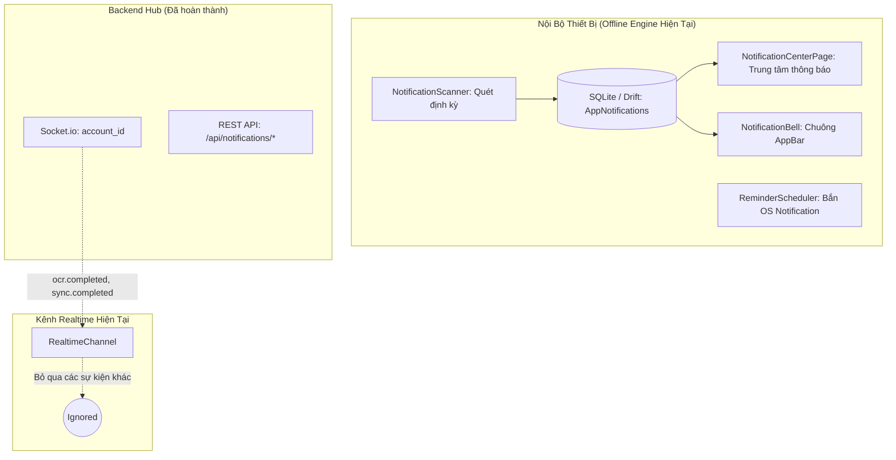
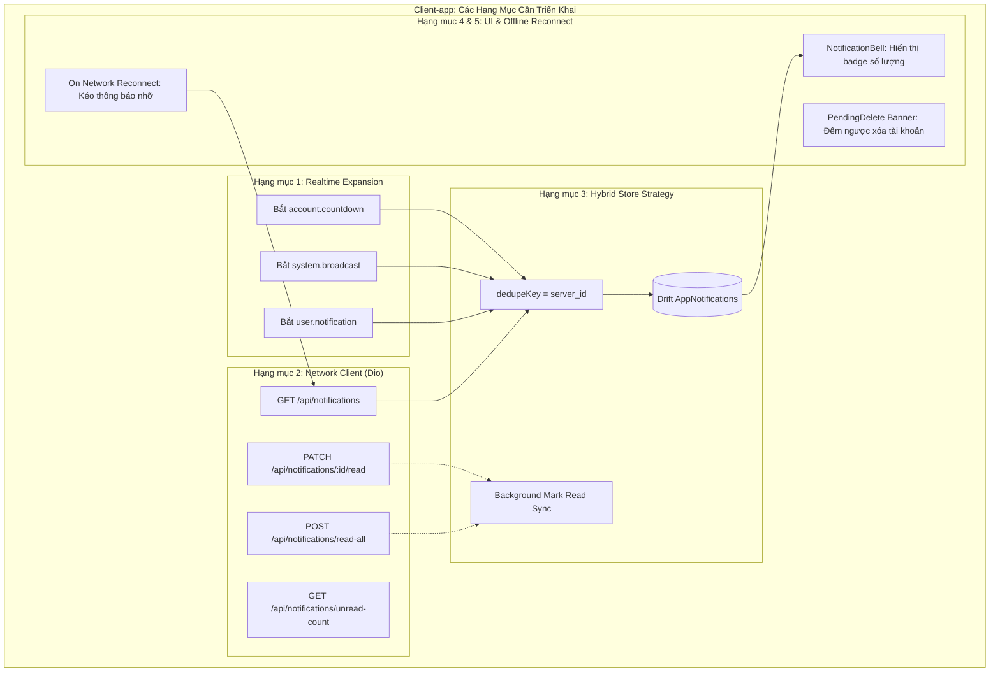

# 📱 Tài Liệu Kỹ Thuật Module Notification — Client-app (Mobile)

> **Trạng thái:** Đặc tả kỹ thuật & Hướng dẫn triển khai tích hợp (2026-09-29)  
> **Phạm vi:** `src/Client-app/lib/features/notification/`, `src/Client-app/lib/core/notification/`, `src/Client-app/lib/core/realtime/`, `src/Client-app/lib/shared/widgets/notification_bell.dart`  
> **Mục tiêu:** Khớp nối hoàn hảo giữa Client-app Mobile (Offline-First) với Backend Hub Notification và Admin-web.

---

## 1. Hiện Trạng Module Notification Trên Client-app

Ứng dụng di động Flutter Client-app hiện đang vận hành theo triết lý **Offline-First**, trong đó thông báo cục bộ phục vụ quản lý tài chính cá nhân đã được xây dựng rất chặt chẽ:



### 1.1. Kiến Trúc Cục Bộ Đã Có
1. **Lưu trữ CSDL Cục bộ (`AppNotifications` - Drift/SQLite):**
   - File: `lib/core/database/tables/notification_table.dart`.
   - Có cơ chế chống trùng nội bộ bằng khoá duy nhất: `{idaccount, dedupeKey}` kết hợp `InsertMode.insertOrIgnore`.
   - Không chứa các cột đồng bộ đồng đẳng (`syncStatus`, `syncError`) vì đây là dữ liệu suy ra được từ nghiệp vụ tài chính.
   - Hỗ trợ xoá mềm `dismissedAt` để bảo toàn khóa chống trùng, phân trang `watchFeed(idaccount, limit, kinds, chiChuaDoc)`.
2. **Hệ Thống 20 Loại Thông Báo Tài Chính Cục Bộ (`NotificationKind`):**
   - Chia thành 6 nhóm người dùng bật/tắt độc lập (`NotificationGroup`):
     - `bill`: Hóa đơn sắp đến hạn, quá hạn, tự động thanh toán, trả trên thiết bị khác...
     - `budget`: Chi tiêu chạm ngưỡng cảnh báo, vượt hạn mức, khoản chi lớn bất thường, đề xuất tái phân bổ ngân sách AI...
     - `goal`: Hoàn thành mục tiêu, chậm tiến độ, chạm cột mốc, tự động trích tiền...
     - `transaction`: Biến động số dư đọc trên máy / biên lai chia sẻ (D1).
     - `system`: Lỗi đồng bộ dữ liệu, số dư ví âm, số dư ví thấp.
     - `summary`: Báo cáo tổng kết tuần.
3. **Giao Diện Trung Tâm Thông Báo (`NotificationCenterPage`):**
   - Đầy đủ tính năng phân trang (20 mục/lượt), vuốt xoá mềm (Dismissible), đánh dấu đã đọc một mục / tất cả mục.
   - Bộ lọc thanh chip cuộn ngang: `Tất cả`, `Chưa đọc`, `Hoá đơn`, `Ngân sách`, `Mục tiêu`, `Hệ thống`, `Tổng kết`.
4. **Hệ Thống Bắn Thông Báo OS (`flutter_local_notifications`):**
   - File: `lib/core/notification/os/os_notifier_native.dart` và `reminder_scheduler.dart`.

---

## 2. Khoảng Cách Kỹ Thuật Giữa Client-app & Backend Hiện Tại

Mặc dù hệ thống thông báo nội bộ của Client-app rất hoàn chỉnh, **nó hoàn toàn bị cô lập khỏi luồng thông báo từ Backend và Admin-web**:

| Thành phần Backend đã có | Hiện trạng tiếp nhận trên Client-app | Tác động / Vấn đề |
|---|---|---|
| **Sự kiện `account.countdown`** (Socket.io) | `realtime_event.dart` chưa hỗ trợ → rơi vào `default: return null` | Người dùng đã yêu cầu xoá tài khoản không nhận được cảnh báo đếm ngược 30 ngày ân hạn trên app. |
| **Sự kiện `system.broadcast`** (Socket.io) | Chưa bắt sự kiện broadcast từ Admin | Khi quản trị viên phát thông báo bảo trì/nâng cấp hệ thống, Client-app không hiển thị. |
| **Sự kiện `user.notification`** (Socket.io) | Chưa bắt sự kiện thông báo trực tiếp từ Backend | Các cảnh báo bảo mật, cảnh báo hệ thống từ server bị bỏ sót. |
| **REST API `/api/notifications/*`** | Client-app chưa có `NotificationApiClient` | Không kéo được lịch sử thông báo server khi offline quay lại; trạng thái đọc không được đồng bộ lên backend. |
| **Widget `NotificationBell`** | Đã hiển thị số lượng chưa đọc động (0 ẩn, 1–99, `99+`) từ 2026-09-30 | Đồng bộ chuẩn UX theo badge số đếm. |

---

## 3. Chi Tiết Các Nội Dung Client-app Cần Làm Để Khớp Module Notification

Để tích hợp liền mạch mà **tuyệt đối không phá vỡ kiến trúc Offline-First** và **tuân thủ `Data_Security.md`**, Client-app cần triển khai 5 hạng mục sau:



---

### 3.1. Hạng Mục 1: Mở Rộng Realtime Socket Listener

#### A. File Cần Sửa Đổi:
- [`src/Client-app/lib/core/realtime/realtime_event.dart`](file:///d:/Tai_Lieu_IUH/Tailieu_Nam5_HK1/DoAnTotNghiep/Personal_Finance_Management/src/Client-app/lib/core/realtime/realtime_event.dart)
- [`src/Client-app/lib/core/realtime/realtime_channel.dart`](file:///d:/Tai_Lieu_IUH/Tailieu_Nam5_HK1/DoAnTotNghiep/Personal_Finance_Management/src/Client-app/lib/core/realtime/realtime_channel.dart)

#### B. Chi Tiết Thực Hiện:
1. **Bổ sung các sự kiện mới vào `RealtimeChannel`:**
   Tương tự như sự kiện `account.force_logout` đã được xử lý bằng luồng riêng (`buocDangXuat`), các sự kiện có payload dữ liệu cụ thể từ Server sẽ được cấp luồng stream tương ứng:
   ```dart
   // Trong realtime_channel.dart:
   const _tenDemNguocXoaTaiKhoan = 'account.countdown';
   const _tenThongBaoPhatSong = 'system.broadcast';
   const _tenThongBaoNguoiDung = 'user.notification';

   final _demNguocController = StreamController<ThongBaoDemNguoc>.broadcast();
   Stream<ThongBaoDemNguoc> get demNguocXoaTaiKhoan => _demNguocController.stream;

   final _thongBaoServerController = StreamController<ThongBaoServerPayload>.broadcast();
   Stream<ThongBaoServerPayload> get thongBaoServer => _thongBaoServerController.stream;
   ```
2. **Giải mã Payload an toàn (Safe Payload Parsing):**
   - Tuyệt đối không để crash ứng dụng khi Backend thay đổi hoặc bổ sung trường dữ liệu.
   - Bắt bọc trong `try-catch` với fallback mặc định.
   - `account.countdown`: Bóc tách `daysRemaining` (int), `title` (String), `message` (String), `idaccount` (String), `username` (String). **Không có** `daysLeft` hay `expireAt`.
   - `system.broadcast`: Bóc tạch `id` (String), `title` (String), `message` (String — **không phải** `content`), `level` (String **CHỮ HOA**: `'INFO'` | `'WARNING'` | `'CRITICAL'`), `createdAt` (DateTime — **không phải** `broadcastAt`), `category` (`'BROADCAST'`), `metadata` (Map).
   - `user.notification`: **Chưa có nguồn phát thật** — `notifyUser` có 0 nơi gọi ngoài test. Giữ placeholder nếu cần implement sau.

---

### 3.2. Hạng Mục 2: Xây Dựng Tầng Network REST API Client

#### A. File Cần Tạo Mới:
- `src/Client-app/lib/features/notification/data/api/notification_api_client.dart`
- Đăng ký DI trong `src/Client-app/lib/core/di/injection_container.dart`.

#### B. Chi Tiết Thực Hiện:
Sử dụng `DioClient` (đã có sẵn cơ chế đính kèm `AccessToken` tự động và tự động Refresh Token):

```dart
class NotificationApiClient {
  final DioClient _dio;

  NotificationApiClient({required DioClient dio}) : _dio = dio;

  /// Lấy danh sách thông báo server (hỗ trợ phân trang)
  Future<NotificationPageResponse> getNotifications({
    int page = 1,
    int limit = 20,
    bool? unreadOnly,
  }) async {
    final response = await _dio.get(
      '/api/notifications',
      queryParameters: {
        'page': page,
        'limit': limit,
        if (unreadOnly != null) 'unreadOnly': unreadOnly,
      },
    );
    return NotificationPageResponse.fromJson(response.data);
  }

  /// Lấy số lượng thông báo chưa đọc từ server
  Future<int> getUnreadCount() async {
    final response = await _dio.get('/api/notifications/unread-count');
    return response.data['data']['unreadCount'] as int? ?? 0;
  }

  /// Đánh dấu 1 thông báo server đã đọc
  Future<void> markAsRead(String notificationId) async {
    await _dio.patch('/api/notifications/$notificationId/read');
  }

  /// Đánh dấu toàn bộ thông báo server đã đọc
  Future<void> markAllAsRead() async {
    await _dio.post('/api/notifications/read-all');
  }
}
```

---

### 3.3. Hạng Mục 3: Mô Hình Lưu Trữ Lai & Khử Trùng Hợp Nhất (Hybrid Store Strategy)

#### A. Nguyên Tắc Cốt Lõi:
1. **Tôn trọng CSDL Cục bộ:** Không tạo bảng CSDL mới. Bảng `AppNotifications` (SQLite Drift) tiếp tục là **Single Source of Truth** cho toàn bộ giao diện thông báo của Client-app.
2. **Khử trùng bằng `dedupeKey`:**
   - Đối với thông báo sinh ra từ Backend/Server, gán:
     $$\text{dedupeKey} = \text{"server\_" + notification.id}$$
   - Nhờ ràng buộc duy nhất `{idaccount, dedupeKey}` trên bảng `AppNotifications`, nếu thông báo đã được nhận qua Socket.io rồi thì lần kéo HTTP API sau đó sẽ được SQLite âm thầm bỏ qua (`insertOrIgnore`), không bao giờ sinh 2 bản ghi trùng nhau!

#### B. Bổ Sung `NotificationKind` Trong `notification_rules.dart`:
```dart
enum NotificationKind {
  // ... 19 loại hiện tại ...
  
  /// Thông báo đếm ngược 30 ngày xóa tài khoản (từ Backend Scheduler)
  accountCountdown,

  /// Thông báo phát sóng diện rộng từ Ban Quản Trị (Admin Broadcast)
  systemBroadcast,

  /// Cảnh báo an toàn / biến động bảo mật tài khoản từ Backend
  securityAlert,
}
```

#### C. Ánh Xạ Nhóm Trong `notification_prefs.dart`:
Cả 3 loại mới đều được phân vào nhóm `NotificationGroup.system`:
```dart
NotificationGroup nhomCua(NotificationKind kind) {
  switch (kind) {
    // ...
    case NotificationKind.syncFailed:
    case NotificationKind.walletNegative:
    case NotificationKind.walletLowBalance:
    case NotificationKind.accountCountdown:
    case NotificationKind.systemBroadcast:
    case NotificationKind.securityAlert:
      return NotificationGroup.system;
    case NotificationKind.weeklySummary:
      return NotificationGroup.summary;
  }
}
```
> **Điểm mạnh:** Tự động hiển thị chính xác khi người dùng chọn tab chip **"Hệ thống"** trên giao diện `NotificationCenterPage` mà không cần sửa giao diện!

#### D. Đồng Bộ Trạng Thái Đã Đọc Hai Chiều (Optimistic Read Sync):
- Khi người dùng chạm đọc một mục trên app:
  1. Cập nhật ngay `readAt = DateTime.now()` vào SQLite qua `dao.markAsRead(id)` để giao diện phản hồi mượt mà không có độ trễ.
  2. Nếu mục đó có `dedupeKey.startsWith('server_')`, trích xuất `serverId = dedupeKey.substring(7)` và gọi `apiClient.markAsRead(serverId)` ngầm dưới background (bọc trong `unawaited`).
- Tương tự khi bấm **"Đọc tất cả"**: Vừa cập nhật SQLite cục bộ, vừa gọi `apiClient.markAllAsRead()`.

---

### 3.4. Hạng Mục 4: Cơ Chế Kéo Bù Khi Nối Lại Mạng (Offline Reconnect Sync)

Khi thiết bị di chuyển vào vùng không có sóng (mất mạng) và sau đó có mạng trở lại:
1. `RealtimeChannel` bắt sự kiện `ConnectivityResult != none` và nối lại Socket.
2. Ngay khi Socket nối lại thành công (`onConnect`), kích hoạt hàm kéo bù thông báo nhỡ:
   ```dart
   Future<void> syncMissedServerNotifications() async {
     try {
       final res = await _apiClient.getNotifications(limit: 50);
       for (final item in res.notifications) {
         await _dao.insertServerNotification(item);
       }
     } catch (e) {
       debugPrint('[NotificationSync] Kéo thông báo nhỡ thất bại (sẽ thử lại sau): $e');
     }
   }
   ```
3. Giúp ứng dụng luôn đầy đủ thông báo ngay cả khi đóng app hoặc offline dài ngày.

---

### 3.5. Hạng Mục 5: Nâng Cấp Giao Diện Người Dùng (UI/UX Alignment)

#### A. Nâng Cấp Chuông Thông Báo (`NotificationBell`):
- **File:** [`src/Client-app/lib/shared/widgets/notification_bell.dart`](file:///d:/Tai_Lieu_IUH/Tailieu_Nam5_HK1/DoAnTotNghiep/Personal_Finance_Management/src/Client-app/lib/shared/widgets/notification_bell.dart)
- **Cải tiến:**
  - Thay thế chấm đỏ 10x10 tĩnh bằng **Badge đếm số linh hoạt**:
    + Nếu số chưa đọc $= 0$: Ẩn badge.
    + Nếu $1 \le$ số chưa đọc $\le 99$: Hiển thị số lượng chính xác (`1`, `2`, `12`).
    + Nếu số chưa đọc $> 99$: Hiển thị `99+`.
  - Giúp đồng bộ giao diện nhận diện thương hiệu giữa Mobile Client-app và Admin-web Header.

#### B. Banner Cảnh Báo Tài Khoản Chờ Xóa (PendingDelete Countdown Banner):
- **File:** `src/Client-app/lib/features/home/presentation/widgets/pending_delete_banner.dart`
- **Hành vi:**
  - Khi nhận sự kiện `account.countdown` hoặc khi `AuthBloc` báo trạng thái tài khoản đang là `PendingDelete`:
  - Hiển thị Banner viền cam/đỏ trên đầu trang Home / Profile:
    > ⚠️ **Tài khoản đang trong thời gian chờ xoá!**  
    > Còn **X ngày** để hủy yêu cầu và giữ lại toàn bộ dữ liệu tài chính của bạn.  
    > `[Hủy xoá tài khoản ngay]`
  - Bấm vào nút "Hủy xoá" sẽ chuyển hướng người dùng đến màn hình xác nhận phục hồi tài khoản (`POST /api/auth/cancel-delete`).

#### C. Điều Hướng Khi Chạm Vào Thông Báo (Notification Tap Deeplink):
- Mở rộng `NotificationTapRouter` (`lib/core/notification/notification_tap_router.dart`):
  - `accountCountdown`: Điều hướng về `/profile/account-security`.
  - `systemBroadcast`: Hiển thị Modal/BottomSheet đọc đầy đủ thông cáo hệ thống.
  - `securityAlert`: Điều hướng về trang Lịch sử đăng nhập / Đổi mật khẩu.

---

## 4. Đặc Tả Hợp Đồng Dữ Liệu (Data Contracts)

### 4.1. Sự Kiện Socket Payload Từ Backend

#### Sự kiện `account.countdown`:
> ⚠️ **Cập nhật 2026-10-01:** Payload thực tế từ `scheduler.service.js:184-190` + `notification.service.js:202`.
> Không có vỏ `{event, data}`. Không có `daysLeft` / `expireAt`. Có `username`.
```json
{
  "idaccount": "123",
  "username": "nguyen_phu_bao",
  "daysRemaining": 28,
  "title": "Cảnh báo ngừng hoạt động tài khoản",
  "message": "Tài khoản của bạn sẽ bị ngừng hoạt động sau 28 ngày."
}
```

#### Sự kiện `system.broadcast`:
> ⚠️ **Cập nhật 2026-10-01:** Payload thực tế từ `notification.service.js:217-238`.
> Trường là `message` (không phải `content`), `createdAt` (không phải `broadcastAt`), `level` **CHỮ HOA** (`'INFO'`).
```json
{
  "id": "broad_98f4e2",
  "title": "Bảo trì nâng cấp hệ thống",
  "message": "Hệ thống sẽ bảo trì định kỳ vào 02:00 sáng ngày 01/10/2026. Một số tính năng đồng bộ có thể bị gián đoạn.",
  "level": "INFO",
  "category": "BROADCAST",
  "metadata": {},
  "isRead": false,
  "readAt": null,
  "createdAt": "2026-09-29T10:00:00.000Z"
}
```

#### Sự kiện `user.notification`:
> ⚠️ **Cập nhật 2026-10-01:** **Chưa có nguồn phát thật** — `notifyUser()` có 0 nơi gọi ngoài test.
> Phần mô tả dưới đây là dự kiến (reserved) cho implementation sau.
> Không có `severity` / `read` trong gói dự kiến.
```json
{
  "id": "notif_user_abc123",
  "type": "securityAlert",
  "title": "Cảnh báo bảo mật",
  "message": "Phát hiện đăng nhập mới từ thiết bị lạ.",
  "createdAt": "2026-09-29T08:30:00.000Z"
}
```

---

## 5. Checklist Triển Khai Cho Lập Trình Viên Client-app

Dưới đây là danh sách công việc tuần tự dành cho Flutter Developer khi triển khai module:

- [ ] **Bước 1: Mở rộng Data Models & Enums**
  - [ ] Bổ sung `accountCountdown`, `systemBroadcast`, `securityAlert` vào `NotificationKind` trong `notification_rules.dart`.
  - [ ] Thêm ánh xạ nhóm vào `NotificationGroup.system` trong `notification_prefs.dart`.
  - [ ] Cập nhật switch-case dịch tên hiển thị và icon trong `notification_visuals.dart` (hoặc `NotificationCenterPage`).
- [ ] **Bước 2: Xây dựng Network Client**
  - [ ] Tạo `notification_api_client.dart` với các phương thức GET, PATCH, POST chuẩn RESTful.
  - [ ] Đăng ký `NotificationApiClient` vào `injection_container.dart`.
- [ ] **Bước 3: Mở rộng Tầng Realtime Channel**
  - [ ] Thêm lắng nghe sự kiện `account.countdown`, `system.broadcast`, `user.notification` trong `realtime_channel.dart`.
  - [ ] Kết nối sự kiện Realtime tự động ghi vào SQLite `AppNotifications` với `dedupeKey = 'server_${item.id}'`.
- [ ] **Bước 4: Nối Lại Mạng & Kéo Bù (Reconnect Sync)**
  - [ ] Tích hợp lệnh kéo bù `syncMissedServerNotifications()` vào hook `onConnect` của Socket.
- [ ] **Bước 5: Cập Nhật UI Widgets**
  - [ ] Nâng cấp `NotificationBell` sang Badge đếm số (ẩn khi 0, số thật khi $\le 99$, `99+` khi lớn hơn).
  - [ ] Thêm `PendingDeleteBanner` cảnh báo thời gian đếm ngược xoá tài khoản trên `HomePage`.
  - [ ] Đấu nối 2 chiều: Đọc thông báo trên máy $\rightarrow$ gọi API mark read lên Server.
- [ ] **Bước 6: Kiểm Thử & Kiểm Định (Verification)**
  - [ ] Viết Unit Test cho `NotificationApiClient` (Mock Dio).
  - [ ] Viết Unit Test cho `RealtimeChannel` kiểm tra giải mã payload `account.countdown` và `system.broadcast`.
  - [ ] Chạy `flutter test` đảm bảo 100% test cases pass.

---

## 6. Tuân Thủ An Toàn Dữ Liệu & Pháp Luật (`Data_Security.md`)

Mọi triển khai trên Client-app bắt buộc tuân thủ nghiêm ngặt các điều khoản bảo mật sau:
1. **Tuyệt đối không lưu trữ dữ liệu nhạy cảm:** Nội dung thông báo hiển thị trên chuông hoặc lưu trong SQLite không được chứa mật khẩu, mã OTP, số tài khoản đầy đủ, hay số dư cụ thể của người dùng.
2. **Cách ly người dùng (User-scoped Isolation):** Mọi thao tác truy vấn SQLite hoặc gọi REST API phải luôn ràng buộc theo `idaccount` của phiên đăng nhập hiện tại. Đăng xuất phải xóa sạch cache thông báo trong bộ nhớ RAM.
3. **Mã hóa truyền tải (In-transit Encryption):** Mọi kết nối Socket.io và HTTP REST API bắt buộc thực hiện qua HTTPS/WSS với mã hóa TLS 1.3.
