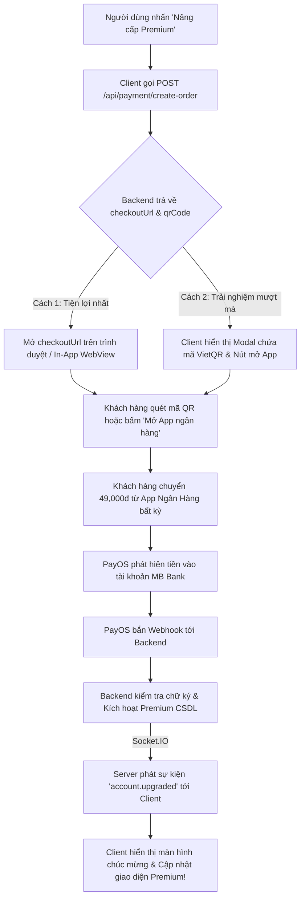

# TÀI LIỆU HƯỚNG DẪN TÍCH HỢP MODULE THANH TOÁN (PAYOS) DÀNH CHO CLIENT-APP

> **Hệ thống:** WealthCommand - Quản Lý Tài Chính Cá Nhân  
> **Dành cho:** Mobile Team (Client-app) & Frontend Team (Admin-web / Client-web)  
> **Phiên bản:** 1.0.0 · **Ngày ban hành:** 2026-10-05  
> **Tuân thủ:** `docs/Rule_Project/Data_Security.md` & Nghị định 13/2023/NĐ-CP  
> **Backend Base URL:**  
> - Localhost: `http://localhost:3000`  
> - Production: `https://managementfinance.onrender.com`

---

## 📌 MỤC LỤC
1. [Tổng Quan Những Gì Backend Đã Hoàn Thành 100%](#1-tổng-quan-những-gì-backend-đã-hoàn-thành-100)
2. [Checklist Nhiệm Vụ Phía Client-App Cần Triển Khai](#2-checklist-nhiệm-vụ-phía-client-app-cần-triển-khai)
3. [Luồng Nghiệp Vụ Người Dùng (UX Flow)](#3-luồng-nghiệp-vụ-người-dùng-ux-flow)
4. [Đặc Tả Chi Tiết Các API Endpoints](#4-đặc-tả-chi-tiết-các-api-endpoints)
5. [Hai Phương Án Hiển Thị Thanh Toán Phía Client](#5-hai-phương-án-hiển-thị-thanh-toán-phía-client)
6. [Cơ Chế Lắng Nghe Trạng Thái Thanh Toán Thời Gian Thực (Realtime)](#6-cơ-chế-lắng-nghe-trạng-thái-thanh-toán-thời-gian-thực-realtime)
7. [Mẫu Code Tích Hợp Tham Khảo (Client Code Snippets)](#7-mẫu-code-tích-hợp-tham-khảo-client-code-snippets)

---

## 1. TỔNG QUAN NHỮNG GÌ BACKEND ĐÃ HOÀN THÀNH 100%

Backend đã hiện thực hoàn chỉnh và kiểm thử toàn diện module Payment:

| Thành phần Backend | Trạng thái | Chi tiết kỹ thuật |
|---|---|---|
| **CSDL PostgreSQL Supabase Thật** | ✅ Hoàn tất | Đã tạo cột `account.premium_expires_at`, 2 bảng `payment_order`, `payment_transaction` và 6 chỉ mục hiệu năng. |
| **Kênh thanh toán PayOS Thật** | ✅ Hoàn tất | Đã liên kết thành công với tài khoản MB Bank (`2512 0703 9999 9`) qua bộ khóa API chính thức. |
| **Tự động sinh mã VietQR Napas** | ✅ Hoàn tất | Sinh `orderCode` số nguyên duy nhất, trả về cả link `checkoutUrl` và chuỗi `qrCode` EMVCo chuẩn. |
| **Xác thực Webhook & Bảo mật** | ✅ Hoàn tất | Thẩm tra chữ ký HMAC-SHA256 với `Checksum Key`, chống thanh toán trùng (Idempotency), băm SHA-256 payload đối soát. |
| **Gia hạn gói & Cộng dồn (Stacking)** | ✅ Hoàn tất | Nếu tài khoản đang là Premium mà mua tiếp, hệ thống tự động cộng dồn thêm 30 ngày vào hạn hiện tại. |
| **Daily Hygiene Scheduler** | ✅ Hoàn tất | Quét lúc 00:00:00 UTC+7 mỗi ngày: Cảnh báo trước 3 ngày qua EventBus và tự động hạ cấp về Basic khi hết hạn. |
| **Bộ Unit & Integration Test** | ✅ 100% Pass | 243/243 unit tests và 7/7 integration tests đều vượt qua kiểm thử trên Supabase Cloud. |

---

## 2. CHECKLIST NHIỆM VỤ PHÍA CLIENT-APP CẦN TRIỂN KHAI

Phía **Client-app** cần triển khai các hạng mục sau:

- [ ] **1. Màn hình Profile / Cài đặt:**
  - Hiển thị huy hiệu loại tài khoản: `Basic` (Xám/Xanh nhạt) hoặc `Premium` (Vàng Gold kèm biểu tượng vương miện 👑).
  - Nếu là `Premium`: Hiển thị ngày hết hạn và số ngày còn lại (ví dụ: *"Còn lại 28 ngày"*).
  - Nút bấm *"Nâng cấp tài khoản"* hoặc *"Gia hạn Premium"*.
- [ ] **2. Màn hình Nâng cấp gói Premium (Subscription / Paywall Screen):**
  - Giới thiệu các đặc quyền của gói Premium (Không giới hạn ví, báo cáo tài chính AI chuyên sâu, không giới hạn ngân sách).
  - Hiển thị giá gói dịch vụ: **49.000 VNĐ / 30 ngày**.
  - Nút bấm: *"Thanh toán ngay qua VietQR / Chuyển khoản"*.
- [ ] **3. Gọi API tạo đơn hàng (`POST /api/payment/create-order`):**
  - Gửi request kèm Bearer JWT Token của người dùng.
  - Hiển thị loading spinner trong lúc Backend kết nối PayOS (khoảng 0.5s - 1s).
- [ ] **4. Màn hình Thanh toán (Payment Sheet / In-App WebView):**
  - Chọn 1 trong 2 phương án: Mở trang `checkoutUrl` của PayOS hoặc hiển thị mã VietQR động ngay trong ứng dụng.
- [ ] **5. Cơ chế phát hiện thanh toán thành công (Instant Sync):**
  - Lắng nghe Socket.IO event `account.upgraded` từ server (room `account_<idaccount>`).
  - (Dự phòng) Polling API `GET /api/payment/order-status/:orderCode` mỗi 3 giây.
- [ ] **6. Màn hình chúc mừng thành công (Success Celebration):**
  - Hiệu ứng chúc mừng (Confetti / Bắn pháo hoa), thông báo: *"Chúc mừng bạn đã nâng cấp thành công gói Premium!"*.
  - Cập nhật tức thì trạng thái local storage / Redux / Bloc sang `type: "Premium"`.
- [ ] **7. Màn hình Lịch sử thanh toán:**
  - Gọi API `GET /api/payment/history` hiển thị danh sách hóa đơn, số tiền, ngày mua và trạng thái (`PAID`).
- [ ] **8. Banner cảnh báo gia hạn:**
  - Nếu `daysRemaining <= 3`, hiển thị banner thông báo nhẹ trên đầu trang chủ: *"Gói Premium của bạn sắp hết hạn sau X ngày. Bấm để gia hạn ngay!"*.

---

## 3. LUỒNG NGHIỆP VỤ NGƯỜI DÙNG (UX FLOW)



---

## 4. ĐẶC TẢ CHI TIẾT CÁC API ENDPOINTS

Tất cả các API bên dưới (trừ Webhook của PayOS) đều yêu cầu Header:
```http
Authorization: Bearer <ACCESS_TOKEN_CUA_USER>
```

---

### 4.1. Tạo đơn hàng thanh toán nâng cấp Premium
- **Endpoint:** `POST /api/payment/create-order`
- **Quyền hạn:** User đã đăng nhập (`authenticate`)
- **Request Body (JSON):**
  ```json
  {
    "packageType": "PREMIUM_1_MONTH"
  }
  ```
  *(Nếu không gửi body, mặc định hệ thống vẫn lấy gói `PREMIUM_1_MONTH`)*

- **Response thành công (HTTP 201 Created):**
  ```json
  {
    "success": true,
    "message": "Tạo đơn hàng thanh toán nâng cấp Premium thành công",
    "data": {
      "orderId": "65b2e9d2-97b4-4e2e-8395-5c120dfc4180",
      "orderCode": 200370869,
      "packageType": "PREMIUM_1_MONTH",
      "amount": 49000,
      "currency": "VND",
      "checkoutUrl": "https://pay.payos.vn/web/917cb5046bc748f59fb2eba01f6a56cc",
      "qrCode": "00020101021238570010A0000007270127000697042201132512070399999...",
      "accountNumber": "2512070399999",
      "accountName": "NGUYEN PHU BAO",
      "bin": "970422",
      "description": "PFM Premium 1 Thang",
      "expiredAt": "2026-10-05T19:09:30.000Z"
    }
  }
  ```

---

### 4.2. Kiểm tra trạng thái đơn hàng (Polling)
- **Endpoint:** `GET /api/payment/order-status/:orderCode`
- **Quyền hạn:** Chủ sở hữu đơn hàng
- **Tham số:** `orderCode` (Mã đơn hàng nhận được ở API tạo đơn)
- **Response thành công (HTTP 200 OK):**
  ```json
  {
    "success": true,
    "message": "Lấy trạng thái đơn hàng thành công",
    "data": {
      "id": "65b2e9d2-97b4-4e2e-8395-5c120dfc4180",
      "order_code": 200370869,
      "status": "PAID", 
      "amount": 49000,
      "currency": "VND",
      "created_at": "2026-10-05T18:39:30.000Z",
      "paid_at": "2026-10-05T18:40:15.000Z",
      "isPaid": true
    }
  }
  ```
  > `status` gồm các giá trị: `PENDING` (chờ thanh toán), `PAID` (đã thanh toán thành công), `CANCELLED` (đã hủy), `EXPIRED` (quá hạn).

---

### 4.3. Lấy thông tin trạng thái gói cước hiện tại của tài khoản
- **Endpoint:** `GET /api/payment/subscription-info`
- **Quyền hạn:** User hiện tại
- **Response thành công (HTTP 200 OK):**
  ```json
  {
    "success": true,
    "message": "Lấy thông tin gói cước thành công",
    "data": {
      "accountType": "Premium",
      "premiumExpiresAt": "2026-11-04T18:40:15.000Z",
      "daysRemaining": 30,
      "isExpired": false,
      "limits": {
        "wallets": 3,
        "budgets": 3,
        "goals": 3
      },
      "price": 49000,
      "packageDays": 30
    }
  }
  ```
  *(Nếu là tài khoản Basic: `accountType: "Basic"`, `premiumExpiresAt: null`, `daysRemaining: 0`, `isExpired: true`, `limits: { "wallets": 3, "budgets": 3, "goals": 3 }`, `price: 49000`, `packageDays: 30`)*

---

### 4.4. Lấy lịch sử giao dịch mua gói dịch vụ
- **Endpoint:** `GET /api/payment/history?page=1&limit=10`
- **Quyền hạn:** User hiện tại
- **Response thành công (HTTP 200 OK):**
  ```json
  {
    "success": true,
    "message": "Lấy lịch sử thanh toán thành công",
    "data": {
      "total": 3,
      "page": 1,
      "limit": 10,
      "totalPages": 1,
      "items": [
        {
          "id": "65b2e9d2-97b4-4e2e-8395-5c120dfc4180",
          "order_code": 200370869,
          "package_type": "PREMIUM_1_MONTH",
          "amount": 49000,
          "status": "PAID",
          "created_at": "2026-10-05T18:39:30.000Z",
          "paid_at": "2026-10-05T18:40:15.000Z"
        }
      ]
    }
  }
  ```

---

## 5. HAI PHƯƠNG ÁN HIỂN THỊ THANH TOÁN PHÍA CLIENT

### 👉 PHƯƠNG ÁN 1: MỞ TRỰC TIẾP `checkoutUrl` (KHUYÊN DÙNG CHO GIAI ĐOẠN 1)
- **Cách làm:** Khi gọi API tạo đơn xong, Client mở `checkoutUrl` bằng trình duyệt web hoặc In-App WebView.
- **Ưu điểm vượt trội:**
  - Không cần mất công code giao diện vẽ QR hay deep link.
  - Trên điện thoại di động, PayOS **tự động hiển thị nút "Mở ứng dụng ngân hàng"**. Khách hàng chỉ việc ấn nút $\rightarrow$ Chọn App ngân hàng $\rightarrow$ App tự động bật lên và điền sẵn tiền lẫn nội dung!
  - Trên máy tính, PayOS tự động hiển thị mã VietQR to rõ và bộ đếm ngược thời gian thanh toán.
  - Sau khi khách hàng thanh toán xong, PayOS chuyển hướng về `PAYOS_RETURN_URL` (trang xác nhận web Admin / deep link). Người dùng app tự quay lại hoặc app tự phát hiện qua resumed / socket / polling.

---

### 👉 PHƯƠNG ÁN 2: TỰ HIỂN THỊ MÃ QR NATIVE TRONG ỨNG DỤNG (IN-APP MODAL)
Nếu Client muốn giữ trải nghiệm 100% Native mà không bật trình duyệt ngoài:
1. **Hiển thị ảnh VietQR:**
   Client sử dụng URL ảnh VietQR chuẩn Napas với các thông tin Backend đã trả về:
   ```text
   https://img.vietqr.io/image/970422-2512070399999-compact2.png?amount=49000&addInfo=PFM%20Premium%201%20Thang&accountName=NGUYEN%20PHU%20BAO
   ```
2. **Hiển thị thông tin chuyển khoản bằng chữ:**
   - Ngân hàng: **MB Bank (Ngân hàng TMCP Quân đội)**
   - Số tài khoản: **`2512 0703 9999 9`**
   - Chủ tài khoản: **`NGUYEN PHU BAO`**
   - Số tiền: **`49.000 đ`**
   - Nội dung chuyển khoản: **`PFM Premium 1 Thang`** (kèm nút copy tiện lợi)
3. **Nút "Mở trang thanh toán / Mở App ngân hàng":**
   Gắn đường link `data.checkoutUrl` vào nút bấm để người dùng có thể mở app ngân hàng nhanh chóng.

---

## 6. CƠ CHẾ LẮNG NGHE TRẠNG THÁI THANH TOÁN THỜI GIAN THỰC (REALTIME)

Để màn hình ứng dụng tự động nhảy sang **Thành công** ngay khi người dùng vừa chuyển khoản mà không cần bấm F5:

### Cách 1: Qua Socket.IO (Khuyên dùng - Nhanh tức thì)
Khi khách hàng mở màn hình thanh toán, Client kết nối Socket.IO tới server:
```javascript
import io from 'socket.io-client';

const socket = io('https://managementfinance.onrender.com', {
  auth: { token: userToken },
  transports: ['websocket'],
});

// Lắng nghe sự kiện kích hoạt Premium thành công
socket.on('account.upgraded', (data) => {
  console.log('Tài khoản đã nâng cấp thành công!', data);
  // data gồm: { type, premiumExpiresAt }
  
  // Hiển thị màn hình chúc mừng và làm mới trạng thái tài khoản
  showCongratulationPopup();
  refreshSubscriptionInfo();
});
```

### Cách 2: Polling định kỳ (Cơ chế dự phòng)
Thiết lập 1 Timer chạy mỗi 3 giây gọi API `GET /api/payment/order-status/:orderCode`:
```javascript
const timer = setInterval(async () => {
  const res = await checkOrderStatus(orderCode);
  if (res.data.status === 'PAID') {
    clearInterval(timer);
    showCongratulationPopup();
  }
}, 3000);

// Dừng polling sau 15 phút nếu người dùng không thanh toán
setTimeout(() => clearInterval(timer), 15 * 60 * 1000);
```

---

## 7. MẪU CODE TÍCH HỢP THAM KHẢO (CLIENT CODE SNIPPETS)

### Ví dụ 1: Flutter / Dart (Mobile App - Dùng Dio & url_launcher)
```dart
import 'package:dio/dio.dart';
import 'package:url_launcher/url_launcher.dart';

Future<void> upgradeToPremium(Dio dio) async {
  try {
    final response = await dio.post(
      '/api/payment/create-order',
      data: {'packageType': 'PREMIUM_1_MONTH'},
    );

    if (response.statusCode == 201) {
      final checkoutUrl = response.data['data']['checkoutUrl'];
      
      // Mở trang thanh toán PayOS (có sẵn VietQR và nút Mở App Ngân Hàng)
      final uri = Uri.parse(checkoutUrl);
      if (await canLaunchUrl(uri)) {
        await launchUrl(uri, mode: LaunchMode.externalApplication);
      }
    }
  } catch (e) {
    print('Lỗi tạo đơn: $e');
  }
}
```

### Ví dụ 2: React Native / React Web (JavaScript / TypeScript)
```typescript
import axios from 'axios';

export async function createPremiumOrder(token: string) {
  try {
    const res = await axios.post(
      'https://managementfinance.onrender.com/api/payment/create-order',
      { packageType: 'PREMIUM_1_MONTH' },
      { headers: { Authorization: `Bearer ${token}` } }
    );

    const { checkoutUrl, orderCode } = res.data.data;
    
    // Chuyển hướng người dùng tới trang thanh toán VietQR của PayOS
    window.location.href = checkoutUrl;
    
    return res.data.data;
  } catch (error) {
    console.error('Không thể tạo đơn hàng thanh toán:', error);
    throw error;
  }
}
```

---

## 🎯 TỔNG KẾT
Mọi logic phức tạp về ngân hàng, sinh mã QR, đối soát chữ ký số, xử lý lỗi và bảo mật CSDL đều đã được Backend xử lý toàn bộ. Phía Client chỉ cần thực hiện 2 thao tác chính:
1. Gọi API `POST /api/payment/create-order`.
2. Mở `checkoutUrl` để người dùng quét mã VietQR hoặc bấm nút mở ứng dụng ngân hàng.
