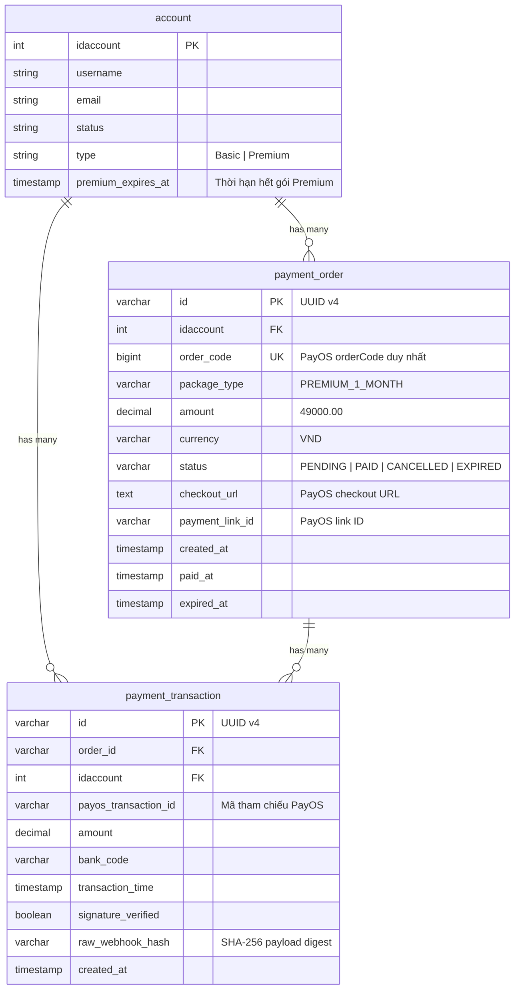

# ĐẶC TẢ KỸ THUẬT & NGHIỆP VỤ MODULE THANH TOÁN (PAYOS) & VÒNG ĐỜI TÀI KHOẢN PREMIUM

> **Phiên bản:** 1.0.0 · **Ngày ban hành:** 2026-10-05  
> **Trạng thái:** Đã phê duyệt phương án kiến trúc (Phương án 1) · **Thẩm quyền:** Product Owner & Core Backend Team  
> **Phạm vi áp dụng:** `src/Backend` (Micro-module `payment`), CSDL PostgreSQL Supabase, Scheduler Daily Hygiene.

---

## 1. TỔNG QUAN & BỐI CẢNH NGHIỆP VỤ

### 1.1. Mục tiêu
Xây dựng module Payment tại Backend nhằm cung cấp điểm thanh toán tự động, an toàn và bảo mật cao cho người dùng cuối (User) nâng cấp từ tài khoản **Basic** lên **Premium**:
1. **Khởi tạo mặc định:** Mọi tài khoản khi đăng ký mới luôn mặc định là `Type = 'Basic'` và `premium_expires_at = NULL`.
2. **Chống sửa đổi trái phép:** Cấm tuyệt đối mọi API công khai hoặc quyền người dùng can thiệp trực tiếp vào trường `Type` hay `premium_expires_at` trong CSDL.
3. **Thanh toán qua PayOS:** Người dùng tạo đơn hàng mua gói dịch vụ Premium (mặc định 49,000 VNĐ / 30 ngày) $\rightarrow$ Hệ thống sinh mã `orderCode` duy nhất gắn chặt với `idaccount` của người dùng và gọi PayOS tạo liên kết thanh toán VietQR / Ngân hàng.
4. **Xác thực Webhook PayOS & Kích hoạt đúng người:** Server Backend nhận webhook từ PayOS, thẩm tra chữ ký số HMAC-SHA256 bằng `Checksum Key`, đối soát `orderCode` và số tiền `amount`. Khi hợp lệ, kích hoạt nâng cấp gói `Premium` trong 1 DB Transaction nguyên tử.
5. **Cơ chế cộng dồn thời hạn (Stacking):** Nếu người dùng đang là Premium và còn hạn mà tiếp tục mua gói mới, hệ thống tự động cộng dồn 30 ngày vào mốc hết hạn hiện tại (`premium_expires_at = current_expires_at + 30 days`).
6. **Lập lịch tự động kiểm tra hết hạn (Scheduler):** Hàng ngày vào 00:00:00 (Giờ Việt Nam - UTC+7), scheduler kiểm tra:
   - Cảnh báo trước 3 ngày khi gói sắp hết hạn (qua Thông báo hệ thống và Email).
   - Tự động hạ cấp về `Basic` khi đã hết hạn, xóa cache xác thực và phát sự kiện thông báo thời gian thực qua Socket.IO.

---

## 2. NGUYÊN TẮC BẢO MẬT DỮ LIỆU & PHÁP LÝ (`Data_Security.md` & PCI-DSS)

Theo quy định tại `docs/Rule_Project/Data_Security.md`, Nghị định 13/2023/NĐ-CP và chuẩn bảo mật thanh toán PCI-DSS:

1. **Nguyên tắc Tối thiểu hóa dữ liệu (Data Minimization):**
   - **Tuyệt đối KHÔNG thu thập hoặc lưu trữ:** Số thẻ tín dụng đầy đủ (PAN), ngày hết hạn thẻ, mã bí mật CVV/CVC, mật khẩu/tên đăng nhập Internet Banking.
   - Giao dịch thanh toán được ủy thác hoàn toàn qua hạ tầng trung gian thanh toán PayOS và Napas VietQR.
2. **Phân quyền cách ly người dùng (User-scoped Isolation):**
   - API tạo đơn thanh toán và tra cứu lịch sử bắt buộc xác thực qua JWT token (`authenticate`). Người dùng chỉ được phép xem đơn hàng thuộc sở hữu của chính mình (`idaccount = req.user.idaccount`).
3. **Bảo vệ Webhook & Chống giả mạo:**
   - Webhook của PayOS được thẩm tra bằng thuật toán chữ ký **HMAC-SHA256** với `PAYOS_CHECKSUM_KEY`. Mọi request không khớp chữ ký đều bị từ chối với HTTP 400.
   - Băm SHA-256 nội dung webhook (`raw_webhook_hash`) để phục vụ đối soát, không lưu dữ liệu nhạy cảm dạng plaintext.
4. **Idempotency (Chống xử lý lặp / Replay Attack):**
   - Webhook có thể được PayOS gửi lại nhiều lần (retry). Server phải kiểm tra trạng thái đơn hàng: Nếu đã ở trạng thái `PAID` thì lập tức trả về HTTP 200 OK và không cộng dồn thời hạn lần 2.

---

## 3. THIẾT KẾ CƠ SỞ DỮ LIỆU & QUY TRÌNH MIGRATION

Tuân thủ **Rule 10 (DB Guard)**: Toàn bộ DDL được viết vào tệp `database/15_create_payment_subscription.sql` để thực thi trên Supabase SQL Editor. Cấm chạy `prisma migrate dev` hay `db push`.

### 3.1. Sơ đồ Quan hệ Thực thể (ERD)



### 3.2. Script SQL DDL (`database/15_create_payment_subscription.sql`)

```sql
-- 1. Bổ sung cột premium_expires_at vào bảng account
ALTER TABLE "account" 
ADD COLUMN IF NOT EXISTS "premium_expires_at" TIMESTAMP(6) NULL;

-- 2. Tạo bảng payment_order (Đơn hàng thanh toán gói dịch vụ)
CREATE TABLE IF NOT EXISTS "payment_order" (
    "id" VARCHAR(36) NOT NULL,
    "idaccount" INTEGER NOT NULL,
    "order_code" BIGINT NOT NULL,
    "package_type" VARCHAR(30) NOT NULL DEFAULT 'PREMIUM_1_MONTH',
    "amount" DECIMAL(15, 2) NOT NULL DEFAULT 49000.00,
    "currency" VARCHAR(3) NOT NULL DEFAULT 'VND',
    "status" VARCHAR(20) NOT NULL DEFAULT 'PENDING',
    "checkout_url" TEXT NULL,
    "payment_link_id" VARCHAR(100) NULL,
    "created_at" TIMESTAMP(6) NOT NULL DEFAULT CURRENT_TIMESTAMP,
    "paid_at" TIMESTAMP(6) NULL,
    "expired_at" TIMESTAMP(6) NULL,
    CONSTRAINT "pk_payment_order" PRIMARY KEY ("id"),
    CONSTRAINT "uq_payment_order_code" UNIQUE ("order_code"),
    CONSTRAINT "fk_payment_order_account" FOREIGN KEY ("idaccount") 
        REFERENCES "account"("Idaccount") ON DELETE CASCADE ON UPDATE NO ACTION
);

-- 3. Tạo bảng payment_transaction (Nhật ký giao dịch đối soát Webhook)
CREATE TABLE IF NOT EXISTS "payment_transaction" (
    "id" VARCHAR(36) NOT NULL,
    "order_id" VARCHAR(36) NOT NULL,
    "idaccount" INTEGER NOT NULL,
    "payos_transaction_id" VARCHAR(100) NULL,
    "amount" DECIMAL(15, 2) NOT NULL,
    "bank_code" VARCHAR(50) NULL,
    "transaction_time" TIMESTAMP(6) NOT NULL DEFAULT CURRENT_TIMESTAMP,
    "signature_verified" BOOLEAN NOT NULL DEFAULT TRUE,
    "raw_webhook_hash" VARCHAR(256) NULL,
    "created_at" TIMESTAMP(6) NOT NULL DEFAULT CURRENT_TIMESTAMP,
    CONSTRAINT "pk_payment_transaction" PRIMARY KEY ("id"),
    CONSTRAINT "fk_payment_transaction_order" FOREIGN KEY ("order_id") 
        REFERENCES "payment_order"("id") ON DELETE CASCADE ON UPDATE NO ACTION,
    CONSTRAINT "fk_payment_transaction_account" FOREIGN KEY ("idaccount") 
        REFERENCES "account"("Idaccount") ON DELETE CASCADE ON UPDATE NO ACTION
);

-- 4. Tạo các chỉ mục tối ưu truy vấn
CREATE INDEX IF NOT EXISTS "idx_payment_order_account" ON "payment_order"("idaccount");
CREATE INDEX IF NOT EXISTS "idx_payment_order_status" ON "payment_order"("status");
CREATE INDEX IF NOT EXISTS "idx_payment_order_code" ON "payment_order"("order_code");
CREATE INDEX IF NOT EXISTS "idx_payment_transaction_order" ON "payment_transaction"("order_id");
CREATE INDEX IF NOT EXISTS "idx_payment_transaction_account" ON "payment_transaction"("idaccount");
CREATE INDEX IF NOT EXISTS "idx_account_premium_expires" ON "account"("premium_expires_at") WHERE "premium_expires_at" IS NOT NULL;
```

---

## 4. TÍCH HỢP CỔNG THANH TOÁN PAYOS

### 4.1. Cấu hình Biến Môi trường
Cần bổ sung các biến sau vào `.env`:
```env
PAYOS_CLIENT_ID=your_client_id
PAYOS_API_KEY=your_api_key
PAYOS_CHECKSUM_KEY=your_checksum_key
PAYOS_RETURN_URL=https://management-finance.app/payment/success
PAYOS_CANCEL_URL=https://management-finance.app/payment/cancel
PREMIUM_PRICE_VND=49000
```

### 4.2. Khởi tạo PayOS Client (`modules/payment/payos.client.js`)
Sử dụng thư viện chính thức `@payos/node`:
```javascript
const { PayOS } = require('@payos/node');
const config = require('../../config');

let payosInstance = null;

function getPayOSClient() {
  if (!payosInstance) {
    payosInstance = new PayOS({
      clientId: config.payos.clientId,
      apiKey: config.payos.apiKey,
      checksumKey: config.payos.checksumKey,
    });
  }
  return payosInstance;
}
```

### 4.3. Tạo Liên kết Thanh toán (Payment Link)
1. Sinh `orderCode`: Sử dụng số nguyên dương ngẫu nhiên kết hợp timestamp an toàn không vượt quá $2^{53}-1$ (JavaScript `Number.MAX_SAFE_INTEGER`).
2. Gửi request sang PayOS:
   - `orderCode`: số nguyên.
   - `amount`: `49000`.
   - `description`: Chuỗi không dấu, tối đa 25 ký tự (VD: `PFM Premium 1 Thang`).
   - `returnUrl`, `cancelUrl`.
3. Nhận về: `checkoutUrl`, `paymentLinkId`. Lưu vào `payment_order`.

### 4.4. Thẩm tra Webhook (HMAC-SHA256)
Khi nhận `POST /api/payment/webhook`:
```javascript
const webhookData = payOS.webhooks.verify(req.body);
```
- Nếu chữ ký sai: Ném lỗi `Invalid signature` $\rightarrow$ Trả về HTTP 400.
- Nếu chữ ký đúng: Tiếp tục giải nén `data` (`orderCode`, `amount`, `reference`, `transactionDateTime`).

---

## 5. ĐẶC TẢ CHI TIẾT CÁC API ENDPOINTS

### 5.1. `POST /api/payment/create-order`
- **Mô tả:** Tạo đơn hàng mua gói Premium và nhận link thanh toán VietQR PayOS.
- **Bảo mật:** Yêu cầu JWT Token (`authenticate`).
- **Request Body:**
  ```json
  {
    "packageType": "PREMIUM_1_MONTH"
  }
  ```
- **Xử lý:**
  1. Lấy `idaccount` từ `req.user.idaccount`.
  2. Tạo bản ghi `payment_order` với `status: 'PENDING'`.
  3. Gọi PayOS tạo checkout link.
  4. Trả về thông tin đơn hàng và `checkoutUrl`.
- **Response Success (HTTP 201):**
  ```json
  {
    "success": true,
    "statusCode": 201,
    "message": "Tạo đơn hàng thanh toán thành công",
    "data": {
      "orderId": "550e8400-e29b-41d4-a716-446655440000",
      "orderCode": 1728123456789,
      "amount": 49000,
      "currency": "VND",
      "packageType": "PREMIUM_1_MONTH",
      "checkoutUrl": "https://pay.payos.vn/web/...",
      "expiredAt": "2026-10-05T12:45:00.000Z"
    }
  }
  ```

### 5.2. `GET /api/payment/order-status/:orderCode`
- **Mô tả:** Kiểm tra trạng thái đơn hàng (phục vụ client polling khi cần).
- **Bảo mật:** Yêu cầu JWT Token (`authenticate`).
- **Response Success (HTTP 200):**
  ```json
  {
    "success": true,
    "statusCode": 200,
    "data": {
      "orderCode": 1728123456789,
      "status": "PAID",
      "paidAt": "2026-10-05T12:20:15.000Z"
    }
  }
  ```

### 5.3. `GET /api/payment/subscription-info`
- **Mô tả:** Lấy thông tin trạng thái gói cước hiện tại của người dùng.
- **Bảo mật:** Yêu cầu JWT Token (`authenticate`).
- **Response Success (HTTP 200):**
  ```json
  {
    "success": true,
    "statusCode": 200,
    "data": {
      "accountType": "Premium",
      "premiumExpiresAt": "2026-11-04T12:20:15.000Z",
      "daysRemaining": 30,
      "isExpired": false
    }
  }
  ```

### 5.4. `POST /api/payment/webhook`
- **Mô tả:** Endpoint tiếp nhận thông báo biến động thanh toán từ PayOS.
- **Bảo mật:** Thẩm tra chữ ký số HMAC-SHA256 với `PAYOS_CHECKSUM_KEY`. Không dùng JWT.
- **Request Body:** Payload chuẩn của PayOS gồm `code`, `desc`, `data`, `signature`.
- **Luồng xử lý:**
  1. Thẩm tra `signature` qua `payOS.webhooks.verify(req.body)`.
  2. Lấy `orderCode` và `amount` từ webhook data.
  3. Tìm `payment_order` theo `order_code`. Nếu không tìm thấy $\rightarrow$ Ghi log cảnh báo và trả HTTP 200 (tránh PayOS retry liên tục với đơn lạ).
  4. Nếu `payment_order.status === 'PAID'` $\rightarrow$ Trả về HTTP 200 ngay (Idempotency).
  5. So khớp `amount`: Nếu số tiền thanh toán thực tế khác số tiền đơn hàng $\rightarrow$ Ghi nhận lỗi và không kích hoạt.
  6. Thực thi Prisma `$transaction`:
     - Cập nhật `payment_order`: `status = 'PAID'`, `paid_at = now()`.
     - Tạo bản ghi `payment_transaction` lưu vết đối soát.
     - Tính toán ngày hết hạn mới:
       - Nếu tài khoản đang là Premium và `premium_expires_at > now`: `newExpiry = premium_expires_at + 30 days`.
       - Ngược lại: `newExpiry = now + 30 days`.
     - Cập nhật bảng `account`: `type = 'Premium'`, `premium_expires_at = newExpiry`.
  7. Xóa cache xác thực: `invalidateAccountCache(idaccount)`.
  8. Phát thông báo:
     - Gửi socket realtime `account.upgraded` qua Socket.IO.
     - Tạo thông báo trong `NotificationStore`.
     - Gửi email chúc mừng nâng cấp thành công.
  9. Phản hồi PayOS: HTTP 200 OK:
     ```json
     {
       "success": true,
       "message": "Webhook processed successfully"
     }
     ```

### 5.5. `GET /api/payment/history`
- **Mô tả:** Lấy danh sách lịch sử đơn hàng thanh toán của người dùng (có phân trang).
- **Bảo mật:** Yêu cầu JWT Token (`authenticate`).

---

## 6. CƠ CHẾ LẬP LỊCH TỰ ĐỘNG (SCHEDULER & NOTIFICATIONS)

Tích hợp trực tiếp vào hàm `runDailyHygieneRoutine` trong `src/Backend/core/scheduler.service.js` (chạy định kỳ lúc **00:00:00 UTC+7** mỗi đêm):

### 6.1. Tác vụ Cảnh báo Sắp Hết hạn (Trước 3 ngày)
- **Điều kiện:** `account.type = 'Premium'` và `account.premium_expires_at > now` và `premium_expires_at <= now + 3 days`.
- **Hành động:**
  - Tính số ngày còn lại (`daysRemaining = ceil((premium_expires_at - now) / 86400000)`).
  - Bắn sự kiện qua `eventBus.publish('payment.expiring_soon', { idaccount, daysRemaining })`.
  - Lưu bản ghi vào `NotificationStore` với tiêu đề: *"Gói Premium sắp hết hạn"* và gửi email nhắc nhở.

### 6.2. Tác vụ Tự động Chuyển về Basic khi Hết hạn
- **Điều kiện:** `account.type = 'Premium'` và `account.premium_expires_at <= now`.
- **Hành động:**
  - Cập nhật `account.type = 'Basic'`, `account.premium_expires_at = NULL`.
  - Gọi `invalidateAccountCache(idaccount)` để xóa cache bộ nhớ.
  - Bắn sự kiện `payment.expired` qua EventBus:
    - Gửi socket `emitToAccount(idaccount, 'account.downgraded', { type: 'Basic' })`.
    - Tạo thông báo trong `NotificationStore` báo cho người dùng tài khoản đã chuyển về Basic.
    - Gửi email thông báo gói cước đã kết thúc.

---

## 7. BỘ KỊCH BẢN KIỂM THỬ (TEST PLAN)

| STT | Tên ca kiểm thử | Mô tả kịch bản | Kết quả mong đợi |
|:---:|---|---|---|
| 1 | `Create Order Success` | User gửi yêu cầu mua gói Premium kèm JWT hợp lệ | Trả về 201, tạo bản ghi `payment_order` PENDING, có `checkoutUrl`. |
| 2 | `Create Order Unauthorized` | Gửi yêu cầu mua gói nhưng không kèm token JWT | Trả về 401 Unauthorized. |
| 3 | `Webhook Valid Signature` | PayOS gửi webhook với chữ ký HMAC-SHA256 chuẩn | Trả về 200, cập nhật đơn `PAID`, `account.type = 'Premium'`, gia hạn 30 ngày. |
| 4 | `Webhook Invalid Signature` | Kẻ tấn công giả mạo webhook gửi sai chữ ký | Trả về 400 Bad Request, không thay đổi CSDL. |
| 5 | `Webhook Idempotency` | PayOS gửi lại webhook cho đơn hàng đã PAID | Trả về 200 OK ngay lập tức, không gia hạn thêm lần nữa. |
| 6 | `Stacking Expiry Date` | Tài khoản còn 10 ngày Premium tiếp tục mua gói 30 ngày | Ngày hết hạn mới = ngày hết hạn cũ + 30 ngày. |
| 7 | `Scheduler Warning 3 Days` | Tài khoản còn 2 ngày hết hạn chạy Daily Task | Phát thông báo và gửi email cảnh báo trước 3 ngày. |
| 8 | `Scheduler Downgrade Basic` | Tài khoản có `premium_expires_at <= now` chạy Daily Task | Chuyển `type` về `Basic`, xóa `premium_expires_at`, phát socket hạ cấp. |
