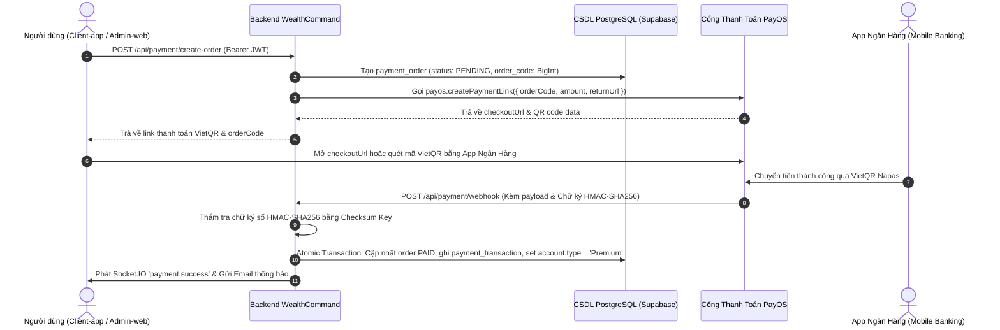

# HƯỚNG DẪN CẤU HÌNH, THIẾT LẬP CỔNG THANH TOÁN PAYOS & LIÊN KẾT BACKEND

> **Hệ thống:** WealthCommand - Quản Lý Tài Chính Cá Nhân  
> **Module:** Payment (`src/Backend/modules/payment`)  
> **Phiên bản:** 1.0.0 · **Ngày cập nhật:** 2026-10-05  
> **Tuân thủ:** Chuẩn an toàn bảo mật `docs/Rule_Project/Data_Security.md` & Nghị định 13/2023/NĐ-CP

---

## 📌 MỤC LỤC
1. [Tổng Quan & Kiến Trúc Liên Kết](#1-tổng-quan--kiến-trúc-liên-kết)
2. [Bước 1: Đăng Ký Tài Khoản & Tạo Kênh Thanh Toán Trên PayOS](#bước-1-đăng-ký-tài-khoản--tạo-kênh-thanh-toán-trên-payos)
3. [Bước 2: Lấy Bộ Khóa Bảo Mật (API Credentials)](#bước-2-lấy-bộ-khóa-bảo-mật-api-credentials)
4. [Bước 3: Cấu Hình Vào Tệp `.env` Của Backend](#bước-3-cấu-hình-vào-tệp-env-của-backend)
5. [Bước 4: Thiết Lập Webhook URL Trên PayOS Dashboard](#bước-4-thiết-lập-webhook-url-trên-payos-dashboard)
6. [Bước 5: Kiểm Tra Kết Nối Tự Động (Diagnostic Test)](#bước-5-kiểm-tra-kết-nối-tự-động-diagnostic-test)
7. [Bước 6: Kịch Bản Kiểm Thử Thanh Toán Thực Tế (End-to-End)](#bước-6-kịch-bản-kiểm-thử-thanh-toán-thực-tế-end-to-end)
8. [Xử Lý Sự Cố Thường Gặp (Troubleshooting)](#xử-lý-sự-cố-thường-gặp-troubleshooting)

---

## 1. TỔNG QUAN & KIẾN TRÚC LIÊN KẾT

PayOS là cổng thanh toán tự động hóa chuyển khoản qua mã **VietQR** (liên kết hệ thống Napas và các ngân hàng lớn tại Việt Nam như MB Bank, VietinBank, TPBank...).

### Sơ đồ Luồng Tích Hợp (End-to-End Payment Flow)



---

## BƯỚC 1: ĐĂNG KÝ TÀI KHOẢN & TẠO KÊNH THANH TOÁN TRÊN PAYOS

1. **Truy cập Cổng Quản Trị PayOS:**
   - Mở trình duyệt và truy cập: [https://my.payos.vn](https://my.payos.vn).
   - Đăng nhập bằng tài khoản **Google** của bạn.

2. **Tạo Kênh Thanh Toán (Payment Channel):**
   - Tại menu bên trái, chọn **Kênh thanh toán** $\rightarrow$ Bấm nút **+ Tạo kênh thanh toán mới**.
   - **Tên kênh thanh toán:** Nhập tên dự án (Ví dụ: `WealthCommand Payment` hoặc `FlowMoney`).
   - **Chọn chế độ tài khoản:**
     - **Chế độ Thử nghiệm (Test / Sandbox):** PayOS sẽ cấp tài khoản ảo để bạn kiểm thử luồng thanh toán mà không tốn tiền thật.
     - **Chế độ Thật (Production / Real):** Liên kết tài khoản ngân hàng của bạn (MB Bank, VietinBank, TPBank, v.v.). Tiền khách hàng chuyển sẽ về thẳng tài khoản ngân hàng của bạn.
   - Nhấn **Xác nhận & Hoàn tất**.

---

## BƯỚC 2: LẤY BỘ KHÓA BẢO MẬT (API CREDENTIALS)

Sau khi tạo kênh thanh toán, bạn nhấp vào chi tiết Kênh thanh toán vừa tạo:

1. Cuộn xuống phần **Thông tin tích hợp**:
   - 📋 **Client ID:** Dạng chuỗi UUID (Ví dụ: `983c27e0-496a-4d2b-bb48-xxxxxxxxxxxx`). Bấm nút Copy.
   - 📋 **API Key:** Dạng chuỗi bí mật (Ví dụ: `f6323a78-b19b-449a-xxxx-xxxxxxxxxxxx`). Bấm nút Copy.
   - 📋 **Checksum Key:** Chuỗi mã hóa 64 ký tự (dùng để sinh và thẩm tra chữ ký số HMAC-SHA256). Bấm biểu tượng 👁️ để hiển thị và copy.

> [!WARNING]
> **Checksum Key** là chìa khóa tối mật! Tuyệt đối không chia sẻ mã này ra bên ngoài và không đưa lên kho lưu trữ Git công khai.

---

## BƯỚC 3: CẤU HÌNH VÀO TỆP `.env` CỦA BACKEND

Mở tệp [`src/Backend/.env`](file:///d:/Tai_Lieu_IUH/Tailieu_Nam5_HK1/DoAnTotNghiep/Personal_Finance_Management/src/Backend/.env) và dán 3 thông số vừa lấy vào mục `11. CỔNG THANH TOÁN PAYOS`:

```env
# ========================================================
# 11. CỔNG THANH TOÁN PAYOS (VIETQR / NGÂN HÀNG)
# ========================================================
# Lấy thông tin tại: https://my.payos.vn -> Kênh thanh toán -> Thông tin tích hợp
PAYOS_CLIENT_ID=dán_Client_ID_vào_đây
PAYOS_API_KEY=dán_API_Key_vào_đây
PAYOS_CHECKSUM_KEY=dán_Checksum_Key_vào_đây

# Đường dẫn chuyển hướng sau khi thanh toán thành công hoặc hủy trên trình duyệt
PAYOS_RETURN_URL=https://managementfinance-admin.vercel.app/payment/success
PAYOS_CANCEL_URL=https://managementfinance-admin.vercel.app/payment/cancel

# Giá gói dịch vụ Premium (VNĐ) và thời hạn mặc định (ngày)
PREMIUM_PRICE_VND=49000
PREMIUM_PACKAGE_DAYS=30
```

Lưu tệp `.env`.

---

## BƯỚC 4: THIẾT LẬP WEBHOOK URL TRÊN PAYOS DASHBOARD

PayOS cần biết địa chỉ API Backend của bạn để tự động gửi thông báo (Webhook) khi khách hàng chuyển khoản thành công.

Endpoint nhận Webhook của Backend là:
```http
POST /api/payment/webhook
```

### Trường hợp 1: Chạy thử nghiệm trên máy cá nhân (Localhost)
Khi bạn chạy Backend tại máy tính cá nhân (`http://localhost:10000`), PayOS trên Internet không thể gọi trực tiếp tới `localhost`. Cần tạo một Public Tunnel:

1. **Sử dụng Ngrok (Khuyên dùng):**
   ```bash
   # Mở terminal mới và chạy:
   ngrok http 10000
   ```
   Bạn sẽ nhận được một địa chỉ Public URL dạng:  
   `https://a1b2-c3d4.ngrok-free.app`

2. **Địa chỉ Webhook Local:**
   ```
   https://a1b2-c3d4.ngrok-free.app/api/payment/webhook
   ```

### Trường hợp 2: Chạy trên Cloud Server Production (Render)
Nếu Backend của bạn đã được triển khai lên máy chủ Cloud (Render):
```
https://managementfinance.onrender.com/api/payment/webhook
```

### Thao tác cài đặt trên PayOS:
1. Vào [https://my.payos.vn](https://my.payos.vn) $\rightarrow$ Chọn Kênh thanh toán.
2. Tìm mục **Cấu hình Webhook** (Webhook Configuration).
3. Dán đường dẫn Webhook URL ở trên vào ô **Webhook URL**.
4. Bấm **Xác nhận / Lưu cài đặt**.
5. PayOS sẽ tự động gửi 1 request kiểm tra tới webhook của bạn. Nếu Backend trả về HTTP 200, PayOS sẽ hiển thị dấu tích xanh: **Webhook hoạt động bình thường**.

---

## BƯỚC 5: KIỂM TRA KẾT NỐI TỰ ĐỘNG (DIAGNOSTIC TEST)

Hệ thống đã tích hợp sẵn công cụ chẩn đoán kết nối PayOS tự động. Sau khi bạn đã điền key vào `.env`, hãy chạy lệnh sau trong thư mục `src/Backend`:

```bash
rtk npm run payos:test
```

### Kết quả mong đợi khi kết nối thành công:
```text
====================================================
   KIỂM TRA KẾT NỐI CỔNG THANH TOÁN PAYOS THẬT     
====================================================

✔ Đã tìm thấy cấu hình PayOS:
  - Client ID: 983c27e0...xxxx
  - API Key:   f6323a78...xxxx
  - Checksum:  b4c10321...xxxx

⏳ Đang gửi yêu cầu tạo liên kết thanh toán mẫu tới PayOS (orderCode: 179603120)...

🎉 KẾT NỐI TỚI PAYOS THÀNH CÔNG 100%!
----------------------------------------------------
- Mã đơn hàng (orderCode): 179603120
- Payment Link ID:         b5a8...
- Link thanh toán VietQR:  https://pay.payos.vn/web/...
----------------------------------------------------
👉 Bạn có thể mở link trên trong trình duyệt để xem trang thanh toán VietQR thật của PayOS!
```

---

## BƯỚC 6: KỊCH BẢN KIỂM THỬ THANH TOÁN THỰC TẾ (END-TO-END)

1. **Khởi động Backend:**
   ```bash
   rtk npm run dev
   ```
2. **Tạo đơn hàng nâng cấp Premium:**
   Gửi HTTP Request qua Postman / cURL hoặc từ Client Web:
   ```http
   POST http://localhost:10000/api/payment/create-order
   Authorization: Bearer <JWT_USER_TOKEN>
   Content-Type: application/json

   {
     "packageType": "PREMIUM_1_MONTH"
   }
   ```
   **Phản hồi nhận được:**
   ```json
   {
     "success": true,
     "message": "Tạo đơn hàng thanh toán nâng cấp Premium thành công",
     "data": {
       "orderId": "550e8400-e29b-41d4-a716-446655440000",
       "orderCode": 179603120,
       "amount": 49000,
       "checkoutUrl": "https://pay.payos.vn/web/..."
     }
   }
   ```

3. **Thực hiện quét mã chuyển khoản:**
   - Mở `checkoutUrl` trên trình duyệt $\rightarrow$ Màn hình hiển thị mã VietQR kèm số tài khoản và đúng nội dung chuyển khoản.
   - Nếu ở chế độ **Thử nghiệm (Sandbox)**: Bấm nút "Giả lập thanh toán thành công" trên trang PayOS Sandbox.
   - Nếu ở chế độ **Thật (Production)**: Dùng app ngân hàng quét mã và thanh toán thật.

4. **Kiểm tra kết quả tự động:**
   - Quan sát Terminal Backend:
     ```text
     2026-10-05 [INFO] [PAYMENT_WEBHOOK] Nhận dữ liệu webhook từ PayOS {"orderCode":179603120}
     2026-10-05 [INFO] [PAYMENT_WEBHOOK] Chữ ký hợp lệ. Bắt đầu kích hoạt gói Premium...
     2026-10-05 [INFO] [PAYMENT_WEBHOOK] Kích hoạt Premium thành công cho tài khoản {"idaccount":18,"newExpiresAt":"2026-11-04T..."}
     ```
   - Kiểm tra CSDL Supabase thật: Cột `account.type` tự động đổi thành `'Premium'` và `account.premium_expires_at` được gia hạn chính xác +30 ngày.

---

## 🛠 XỬ LÝ SỰ CỐ THƯỜNG GẶP (TROUBLESHOOTING)

| Hiện tượng | Nguyên nhân | Cách khắc phục |
|---|---|---|
| **PayOS báo lỗi `Invalid signature`** | `PAYOS_CHECKSUM_KEY` trong `.env` không trùng khớp với Checksum Key trên PayOS Dashboard | Copy lại chính xác Checksum Key từ PayOS Dashboard vào `.env` và khởi động lại Backend. |
| **Không nhận được Webhook khi thanh toán** | Chưa cấu hình Webhook URL trên PayOS hoặc Ngrok bị đổi địa chỉ khi khởi động lại | Kiểm tra ô Webhook URL trên PayOS Dashboard; nếu dùng Ngrok, hãy cập nhật lại địa chỉ mới. |
| **Lỗi `OrderCode already exists`** | Mã `orderCode` bị trùng lặp | Thuật toán trong `payos.client.js` đã tự sinh `Date.now() + random` đảm bảo duy nhất. Đơn hàng mới sẽ tự có orderCode mới. |
| **Người dùng thanh toán 2 lần liên tiếp** | Client bấm thanh toán nhiều lần | Module Payment đã kích hoạt cơ chế **Stacking** (Cộng dồn thời hạn): Tài khoản sẽ được cộng thêm 30 ngày cho mỗi lần thanh toán thành công, hoàn toàn không bị mất ngày sử dụng. |
