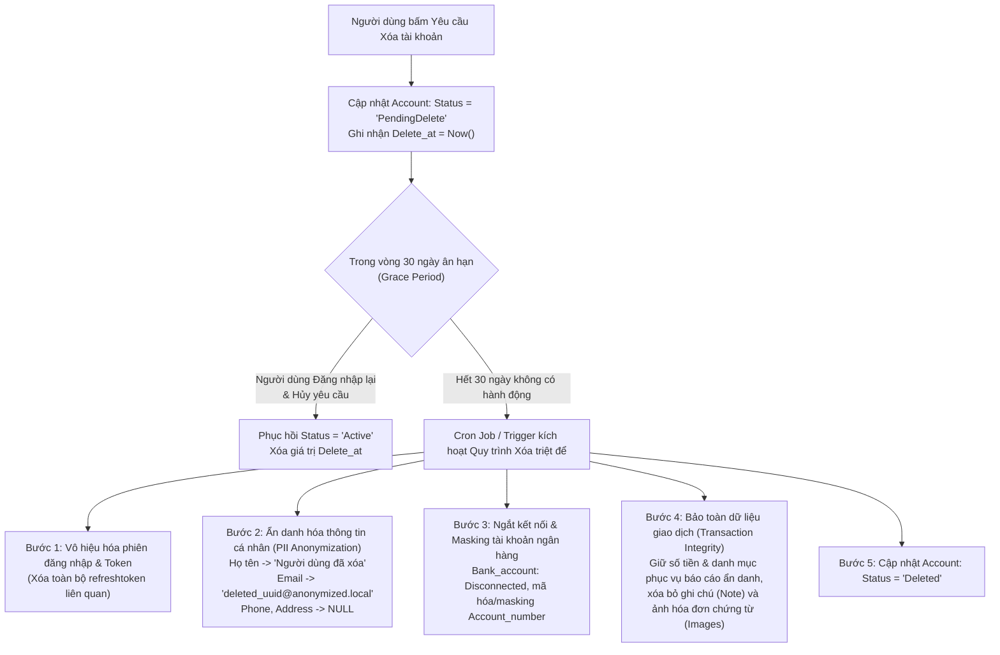

# 🛡️ NGUYÊN TẮC BẢO MẬT DỮ LIỆU & PHÂN LOẠI DỮ LIỆU NHẠY CẢM — MANAGEMENTFINANCE

> **Source of Truth** về danh mục dữ liệu nhạy cảm, cấp độ bảo mật, phạm vi thu thập, chia sẻ và các nguyên tắc kỹ thuật an toàn thông tin áp dụng cho toàn bộ hệ thống **ManagementFinance**.
>
> *Ngày cập nhật:* 2026-09-10  
> *Phạm vi áp dụng:* Toàn bộ dự án (`src/Backend`, `src/Admin-web`, `src/Client-app`).  
> *Căn cứ pháp lý & tiêu chuẩn:* Nghị định 13/2023/NĐ-CP về bảo vệ dữ liệu cá nhân, chuẩn bảo mật dữ liệu thẻ PCI-DSS, khuyến nghị bảo mật OWASP.

---

## 1. Dữ Liệu Nhạy Cảm Của Người Dùng Chung Trong Tài Chính

Bảng phân loại chi tiết các nhóm dữ liệu người dùng, mức độ nhạy cảm và nguyên tắc kỹ thuật xử lý/bảo mật tương ứng:

| STT | Nhóm dữ liệu | Dữ liệu cụ thể | Mức độ nhạy cảm | Ghi chú xử lý / bảo mật |
|:---:|---|---|:---:|---|
| **1** | Thông tin xác thực & bảo mật | Mật khẩu, mã PIN, OTP, mã khôi phục | **Rất cao** | Hash mật khẩu bằng Argon2id / bcrypt; không lưu OTP lâu dài; không ghi log |
| **2** | Thông tin xác thực & bảo mật | Token đăng nhập, refresh token, khóa 2FA | **Rất cao** | Mã hóa, lưu server-side, xoay vòng, thu hồi khi cần |
| **3** | Thông tin xác thực & bảo mật | Câu hỏi bảo mật, secret key | **Rất cao** | Không lưu dạng plaintext; dùng KMS/HSM nếu có |
| **4** | Thông tin định danh cá nhân | Họ tên, ngày sinh, giới tính | **Cao** | Mã hóa khi lưu trữ; hạn chế truy cập |
| **5** | Thông tin định danh cá nhân | Số CMND/CCCD, hộ chiếu, mã số thuế, số BHXH | **Rất cao** | Mã hóa at-rest; audit log mọi truy cập |
| **6** | Thông tin định danh cá nhân | Địa chỉ, số điện thoại, email | **Cao** | Che một phần khi hiển thị; có sự đồng ý khi chia sẻ |
| **7** | Thông tin định danh cá nhân | Ảnh chân dung, chữ ký (nếu có) | **Rất cao** | Lưu trữ riêng, mã hóa; không public URL |
| **8** | Thông tin tài chính – ngân hàng | Số tài khoản, số thẻ, CVV, ngày hết hạn thẻ | **Rất cao** | Không lưu CVV; token hóa số thẻ; tuân thủ PCI-DSS nếu có |
| **9** | Thông tin tài chính – ngân hàng | Số dư, hạn mức tín dụng, thu nhập, tài sản, khoản nợ | **Rất cao** | Mã hóa; phân quyền theo `userId`; không log chi tiết |
| **10** | Thông tin tài chính – ngân hàng | Lịch sử tín dụng, điểm tín dụng | **Rất cao** | Chỉ lưu khi có đồng ý; mã hóa; hạn chế chia sẻ |
| **11** | Thông tin tài chính – ngân hàng | Thông tin ví điện tử, tài khoản đầu tư | **Rất cao** | Token hóa; mã hóa; kiểm soát truy cập chặt |
| **12** | Dữ liệu giao dịch | Lịch sử thu/chi, số tiền, thời gian, địa điểm | **Rất cao** | Mã hóa at-rest/in-transit; audit log |
| **13** | Dữ liệu giao dịch | Người nhận/người gửi, nội dung giao dịch, phương thức thanh toán | **Rất cao** | Ẩn danh khi thống kê; không chia sẻ bên thứ ba |
| **14** | Dữ liệu giao dịch | Hóa đơn, biên lai, danh mục chi tiêu | **Cao** | Lưu trữ an toàn; có thể mã hóa tệp đính kèm |
| **15** | Dữ liệu hành vi & thói quen | Thói quen chi tiêu, ngân sách, mục tiêu tiết kiệm | **Cao** | Dùng cho cá nhân hóa; có opt-in; không bán dữ liệu |
| **16** | Dữ liệu hành vi & thói quen | Tần suất giao dịch, sản phẩm/dịch vụ quan tâm | **Cao** | Ẩn danh hóa khi phân tích tổng hợp |
| **17** | Dữ liệu hành vi & thói quen | Lịch sử tìm kiếm, phản hồi, đánh giá | **Trung bình – Cao** | Có thể xóa theo yêu cầu; hạn chế lưu lâu dài |
| **18** | Dữ liệu thiết bị & phiên | Địa chỉ IP, device ID, vị trí | **Trung bình – Cao** | Chỉ thu thập khi cần; mã hóa; thông báo rõ trong chính sách |
| **19** | Dữ liệu thiết bị & phiên | Log đăng nhập, cookies, dấu vân tay thiết bị | **Cao** | Bảo vệ chống chiếm đoạt tài khoản; có thời hạn lưu |
| **20** | Dữ liệu thiết bị & phiên | Lịch sử hoạt động trên hệ thống | **Trung bình** | Dùng cho audit; không tiết lộ cho người dùng khác |
| **21** | Dữ liệu sinh trắc học | Vân tay, khuôn mặt, giọng nói (nếu dùng để xác thực) | **Rất cao** | Ưu tiên xử lý cục bộ trên thiết bị; không lưu server nếu không cần |
| **22** | Dữ liệu suy diễn / derived | Điểm rủi ro, xếp hạng tín dụng, phân khúc khách hàng | **Cao** | Minh bạch cách tính; không gây phân biệt đối xử |
| **23** | Dữ liệu suy diễn / derived | Dự đoán hành vi, đề xuất tài chính cá nhân hóa | **Cao** | Có thể tắt; giải thích lý do đề xuất; bảo vệ dữ liệu đầu vào |

---

## 2. Những Dữ Liệu Nào Là Dữ Liệu Nhạy Cảm Của Khách Hàng

Theo **Nghị định 13/2023/NĐ-CP**, dữ liệu cá nhân nhạy cảm là dữ liệu gắn liền với quyền riêng tư, khi bị xâm phạm sẽ ảnh hưởng trực tiếp đến quyền và lợi ích hợp pháp của cá nhân. Trong lĩnh vực tài chính cá nhân, bao gồm:

| Nhóm dữ liệu | Ví dụ cụ thể |
|---|---|
| **Dữ liệu tài chính cốt lõi** | Số tài khoản ngân hàng, số dư, lịch sử giao dịch, thu nhập, tài sản, khoản nợ |
| **Dữ liệu định danh** | Số CMND/CCCD, số hộ chiếu, mã số thuế cá nhân, số bảo hiểm xã hội |
| **Dữ liệu sinh trắc học** | Ảnh khuôn mặt, vân tay (nếu dùng để xác thực) |
| **Dữ liệu hành vi** | Lịch sử chi tiêu, thói quen mua sắm, vị trí giao dịch |
| **Dữ liệu quan hệ** | Thông tin về mối quan hệ gia đình, người thụ hưởng |

> [!NOTE]
> **Lưu ý:** Ngay cả thông tin như *"số tài khoản số của cá nhân"* cũng được xếp vào dữ liệu cá nhân cơ bản theo Nghị định 13, nhưng khi kết hợp với lịch sử giao dịch và số dư, nó trở thành **dữ liệu tài chính nhạy cảm** cần mức bảo vệ cao hơn.

---

## 3. Dữ Liệu Nào Là Công Khai Và Được Phép Quản Lý

Đây là những dữ liệu không gắn liền với cá nhân cụ thể hoặc đã được ẩn danh hóa hoàn toàn:

* **Tỷ giá ngoại tệ, lãi suất ngân hàng công bố**.
* **Danh mục chi tiêu chuẩn** (ví dụ: Ăn uống, Di chuyển, Giải trí) — không gắn với bất kỳ người dùng nào.
* **Biểu phí dịch vụ** của hệ thống (nếu có thu phí).
* **Hướng dẫn sử dụng, chính sách bảo mật, điều khoản dịch vụ**.
* **Dữ liệu thống kê tổng hợp đã ẩn danh** (ví dụ: *"Người dùng trung bình chi 30% thu nhập cho Ăn uống"*) — chỉ được dùng nếu không thể tái nhận dạng cá nhân.

> [!IMPORTANT]
> **Nguyên tắc:** Bất kỳ dữ liệu nào có thể kết hợp để nhận dạng một cá nhân cụ thể đều **không được coi là công khai**, dù ban đầu trông vô hại.

---

## 4. Dữ Liệu Nào Được Phép Thu Thập Từ Khách Hàng & Đưa Lên Server

Hệ thống chỉ được thu thập dữ liệu khi có **sự đồng ý rõ ràng** của người dùng và vì **mục đích cụ thể**.

### ✅ Được phép thu thập (khi có sự đồng ý):
* **Thông tin tài khoản cơ bản:** Email, tên hiển thị, mật khẩu (đã được hash an toàn).
* **Dữ liệu giao dịch do người dùng tự nhập:** Số tiền, ngày thực hiện, danh mục, ghi chú.
* **Số dư tài khoản do người dùng tự khai báo:** Số dư ví thủ công (không kết nối trực tiếp tài khoản ngân hàng).
* **Cài đặt cá nhân:** Đơn vị tiền tệ, ngân sách định mức, mục tiêu tiết kiệm.
* **Dữ liệu ẩn danh cho mục đích cải thiện hệ thống:** Chỉ thu thập khi có cơ chế opt-in rõ ràng từ người dùng.

### ❌ Không nên thu thập (trừ khi thực sự cần & có biện pháp bảo vệ đặc biệt):
* **Thông tin đăng nhập ngân hàng:** Tên đăng nhập (username) / mật khẩu (password) internet banking.
* **Số thẻ tín dụng đầy đủ:** Số thẻ + mã CVV/CVC + ngày hết hạn thẻ.
* **Dữ liệu vị trí GPS liên tục**.
* **Danh bạ điện thoại, tin nhắn SMS cá nhân** (ngoài phạm vi các tin nhắn biến động số dư được người dùng cho phép xử lý cục bộ trên máy).
* **Dữ liệu sinh trắc học:** Tuyệt đối không đẩy lên server (chỉ xử lý xác thực cục bộ trên thiết bị qua Local Authentication / Biometrics API).

> [!CAUTION]
> **Nguyên tắc vàng — Data Minimization (Tối thiểu hóa dữ liệu):** Chỉ thu thập những gì thực sự cần thiết cho chức năng cốt lõi. Nếu không có dữ liệu đó mà hệ thống vẫn vận hành bình thường, **tuyệt đối không thu thập**.

---

## 5. Dữ Liệu Nào Server Cung Cấp Công Khai Và Mặc Định

Đây là dữ liệu server chủ động trả về cho mọi người dùng (hoặc người dùng chưa đăng nhập) mà hoàn toàn không tiết lộ thông tin cá nhân:

* **Cấu hình hệ thống mặc định:** Đơn vị tiền tệ mặc định (`VND`), định dạng ngày tháng hiển thị, ngôn ngữ giao diện.
* **Danh mục mặc định:** Danh sách các loại chi tiêu / thu nhập gợi ý sẵn do hệ thống định nghĩa (`Ăn uống`, `Di chuyển`, `Lương`, `Thưởng`...).
* **Dữ liệu tham chiếu:** Tỷ giá ngoại tệ, lãi suất ngân hàng tham khảo (nếu tích hợp API công khai bên ngoài).
* **Thông báo hệ thống:** Thông tin bảo trì, nâng cấp phiên bản, điều khoản và chính sách mới.
* **Tài liệu API công khai** (nếu có cung cấp cho nhà phát triển bên ngoài).
* **Dữ liệu tổng hợp ẩn danh:** Chỉ cung cấp khi đã đảm bảo hoàn toàn không thể đảo ngược hoặc tái nhận dạng cá nhân.

> [!WARNING]
> **Tuyệt đối không trả về:** Danh sách người dùng, email, số điện thoại, số dư, lịch sử giao dịch của bất kỳ ai qua các endpoint công khai (public endpoints).

---

## 6. Dữ Liệu Nào Đặc Thù Riêng & Cần Bảo Mật Cho Hệ Thống

Đây là những dữ liệu chỉ tồn tại bên trong hệ thống, mang tính độc quyền, sống còn và nếu rò rỉ sẽ gây thiệt hại trực tiếp cho người dùng cùng uy tín vận hành của toàn bộ hệ thống:

| Loại dữ liệu | Mức độ bảo mật cần thiết |
|---|---|
| **Khóa mã hóa (Encryption keys)** | **Tuyệt đối** — Dùng KMS/HSM hoặc Secret Manager an toàn; tuyệt đối không hardcode trong mã nguồn. |
| **Mật khẩu đã hash** | Dùng Argon2id hoặc bcrypt (work factor $\ge$ 12). |
| **JWT secret / Refresh token** | Lưu trữ trong biến môi trường an toàn; xoay vòng khóa định kỳ; hash token lưu trong DB. |
| **Dữ liệu giao dịch thô** | Mã hóa at-rest (AES-256) và mã hóa in-transit (TLS 1.3). |
| **Lịch sử đăng nhập, IP, thiết bị** | Bảo vệ nghiêm ngặt để chống chiếm đoạt tài khoản và điều tra gian lận. |
| **Audit log** | Ghi nhận mọi truy cập vào dữ liệu nhạy cảm; đảm bảo tính toàn vẹn (Append-only, không thể chỉnh sửa hoặc xóa). |
| **Dữ liệu sao lưu (Backup)** | Mã hóa toàn bộ tệp sao lưu, lưu trữ tách biệt môi trường chính và kiểm soát truy cập nghiêm ngặt. |

### 🔒 Biện Pháp Bảo Vệ Khuyến Nghị Áp Dụng:
1. **Mã hóa End-to-End (E2EE):** Áp dụng cho dữ liệu tài chính nếu có thể giữa client và backend.
2. **Xác thực hai yếu tố (2FA):** Bắt buộc hoặc khuyến khích tối đa cho mọi tài khoản người dùng và quản trị viên.
3. **Rate Limiting:** Thiết lập giới hạn tần suất gọi API nghiêm ngặt để chống brute-force mật khẩu, OTP và token.
4. **Phân quyền theo người dùng (User-scoped Isolation):** Mọi truy vấn đọc/ghi dữ liệu vào database bắt buộc phải lọc theo `userId` (hoặc `idaccount`) từ JWT token đã xác thực; cấm dùng query không kèm ràng buộc người sở hữu.
5. **Tuân thủ chuẩn bảo mật thẻ (PCI-DSS):** Không lưu trữ thông tin thẻ ngân hàng nếu không thực sự cần thiết; nếu cần thanh toán trực tuyến, bắt buộc sử dụng cổng thanh toán đối tác đã đạt chuẩn PCI-DSS (Stripe, VNPay, MoMo...).
6. **Ghi log & Giám sát liên tục:** Ghi nhận audit log và theo dõi mọi hành vi truy cập bất thường để kịp thời ngăn chặn tấn công hoặc rò rỉ dữ liệu.

---

## 7. Khung Pháp Lý Bắt Buộc Áp Dụng Cho Dự Án

Hệ thống **ManagementFinance** bắt buộc tuân thủ 100% các văn bản quy phạm pháp luật của Nhà nước Việt Nam và các chuẩn mực an toàn thông tin quốc tế sau đây:

### 7.1. Nghị định số 13/2023/NĐ-CP — Bảo vệ dữ liệu cá nhân (PDPD)
* **Quyền của chủ thể dữ liệu (Điều 9):**
  * **Quyền được biết & đồng ý:** Người dùng phải được thông báo rõ ràng về loại dữ liệu thu thập, mục đích xử lý trước khi bấm đăng ký.
  * **Quyền rút lại sự đồng ý & Quyền yêu cầu xóa dữ liệu ("Right to be forgotten"):** Người dùng có quyền yêu cầu xóa toàn bộ thông tin cá nhân khỏi hệ thống.
  * **Quyền hạn chế xử lý dữ liệu:** Người dùng có quyền tạm khóa dữ liệu (trạng thái `PendingDelete`).
* **Nguyên tắc xử lý dữ liệu cá nhân nhạy cảm (Điều 13, Điều 26, Điều 27):**
  * Thông tin tài khoản ngân hàng, biến động số dư và thói quen tài chính được định danh là **dữ liệu cá nhân nhạy cảm**.
  * Bắt buộc phải áp dụng các biện pháp kỹ thuật: **Mã hóa khi lưu trữ (at-rest)**, **Mã hóa khi truyền tải (in-transit)**, **Kiểm soát truy cập nghiêm ngặt (Access Control)** và **Ghi nhật ký xử lý (Audit Logging)**.
* **Chế tài xử phạt:** Vi phạm quy định về bảo vệ dữ liệu cá nhân có thể bị xử phạt hành chính đến 5% tổng doanh thu hoặc xử lý hình sự theo Điều 288 Bộ luật Hình sự.

### 7.2. Nghị định số 53/2022/NĐ-CP & Luật An ninh mạng 2018
* **Lưu trữ dữ liệu tại Việt Nam (Điều 26):** Dữ liệu về thông tin cá nhân người sử dụng dịch vụ tại Việt Nam, dữ liệu do người sử dụng dịch vụ tại Việt Nam tạo ra (tài khoản, thời gian sử dụng, thông tin thẻ tín dụng, địa chỉ IP, nhật ký truy cập) phải được lưu trữ trên máy chủ đặt tại lãnh thổ Việt Nam.
* **Thời hạn lưu trữ nhật ký hệ thống:** Nhật ký hoạt động, nhật ký hệ thống, nhật ký kiểm toán (`Audit_log`) bắt buộc phải được lưu trữ **tối thiểu 12 tháng** để phục vụ công tác thanh tra, điều tra an ninh thông tin khi có yêu cầu từ cơ quan có thẩm quyền.

### 7.3. Luật Kế toán 2015 (Luật số 88/2015/QH13) & Nghị định 174/2016/NĐ-CP
* **Thời hạn lưu trữ chứng từ kế toán, dữ liệu tài chính:**
  * **Tối thiểu 5 năm:** Đối với tài liệu kế toán dùng cho quản lý, điều hành nội bộ của đơn vị (chứng từ giao dịch thu/chi thông thường, hóa đơn phát sinh thường nhật).
  * **Tối thiểu 10 năm:** Đối với chứng từ kế toán sử dụng trực tiếp để ghi sổ kế toán và lập báo cáo tài chính, báo cáo quyết toán.
* **Áp dụng cho ManagementFinance:** Bảng `transaction`, `bank_account`, `wallet`, `bill`, `budget` chứa các bản ghi lịch sử tài chính của người dùng phải được bảo toàn tính toàn vẹn và có chính sách lưu trữ tối thiểu 5 năm trước khi áp dụng quy trình ẩn danh hóa hoàn toàn hoặc thanh lọc.

### 7.4. Tiêu Chuẩn Quốc Tế PCI-DSS v4.0 & Khuyến Nghị OWASP Top 10
* **PCI-DSS (Payment Card Industry Data Security Standard):**
  * Yêu cầu 3: Bảo vệ dữ liệu chủ thẻ lưu trữ. Cấm tuyệt đối lưu trữ mã bảo mật CVV/CVC, mã PIN sau khi ủy quyền giao dịch.
  * Số tài khoản ngân hàng / số thẻ (PAN) phải được che bớt (masking) khi hiển thị (chỉ hiển thị 4 số cuối: `**** **** **** 1234`) và mã hóa AES-256 khi lưu trong CSDL.
* **OWASP Top 10:**
  * Phòng chống Cryptographic Failures: Mật khẩu băm bằng Argon2id hoặc bcrypt (cost $\ge$ 12); OTP và Refresh Token băm 1 chiều bằng SHA-256; dữ liệu nhạy cảm mã hóa AES-256-GCM với khóa mã hóa quản lý độc lập.

---

## 8. Quy Định Chi Tiết Về Thời Hạn Lưu Trữ Dữ Liệu (Data Retention Policy)

Bảng quy định thời hạn lưu trữ chi tiết cho từng nhóm dữ liệu và từng bảng CSDL trong hệ thống **ManagementFinance**:

| Nhóm dữ liệu | Bảng CSDL liên quan | Thời hạn lưu trữ tối thiểu | Thời hạn lưu trữ tối đa | Căn cứ pháp lý & Tiêu chuẩn | Xử lý khi hết hạn |
|---|---|---|---|---|---|
| **Xác thực tạm thời (OTP)** | `otp_code` | 10 phút (hiệu lực mã) | **24 giờ** kể từ khi tạo | OWASP Session & Storage Limitation (NĐ 13/2023 Điều 13) | **Purge tự động** (xóa vật lý khỏi CSDL) hàng ngày |
| **Phiên đăng nhập & Token** | `refreshtoken` | Theo thời hạn hiệu lực Token (7 - 30 ngày) | **30 ngày** sau khi hết hạn hoặc bị thu hồi (`Status = TRUE`) | OWASP Session Management & NĐ 53/2022 | **Purge tự động** bản ghi token hết hạn > 30 ngày |
| **Nhật ký kiểm toán (Audit)** | `auditlog` | **12 tháng** | **24 - 36 tháng** | Nghị định 53/2022/NĐ-CP (Điều 26) | Sau 12 tháng: Nén xuất kho lạnh (Cold Storage/Archive) hoặc xóa dữ liệu hết hạn điều tra |
| **Định danh & Tài khoản** | `account`, `User` | Trong suốt thời gian tài khoản hoạt động (`Active`) | Khi người dùng yêu cầu xóa: **30 ngày ân hạn (`PendingDelete`)** $\rightarrow$ Chuyển `Deleted` | Nghị định 13/2023/NĐ-CP (Điều 9 - Quyền xóa dữ liệu) | Sau 30 ngày: Ẩn danh hóa thông tin cá nhân (Email, Phone, Address, Họ tên) hoặc xóa mềm triệt để |
| **Giao dịch tài chính cốt lõi** | `transaction` | **5 năm** kể từ ngày phát sinh giao dịch | Vô thời hạn (hoặc theo yêu cầu người dùng) | Luật Kế toán 2015 (Điều 41) & Nghị định 174/2016/NĐ-CP | Sau 5 năm: Được phép nén lưu trữ ngoại tuyến (Cold Archive) hoặc ẩn danh hóa nếu tài khoản đã xóa |
| **Tài sản & Số dư** | `bank_account`, `wallet` | Trong suốt vòng đời tài khoản | Tối thiểu **5 năm** sau khi ví/liên kết bị xóa mềm | Luật Kế toán 2015 | Giữ bản ghi tham chiếu lịch sử giao dịch (không xóa vật lý làm hỏng toàn vẹn sổ cái) |
| **Kế hoạch & Định mức** | `budget`, `bill`, `goal` | Đến khi kết thúc chu kỳ ngân sách / hóa đơn / mục tiêu | Tối thiểu **3 - 5 năm** phục vụ báo cáo phân tích | Best Practice Quản lý Tài chính | Cho phép xóa mềm hoặc lưu trữ lịch sử báo cáo tổng hợp |
| **Cấu hình & Phân quyền** | `role`, `category` | Vĩnh viễn (danh mục mặc định hệ thống) | Theo vòng đời tài khoản (với danh mục custom) | Nguyên tắc vận hành hệ thống | Không xóa vật lý danh mục đã có giao dịch liên kết |

---

## 9. Quy Trình Kỹ Thuật Thanh Lọc & Hủy Dữ Liệu (Data Sanitization & Deletion Workflow)

Nhằm đảm bảo tính toàn vẹn tham chiếu (Referential Integrity) của cơ sở dữ liệu mà vẫn tuyệt đối tuân thủ quyền xóa dữ liệu của người dùng theo Nghị định 13/2023/NĐ-CP:

### 9.1. Quy tắc Ẩn danh hóa (Data Anonymization):
* **Không thể tái định danh:** Sau khi ẩn danh, mọi mối liên kết giữa dữ liệu tài chính lịch sử và danh tính đời thực của cá nhân phải bị cắt đứt hoàn toàn.
* **Xóa chứng từ nhạy cảm:** Mọi tệp ảnh biên lai, hóa đơn chứa hình ảnh (`transaction.images`) phải bị xóa vật lý khỏi Storage (S3/Cloudinary/Local disk).

### 9.2. Cơ chế Thanh lọc Định kỳ Tự động (Automated Scheduled Purge):
* Hệ thống phải có **Job định kỳ tự động chạy mỗi ngày (ví dụ 00:00 GMT+7)** để:
  1. Quét và xóa các bản ghi `otp_code` đã tạo quá 24 giờ.
  2. Quét và xóa các bản ghi `refreshtoken` đã hết hạn hoặc bị thu hồi quá 30 ngày.
  3. Quét các tài khoản `PendingDelete` đã quá 30 ngày để tiến hành quy trình ẩn danh hóa tự động.

---

## 10. Các Giải Pháp Kỹ Thuật Bảo Mật Đã Triển Khai Thực Tế

Hệ thống đã hoàn tất triển khai và kiểm thử 100% các biện pháp kỹ thuật bảo mật sau:

### 10.1. Cơ chế Bảo vệ 2 Đầu (Client/Backend + CSDL Trigger)
* **Xác thực và mã hóa cấp ứng dụng (Backend Application Layer):** Mọi trường PII (`User.phone`, `User.address`, `bank_account.account_number`) được mã hóa AES-256-GCM trước khi lưu vào CSDL.
* **Hàng rào thép cấp CSDL (PostgreSQL Trigger Layer):** 
  * Trigger `trg_check_phone_encrypted`: Chặn đứng lệnh INSERT/UPDATE nếu SĐT có dạng chuỗi số rõ.
  * Trigger `trg_check_bank_account_encrypted`: Chặn đứng lệnh INSERT/UPDATE nếu STK có dạng chuỗi số rõ.
  * Trigger `trg_protect_transaction` & `trg_protect_audit_log`: Chặn đứng lệnh `DELETE` vật lý dưới 5 năm đối với giao dịch và dưới 12 tháng đối với audit log.

### 10.2. Blind Indexing cho Tra Soát Ngân Hàng O(1)
* Bảng `bank_account` bổ sung cột `Account_number_hash` `VARCHAR(64)` có Index B-Tree.
* Sử dụng `HMAC-SHA256` với khóa bí mật `BLIND_INDEX_SECRET` để tạo hash xác định. Worker SePay/Casso tra cứu tài khoản nhận tiền trong thời gian thực $O(1)$ mà không cần giải mã toàn bộ bảng hay quét tuyến tính.

### 10.3. Che Mờ Dữ Liệu Tự Động (Data Masking)
* Bộ tiện ích `masking.util.js`:
  * Email: `ph***@gmail.com`
  * Phone: `098****321`
  * STK: `**** **** **** 1234`
  * Họ tên công cộng: `Nguyễn P. B.`
* Tích hợp tự động vào các API danh sách quản trị viên (`AdminService.getUsers`, `AdminService.getUserDetail`).

### 10.4. Kiểm Soát Nội Dung Không Được Chứa PII hay Xúc Phạm
* `Reason_Inactive` (Lý do khóa tài khoản): Tiện ích `content-filter.util.js` quét phát hiện SĐT, Email, CCCD, Thẻ ngân hàng, từ ngữ thô tục/xúc phạm. Nếu vi phạm, trả về lỗi `400 Bad Request`.
* `Note` (Ghi chú giao dịch/ngân sách/hóa đơn/mục tiêu): Tự động khử số thẻ tín dụng, mã CVV, mật khẩu trước khi mã hóa At-Rest AES-256-GCM.

### 10.5. Bảo Mật Biên Lai Chứng Từ (Pre-signed URL)
* Ảnh chứng từ (`transaction.images`) được lưu trong Private Bucket, không cấp quyền public truy cập trực tiếp.
* Khi cần xem ảnh, Backend sinh Pre-Signed URL có chữ ký HMAC-SHA256 với thời hạn ngắn (15 - 30 phút).

### 10.6. Làm Sạch Nhật Ký Hệ Thống (Logger Redaction)
* Winston Logger tích hợp format tự động phát hiện và che giấu các trường nhạy cảm (`balance`, `password`, `token`, `otp`, `code_hash`, `cvv`, `refreshtoken`).

