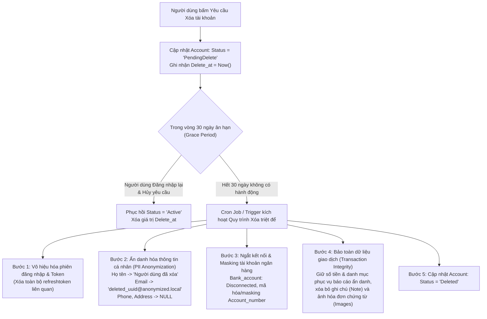

# 🛡️ NGUYÊN TẮC BẢO MẬT DỮ LIỆU & PHÂN LOẠI DỮ LIỆU NHẠY CẢM — MANAGEMENTFINANCE

> **Source of Truth** về danh mục dữ liệu nhạy cảm, cấp độ bảo mật, phạm vi thu thập, chia sẻ và các nguyên tắc kỹ thuật an toàn thông tin áp dụng cho toàn bộ hệ thống **ManagementFinance**.
>
> *Ngày cập nhật:* 2026-09-10  
> *Phạm vi áp dụng:* Toàn bộ dự án (`src/Backend`, `src/Admin-web`, `src/Client-app`).  
> *Căn cứ pháp lý & tiêu chuẩn:* Nghị định 13/2023/NĐ-CP về bảo vệ dữ liệu cá nhân, chuẩn bảo mật dữ liệu thẻ PCI-DSS, khuyến nghị bảo mật OWASP.

---
# Phân loại dữ liệu trong hệ thống tài chính
### (Theo Luật Bảo vệ dữ liệu cá nhân 2025 – Luật số 91/2025/QH15 – và các chuẩn quốc tế)

> **Cập nhật pháp lý quan trọng:** Việt Nam đã ban hành **Luật Bảo vệ dữ liệu cá nhân 2025 (Luật số 91/2025/QH15)**, Quốc hội thông qua ngày 26/6/2025, **có hiệu lực từ 01/01/2026**, thay thế cơ chế cũ chỉ dựa trên Nghị định 13/2023/NĐ-CP. Kèm theo là **Nghị định 356/2025/NĐ-CP** (31/12/2025) quy định chi tiết thi hành. Luật chia dữ liệu cá nhân thành 2 nhóm: **dữ liệu cá nhân cơ bản** và **dữ liệu cá nhân nhạy cảm**, đồng thời có **Điều 27** quy định riêng trách nhiệm của tổ chức hoạt động trong lĩnh vực tài chính, ngân hàng, thông tin tín dụng — trong đó nêu rõ **phần lớn dữ liệu khách hàng ngân hàng thuộc nhóm dữ liệu nhạy cảm**.
>
> Nếu hệ thống của bạn đang xây dựng chính sách dữ liệu, nên đối chiếu lại với văn bản luật gốc và Nghị định 356/2025/NĐ-CP vì đây là văn bản mới, các hướng dẫn chi tiết (thông tư chuyên ngành ngân hàng) có thể tiếp tục được ban hành thêm trong 2026.

---

## 1. Các chức năng & nhóm dữ liệu nhạy cảm phổ biến trong hệ thống tài chính

| Chức năng nghiệp vụ | Dữ liệu nhạy cảm liên quan |
|---|---|
| Định danh khách hàng (KYC/eKYC) | CCCD/CMND/hộ chiếu, ảnh chân dung, video xác thực sống (liveness), vân tay, khuôn mặt |
| Mở & quản lý tài khoản | Số tài khoản, số dư, lịch sử giao dịch, hạn mức |
| Thanh toán / ví điện tử | Số thẻ (PAN), CVV, mã OTP, token thanh toán, lịch sử giao dịch |
| Tín dụng / cho vay | Thu nhập, lịch sử tín dụng (CIC), tài sản đảm bảo, điểm tín dụng (credit score), hồ sơ vay |
| Đầu tư / chứng khoán | Danh mục đầu tư, giá trị tài sản ròng, lệnh giao dịch |
| Bảo hiểm | Tình trạng sức khỏe, bệnh sử, thông tin người thụ hưởng |
| Chống gian lận / AML-CFT | Thiết bị (device ID), IP, vị trí địa lý, hành vi giao dịch bất thường, danh sách đen |
| Chấm điểm tín dụng bằng AI | Dữ liệu hành vi, dữ liệu thay thế (alternative data), mô hình scoring |

---

## 2. Dữ liệu nhạy cảm theo quy định Việt Nam + chuẩn quốc tế

### Theo Luật Bảo vệ dữ liệu cá nhân 2025 (VN)
Dữ liệu cá nhân nhạy cảm là dữ liệu gắn liền với quyền riêng tư, khi bị xâm phạm sẽ ảnh hưởng trực tiếp tới quyền và lợi ích hợp pháp của chủ thể, bao gồm (nhóm chính thường được nêu):
- Dữ liệu về **sức khỏe, đời sống riêng tư, tôn giáo, tín ngưỡng, chủng tộc/dân tộc, quan điểm chính trị**
- **Dữ liệu sinh trắc học** (vân tay, khuôn mặt, giọng nói, mống mắt...)
- **Dữ liệu tài chính** — tài khoản ngân hàng, số dư, lịch sử giao dịch, **thông tin tín dụng** (đây là nhóm áp dụng trực tiếp cho ngành tài chính – ngân hàng, quy định riêng tại Điều 27)
- **Vị trí địa lý** của cá nhân
- Dữ liệu về **tội phạm, vi phạm pháp luật**
- Dữ liệu cá nhân **là bí mật nhà nước** — phải mã hóa/giải mã theo pháp luật về bảo vệ bí mật nhà nước và cơ yếu

Riêng với lĩnh vực tài chính – ngân hàng – thông tin tín dụng, Điều 27 quy định thêm:
- Không được dùng thông tin tín dụng để **chấm điểm/xếp hạng tín dụng** khi chưa có sự đồng ý của chủ thể dữ liệu
- Chỉ thu thập dữ liệu **cần thiết** cho hoạt động thông tin tín dụng, từ nguồn hợp pháp
- Phải **thông báo cho khách hàng** khi xảy ra sự cố lộ/mất dữ liệu tài khoản ngân hàng, tài chính, tín dụng
- Xử lý dữ liệu bằng AI phải **phân loại theo mức độ rủi ro**

*(Lưu ý: đây là tổng hợp từ các nguồn báo chí/pháp lý công bố về luật mới — nên đối chiếu với văn bản luật gốc Điều 2 và Nghị định 356/2025/NĐ-CP để có định nghĩa chính xác từng khoản khi áp dụng vào hệ thống thực tế.)*

### Theo chuẩn quốc tế (tham chiếu song song)

| Chuẩn / Quy định | Phạm vi | Dữ liệu coi là nhạy cảm |
|---|---|---|
| **GDPR (EU)** – Điều 9 | Bảo vệ dữ liệu cá nhân chung | Chủng tộc, dân tộc, tôn giáo, sức khỏe, xu hướng/đời sống tình dục, sinh trắc học, công đoàn, quan điểm chính trị |
| **PCI-DSS** | Dữ liệu thẻ thanh toán | Số thẻ đầy đủ (PAN), CVV/CVC, dữ liệu dải từ/chip, PIN |
| **GLBA (Mỹ)** | Tổ chức tài chính | "Nonpublic Personal Information" – thu nhập, số dư, lịch sử giao dịch, điểm tín dụng |
| **ISO/IEC 27701** | Hệ thống quản lý bảo mật thông tin cá nhân | PII nhạy cảm, gắn với ISO 27001 |
| **Basel / quy định NHNN** | Quản trị rủi ro ngân hàng | Dữ liệu định danh khách hàng, dữ liệu giao dịch, dữ liệu rủi ro tín dụng |

**Điểm chung VN + quốc tế:** dữ liệu tài chính – tín dụng – sinh trắc học – sức khỏe đều được xếp vào nhóm cần **bảo vệ đặc biệt**, đòi hỏi sự đồng ý rõ ràng, tách biệt, và biện pháp bảo mật cao hơn dữ liệu cơ bản.

---

## 3. Dữ liệu công khai và được phép quản lý tự do

Đây là dữ liệu không thuộc phạm vi bảo vệ nghiêm ngặt, có thể công bố/quản lý bình thường:

- Tên, mã số thuế, thông tin đăng ký kinh doanh của **pháp nhân/doanh nghiệp**
- Báo cáo tài chính đã công bố của công ty đại chúng/niêm yết
- Tỷ giá hối đoái, lãi suất huy động/cho vay đã công bố công khai
- Biểu phí dịch vụ, danh mục sản phẩm
- Địa chỉ chi nhánh, phòng giao dịch, ATM, giờ làm việc
- Mã ngân hàng (BIN), mã SWIFT/BIC
- Số tổng đài, kênh liên hệ chăm sóc khách hàng

---

## 4. Dữ liệu được phép thu thập từ khách hàng & gửi lên server

Điều kiện tiên quyết theo luật mới: phải có **sự đồng ý** rõ ràng, tách biệt (đặc biệt với dữ liệu nhạy cảm), thông báo mục đích – phạm vi – thời hạn lưu trữ, và **chỉ thu thập trong phạm vi cần thiết**.

Nhóm dữ liệu thường được phép thu thập khi có đồng ý hợp lệ:
- **Định danh cơ bản:** họ tên, ngày sinh, giới tính, quốc tịch, số CCCD/hộ chiếu (cần mã hóa khi lưu trữ/truyền tải)
- **Liên hệ:** số điện thoại, email, địa chỉ
- **Dữ liệu eKYC:** ảnh giấy tờ, ảnh chân dung, dữ liệu sinh trắc học phục vụ xác thực (cần đồng ý riêng, mục đích rõ ràng)
- **Dữ liệu giao dịch nghiệp vụ:** số tài khoản, lịch sử giao dịch phục vụ đúng mục đích đã thông báo
- **Dữ liệu thiết bị/phiên:** device ID, IP, user-agent — phục vụ bảo mật, chống gian lận
- **Dữ liệu tín dụng:** chỉ thu thập từ nguồn hợp pháp, phục vụ đúng mục đích thông tin tín dụng

---

## 5. Dữ liệu server cung cấp công khai & mặc định

Đây là dữ liệu hệ thống có thể trả về qua API công khai, không cần xác thực định danh cá nhân:

- Tỷ giá hối đoái tham khảo theo thời gian thực
- Lãi suất tiết kiệm/vay đã niêm yết
- Biểu phí dịch vụ
- Danh sách chi nhánh/ATM và trạng thái hoạt động
- Mã QR thanh toán công khai của điểm bán (merchant)
- Trạng thái vận hành hệ thống (uptime/maintenance)
- Danh mục sản phẩm/dịch vụ

---

## 6. Dữ liệu đặc thù riêng, cần bảo mật đặc biệt cho hệ thống

Nhóm này không chỉ nhạy cảm với khách hàng mà còn **quyết định an toàn của toàn hệ thống** — cần kiểm soát truy cập chặt nhất (mã hóa, HSM, phân quyền tối thiểu, audit log):

- **Khóa mã hóa / bí mật hệ thống:** encryption keys, HSM keys, API secrets, private key ví điện tử/blockchain
- **Dữ liệu xác thực:** mật khẩu (hash), mã OTP seed, PIN, CVV — theo PCI-DSS **tuyệt đối không lưu CVV** sau khi xác thực xong
- **Dữ liệu sinh trắc học gốc** (biometric templates) — không lưu dạng thô, chỉ lưu vector đã mã hóa/hash
- **Core banking data & nhật ký giao dịch nội bộ**
- **Mô hình/thuật toán chấm điểm tín dụng, mô hình AI** — thuộc bí mật kinh doanh
- **Danh sách đen AML/CFT, dữ liệu phòng chống rửa tiền** — thường có yêu cầu bảo mật ở mức cao, hạn chế truy cập
- **Dữ liệu cá nhân là bí mật nhà nước** (nếu có) — bắt buộc mã hóa/giải mã theo quy định về bảo vệ bí mật nhà nước và cơ yếu
- **Kiến trúc bảo mật hệ thống, source code, cấu hình hạ tầng**

---

## Ghi chú áp dụng thực tế

1. Với **dữ liệu nhạy cảm**, luật mới yêu cầu **sự đồng ý riêng biệt** (không gộp chung với đồng ý dữ liệu cơ bản) và phải chứng minh được căn cứ pháp lý khi bị kiểm tra.
2. Sự cố lộ/mất dữ liệu tài khoản ngân hàng/tài chính/tín dụng phải được **thông báo cho khách hàng** — nên có quy trình phản ứng sự cố (incident response) rõ ràng, kèm mốc thời gian báo cáo cơ quan quản lý (một số nguồn nhắc tới mốc 72 giờ theo tinh thần tương tự GDPR).
3. Nên rà soát lại toàn bộ chính sách bảo mật/quy trình nội bộ đang dựa trên Nghị định 13/2023/NĐ-CP cũ để cập nhật theo Luật 91/2025/QH15 và Nghị định 356/2025/NĐ-CP, có hiệu lực từ 01/01/2026.
4. Nên đối chiếu song song với PCI-DSS (nếu xử lý dữ liệu thẻ) và tiêu chuẩn quốc tế phù hợp (ISO 27001/27701) nếu hệ thống phục vụ khách hàng nước ngoài hoặc có đối tác quốc tế.

---

### Nguồn tham khảo
- [Luật Bảo vệ dữ liệu cá nhân 2025, số 91/2025/QH15 – LuatVietnam](https://luatvietnam.vn/dan-su/luat-bao-ve-du-lieu-ca-nhan-2025-so-91-2025-qh15-405135-d1.html)
- [Luật Bảo vệ dữ liệu cá nhân chính thức có hiệu lực – Cổng TTĐT Chính phủ](https://baochinhphu.vn/luat-bao-ve-du-lieu-ca-nhan-chinh-thuc-co-hieu-luc-tu-ngay-mai-1-1-2026-102251231155609721.htm)
- [Quy định bảo vệ dữ liệu cá nhân trong hoạt động tài chính, ngân hàng – Chinhphu.vn](https://xaydungchinhsach.chinhphu.vn/quy-dinh-bao-ve-du-lieu-ca-nhan-trong-hoat-dong-tai-chinh-ngan-hang-119250725172823942.htm)
- [Bảo vệ dữ liệu cá nhân trong lĩnh vực ngân hàng – Tạp chí Ngân hàng](https://tapchinganhang.gov.vn/bao-ve-du-lieu-ca-nhan-trong-linh-vuc-ngan-hang-tu-yeu-cau-phap-ly-den-thuc-tien-quan-tri-17223.html)
- [Luật số 91/2025/QH15 – An toàn thông tin](https://antoanthongtin.vn/tin/luat-so-91-2025-qh15-luat-bao-ve-du-lieu-ca-nhan-2025)

---

## 7. Khung Pháp Lý Bắt Buộc Áp Dụng Cho Dự Án

Hệ thống **ManagementFinance** bắt buộc tuân thủ 100% các văn bản quy phạm pháp luật của Nhà nước Việt Nam và các chuẩn mực an toàn thông tin quốc tế sau đây:

### 7.1. Nghị định số 13/2023/NĐ-CP — Bảo vệ dữ liệu cá nhân (PDPD)
* **Quyền của chủ thể dữ liệu (Điều 9):**
  * **Quyền được biết & đồng ý:** Người dùng phải được thông báo rõ ràng về loại dữ liệu thu thập, mục đích xử lý trước khi bấm đăng ký.
  * **Quyền rút lại sự đồng ý & Quyền yêu cầu xóa dữ liệu ("Right to be forgotten"):** Người dùng có quyền yêu cầu xóa toàn bộ thông tin cá nhân khỏi hệ thống.
  * **Quyền hạn chế xử lý dữ liệu:** Người dùng có quyền tạm khóa dữ liệu (trạng thái `PendingDelete`).
* **Nguyên tắc xử lý dữ liệu cá nhân nhạy cảm (Điều 13, Điều 26, Điều 27):**
  * Thông tin tài khoản ngân hàng, biến động số dư và thói quen tài chính được định danh là **dữ liệu cá nhân nhạy cảm**.
  * Bắt buộc phải áp dụng các biện pháp kỹ thuật: **Mã hóa khi lưu trữ (at-rest)**, **Mã hóa khi truyền tải (in-transit)**, **Kiểm soát truy cập nghiêm ngặt (Access Control)** và **Ghi nhật ký xử lý (Audit Logging)**.
* **Chế tài xử phạt:** Vi phạm quy định về bảo vệ dữ liệu cá nhân có thể bị xử phạt hành chính đến 5% tổng doanh thu hoặc xử lý hình sự theo Điều 288 Bộ luật Hình sự.

### 7.2. Nghị định số 53/2022/NĐ-CP & Luật An ninh mạng 2018
* **Lưu trữ dữ liệu tại Việt Nam (Điều 26):** Dữ liệu về thông tin cá nhân người sử dụng dịch vụ tại Việt Nam, dữ liệu do người sử dụng dịch vụ tại Việt Nam tạo ra (tài khoản, thời gian sử dụng, thông tin thẻ tín dụng, địa chỉ IP, nhật ký truy cập) phải được lưu trữ trên máy chủ đặt tại lãnh thổ Việt Nam.
* **Thời hạn lưu trữ nhật ký hệ thống:** Nhật ký hoạt động, nhật ký hệ thống, nhật ký kiểm toán (`Audit_log`) bắt buộc phải được lưu trữ **tối thiểu 12 tháng** để phục vụ công tác thanh tra, điều tra an ninh thông tin khi có yêu cầu từ cơ quan có thẩm quyền.

### 7.3. Luật Kế toán 2015 (Luật số 88/2015/QH13) & Nghị định 174/2016/NĐ-CP
* **Thời hạn lưu trữ chứng từ kế toán, dữ liệu tài chính:**
  * **Tối thiểu 5 năm:** Đối với tài liệu kế toán dùng cho quản lý, điều hành nội bộ của đơn vị (chứng từ giao dịch thu/chi thông thường, hóa đơn phát sinh thường nhật).
  * **Tối thiểu 10 năm:** Đối với chứng từ kế toán sử dụng trực tiếp để ghi sổ kế toán và lập báo cáo tài chính, báo cáo quyết toán.
* **Áp dụng cho ManagementFinance:** Bảng `transaction`, `bank_account`, `wallet`, `bill`, `budget` chứa các bản ghi lịch sử tài chính của người dùng phải được bảo toàn tính toàn vẹn và có chính sách lưu trữ tối thiểu 5 năm trước khi áp dụng quy trình ẩn danh hóa hoàn toàn hoặc thanh lọc.

### 7.4. Tiêu Chuẩn Quốc Tế PCI-DSS v4.0 & Khuyến Nghị OWASP Top 10
* **PCI-DSS (Payment Card Industry Data Security Standard):**
  * Yêu cầu 3: Bảo vệ dữ liệu chủ thẻ lưu trữ. Cấm tuyệt đối lưu trữ mã bảo mật CVV/CVC, mã PIN sau khi ủy quyền giao dịch.
  * Số tài khoản ngân hàng / số thẻ (PAN) phải được che bớt (masking) khi hiển thị (chỉ hiển thị 4 số cuối: `**** **** **** 1234`) và mã hóa AES-256 khi lưu trong CSDL.
* **OWASP Top 10:**
  * Phòng chống Cryptographic Failures: Mật khẩu băm bằng Argon2id hoặc bcrypt (cost $\ge$ 12); OTP và Refresh Token băm 1 chiều bằng SHA-256; dữ liệu nhạy cảm mã hóa AES-256-GCM với khóa mã hóa quản lý độc lập.

---

## 8. Quy Định Chi Tiết Về Thời Hạn Lưu Trữ Dữ Liệu (Data Retention Policy)

Bảng quy định thời hạn lưu trữ chi tiết cho từng nhóm dữ liệu và từng bảng CSDL trong hệ thống **ManagementFinance**:

| Nhóm dữ liệu | Bảng CSDL liên quan | Thời hạn lưu trữ tối thiểu | Thời hạn lưu trữ tối đa | Căn cứ pháp lý & Tiêu chuẩn | Xử lý khi hết hạn |
|---|---|---|---|---|---|
| **Xác thực tạm thời (OTP)** | `otp_code` | 10 phút (hiệu lực mã) | **24 giờ** kể từ khi tạo | OWASP Session & Storage Limitation (NĐ 13/2023 Điều 13) | **Purge tự động** (xóa vật lý khỏi CSDL) hàng ngày |
| **Phiên đăng nhập & Token** | `refreshtoken` | Theo thời hạn hiệu lực Token (7 - 30 ngày) | **30 ngày** sau khi hết hạn hoặc bị thu hồi (`Status = TRUE`) | OWASP Session Management & NĐ 53/2022 | **Purge tự động** bản ghi token hết hạn > 30 ngày |
| **Nhật ký kiểm toán (Audit)** | `auditlog` | **12 tháng** | **24 - 36 tháng** | Nghị định 53/2022/NĐ-CP (Điều 26) | Sau 12 tháng: Nén xuất kho lạnh (Cold Storage/Archive) hoặc xóa dữ liệu hết hạn điều tra |
| **Định danh & Tài khoản** | `account`, `User` | Trong suốt thời gian tài khoản hoạt động (`Active`) | Khi người dùng yêu cầu xóa: **30 ngày ân hạn (`PendingDelete`)** $\rightarrow$ Chuyển `Deleted` | Nghị định 13/2023/NĐ-CP (Điều 9 - Quyền xóa dữ liệu) | Sau 30 ngày: Ẩn danh hóa thông tin cá nhân (Email, Phone, Address, Họ tên) hoặc xóa mềm triệt để |
| **Giao dịch tài chính cốt lõi** | `transaction` | **5 năm** kể từ ngày phát sinh giao dịch | Vô thời hạn (hoặc theo yêu cầu người dùng) | Luật Kế toán 2015 (Điều 41) & Nghị định 174/2016/NĐ-CP | Sau 5 năm: Được phép nén lưu trữ ngoại tuyến (Cold Archive) hoặc ẩn danh hóa nếu tài khoản đã xóa |
| **Tài sản & Số dư** | `bank_account`, `wallet` | Trong suốt vòng đời tài khoản | Tối thiểu **5 năm** sau khi ví/liên kết bị xóa mềm | Luật Kế toán 2015 | Giữ bản ghi tham chiếu lịch sử giao dịch (không xóa vật lý làm hỏng toàn vẹn sổ cái) |
| **Kế hoạch & Định mức** | `budget`, `bill`, `goal` | Đến khi kết thúc chu kỳ ngân sách / hóa đơn / mục tiêu | Tối thiểu **3 - 5 năm** phục vụ báo cáo phân tích | Best Practice Quản lý Tài chính | Cho phép xóa mềm hoặc lưu trữ lịch sử báo cáo tổng hợp |
| **Cấu hình & Phân quyền** | `role`, `category` | Vĩnh viễn (danh mục mặc định hệ thống) | Theo vòng đời tài khoản (với danh mục custom) | Nguyên tắc vận hành hệ thống | Không xóa vật lý danh mục đã có giao dịch liên kết |

---

## 9. Quy Trình Kỹ Thuật Thanh Lọc & Hủy Dữ Liệu (Data Sanitization & Deletion Workflow)

Nhằm đảm bảo tính toàn vẹn tham chiếu (Referential Integrity) của cơ sở dữ liệu mà vẫn tuyệt đối tuân thủ quyền xóa dữ liệu của người dùng theo Nghị định 13/2023/NĐ-CP:

### 9.1. Quy tắc Ẩn danh hóa (Data Anonymization):
* **Không thể tái định danh:** Sau khi ẩn danh, mọi mối liên kết giữa dữ liệu tài chính lịch sử và danh tính đời thực của cá nhân phải bị cắt đứt hoàn toàn.
* **Xóa chứng từ nhạy cảm:** Mọi tệp ảnh biên lai, hóa đơn chứa hình ảnh (`transaction.images`) phải bị xóa vật lý khỏi Storage (S3/Cloudinary/Local disk).

### 9.2. Cơ chế Thanh lọc Định kỳ Tự động (Automated Scheduled Purge):
* Hệ thống phải có **Job định kỳ tự động chạy mỗi ngày (ví dụ 00:00 GMT+7)** để:
  1. Quét và xóa các bản ghi `otp_code` đã tạo quá 24 giờ.
  2. Quét và xóa các bản ghi `refreshtoken` đã hết hạn hoặc bị thu hồi quá 30 ngày.
  3. Quét các tài khoản `PendingDelete` đã quá 30 ngày để tiến hành quy trình ẩn danh hóa tự động.

---

## 10. Các Giải Pháp Kỹ Thuật Bảo Mật Đã Triển Khai Thực Tế

Hệ thống đã hoàn tất triển khai và kiểm thử 100% các biện pháp kỹ thuật bảo mật sau:

### 10.1. Cơ chế Bảo vệ 2 Đầu (Client/Backend + CSDL Trigger)
* **Xác thực và mã hóa cấp ứng dụng (Backend Application Layer):** Mọi trường PII (`User.phone`, `User.address`, `bank_account.account_number`) được mã hóa AES-256-GCM trước khi lưu vào CSDL.
* **Hàng rào thép cấp CSDL (PostgreSQL Trigger Layer):** 
  * Trigger `trg_check_phone_encrypted`: Chặn đứng lệnh INSERT/UPDATE nếu SĐT có dạng chuỗi số rõ.
  * Trigger `trg_check_bank_account_encrypted`: Chặn đứng lệnh INSERT/UPDATE nếu STK có dạng chuỗi số rõ.
  * Trigger `trg_protect_transaction` & `trg_protect_auditlog`: Chặn đứng lệnh `DELETE` vật lý dưới 5 năm đối với giao dịch và dưới 12 tháng đối với audit log.

### 10.2. Blind Indexing cho Tra Soát Ngân Hàng O(1)
* Bảng `bank_account` bổ sung cột `Account_number_hash` `VARCHAR(64)` có Index B-Tree.
* Sử dụng `HMAC-SHA256` với khóa bí mật `BLIND_INDEX_SECRET` để tạo hash xác định. Worker SePay/Casso tra cứu tài khoản nhận tiền trong thời gian thực $O(1)$ mà không cần giải mã toàn bộ bảng hay quét tuyến tính.

### 10.3. Che Mờ Dữ Liệu Tự Động (Data Masking)
* Bộ tiện ích `masking.util.js`:
  * Email: `ph***@gmail.com`
  * Phone: `098****321`
  * STK: `**** **** **** 1234`
  * Họ tên công cộng: `Nguyễn P. B.`
* Tích hợp tự động vào các API danh sách quản trị viên (`AdminService.getUsers`, `AdminService.getUserDetail`).

### 10.4. Kiểm Soát Nội Dung Không Được Chứa PII hay Xúc Phạm
* `Reason_Inactive` (Lý do khóa tài khoản): Tiện ích `content-filter.util.js` quét phát hiện SĐT, Email, CCCD, Thẻ ngân hàng, từ ngữ thô tục/xúc phạm. Nếu vi phạm, trả về lỗi `400 Bad Request`.
* `Note` (Ghi chú giao dịch/ngân sách/hóa đơn/mục tiêu): Áp dụng chuẩn kiểm tra kết hợp **Hình dạng số thẻ (CARD_SHAPE)** và **Thuật toán Luhn (Luhn checksum)** để chỉ lọc số thẻ tín dụng thật sự mà không bắt nhầm số điện thoại, mã đơn hàng hay chuỗi do ứng dụng sinh. Nhận diện mật khẩu tường minh theo dấu phân tách `[:=]`, không nuốt từ "pin" trong ngữ cảnh thường ngày (như "thay pin"). Tự động khử số thẻ tín dụng, mã CVV, mật khẩu trước khi mã hóa At-Rest AES-256-GCM.

### 10.5. Bảo Mật Biên Lai Chứng Từ (Pre-signed URL)
* Ảnh chứng từ (`transaction.images`) được lưu trong Private Bucket, không cấp quyền public truy cập trực tiếp.
* Khi cần xem ảnh, Backend sinh Pre-Signed URL có chữ ký HMAC-SHA256 với thời hạn ngắn (15 - 30 phút).

### 10.6. Làm Sạch Nhật Ký Hệ Thống (Logger Redaction)
* Winston Logger tích hợp format tự động phát hiện và che giấu các trường nhạy cảm (`balance`, `password`, `token`, `otp`, `code_hash`, `cvv`, `refreshtoken`).

