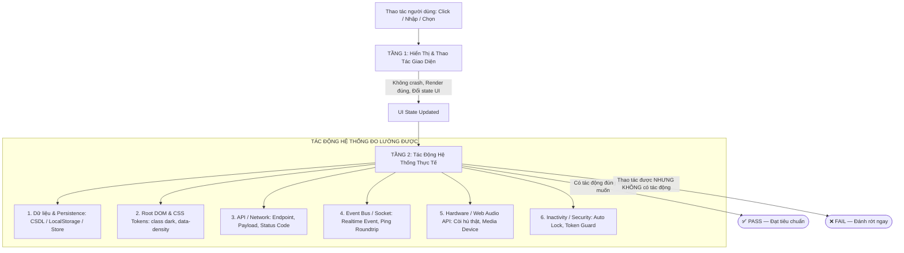

# 🧪 Quy Chuẩn Kiểm Thử 2 Tầng (2-Tier Testing Architecture) — FinanceManagement

> **Dự án:** Personal Finance Management  
> **Tài liệu nguồn sự thật:** `docs/Rule_Project/testing-guidelines.md`  
> **Phạm vi áp dụng:** Toàn bộ 3 module (`src/Backend`, `src/Admin-web`, `src/Client-app`)  
> **Nguyên tắc cốt lõi:** *"Nếu thao tác được trên giao diện nhưng không tạo ra tác động thực sự đến hệ thống như mong muốn thì bài test BẮT BUỘC ĐÁNH RỚT (FAIL)."*

---

## 🏛️ 1. TỔNG QUAN KIẾN TRÚC KIỂM THỬ 2 TẦNG

Trong dự án FinanceManagement, mọi tính năng kỹ thuật và màn hình nghiệp vụ khi viết bài kiểm thử (Unit / Integration / System Test) **bắt buộc phải được cấu trúc theo 2 tầng độc lập nhưng liên kết chặt chẽ**:



---

## 🧱 2. ĐẶC TẢ CHI TIẾT TỪNG TẦNG

---

### 2.1. TẦNG 1: KIỂM THỬ HIỂN THỊ & THAO TÁC GIAO DIỆN (UI Rendering & Interaction)

* **Mục tiêu:** Đảm bảo component/màn hình hiển thị đầy đủ các phần tử trực quan, bố cục không bị vỡ và phản hồi tương tác mượt mà với người dùng mà không quăng lỗi (crash).
* **Nhiệm vụ kiểm tra:**
  1. **Hiển thị đầy đủ phần tử:** Kiểm tra render của tất cả các controls (input, select, checkbox, toggle, button, table, badge, modal, alert).
  2. **Tương tác trực tiếp:** Người dùng có thể `click()`, `change()`, `submit()`, `hover()` bình thường.
  3. **Xử lý trạng thái nội bộ:** Component tự cập nhật các visual feedback như loading indicator, active tab highlight, disabled buttons khi đang gửi request.
* **Ví dụ Assertion Tầng 1:**
  ```javascript
  // Kiểm tra hiển thị
  expect(screen.getByText('Cài Đặt Hệ Thống Admin')).toBeInTheDocument();
  expect(screen.getByText('Giao diện Tối')).toBeInTheDocument();
  
  // Kiểm tra thao tác click
  const darkBtn = screen.getByText('Giao diện Tối');
  fireEvent.click(darkBtn);
  // UI phản hồi active class
  expect(darkBtn).toHaveClass('border-primary');
  ```

---

### 2.2. TẦNG 2: KIỂM THỬ HOẠT ĐỘNG THỰC TẾ & TÁC ĐỘNG HỆ THỐNG (Real System Impact)

* **Mục tiêu:** Đảm bảo tính năng **thực sự hoạt động và tạo ra tác động đo lường được đến toàn bộ hệ thống**, không phải là bản mockup trá hình hay chỉ đổi state giả lập cục bộ.
* **NGUYÊN TẮC BẤT DI BẤT DỊCH (CRITICAL RULE):**
  > **Nếu thao tác được trên giao diện nhưng không tạo ra tác động thực sự đến hệ thống như mong muốn thì bài test BẮT BUỘC ĐÁNH RỚT (FAIL).**
* **Các chiều tác động hệ thống bắt buộc phải assert (Tùy theo loại tính năng):**

| Chiều Tác Động | Yêu Cầu Kiểm Chứng Tầng 2 | Ví Dụ Assertion Mẫu |
|---|---|---|
| **1. Persistence & Dữ liệu** | Dữ liệu phải được ghi nhận bền vững vào CSDL / LocalStorage / SecureStorage / Global Store. Khi đọc lại phải bảo toàn. | `expect(localStorage.getItem('admin_system_settings')).toContain('"theme":"dark"');` |
| **2. Root DOM & CSS Tokens** | Thiết lập giao diện phải tác động lên Root Document (`<html>`, `<body>`) để toàn bộ trang thay đổi màu sắc/mật độ. | `expect(document.documentElement.classList.contains('dark')).toBe(true);`<br>`expect(document.body.getAttribute('data-density')).toBe('compact');` |
| **3. API Call & Network** | Request gửi lên server phải đúng endpoint, đúng HTTP method, đúng authorization token và body chuẩn. | `expect(authApi.login).toHaveBeenCalledWith({ username: 'admin', password: 'secret' });` |
| **4. Event Bus & Realtime** | Gửi/nhận sự kiện socket thật, đo độ trễ roundtrip thời gian thực. | `expect(mockSocket.timeout).toHaveBeenCalledWith(5000);`<br>`expect(mockSocket.emit).toHaveBeenCalledWith('admin_ping', expect.any(Function));` |
| **5. Web Audio API / Hardware** | Còi báo động phải kích hoạt dao động sóng âm Oscillator thật của Web Audio API. | `expect(soundService.playCriticalAlarm).toHaveBeenCalledTimes(1);` |
| **6. Timer & Inactivity** | Thay đổi thời gian Toast (`3000ms`) thì thông báo phải tự đóng đúng sau `3000ms`. Rời website quá thời gian thì màn hình khóa phải kích hoạt. | `act(() => vi.advanceTimersByTime(3000));`<br>`expect(screen.queryByTestId('alert-toast-success')).toBeNull();` |

---

## 🚫 3. CÁC ANTI-PATTERNS (LỖI CẤM KỴ KHI VIẾT TEST)

1. ❌ **Chỉ assert state nội bộ của component:**
   ```javascript
   // SAI: Chỉ kiểm tra state biến đổi nội bộ, không biết hệ thống có ăn không!
   expect(button.classList.contains('active')).toBe(true);
   ```
   👉 **ĐÚNG (Có Tầng 2):**
   ```javascript
   // ĐÚNG: Kiểm tra cả UI active lẫn tác động lên Root DOM hoặc LocalStorage
   expect(button.classList.contains('active')).toBe(true);
   expect(document.documentElement.classList.contains('dark')).toBe(true);
   expect(localStorage.getItem('admin_system_settings')).toContain('"theme":"dark"');
   ```

2. ❌ **Mock quá mức làm mất tác động thực tế (Over-mocking):**
   Mock luôn cả hàm thực thi chính khiến việc test trở thành vô nghĩa. Nếu mock một service, phải assert service đó được gọi với đúng tham số và trigger đúng side-effects.

3. ❌ **Bỏ qua kiểm tra thời gian thực (Timers):**
   Đặt Toast Duration là 3 giây nhưng trong test không chạy timer kiểm tra xem sau 3 giây Toast có thực sự biến mất hay không.

---

## 📋 4. MA TRẬN ĐỐI CHIẾU 2 TẦNG TRONG TOÀN BỘ 3 MODULE

### 4.1. Module `src/Admin-web`
- **Tính năng Theme Tối:**
  - *Tầng 1:* Click nút "Giao diện Tối" -> Nút chuyển viền xanh active.
  - *Tầng 2:* `document.documentElement` có class `.dark` + LocalStorage lưu `theme: 'dark'`.
- **Tính năng Mật độ bảng (Compact):**
  - *Tầng 1:* Click nút "Thu gọn" -> Nút chuyển màu active.
  - *Tầng 2:* `document.body` có thuộc tính `data-density="compact"`.
- **Tính năng Đổi thời gian Toast (3s):**
  - *Tầng 1:* Chọn select `3000` -> Dropdown hiển thị giá trị 3000.
  - *Tầng 2:* Bắn thông báo Toast -> Sau 2500ms vẫn còn -> Sau 3000ms biến mất hoàn toàn.
- **Tính năng Dọn dẹp cache an toàn:**
  - *Tầng 1:* Click nút "Xóa Cache" -> Hiện hộp thoại confirm.
  - *Tầng 2:* `sessionStorage` bị xóa sạch, cache rác bị xóa, nhưng `wealthcommand_access_token` và `settings` còn nguyên vẹn 100%.

### 4.2. Module `src/Backend`
- **Tính năng Phân quyền tính năng (`requireFeature`):**
  - *Tầng 1:* Controller nhận request hợp lệ không bị sập ứng dụng.
  - *Tầng 2:* Nếu tài khoản Basic gọi tính năng Premium -> Chặn cứng HTTP 403 Forbidden (`code: FEATURE_DISABLED`); nếu đã nâng cấp Premium -> Cho phép đi tiếp HTTP 200 OK.

### 4.3. Module `src/Client-app`
- **Tính năng Nâng cấp gói cước Realtime:**
  - *Tầng 1:* Nhận sự kiện Socket -> Icon huy hiệu Premium trên AppBar đổi màu vàng.
  - *Tầng 2:* `GoiCubit` cập nhật state, các cổng OCR và Chatbot AI mở khóa hạn mức, dữ liệu được ghi vào `FlutterSecureStorage`.

---

## 🏁 5. CHECKLIST NGHIỆM THU TEST TRƯỚC KHI SHIP
Mỗi khi viết hoặc review test, kỹ sư/AI bắt buộc tự kiểm:
- [ ] Test đã có assert Tầng 1 (Render đầy đủ, thao tác click/change/submit không lỗi)?
- [ ] Test đã có assert Tầng 2 (Tác động đo lường được lên CSDL / DOM / Event Bus / Timer / Persistence)?
- [ ] Nếu component đổi state nhưng không tạo ra tác động đến hệ thống, bài test có bắt được và đánh fail không?
