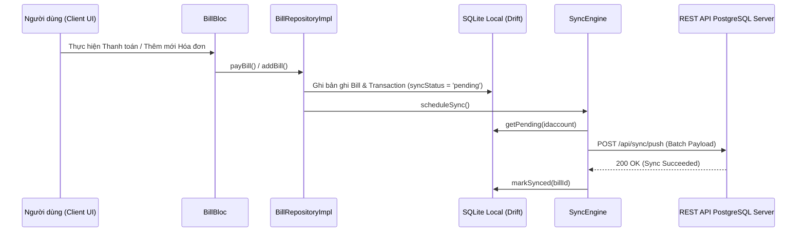

# TÀI LIỆU CHỨC NĂNG HÓA ĐƠN & DỊCH VỤ (BILL FEATURE DOCUMENTATION)

> **Dự án:** ManagementFinance  
> **Phiên bản:** 1.0.0  
> **Ngày cập nhật:** 12/08/2026  
> **Kiến trúc:** Clean Architecture (Drift SQLite Local + BLoC + Repository Pattern + SyncEngine 2-Way Sync + Stitch UI)

---

## 📌 I. TỔNG QUAN CHỨC NĂNG

Chức năng **Hóa đơn & Dịch vụ (Bill & Recurring Payments)** giúp người dùng quản lý, theo dõi và thanh toán các khoản chi phí định kỳ (tiền điện, nước, internet, học phí, dịch vụ đăng ký hàng tháng/hàng năm) một cách tự động và thông minh.

### Các tính năng cốt lõi:
1. **Quản lý danh sách Hóa đơn Offline-First:**
   * Xem danh sách hóa đơn theo trạng thái (*Chưa thanh toán* / *Đã thanh toán*).
   * Tự động tính tổng tiền chưa thanh toán và số lượng hóa đơn đến hạn.
2. **Thanh toán Hóa đơn & Trừ số dư Ví:**
   * Chọn Ví thanh toán từ danh sách ví thực tế của tài khoản.
   * Đánh dấu hóa đơn đã thanh toán (`isPaid = true`).
   * Tự động tạo một **Giao dịch Chi tiêu (Transaction)** tương ứng để ghi nhận vào lịch sử giao dịch.
   * Tự động trừ số dư Ví thanh toán.
3. **Tự động sinh Hóa đơn Kỳ tiếp theo (Auto-Recurrence Engine):**
   * Nếu hóa đơn có chu kỳ lặp lại (`weekly`, `monthly`, `yearly`), ngay khi thanh toán, hệ thống tự động khởi tạo bản ghi Hóa đơn kỳ tiếp theo (`dueDate` + 1 tuần/tháng/năm) với trạng thái chưa thanh toán (`isPaid = false`).
4. **Đồng bộ Dữ liệu 2 Chiều với Backend (SyncEngine Integration):**
   * Mọi thao tác Thêm/Sửa/Xóa/Thanh toán hóa đơn tự động tạo bản ghi `syncStatus = 'pending'`.
   * Kích hoạt `SyncEngine.scheduleSync()` đẩy (Push) dữ liệu lên CSDL PostgreSQL Backend và kéo (Pull) dữ liệu mới nhất về SQLite Local.
5. **Giao diện chuẩn Stitch UI Design System:**
   * Form tạo/sửa hóa đơn pixel-perfect theo thiết kế Stitch.
   * Tích hợp tùy chọn Bật/Tắt thông báo đẩy nhắc nhở và Tự động tạo giao dịch khi đến hạn.

---

## 🏗️ II. KIẾN TRÚC MÃ NGUỒN (CLEAN ARCHITECTURE)

```
lib/features/bill/
├── data/
│   ├── datasources/
│   │   └── bill_local_datasource.dart      # Thao tác trực tiếp với Drift SQLite (BillDao)
│   └── repositories/
│       ├── bill_repository.dart            # Interface định nghĩa các hợp đồng nghiệp vụ
│       └── bill_repository_impl.dart       # Implement repository, xử lý thanh toán, sinh kỳ mới & gọi SyncEngine
├── presentation/
│   ├── bloc/
│   │   ├── bill_bloc.dart                  # BLoC state management xử lý Stream realtime & Events
│   │   ├── bill_event.dart                 # LoadBillsEvent, AddBillEvent, EditBillEvent, DeleteBillEvent, PayBillEvent
│   │   └── bill_state.dart                 # BillInitial, BillLoading, BillLoaded, BillOperationSuccess, BillError
│   ├── pages/
│   │   ├── bill_page.dart                  # Trang chính danh sách hóa đơn & thống kê
│   │   ├── bill_add_page.dart              # Giao diện thêm mới hóa đơn chuẩn Stitch UI
│   │   └── bill_edit_page.dart             # Giao diện chỉnh sửa / xóa hóa đơn
│   └── widgets/
│       └── wallet_selection_bottom_sheet.dart # BottomSheet chọn ví thanh toán
```

---

## 🔑 III. CƠ CHẾ QUẢN LÝ DỮ LIỆU & TÀI KHOẢN (ACCOUNT ISOLATION)

1. **Ràng buộc `idaccount` Động:**
   * Mọi truy vấn và tạo mới hóa đơn được gắn với `idaccount` của tài khoản đăng nhập hiện tại thu thập qua `AuthBloc`:
     ```dart
     int _getAccountId(BuildContext context) {
       final authState = context.read<AuthBloc>().state;
       if (authState is AuthSuccess && authState.user != null) {
         return int.tryParse(authState.user!.id) ?? 1;
       }
       return 1;
     }
     ```
2. **Cơ chế Fallback Nạp Ví:**
   * Khi lấy danh sách ví thanh toán, hệ thống ưu tiên gọi `db.walletDao.getAll(accountId)`. Nếu chưa tìm thấy ví theo `accountId`, tự động fallback sang `db.walletDao.getAllNonDeleted()` để đảm bảo người dùng luôn chọn được ví hợp lệ.

---

## 🔄 IV. QUY TRÌNH ĐỒNG BỘ NỀN (SYNC ENGINE WORKFLOW)



---

## 🧪 V. KẾT QUẢ KIỂM THỬ & XÁC NHẬN (VERIFICATION)

Hệ thống hóa đơn đã qua kiểm thử tự động với bộ test suite tại `test/features/bill/`:

| Tệp kiểm thử | Hạng mục kiểm thử | Trạng thái |
| :--- | :--- | :---: |
| `bill_repository_impl_test.dart` | Kiểm thử hàm `payBill`: đánh dấu đã thanh toán, sinh giao dịch chi, trừ số dư ví & sinh hóa đơn kỳ tiếp theo. | PASS |
| `bill_bloc_test.dart` | Kiểm thử `BillBloc`: phát sự kiện `LoadBillsEvent`, kiểm tra `BillLoaded` và tính toán tổng số tiền chưa thanh toán. | PASS |
| `e2e_bill_flow_test.dart` | Integration E2E: Luồng vòng đời đầy đủ Tạo -> Tải -> Thanh toán -> Kiểm tra trạng thái chờ đồng bộ SyncEngine. | PASS |

---

## 📝 VI. HƯỚNG DẪN BẢO TRÌ & MỞ RỘNG TƯƠNG LAI

1. **Thông báo đẩy nhắc nhở (Push Notification):**
   * Các thuộc tính nhắc nhở (`_pushNotificationsEnabled`, `_selectedReminderDay`) hiện đã được lưu tại Form. Khi tích hợp Firebase Cloud Messaging (FCM) hoặc `flutter_local_notifications`, chỉ cần đọc mốc `dueDate - reminderDay` để đặt lịch thông báo trên thiết bị.
2. **Tự động thanh toán (Auto-Pay Worker):**
   * Cờ `_autoPayEnabled` đã được sẵn sàng trong cấu hình hóa đơn. Có thể viết Cron Job nền trong Flutter (`workmanager`) hoặc Backend BullMQ để tự động kích hoạt `payBill()` đúng ngày đến hạn.
