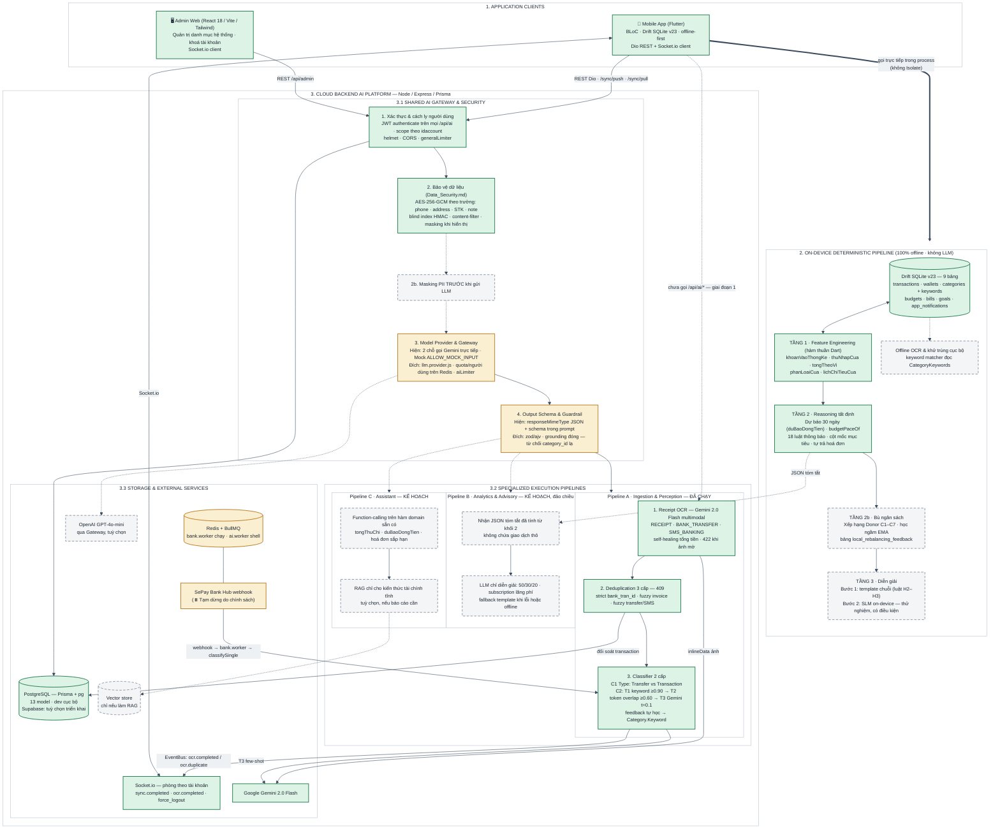

# Kiến trúc AI — đối chiếu sơ đồ mẫu với hệ thống đang chạy, và các phương án đi tiếp

**Thêm 2026-09-17.** Đây **không phải một việc cần backend làm** và không nằm
trong hàng đợi `CAN-LAM/`. Tài liệu này tồn tại để hai phía (client và backend)
thảo luận trên **cùng một bộ số đo** trước khi chốt phương án cho phần AI. Mọi con số bên dưới đều đo bằng mã ngày 2026-09-17 trên nhánh `TranQuangDat` @
`d1fc05d` (đã gộp `main` @ `fcc20b5`), không chép từ tài liệu nào.

> ⚠️ **CẬP NHẬT 2026-09-21:** Vì lý do chính sách (bảo mật dữ liệu ngân hàng và phạm vi đồ án), **Module Bank được tạm dừng hoàn toàn**. Hệ thống không xóa bỏ chức năng/mã nguồn đã làm, nhưng trong phạm vi xây dựng sắp tới sẽ không còn Module Bank. Nhánh SePay Webhook / Bank Worker đóng băng; luồng nhận diện và phân loại tập trung vào Receipt OCR và Nhập tay / SMS.

Sơ đồ được đối chiếu là **"KIẾN TRÚC AI PHÂN TẦNG HYBRID (Nền tảng Quản trị
Chung + Các Pipeline Thực thi Chuyên biệt)"** — bản Mermaid do phía backend
gửi, gồm ba tầng: *1. Application Clients → 2. On-device Edge AI Pipeline + 3. Cloud Backend AI Platform (3.1 Shared Gateway & Security → 3.2 ba pipeline A/B/C → 3.3 Storage & External Services)*. Bên dưới gọi nó là **sơ đồ mẫu**.

Bản vẽ lại khớp mã (mục 8) xem được ở đây:
<https://claude.ai/code/artifact/31fa9ece-9889-4400-a996-371df10a62c4>

---

## 0. Tóm tắt một trang

1. **Sơ đồ mẫu là kiến trúc ĐÍCH, không phải kiến trúc hiện có.** Khoảng một
   phần ba đã chạy thật (Pipeline A trên backend; xác thực, mã hoá theo trường,
   hạ tầng Redis/Socket.io); phần còn lại (Edge SLM, Gateway, Zod, Pipeline B/C,
   ChromaDB, OpenAI) là **0 dòng mã**.
2. **Có sáu chỗ sơ đồ nói ngược với mã** (mục 2.2), trong đó một chỗ là **lỗi
   mã thật** đang chạy: grounding của LLM classifier không được thi hành —
   `category_id` bịa vẫn lọt xuống (`llm.classifier.js:123-133`).
3. **Hệ thống hiện tại đã đi xa hơn sơ đồ ghi nhận — nhưng theo hướng khác**:
   phần tính toán (dự báo 30 ngày, nhịp ngân sách, 18 luật thông báo…) đã có ở
   **client, tất định, offline, có test**, không phải LLM trên cloud như sơ đồ vẽ.
4. **Điểm nghẽn thật không phải thiếu AI mà là AI đã có chưa tới tay người
   dùng**: 2 487 dòng backend của Pipeline A **không có client nào gọi**
   (`grep` toàn `lib/` ra 0 chỗ gọi `/api/ai/*`; trang "Trợ lý AI" là giao diện
   tĩnh, nút gửi chỉ xoá ô nhập).
5. Hai phương án đi tiếp được trình bày đầy đủ ở mục 5 và 6. Client **đề xuất
   phương án A** (giữ lõi tất định làm nguồn số, mượn Gateway/guardrail và tầng
   diễn giải của sơ đồ mẫu) — lý do chi tiết ở mục 9.1. Phương án B (khớp nguyên bản) làm được, nhưng ba ô
   sẽ là mã chạy mà cho kết quả **kém hơn thứ đang có**.
6. **Ba quyết định cần hai phía chốt** — mục 9.

---

## 1. Sơ đồ mẫu gồm gì

| Khối | Nội dung sơ đồ ghi |
|---|---|
| 1. Application Clients | Mobile App (Flutter, online/offline, Drift SQLite) · Admin Web (React/Vite) |
| 2. On-device Edge AI Pipeline | Drift với 3 bảng `local_category_features` / `local_rebalancing_feedback` / `local_ai_alert_history`; Tầng 1 Feature Engineering (Welford O(1), lọc outlier 3σ, tách lump-sum, dự phóng Bayesian B4–B5); Tầng 2 Optimization Engine (điểm thiết yếu, xếp hạng Donor C1–C7, học ngầm EMA E1–E5); Tầng 3 On-device SLM (Gemma Nano / MediaPipe, fallback template H2–H3, thẻ đối soát G3). Mũi tên từ Mobile: *"Thực thi Offline (Dart Isolate)"* |
| 3.1 Shared AI Gateway & Security | Data Masking & Privacy (che PII, phân quyền user-scoped) → Unified Model Provider & Gateway (API key, quota, rate-limit; OpenAI GPT-4o-mini / Gemini Flash / Mock) → Output Schema & Guardrails (JSON Schema / Zod, strict grounding) |
| 3.2 Pipeline A — Ingestion & Perception | Receipt OCR (Vision API) → Deduplication Engine F013 (3 cấp) → 2-Level Classifier (Type; T1 keyword → T2 NLP → T3 Gemini) |
| 3.2 Pipeline B — Analytics & Forecasting | Spending Behavior Analysis (đột biến, subscription lãng phí) · Financial Advisory 50/30/20 (thâm hụt cấu trúc 3 tháng, CoT temp 0.1) · Cash Flow Forecast 30-Day |
| 3.2 Pipeline C — Advanced RAG | Advanced Indexing (NFC, semantic chunking 0.5, parent-child 200/1000) → Advanced Retrieval (query decomposition, BM25 + HNSW, RRF k=60, cross-encoder) → Generation & Evaluation (U-shape, strict grounding + citation, Ragas ≥ 0.85) |
| 3.3 Storage & External | External LLMs (OpenAI GPT-4o-mini, Gemini 2.0 Flash) · ChromaDB / HNSW (`ef_search` 50–100) · Supabase PostgreSQL (AES-256 at-rest cho giao dịch, ví, hoá đơn, ngân sách) |

---

## 2. Đối chiếu từng khối với mã

### 2.1. Bảng đối chiếu

Ký hiệu: ✅ đã chạy thật · ⚠️ một phần · ❌ chưa có (0 dòng mã).

| Khối trên sơ đồ | Đo được trong mã | Kết luận |
|---|---|---|
| **1. Clients** — Flutter + Drift SQLite; Admin React/Vite | `src/Client-app/pubspec.yaml`: Flutter, `flutter_bloc`, `drift`, `dio`, `socket_io_client`. `src/Admin-web/package.json`: React 18.2, Vite 5, Tailwind 4, `socket.io-client` | ✅ |
| Mũi tên *"Gọi API Online"* cho AI | `grep -rnE "['\"/]ai/" src/Client-app/lib` → **0** chỗ gọi `/api/ai/*`. `features/ai_chat/presentation/pages/ai_chat_page.dart` (436 dòng) chỉ import `material`, `go_router`, `app_colors`; nút gửi (dòng 424) chỉ `_textController.clear()` | ❌ Pipeline A dựng xong nhưng **chưa có ai gọi** |
| Mũi tên *"Thực thi Offline (Dart Isolate)"* | Không có `Isolate` nào cho AI; mọi phép tính domain gọi đồng bộ trong process | ❌ |
| **2. On-device Edge AI** — 3 bảng, 3 tầng, Gemma/MediaPipe | Drift có **9 bảng** (schema v23): `Transactions`, `Wallets`, `Categories`, `CategoryKeywords`, `CategoryGroupMemberships`, `Budgets`, `Bills`, `Goals`, `AppNotifications`. Không có bảng `local_*`. `pubspec.yaml` không có MediaPipe/tflite/gemma. Chỉ có tài liệu `docs/AI/AI_Edge-SLM.md/Client-app.md` (448 dòng, NPBao, 2026-09-13) — client đã soát ra **6 chỗ lệch** với mã cùng ngày (A3 định nghĩa hoàn tiền bằng `amount < 0` trong khi SQLite lưu `amount` luôn dương; 3 cột `is_outlier`/`is_one_time`/`is_recurring_hint` chưa tồn tại; `saving_goal_ratio` không có; `income` không lưu ở đâu; mô hình ngân sách rộng hơn giả định; F2 hứa mã hoá client không có) | ❌ Nhưng xem mục 3: **tầng 1–2 đã có ở hình dạng khác** |
| **3.1 Data Masking & Privacy** | `utils/masking.util.js` (email, phone, STK, họ tên, địa chỉ), `utils/content-filter.util.js` (PII/thẻ tín dụng trong note), `utils/crypto.util.js` AES-256-GCM + blind index HMAC. Mọi route `/api/ai/*` qua `authenticate` (`api/ai.routes.js:12`); danh mục lấy theo `idaccount` | ⚠️ Có, nhưng **không nằm trên đường tới LLM** — xem 2.2 #1 |
| **3.1 Unified Model Provider & Gateway** | Không có thành phần nào như vậy. Hai chỗ gọi Gemini REST trực tiếp bằng `axios`, mỗi chỗ tự đọc `GEMINI_API_KEY`: `modules/ai/features/classify/pipeline/llm.classifier.js:106` và `modules/ai/features/ocr/pipeline/vision.extractor.js:110`. Rate-limit chỉ là `generalLimiter` chung cho `/api/` (`app.js:38`; 1000 req/15 phút, dev nâng lên 10 000) — không quota theo người dùng, không limiter riêng cho AI. Mock: ✅ `ALLOW_MOCK_INPUT` + `_mockExtraction`/`_mockUser` | ❌ Gateway |
| **3.1 Output Schema & Guardrails — JSON Schema / Zod** | `package.json` backend không có `zod`/`ajv`. `middleware/validator.js` là bộ kiểm tay (required/type/length), **chỉ gắn vào route cũ** `POST /ai/classify` (`api/ai.routes.js:20`). Bốn route `/classify/single|batch|feedback|transaction` (`classify.routes.js`) và `/ocr/*` (`ocr.routes.js`) không gắn validator nào; `ocr.controller.js:27` tự kiểm `image_base64` rỗng | ⚠️ Chỉ có `responseMimeType: 'application/json'` của Gemini + lược đồ ghi trong prompt |
| **Pipeline A** — OCR → Dedup → Classifier | `ocr.service.js` (168 dòng): Gemini 2.0 Flash multimodal, phân `RECEIPT`/`BANK_TRANSFER`/`SMS_BANKING`, self-healing tổng tiền từ items, 422 khi ảnh mờ, 409 khi trùng, phát `ocr.completed`/`ocr.duplicate` qua EventBus. `dedup.service.js` (109 dòng): đúng 3 cấp — strict `bank_tran_id` (kể cả hậu tố `_grp_`), fuzzy invoice (merchant + tiền + ngày), fuzzy transfer/SMS. `classify.service.js` (500 dòng): Type detector (Transfer vs Transaction) → T1 keyword (≥ 0.90) → T2 token overlap (≥ 0.60) → T3 Gemini (temp 0.1, U-shape) + `recordFeedback` ghi vào `Category.Keyword`. Nối **SePay webhook** (`workers/bank.worker.js:156` — *hiện tạm dừng hoàn toàn do lý do chính sách*) | ✅ Khớp nhất, và **hoàn chỉnh hơn** sơ đồ vẽ |
| **Pipeline B** — Spending Behavior, Advisory, Forecast | Backend: `grep -rniE "forecast|advis|50/30|subscription"` ngoài `node_modules` chỉ ra `modules/ai/config.js:19-20` (`maxTokens`/`temperature` giữ chỗ cho `advice`/`budget`/`chatbot`). `docs/AI/LogicBusinessAI.md` §1 tự đánh dấu cả ba là *"Lộ trình tiếp theo"* | ❌ Và **đặt sai chỗ** — xem 2.2 #2 |
| **Pipeline C** — Advanced RAG | `grep -rniE "embedding|vector|chroma|bm25|rerank"` → **0** trên backend. Chatbot chỉ là chú thích `(future)` ở `modules/ai/ai.controller.js:9`. Thứ duy nhất mượn từ `Standard_RAG.md` là `_reorderCategoriesUshape` + temperature 0.1 trong classifier | ❌ |
| **3.3 External LLMs** — OpenAI + Gemini | Chỉ Gemini 2.0 Flash được gọi. `OPENAI_API_KEY` được đọc ở `llm.classifier.js:16` nhưng **không bao giờ dùng**; `config.js:18` ghi `defaultProvider: 'openai'` mà không có mã nào đọc; không có gói `openai` | ❌ OpenAI |
| **3.3 ChromaDB / HNSW** | Không có gói, không có mã | ❌ |
| **3.3 Supabase PostgreSQL, AES-256 at-rest** | `.env` dev: **0** chữ "supabase"; PostgreSQL cục bộ qua Prisma + `pg` (13 model). "Supabase" chỉ xuất hiện trong chuỗi log của `scripts/apply_migration_6.js`, `scripts/test_db.js` và chú thích `.env.example`. AES là **theo trường**: `phone`, `address` (auth), `account_number`, `note` (bank, sync) — **không** mã hoá số tiền, ví, hoá đơn, ngân sách | ⚠️ |

Ngoài ra: `modules/ai/config.js:8-9` trỏ tới `model.v1.bin` / `labels.json` **không tồn tại** trong `classify/pipeline/`; T2 là token overlap (`nlp.matcher.js`), không phải mô hình ML — nếu báo cáo gọi nó là "NLP" thì nên nói rõ. `workers/ai.worker.js` đang ở *shell mode* (nhận job, log, không làm gì) trong khi `classify.service` chạy đồng bộ ngay trong request — hai đường này chưa nối nhau.

### 2.2. Sáu chỗ sơ đồ nói ngược với mã

1. **Masking không nằm trên đường tới LLM.** Sơ đồ vẽ *Data Masking → Gateway →
   LLM*, ngụ ý PII được che trước khi ra ngoài. Thực tế `classifyWithLLM` gửi
   nguyên `text`/`merchant`/`counterpart_name`, và `extract` gửi nguyên ảnh lên
   Gemini; `masking.util` chỉ dùng khi **hiển thị**. Biên lai chuyển khoản chứa
   tên và số tài khoản người nhận đi thẳng lên Google.
2. **Dự báo dòng tiền 30 ngày đã có — ở CLIENT, thuần Dart, không LLM.** Đó là
   mục 3.27 `docs/ANALYTICS_FEATURE.md` (`features/analytics/domain/du_bao_dong_tien.dart`,
   xong 2026-09-16), chạy trên SQLite offline. Sơ đồ đặt nó ở Pipeline B trên
   server. Tương tự, "phát hiện chi tiêu đột biến" đã có ở client dưới dạng
   **ngưỡng người dùng đặt** (thông báo Khoản chi lớn, 2026-09-17) — và người
   dùng đã chốt **cố ý không dùng thống kê** vì dữ liệu thật quá mỏng (8 ngày,
   danh mục đông nhất 5 giao dịch). Khối 2 trên sơ đồ chỉ mô tả Edge SLM chưa
   có, bỏ qua phần on-device đã chạy thật.
3. **"Strict Grounding chống ảo giác" không được thi hành.** `llm.classifier.js:123-133`:
   khi `parsed.category_id` không khớp danh mục nào của người dùng, hàm **vẫn
   trả về** `category_id: parsed.category_id` (chỉ `category_name`/`icon` rơi về
   giá trị LLM đưa), và `classifySingle` nhận nó vì `category_id` truthy. Một
   UUID bịa sẽ lọt xuống ghi giao dịch. **Đây là lỗi mã thật, không chỉ lệch sơ
   đồ.** Sửa là một dòng: `if (!matchedCat) return null;`.
4. **Không có Gateway, không có OpenAI.** Sơ đồ có hai nhà cung cấp và một lớp
   điều phối; mã có một nhà cung cấp gọi trực tiếp ở hai chỗ.
5. **Không có Zod / JSON Schema validator**, và 4/5 route AI không gắn validator.
6. **Supabase và "AES-256 at-rest cho Giao dịch, Ví, Hoá đơn, Ngân sách"** —
   cả hai chưa đo được trên hệ thống đang chạy (xem bảng).

### 2.3. Thứ có thật nhưng sơ đồ bỏ sót

- **Redis + BullMQ** (`index.js:22-27`): `ai.worker.js` shell mode; `bank.worker.js` chạy thật.
- **SePay webhook → `bank.worker.js:156` → `classifySingle`** — nguồn dữ liệu quan trọng của classifier *(tạm dừng hoàn toàn từ 2026-09-21 do lý do chính sách)*.
- **EventBus → Socket.io**: `ocr.completed` / `ocr.duplicate` phát về client — đường trả kết quả của Pipeline A không phải chỉ HTTPS response.
- **Đồng bộ hai chiều offline-first** (`/sync/push`, `/sync/pull`), cưỡng chế đăng xuất, blind index — nền mà mọi pipeline tựa vào.

---

## 3. Hệ thống hiện tại đã đi xa hơn sơ đồ ghi nhận ở đâu

Đúng ở ba chỗ, đo được bằng mã — và **theo hướng khác** hướng sơ đồ vẽ.

1. **Phần tính toán on-device đã chạy thật, không cần AI.** Client đã có: dự báo
   30 ngày bậc thang (`duBaoDongTien`), nhịp ngân sách (`budgetPaceOf`), thu
   nhập tách khỏi vay/nợ (`thuNhapCua`), tỉ lệ tiết kiệm, tổng tài sản theo thời
   gian, lịch chi tiêu, cột mốc mục tiêu 25/50/75%, tự trả hoá đơn, trích tự
   động, 18 loại thông báo — tất cả tất định, offline, có test (2 810 ca). Đó
   chính là **Tầng 1–2** mà tài liệu Edge SLM mô tả, chỉ không mang tên ấy và
   không dùng thống kê.
2. **Pipeline A hoàn chỉnh hơn sơ đồ vẽ**: self-healing, mã lỗi 422/409, vòng tự
   học `feedback`, nối SePay.
3. **Nền tảng vận hành có sẵn mà sơ đồ bỏ qua**: Redis/BullMQ, Socket.io, đồng
   bộ, mã hoá theo trường + blind index.

**Chưa tới** ở phần còn lại, chiếm phần lớn diện tích sơ đồ: Gateway, OpenAI,
Zod, Pipeline B/C, ChromaDB, Gemma on-device. Và **đi lùi so với sơ đồ** ở một
chỗ: client không gọi endpoint AI nào.

Câu đúng: *hệ thống đã đi xa hơn ở phần tính toán và hạ tầng, nhưng đi theo
hướng "tất định trên client" chứ không theo hướng "LLM trên cloud" mà sơ đồ vẽ.*

---

## 4. So sánh hai lối kiến trúc — ưu và nhược

### 4.1. Năm trục khác biệt thật sự

| Trục | Sơ đồ mẫu | Hệ thống hiện tại |
|---|---|---|
| **Trí tuệ nằm ở đâu** | LLM là trung tâm: phân tích, dự báo, tư vấn, hỏi đáp đều qua mô hình ngôn ngữ | Thuật toán **tất định** là trung tâm; LLM chỉ ở rìa (OCR, phân loại tầng 3) và chỉ khi luật thường không đủ tự tin |
| **Con số sinh ra ở đâu** | Trên server từ PostgreSQL (Pipeline B) và từ mô hình thống kê on-device (Tầng 1) | Trên client từ SQLite, **một định nghĩa duy nhất** cho mỗi phép tính, có test |
| **Cách "hiểu" dữ liệu người dùng** | Truy xuất ngữ nghĩa: vector, HNSW, BM25, rerank — coi dữ liệu tài chính như kho văn bản | Truy vấn có cấu trúc trên bảng đã biết lược đồ |
| **Phát hiện bất thường** | Thống kê (Welford, 3σ, Bayesian, z-score) | Ngưỡng người dùng đặt (`nguongChiLon`, `nguongSoDuThap`) |
| **Offline** | Offline = có SLM chạy trên máy | Offline = **mọi tính năng cốt lõi** chạy trên SQLite; AI là phần thêm khi có mạng |

### 4.2. Sơ đồ mẫu

**Ưu điểm**
- Trần năng lực cao: hỏi đáp tự nhiên, lời khuyên có ngữ cảnh, đọc hoá đơn — thứ luật cứng không làm được.
- Kiến trúc chuẩn ngành, dễ trình bày: Gateway chung → pipeline chuyên biệt → storage; RAG/Ragas/Zod là từ khoá hội đồng hiểu ngay. Với đồ án, đây là ưu điểm thật.
- Mở rộng theo chiều ngang: thêm pipeline là thêm nhánh sau Gateway.
- Bảo mật được thiết kế thành tầng riêng (masking, quota, guardrail).

**Nhược điểm**
- Không kiểm chứng được như mã tất định: một đường dự báo sai do LLM không có test nào bắt; dự án đã học rằng lỗi im lặng là lỗi đắt nhất.
- Đòi dữ liệu dày: Welford, z-score, embedding, Ragas ≥ 0.85 với tài khoản 8 ngày đều im lặng hoặc bịa. Sơ đồ ngầm giả định người dùng có 6–12 tháng lịch sử.
- Dùng sai công cụ ở Pipeline C: dữ liệu người dùng là vài bảng có cấu trúc, vài trăm hàng — vector search trả lời "tháng này tiêu ăn uống bao nhiêu" **kém chính xác hơn** một câu SQL, và tốn một cụm Chroma + reranker để làm việc đó.
- Chi phí vận hành và phụ thuộc: OpenAI + Gemini + Chroma + Redis + Python reranker + Supabase — sáu dịch vụ ngoài cho một app cá nhân; tắt mạng là mất phần lớn "AI".
- Riêng tư mâu thuẫn nội tại: 3.1 che PII, nhưng Pipeline C nhúng ghi chú giao dịch (đang mã hoá AES) thành vector không mã hoá, và Pipeline A gửi nguyên ảnh biên lai lên Google.
- SLM on-device chưa khả thi cho phát hành: Gemma 3 1B int4 ≈ 550 MB tải về, RAM ≥ 3 GB, chưa kiểm iOS.
- Hai định nghĩa cho một con số: dự báo/thu nhập tính ở server *và* client sớm muộn lệch nhau — chính lý do dự án gom mọi phép tính về "một định nghĩa duy nhất".

### 4.3. Hệ thống hiện tại

**Ưu điểm**
- Đúng cho offline-first thật: mọi thứ người dùng thấy đều chạy không mạng; đồng bộ, xung đột, cưỡng chế đăng xuất đã nghiệm thu trên hai máy ảo.
- Kiểm chứng được: mỗi phép tính là hàm thuần có test, có bẫy ghi lại.
- Không bịa số: cảnh báo ngưỡng không thể báo động giả; dự báo chỉ chiếu thứ đã biết chắc.
- Riêng tư theo cấu trúc: dữ liệu không rời máy trừ đồng bộ với server của chính mình.
- Rẻ và ít phụ thuộc: Gemini là dịch vụ ngoài duy nhất, tắt được (`GEMINI_API_KEY` trống → tầng 3 tự bỏ qua).
- Pipeline A thật sự đã chạy và cẩn thận hơn sơ đồ.

**Nhược điểm**
- Trần thấp về "thông minh": không hỏi đáp tự nhiên, không lời khuyên theo ngữ cảnh; trang Trợ lý AI là hình tĩnh. Với đề tài có chữ "AI", đây là khoảng trống hội đồng sẽ hỏi.
- AI đã có nhưng không tới tay người dùng.
- Luật cứng cần người dùng cấu hình: ngưỡng chi lớn mặc định tắt.
- Tính toán dồn về client → Admin-web không dùng lại được gì; server không có phép tính nào để phục vụ dashboard.
- Thiếu tầng gateway/guardrail thật: hai chỗ gọi Gemini trực tiếp, grounding hở, không quota — đúng thứ sơ đồ mẫu làm tốt.
- Sơ đồ/tài liệu và mã đang nói khác nhau — món nợ phải trả trước khi bảo vệ.

### 4.4. Nhận định

Hai hệ thống không đối nghịch mà **bổ sung theo đúng tầng**: hiện tại mạnh ở
*số liệu đúng, offline, kiểm chứng được*; sơ đồ mẫu mạnh ở *diễn giải, hội
thoại, và khung bảo mật/gateway sạch*. Điểm yếu của mỗi bên là điểm mạnh của
bên kia. Chính tài liệu Edge SLM của backend đã viết nguyên tắc xuyên suốt:
**"số liệu luôn đến từ tầng tất định, mô hình ngôn ngữ không bao giờ tự tính
toán"** — phương án A bên dưới chỉ là áp nguyên tắc ấy lên cả sơ đồ.

---

## 5. Phương án A — Hybrid: tất định làm số, LLM diễn giải *(client đề xuất)*

Giữ nguyên **khung ba tầng và ba khối con 3.1/3.2/3.3** của sơ đồ mẫu; đổi nội
dung ba ô để mỗi tầng làm việc nó giỏi.

**Nguyên tắc chọn đường**
1. Sửa lỗi trước, tính năng sau — ba lỗi ở đường AI đang chạy (2.2 #1, #3, #5) đóng trước khi client bắt đầu gọi.
2. Một định nghĩa duy nhất — con số client đã tính thì server **không tính lại**; LLM chỉ diễn giải JSON đã đúng.
3. Dữ liệu thật rất mỏng — ưu tiên thứ tất định và thứ người dùng thấy ngay.
4. Client chỉ sửa `src/Client-app`; việc backend đi qua `CAN-LAM/`.

### Giai đoạn 0 — Đóng lỗ hổng trên đường đã có *(backend · nhỏ)*

| Việc | Chỗ |
|---|---|
| Từ chối `category_id` không thuộc danh mục người dùng | `llm.classifier.js:123-133` — `if (!matchedCat) return null;` |
| Che PII **trước** khi gửi Gemini (`text`, `counterpart_name`, `merchant`); với OCR che ở DTO trả về vì ảnh không che được | `llm.classifier.js`, `ocr.service.js` |
| Gắn validator cho 4 route `/classify/*` và `/ocr/*` | `classify.routes.js`, `ocr.routes.js` |
| Dọn mã chết: `OPENAI_API_KEY` đọc mà không dùng, `config.js` trỏ `model.v1.bin` không tồn tại, `ai.worker.js` shell mode | `modules/ai/` |
| Sửa 6 chỗ lệch của `AI_Edge-SLM.md/Client-app.md` | `docs/AI/` |

### Giai đoạn 1 — Nối client vào Pipeline A *(client · vừa)*

- Màn chụp/chọn ảnh hoá đơn → `POST /api/ai/ocr/parse` → màn xác nhận dựng từ DTO (`option_single` / `option_grouped` / cặp `options` chuyển khoản) → ghi SQLite qua `TransactionRepository.addTransaction` để `_applyBalances` và `SoDuViService` dùng lại.
- Gợi ý danh mục khi nhập tay qua `/classify/single` — gợi ý một chạm, không tự ghi; nút "học" gọi `/classify/feedback`.
- Offline: theo `ORC.md` §7.2 nhưng **cắt** OCR cục bộ ML Kit ở lát đầu — chỉ khử trùng cục bộ và keyword matcher trên `CategoryKeywords` (bảng đã có).
- 🛑 **Điều kiện tiên quyết ĐÃ BỎ (2026-09-18).** Câu cũ ở đây đòi mở `provider` và `bank_tran_id` vào hợp đồng payload đồng bộ. **Không còn đúng**: nhóm bỏ liên kết ngân hàng, hai cột ấy chỉ có nghĩa cho giao dịch do SePay bắn về, và giai đoạn này **không cần chúng** — người dùng chụp ảnh hoá đơn thì khử trùng theo ảnh và theo nội dung, không theo mã giao dịch ngân hàng. Giai đoạn 1 nay **không có điều kiện tiên quyết nào về đồng bộ**, và **không được** nhân cơ hội này mở hai cột ấy ra (quy tắc 4 `CLAUDE.md`).
- ⚠️ **Hệ quả nhỏ cần chốt khi làm**: `dedup.service.js` có ba cấp, cấp một là `bank_tran_id` **strict**. Ảnh hoá đơn do người dùng chụp không mang mã ấy nên rơi vào hai cấp fuzzy — đủ dùng, nhưng đừng trông chờ cấp một bắt được gì.
- Cần màn Stitch cho quét/xác nhận trước khi dựng.

### Giai đoạn 2 — Gateway & guardrail *(backend · nhỏ, cơ học)*

- Một `llm.provider.js` duy nhất bọc Gemini (và OpenAI nếu muốn giữ trên sơ đồ); hai chỗ gọi trực tiếp đổi sang gọi nó.
- Quota theo người dùng/ngày lưu Redis (đã có `ioredis`) + `aiLimiter` riêng.
- Kiểm lược đồ output bằng `zod` hoặc `ajv`.
- Chốt số phận `ai.worker.js`: classify qua BullMQ thật (cho SePay), hoặc xoá worker.

### Giai đoạn 3 — Pipeline B đảo chiều: client tính, server diễn giải

| Ô trên sơ đồ | Đã có ở client | Còn thiếu |
|---|---|---|
| Cash Flow Forecast 30-Day | `du_bao_dong_tien.dart` (3.27) — tất định, offline | Không |
| Phát hiện chi tiêu đột biến | Khoản chi lớn theo ngưỡng (5f) — cố ý không thống kê | Không nên "nâng cấp" thành thống kê khi dữ liệu còn mỏng |
| Subscription lãng phí | `Bills` lặp + `Auto_pay` | Luật "hoá đơn lặp không có giao dịch tương ứng N kỳ" — hàm thuần, nhỏ |
| Advisory 50/30/20 | `thuNhapCua()`, `phanLoaiCua`, `budgetPaceOf` | Phép chia 3 nhóm + so ngân sách — hàm thuần, nhỏ |

Client dựng **một JSON tóm tắt** (không chứa giao dịch thô → riêng tư theo cấu
trúc, không cần masking), gửi `POST /ai/advice`; server cho LLM **viết lời
khuyên trên JSON ấy** với template cứng làm fallback. Server không tính lại từ
PostgreSQL.

### Giai đoạn 4 — Chatbot: function-calling thay vì RAG vector

- LLM có function-calling trên một bộ công cụ cố định, mỗi công cụ là **một hàm domain đã có** (`tongThuChi`, `soLieuNhanhCua`, `duBaoDongTien`, hoá đơn sắp đến hạn…). Grounding theo cấu trúc: LLM không thấy số nào ngoài số công cụ trả về.
- Pipeline C (RAG thật) chỉ giữ cho **kiến thức tài chính tĩnh** — trường hợp duy nhất vector có nghĩa; ChromaDB/Ragas chỉ làm nếu báo cáo cần chứng minh chương RAG.
- Nối `ai_chat_page.dart` (đang tĩnh).

### Giai đoạn 5 — Edge SLM on-device *(cuối, có điều kiện)*

- Làm Tầng 2 bù ngân sách (Donor C1–C7) như hàm thuần + **fallback template chuỗi** (H2–H3) **trước** — chạy được ngay, test được.
- Gemma / MediaPipe chỉ khi đã đo APK và RAM trên máy thật; đánh dấu **thử nghiệm**, không nằm trên đường găng.

**Thứ tự:** 0 → 1 → 2 → 3 → 4 → 5; giai đoạn 0 và 1 song song được (hai đầu, hai người).

---

## 6. Phương án B — Khớp nguyên bản sơ đồ

Hộp nào cũng phải có thật. Độ lớn: S < M < L < XL.

| Khối | Còn thiếu | Độ lớn | Ai |
|---|---|---|---|
| 1 · Clients | Mobile chưa gọi AI; chưa có Isolate | S | Client |
| 2 · On-device Edge AI | Gần như toàn bộ (3 bảng, 3 tầng, SLM) | **XL** | Client |
| 3.1 · Gateway & Security | Masking trước LLM, Gateway, Zod, grounding | M | Backend |
| 3.2 A · Ingestion | Backend xong; **client chưa nối** | M | Client |
| 3.2 B · Analytics & Forecasting | Toàn bộ trên server | L | Backend |
| 3.2 C · Advanced RAG | Toàn bộ | **XL** | Backend (+ Python) |
| 3.3 · Storage | Chroma, OpenAI, Supabase | M | Backend / hạ tầng |

Phụ thuộc bắt buộc: **3.1 trước 3.2 B/C** (pipeline mới phải đi qua Gateway và
Zod từ đầu), **3.3 Chroma trước C**; khối 2 và A-client độc lập.

### Khối 1 — Clients
- Bọc Tầng 1–2 của khối 2 trong `Isolate.run()` chạy sau mỗi `sync.completed` (đã có sự kiện). Mã tầng ấy phải là hàm thuần (truyền danh sách vào, trả JSON ra).

### Khối 2 — On-device Edge AI *(client, XL)*

| Việc | Chi tiết | Vướng |
|---|---|---|
| 3 bảng Drift — schema v24 | `local_category_features`, `local_rebalancing_feedback`, `local_ai_alert_history`; cục bộ, không vào `SyncEntityType` | Tài liệu đòi 3 cột `is_outlier`/`is_one_time`/`is_recurring_hint` vào `transactions` — cột cục bộ, phải quyết trước |
| Tầng 1 | Welford O(1), lọc outlier 3σ, tách lump-sum, Bayesian B4–B5 — hàm thuần ở `features/ai_edge/domain/`, mượn `khoanVaoThongKe`, `phanLoaiCua`, `thuNhapCua` | Dữ liệu 8 ngày → phương sai vô nghĩa; cần ngưỡng "đủ mẫu" và dữ liệu demo |
| Tầng 2 | Điểm thiết yếu, Donor C1–C7, EMA E1–E5 — mượn `budgetPaceOf`, không đẻ định nghĩa thứ hai | `saving_goal_ratio` không tồn tại, `income` không lưu — tài liệu phải sửa theo mô hình thật |
| Tầng 3 SLM | MediaPipe LLM Inference (`flutter_gemma`), tải Gemma lần đầu, prompt grounded, fallback template H2–H3, thẻ đối soát G3 (regex: mọi số trong câu trả lời phải có trong JSON) | ≈ 550 MB tải về; RAM ≥ 3 GB; máy ảo chưa chắc chạy; iOS chưa kiểm — **rủi ro lớn nhất lộ trình** |
| Giao diện | Màn gợi ý cân đối + nối trang Trợ lý AI | Chưa có màn Stitch |

Trước đó **phải sửa 6 chỗ lệch tài liệu**, nếu không mã áp luật A3 `amount < 0`
lên SQLite luôn dương và không khớp hàng nào, im lặng.

### Khối 3.1 — Gateway & Security *(backend, M)*
1. `maskForLLM()` trên `text`/`merchant`/`counterpart_name` (STK, SĐT, OTP, tên riêng — regex đã có ở `content-filter.util`); OCR che ở DTO.
2. `modules/ai/gateway/`: interface `complete()/vision()`, adapter Gemini (dời hai chỗ gọi vào), adapter OpenAI, adapter Mock; quota/người dùng/ngày trên Redis; `aiLimiter`. Cần tài khoản OpenAI có billing.
3. `zod`; schema cho từng đầu ra LLM; đóng grounding; gắn `validate()` cho 4 route.

### Khối 3.2 A — nối client *(client, M)* — như giai đoạn 1 phương án A.

### Khối 3.2 B — trên server *(backend, L)* — **lật ba quyết định đã chốt**

| Hộp | Phải xây | Quyết định bị lật |
|---|---|---|
| 4. Spending Behavior | Z-score theo danh mục trên PostgreSQL; subscription = khoản lặp cùng tiền/merchant ~30 ngày không có `Bill` | 2026-09-17 chốt "bất thường là ngưỡng người dùng đặt" vì dữ liệu mỏng — luật này im lặng hàng tháng rồi nổ bừa |
| 5. Advisory 50/30/20 | Cần Needs/Wants/Savings — **không có cột nào** → thêm `category.Bucket` hoặc ánh xạ theo tên; "thu nhập" server không lưu → chép `thuNhapCua` sang JS | Hai định nghĩa thu nhập ở hai đầu |
| 6. Cash Flow Forecast | Chép `duBaoDongTien` + `kyKeTiepCua` + `mocThuN` sang server | Client đã có, chạy offline; hai bản sẽ lệch (kỳ hoá đơn, ân hạn `periodEnd`, ví không tính vào tổng…) |

Kỹ thuật: module `features/analytics/`, `GET /ai/advice`, CoT temp 0.1 qua Gateway, Zod, cache Redis theo `idaccount + ngày`.

### Khối 3.2 C — Advanced RAG *(backend + Python, XL)*
- Phase 1: NFC (có `classify.preprocess`), semantic chunking 0.5, parent-child 200/1000, embedding (Gemini `text-embedding-004` qua Gateway), Chroma **mỗi người dùng một collection**. ⚠️ `transaction.Note` mã hoá AES → phải giải mã trước khi nhúng, và vector chứa PII nằm trong Chroma không mã hoá — mâu thuẫn 3.1.1, cần masking trước khi nhúng. Chỉ mục cập nhật sau mỗi `/sync/push` (job BullMQ — chỗ `ai.worker.js` hết shell).
- Phase 2: query decomposition (LLM), BM25 (`wink-bm25-text-search` hoặc `tsvector`), HNSW `ef_search` 50–100, RRF k=60, **cross-encoder** — không có gói Node; cần dịch vụ Python (FastAPI + `bge-reranker`) hoặc Cohere Rerank.
- Phase 3–4: U-shape (mầm ở `_reorderCategoriesUshape`), grounding + trích dẫn, `POST /ai/chatbot` streaming; **Ragas** là Python, cần bộ câu hỏi/đáp án vàng và dữ liệu demo đủ dày.
- Client: nối `ai_chat_page.dart` với streaming + trích dẫn.
- Tài liệu học sẵn trong repo: `docs/AI/Document_Application_AI/AIO2025_Tutorial_RAG.pdf`, `[Reading]-RAG-System_1.pdf`.

### Khối 3.3 — Storage *(hạ tầng, M)*
- ChromaDB: `docker-compose` dev, dịch vụ riêng khi deploy; gói `chromadb`.
- OpenAI: chỉ có nghĩa khi Gateway xong.
- Supabase: `DATABASE_URL` (pooler 6543) + `DIRECT_URL` (5432), áp lại `database/5…13` — **sổ ghi migration mà CAN-LAM 18 §2.4 xin từ 2026-09-11 thành bắt buộc**. "AES-256 at-rest cho Giao dịch, Ví, Hoá đơn, Ngân sách": mã hoá từng cột số tiền sẽ phá `chk_transaction_nonzero_amount` và mọi `SUM` — cách khớp sơ đồ mà không phá là **mã hoá đĩa của nền tảng** (Supabase bật sẵn), ghi rõ là at-rest ở tầng lưu trữ; AES theo trường giữ cho PII.

**Thứ tự:** (1) dữ liệu demo + sửa tài liệu Edge SLM → (2) 3.1 ∥ A-client → (3) khối 2 tầng 1–2 + template ∥ Chroma + Gateway OpenAI → (4) Pipeline B (sau khi chốt ba quyết định bị lật) → (5) Pipeline C + chatbot → (6) SLM on-device.

---

## 7. Điều kiện tiên quyết chung cho cả hai phương án

1. **Dữ liệu demo 6–12 tháng**, vài trăm giao dịch, sinh có chủ ý (có subscription, có outlier, có tháng thâm hụt), nạp qua đúng đường ghi của app để số dư ví, hoá đơn, mục tiêu nhất quán. Tầng 1 Welford, Spending Behavior, RAG, Ragas đều vô nghĩa với 8 ngày dữ liệu.
2. **Sửa 6 chỗ lệch của `AI_Edge-SLM.md/Client-app.md`** (soát 2026-09-13) — tài liệu do backend quản.
3. **Đóng 2.2 #3** (grounding) ngay, độc lập với mọi phương án — nó đang chạy.
4. **Sổ ghi migration** (CAN-LAM 18 §2.4) nếu đổi CSDL sang Supabase.

---

## 8. Sơ đồ vẽ lại khớp mã

Giữ khung ba tầng của sơ đồ mẫu; **trạng thái mã hoá vào hình**: xanh đặc = đã
chạy, vàng = một phần, xám nét đứt = kế hoạch; mũi tên nét đứt = đường chưa nối;
mũi tên đậm = gọi trong process, không qua mạng. Nội dung hộp theo **phương án
A**; đổi một hộp từ kế hoạch sang đã chạy chỉ cần sửa `:::plan` → `:::run`.

Bản render + bảng "giữ gì, đổi gì": <https://claude.ai/code/artifact/31fa9ece-9889-4400-a996-371df10a62c4>



---

## 9. Ba quyết định cần hai phía chốt

| # | Câu hỏi | Nếu chọn phương án A | Nếu chọn phương án B |
|---|---|---|---|
| 1 | Dự báo dòng tiền và thu nhập tính ở đâu? | Client tính (đã có), server nhận JSON và chỉ diễn giải — **một định nghĩa** | Server tính lại từ PostgreSQL — **hai định nghĩa**, chấp nhận lệch và phải đồng bộ luật hai đầu (kỳ hoá đơn, `periodEnd`, `viTinhVaoTong`…) |
| 2 | Phát hiện chi tiêu bất thường bằng gì? | Ngưỡng người dùng đặt (đã chốt 2026-09-17), thêm luật subscription tất định | Mở lại thống kê (Welford/z-score) — cần dữ liệu ≥ 6 tháng để không nổ bừa |
| 3 | SLM on-device là bắt buộc hay tuỳ chọn? | Template chuỗi trước; SLM là thử nghiệm sau khi đo APK/RAM | Bắt buộc — chấp nhận ≈ 550 MB tải về, RAM ≥ 3 GB, chưa kiểm iOS |

**Đề xuất của client:** phương án A cho cả ba — lý do chi tiết ở mục 9.1 ngay
dưới. Nếu mục tiêu bảo vệ đồ án đòi đúng hình sơ đồ mẫu thì phương án B vẫn làm
được theo mục 6 — chỉ cần biết trước ba ô (Spending Behavior thống kê, Forecast
trên server, RAG trên dữ liệu người dùng) sẽ là mã chạy mà cho kết quả kém hơn
thứ đang có.

### 9.1. Phương án đề xuất: A — và vì sao

Phương án A là lối **"tất định làm số, LLM diễn giải"** (mục 5): giữ nguyên
khung ba tầng của sơ đồ mẫu, giữ nguyên Gateway / masking / guardrail / Pipeline
A, và chỉ phân vai lại **ba ô** — Pipeline B nhận JSON client đã tính thay vì
tính lại trên server; chatbot dùng function-calling trên hàm domain thay vì RAG
vector trên dữ liệu người dùng; khối 2 diễn giải bằng template trước, SLM
on-device là thử nghiệm sau. Client đề xuất nó **cho cả hiện tại lẫn tương
lai**, không chỉ vì rẻ hơn hôm nay.

#### a. Cho hiện tại — đến lúc bảo vệ đồ án

1. **Là phương án duy nhất có thứ chạy được để trình diễn trong thời gian còn
   lại.** Giai đoạn 0 + 1 biến 2 487 dòng backend đã viết (Pipeline A) thành
   tính năng người dùng chạm được — quét hoá đơn, gợi ý danh mục, tự học — chỉ
   tốn công phía client và bốn việc nhỏ phía backend. Phương án B phải xong hai
   khối XL (Edge SLM, RAG) mới có gì để xem, và cái xem được sẽ nổ bừa hoặc im
   lặng vì dữ liệu thật mới có 8 ngày (mục 7 #1).

2. **Không bắt lật quyết định nào đã trả giá bằng lỗi thật.** Ba quyết định ở
   bảng trên — ngưỡng thay thống kê, một định nghĩa cho mỗi phép tính, không bịa
   thu nhập — đều sinh ra từ lỗi im lặng đã vấp (`docs/ANALYTICS_FEATURE.md`
   3.24/3.27, `docs/NOTIFICATION_FEATURE.md` 5f). Phương án B lật cả ba; A giữ
   cả ba.

3. **Với hội đồng, A vẫn đầy đủ từ khoá và lập luận kỹ thuật đúng hơn.** Kiến
   trúc vẫn là "phân tầng hybrid: Gateway chung → pipeline chuyên biệt →
   storage", vẫn có guardrail, quota, masking, grounding, OCR multimodal, phân
   loại ba tầng. Câu *"số liệu từ tầng tất định có test, LLM chỉ diễn giải; hỏi
   đáp bằng function-calling vì dữ liệu người dùng là bảng có cấu trúc"* là lập
   luận **đúng hơn** "RAG vector trên vài trăm hàng SQL" — và là câu một hội
   đồng có kinh nghiệm sẽ hỏi nếu chọn B. Nguyên tắc ấy cũng chính là dòng
   *"SLM ở Tầng 3 không bao giờ tự tính toán số học"* trong tài liệu Edge SLM
   của backend — A chỉ áp nó lên toàn bộ sơ đồ.

4. **Chi phí và phụ thuộc thấp.** A cần Gemini (đã có) và tuỳ chọn OpenAI qua
   Gateway; B cần thêm Chroma, dịch vụ reranker Python, Supabase, và ≈ 550 MB
   mô hình trên máy — sáu dịch vụ ngoài cho một app cá nhân, chưa kể chi phí
   token cho mỗi lượt tính lại trên server.

5. **Không tạo mâu thuẫn riêng tư mới.** JSON tóm tắt gửi lên không chứa giao
   dịch thô nên riêng tư *theo cấu trúc*; B nhúng ghi chú giao dịch (đang mã
   hoá AES) thành vector không mã hoá trong Chroma — tự mâu thuẫn với hộp 3.1
   của chính sơ đồ.

#### b. Cho tương lai — nếu app đi tiếp sau đồ án

A **không đóng cửa** đường lên B; nó chỉ đổi thứ tự để mỗi mảnh được xây khi có
dữ liệu và lý do thật:

- **Gateway của giai đoạn 2 là cùng một Gateway B cần.** Thêm nhà cung cấp,
  thêm pipeline sau này là thêm adapter, không đập gì.
- **Chatbot function-calling mở rộng tự nhiên sang RAG.** Khi có kho văn bản
  thật (điều khoản ngân hàng, kiến thức tài chính, FAQ), thêm một công cụ
  `tra_cuu_kien_thuc()` chạy RAG — Pipeline C xuất hiện đúng chỗ nó có nghĩa,
  nằm *cạnh* truy vấn có cấu trúc chứ không thay thế nó.
- **Luật thống kê thêm vào cạnh ngưỡng, không thay ngưỡng.** Khi người dùng có
  6–12 tháng lịch sử, Welford / subscription là hàm thuần thêm vào cùng tầng
  domain đã có test; ngưỡng người dùng đặt vẫn là lớp không thể báo động giả.
- **SLM on-device cắm vào Tầng 3 đã có template.** Nguyên tắc "SLM không tính
  toán" giữ nguyên, nên khi mô hình nhỏ đủ để phát hành, chỉ đổi bộ sinh câu,
  không đổi số liệu.

Ngược lại, xây B trước rồi mới có dữ liệu thì phải **gỡ** ba ô sau khi thấy
chúng kém hơn thứ đang có — trả chi phí hai lần.

#### c. Rủi ro của A và cách giảm

| Rủi ro | Cách giảm |
|---|---|
| Hội đồng thấy "ít AI" hơn sơ đồ mẫu | Trình bày đúng: LLM ở ba chỗ (OCR multimodal, phân loại tầng 3, diễn giải/hội thoại) cộng function-calling; kèm chương RAG cho kiến thức tĩnh nếu cần (mục d) |
| JSON tóm tắt từ client thành **hợp đồng thứ hai** cạnh payload đồng bộ, dễ lệch tên trường im lặng (quy tắc 4 `CLAUDE.md`) | Một tệp test hợp đồng riêng theo đúng khuôn `sync_payload_contract_test.dart`; server validate bằng Zod ở Gateway |
| Admin-web không có phép tính nào để dùng lại (server không tính) | Chấp nhận có chủ ý; dashboard admin dùng số tổng hợp đã đồng bộ, không cần dự báo/tư vấn |
| Client phải thêm mã cho mỗi công cụ của chatbot | Mỗi công cụ bọc một hàm domain đã có, không viết luật mới; số công cụ cố định và nhỏ |

#### d. Điều giữ lại từ phương án B

Nếu báo cáo đồ án **cần chương RAG có Ragas**, làm Pipeline C **chỉ cho kiến
thức tài chính tĩnh** (bộ tài liệu 50/30/20, lãi kép, thuế TNCN, điều khoản
thẻ…) — kho văn bản thật, chấm điểm được, không đụng dữ liệu người dùng, không
vướng mã hoá `Note`. Đó là cách có chương RAG mà không phá kiến trúc.

#### e. Bắt đầu từ đâu

Việc **không phụ thuộc quyết định nào** và nên làm ngay, song song hai đầu:
giai đoạn 0 của phương án A (bốn việc backend nhỏ, trong đó 2.2 #3 là lỗi đang
chạy) và giai đoạn 1 — nối client vào Pipeline A. Hai giai đoạn ấy là phần chung
của **cả A lẫn B**, nên làm trước không phí dù sau đó chọn hướng nào.

---

## 10. Phụ lục — cách đo lại

Chạy từ gốc repo, ngày 2026-09-17. Nếu số khác, tài liệu này đã cũ.

```bash
# Client không gọi endpoint AI nào
grep -rnE "['\"/]ai/" src/Client-app/lib --include=*.dart | grep -v features/ai_chat
# Không có bảng local_*, không có MediaPipe
grep -rniE "local_category|rebalanc|ai_alert|mediapipe|gemma|tflite" src/Client-app/lib src/Client-app/pubspec.yaml
# Backend: các từ khoá của sơ đồ
cd src/Backend
for k in openai gemini chroma zod supabase embedding vector bm25 rerank forecast; do
  printf "%-10s %s\n" "$k" "$(grep -rniE "$k" --include=*.js --include=*.json . | grep -v node_modules | wc -l)"
done
# Dòng mã module AI
find modules/ai -type f | xargs wc -l | tail -1        # 2487 (2026-09-17)
# Grounding hở
sed -n '120,135p' modules/ai/features/classify/pipeline/llm.classifier.js
# Route AI không gắn validator
grep -n "validate" api/ai.routes.js modules/ai/features/classify/classify.routes.js modules/ai/features/ocr/ocr.routes.js
```

Tài liệu liên quan phía backend (đều do NPBao viết, client chỉ đọc):
`docs/AI/LogicBusinessAI.md`, `docs/AI/Classify.md`, `docs/AI/ORC.md`,
`docs/AI/Standard_RAG.md`, `docs/AI/AI_Edge-SLM.md/Client-app.md`,
`docs/Rule_Project/Data_Security.md`. Phía client:
`docs/ANALYTICS_FEATURE.md` (3.27 dự báo, 3.24 thu nhập),
`docs/NOTIFICATION_FEATURE.md` (5f khoản chi lớn), `docs/CLIENT_APP_KNOWN_GAPS.md`.
